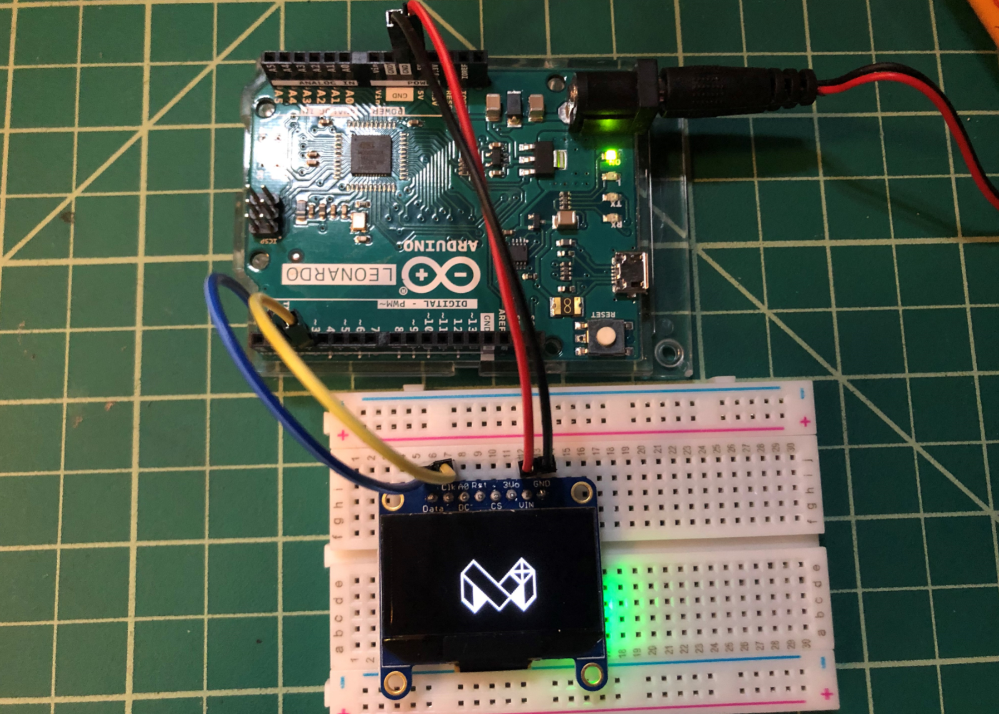
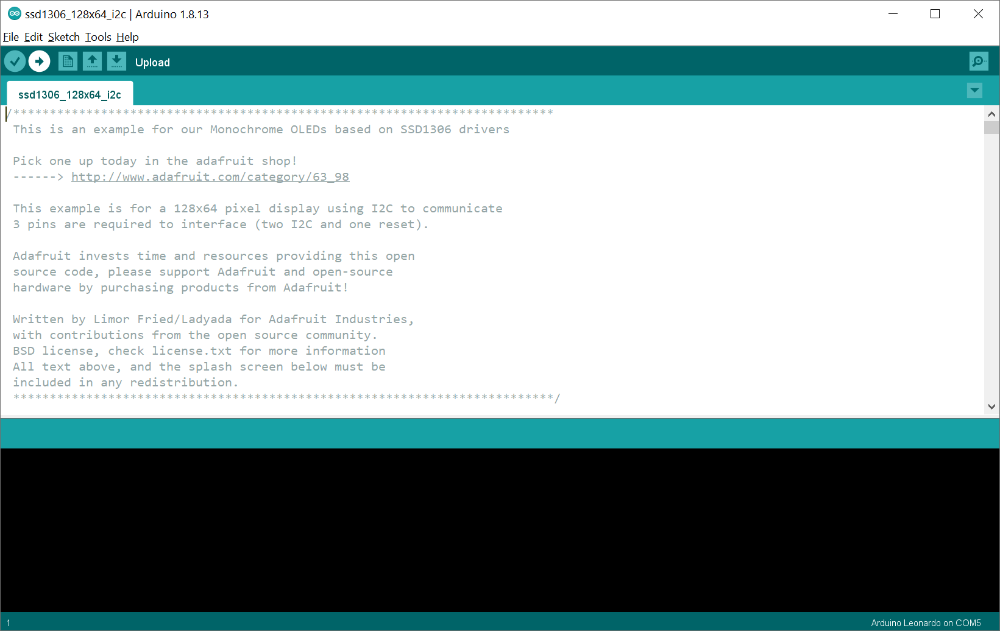
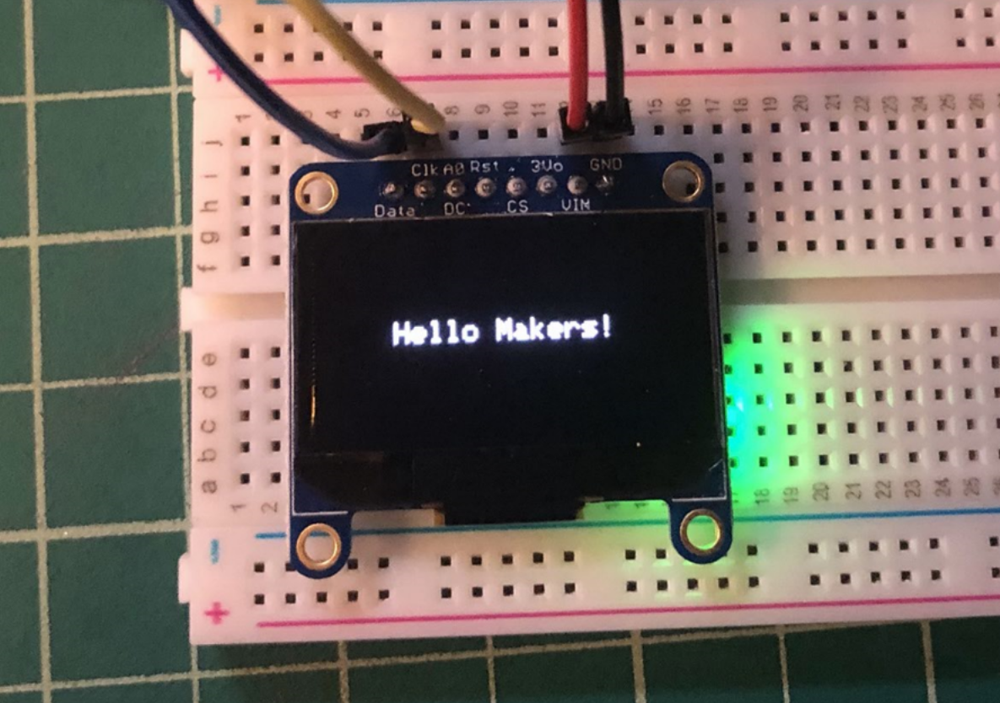
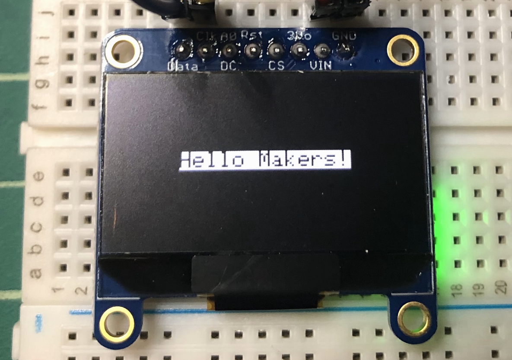
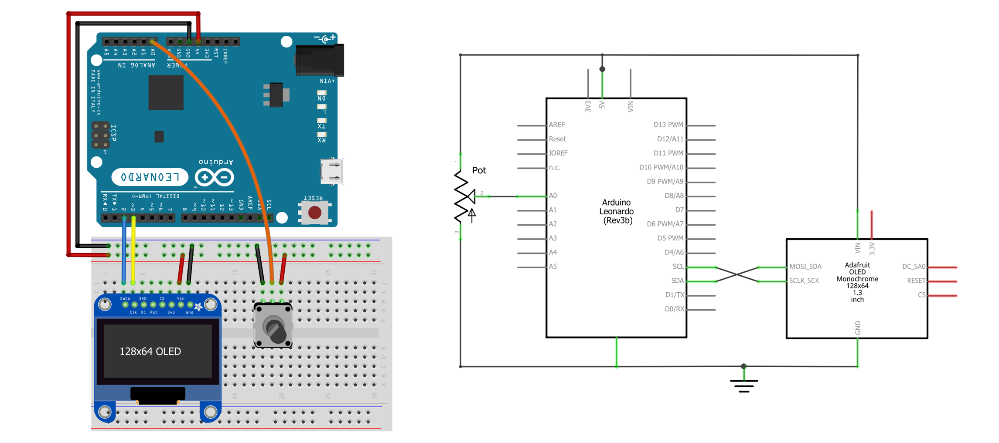
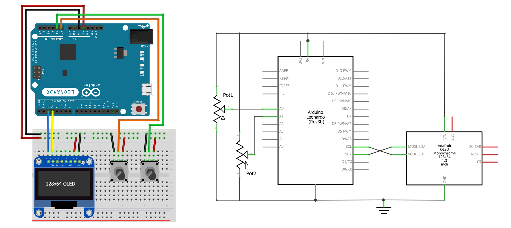

# {{ page.title }}
{: .no_toc }

## Table of Contents
{: .no_toc .text-delta }

1. TOC
{:toc}
---

<!-- ## Serial communication protocols

TODO: intro i2c and SPI
- Can Leonardo actually use i2c pin student confusion: https://forum.arduino.cc/t/can-leonardo-actually-use-its-i2c-pins/417516

### Terminology

Master/slave

### i2C

- With 7-bit addressing, 112 devices. With 10-bit addressing, 1008 devices
- Each device has a unique id
- Need pull-up resistors (importantly, the breakout boards that we use in class **already** have these pull-up resistors builtin to the PCBs) 

- Hook up multiple devices at once with daisy chaining. Link to color sensor video

TODO: in future compare i2c and SPI. I believe SPI is faster

- -->

<video autoplay loop muted playsinline style="margin:0px">
  <source src="assets/videos/OLED_Pong720p.mp4" type="video/mp4" />
</video>
**Video.** Playing Pong on the Adafruit monochrome 1.3" 128x64 pixel [OLED display](https://www.adafruit.com/product/938) with the [Parallax 2-axis joystick](https://www.adafruit.com/product/245) and tactile buttons. The source code for Pong is [here](https://github.com/makeabilitylab/arduino/blob/master/OLED/Pong/Pong.ino). Parts of this video are sped up 4x.
{: .fs-1 }

In this lesson, you will learn about organic light-emitting diode (OLED) displays, basic graphics programming, and a brief introduction to two serial communication protocols called [I2C](https://en.wikipedia.org/wiki/I%C2%B2C) (Inter-Integrated Circuit) and [SPI](https://en.wikipedia.org/wiki/Serial_Peripheral_Interface) (Serial Peripheral Interface)

## OLED displays

Organic light-emitting diode ([OLED](https://en.wikipedia.org/wiki/OLED)) displays are relatively new technology, increasingly used in TVs, computer monitors, smartphones, and handheld game consoles. Unlike LCDs, which require backlighting, each OLED pixel generates its own light providing superior contrast and color control.

In this lesson, we will be using the [monochrome (black-and-white) OLED displays](https://learn.adafruit.com/monochrome-oled-breakouts) from Adafruit along with their display control and graphics libraries. To do so, we need to install some [ libraries](oled-libraries.md).

<!-- TODO: add in examples of where OLEDs are used. Like the Fitbit Charge: https://www.microcontrollertips.com/inside-fitbit-charge/ -->

### Install Arduino libraries

To use the Adafruit OLED display, we need two libraries:

- The [Adafruit_SSD1306](https://github.com/adafruit/Adafruit_SSD1306) display driver library, which handles display communication, memory mapping, and low-level drawing routines
- The [Adafruit_GFX](https://github.com/adafruit/Adafruit-GFX-Library) graphics library, which provides core graphics routines for all Adafruit displays like drawing points, lines, circles. 

Fortunately, the Arduino IDE makes library installation easy. We can do it right from the IDE itself. Follow our step-by-step [installation guide here](oled-libraries.md).

### Wiring the Adafruit OLED display

Once you've installed the requisite libraries, you're ready to wire up the display!

The [SSD1306](https://github.com/adafruit/Adafruit_SSD1306) driver chip and accompanying library provides two different communication methods—each require different wirings: [I2C](https://en.wikipedia.org/wiki/I%C2%B2C) (Inter-Integrated Circuit) and [SPI](https://en.wikipedia.org/wiki/Serial_Peripheral_Interface) (Serial Peripheral Interface). The default is I2C, which is what we will use in this lesson. For more on the SPI mode, see [Adafruit's official docs](https://learn.adafruit.com/monochrome-oled-breakouts/wiring-128x64-oleds).

While the OLED display requires a 3.3V power supply and 3.3V logic levels for communication, the Adafruit breakout board includes a 3.3V regulator and level shifting on all pins, so you can interface with either 3V or 5V devices. Additionally, recall that the I2C requires pull-up resistors on the clock (SCL) and data (SDA) lines so that both are pulled-up to logic level `HIGH` by default. Thankfully, the Adafruit breakout board also includes these resistors. So, the wiring is quite straightforward, consisting of only four wires!

The wiring diagram and circuit schematic are below. We used the [Qwiic](https://www.sparkfun.com/qwiic) color-coding system for our wires: blue for data (SDA), yellow for clock (SCL), black for ground (GND), and red for the voltage supply (5V). The I2C pins differ depending on your board. For example, on the Arduino Uno, they are A4 (SDA) and A5 (SCL) rather than digital pins 2 (SDA) and 3 (SCL) as they are on the Leonardo.

**Figure** Wiring the Adafruit OLED display requires only four wires (and nothing else). I used the standard STEMMA QT color coding for my wires: blue for data (SDA), yellow for clock (SCL), black for ground (GND), and red for the voltage supply (5V). Note that the I2C pins differ depending on your board. For example, on the Arduino Uno, they are A4 (SDA) and A5 (SCL) rather than digital pins 2 (SDA) and 3 (SCL) as they are for the Leonardo.
{: .fs-1 }

#### Physical wiring with jumper cables

**Figure** Physically wiring the OLED display with jumper cables. The Arduino is running this demo code ['BitmapBounce.ino'](https://github.com/makeabilitylab/arduino/blob/master/OLED/BitmapBounce/BitmapBounce.ino)
{: .fs-1 }

#### STEMMA QT wiring

Starting in ~2017, many Adafruit and SparkFun breakout boards began including standardized connectors to more easily connect multiple electronic devices without soldering or working with lots of individual wires. This is particularly helpful because I2C let's us daisy chain I2C-compatible devices together. The Sparkfun connection standard for I2C devices, called [Qwicc](https://www.sparkfun.com/qwiic), was later adopted by Adafruit, which they call [STEMMA QT](https://learn.adafruit.com/introducing-adafruit-stemma-qt/what-is-stemma-qt).

Both [Sparkfun](https://www.sparkfun.com/categories/tags/qwiic-cables) and Adafruit sell a variety of Qwiic/STEMMA QT cables, including this [female-to-female](https://www.adafruit.com/product/4210) version (for ~$0.95) and this [female-to-male](https://www.adafruit.com/product/4209) jumper cable version ($0.95). You can use the female-to-female cable to daisy chain multiple devices together.

| STEMMA QT / Qwiic Female-to-Female Cable | STEMMA QT / Qwiic Female-to-Male Jumper Cable |
|:------------------------------------:|:--------------------------------:|
|  |  |

The video below shows the OLED display hooked up to a STEMMA QT [female-to-male jumper cable](https://www.adafruit.com/product/4209):

<video autoplay loop muted playsinline style="margin:0px">
  <source src="assets/videos/AdafruitSTEMMAQT_IMG_6163-TrimmedAndCropped720p.mov" type="video/mp4" />
</video>
**Video** Running the demo [`ssd1306_128x64_i2c`](https://github.com/adafruit/Adafruit_SSD1306/blob/master/examples/ssd1306_128x64_i2c/ssd1306_128x64_i2c.ino) with a STEMMA QT cable.
{: .fs-1 }

### Testing the OLED display

Once you've wired the OLED display, we're ready to test it with some code!

We will run one of the examples that ships with the [Adafruit_SSD1306](https://github.com/adafruit/Adafruit_SSD1306) library called [`ssd1306_128x64_i2c`](https://github.com/adafruit/Adafruit_SSD1306/blob/master/examples/ssd1306_128x64_i2c/ssd1306_128x64_i2c.ino). This example iterates through a variety of drawing demonstrations, including: drawing lines, outlining and filling rectangles, circles, rounded rectangles, and triangles, rendering text with different styles, and drawing and animating bitmaps. You can view the example [source code here](https://github.com/adafruit/Adafruit_SSD1306/blob/master/examples/ssd1306_128x64_i2c/ssd1306_128x64_i2c.ino).

To open and run the example, follow these steps.

#### Step 1: Open the example

In the Arduino IDE, go to `File -> Examples -> Adafruit SSD1306` and select `ssd1306_128x64_i2c`. You might have to scroll down in the `Examples` file menu to see it.

#### Step 2: Compile and upload the example

Now, compile and upload the example.

#### Step 3: Watch the demo

Once the code has compiled and uploaded, it should look something like this:

<video autoplay loop muted playsinline style="margin:0px">
  <source src="assets/videos/AdafruitOLEDOfficialDemo0x3D-IMG_6160-Rotated-TrimmedAndSpedUp720p-Optimized.mp4" type="video/mp4" />
</video>
**Video** Running the demo [`ssd1306_128x64_i2c`](https://github.com/adafruit/Adafruit_SSD1306/blob/master/examples/ssd1306_128x64_i2c/ssd1306_128x64_i2c.ino). Parts of this video are sped up 4x.
{: .fs-1 }

If you're curious how they rendered something, please do look over the [source code](https://github.com/adafruit/Adafruit_SSD1306/blob/master/examples/ssd1306_128x64_i2c/ssd1306_128x64_i2c.ino). There is nothing magic here and reading the code may help inform your future prototypes!

## The Adafruit GFX Library

Now that we've got our OLED display wired up correctly and tested that it's working, let's talk about **how** to draw to the screen.

To provide a common API for drawing across all Adafruit LCD and OLED displays, Adafruit created a general-purpose graphics rendering library, called [Adafruit GFX](https://learn.adafruit.com/adafruit-gfx-graphics-library/overview). Put simply, rather than having to individually turn on/off OLEDs in the OLED matrix—which would be tedious (though perhaps a useful learning exercise)—the Adafruit GFX library provides higher level drawing routines to do this for you, like drawing rectangles, circles, text, and bitmaps.

### Coordinate system and pixels

If you're familiar with graphics APIs in other programming frameworks—like C#'s [System.Drawing library](https://docs.microsoft.com/en-us/dotnet/api/system.drawing.graphics.drawline), [Processing's Java drawing library](https://processing.org/), [p5js' JavaScript drawing library](https://p5js.org/), *etc.*—the Adafruit GFX library works much the same (at a high level).

The black-and-white OLED consists of a matrix of OLEDS, called pixels, which can be individually addressed to turn on/off (or, in the case of colored displays, to control individual RGB OLEDs to create colors). As with all other drawing libraries, the coordinate system for these pixels places the origin `(0,0)` at the top-left corner with the `x-axis` increasing to the right and the `y-axis` increasing down.

**Figure** An overview of the 128x64 matrix of LEDs—we call each LED a "pixel". We've found that students sometimes flip the y-axis in their minds. So, make sure to note how the origin starts at `(0,0)` and the `x-axis` increases to the right and the `y-axis` increases down. Image created in PowerPoint and uses images from Fritzing and the [Adafruit GFX](https://learn.adafruit.com/adafruit-gfx-graphics-library/coordinate-system-and-units) tutorial.
{: .fs-1 }

Thus, to turn "on" the LED at pixel `(18, 6)` using [Adafruit GFX](https://learn.adafruit.com/adafruit-gfx-graphics-library/overview), we would write: `drawPixel(18, 6, SSD1306_WHITE)`. For black-and-white displays, the last argument can be either `SSD1306_WHITE` to draw a white pixel or `SSD1306_BLACK` to draw a black pixel (these parameters are defined in [Adafruit_SSD1306.h](https://github.com/adafruit/Adafruit_SSD1306/blob/master/Adafruit_SSD1306.h)). For color displays, you can instead pass in an unsigned 16-bit value representing RGB colors (see [docs](https://learn.adafruit.com/adafruit-gfx-graphics-library/coordinate-system-and-units)).

### Drawing subsystem

Below, we describe how to draw shapes, text, and bitmaps. Importantly, when you call any of the drawing routines—from `drawLine` to `drawTriangle`—you are **not** drawing directly to the OLED display. Instead, you are drawing to an offscreen buffer handled by the SSD1306 driver. So, after you call your drawing routines, you must then call the `void Adafruit_SSD1306::display()` function to push the data from RAM to the display. We'll show how to do this step-by-step in our examples below.

In short, the drawing pipeline looks like this:


// Instantiate SSD1306 driver display object
Adafruit_SSD1306 _display(SCREEN_WIDTH, SCREEN_HEIGHT, &Wire, OLED_RESET);

void setup(){
  Serial.begin(9600);
  
  // Initialize the display. If it fails, print failure to Serial
  // and enter an infinite loop
  if (!_display.begin(SSD1306_SWITCHCAPVCC, 0x3D)) { // Address 0x3D for 128x64
    Serial.println(F("SSD1306 allocation failed"));
    for (;;); // Don't proceed, loop forever
  }
}

void loop(){
  // Clear the display
  _display.clearDisplay();

  // Put in drawing routines
  // In this case, draw a circle at x,y location of 50,20 with a radius of 10
  _display.fillCircle(50, 20, 10, SSD1306_WHITE);

  // Render graphics buffer to screen
  _display.display();
}


Now, because we are drawing the exact same thing on every `loop()` call, we could just as well put this drawing code into `setup()` and have it draw once and only once (the graphic content will persist).


// Instantiate SSD1306 driver display object
Adafruit_SSD1306 _display(SCREEN_WIDTH, SCREEN_HEIGHT, &Wire, OLED_RESET);

void setup(){
  Serial.begin(9600);
  
  // Initialize the display. If it fails, print failure to Serial
  // and enter an infinite loop
  if (!_display.begin(SSD1306_SWITCHCAPVCC, 0x3D)) { // Address 0x3D for 128x64
    Serial.println(F("SSD1306 allocation failed"));
    for (;;); // Don't proceed, loop forever
  }

  // Clear the display
  _display.clearDisplay();

  // Put in drawing routines
  // In this case, draw a circle at x,y location of 50,20 with a radius of 10
  _display.fillCircle(50, 20, 10, SSD1306_WHITE);

  // Render graphics buffer to screen
  _display.display();
}

void loop(){
  // Empty on purpose to make a point about how graphic content persists
  // on screen
}


However, for practical purposes, we always want to put our drawing methods in `loop()` because we want so support **dynamic graphics**, which are animated (*e.g.,* graphics that change over time) and/or responsive (*e.g.,* graphics that change in response to input).

### Drawing shapes

The Adafruit GFX library current supports drawing lines, rectangles, circles, rounded rectangles, and triangles. For all shapes, you can draw an outlined version (*e.g.,* `drawRect`) or a filled version (*e.g.,* `fillRect`). The images below are drawn from the [Adafruit GFX tutorial](https://learn.adafruit.com/adafruit-gfx-graphics-library/graphics-primitives).

| Shape and API call | Output |
|-------|:--------:| 
|**Lines**  `void drawLine(uint16_t x0, uint16_t y0, uint16_t x1, uint16_t y1, uint16_t color);` |  `drawLine(5, 10, 3, 19, SSD1306_WHITE)` |
|**Rectangles**   `void drawRect(uint16_t x0, uint16_t y0, uint16_t w, uint16_t h, uint16_t color);`    `void fillRect(uint16_t x0, uint16_t y0, uint16_t w, uint16_t h, uint16_t color);` |  `drawRect(3, 2, 13, 10, SSD1306_WHITE)` |
|**Circles**  `void drawCircle(uint16_t x0, uint16_t y0, uint16_t r, uint16_t color);`    `void fillCircle(uint16_t x0, uint16_t y0, uint16_t r, uint16_t color);` |  `drawCircle(14, 8, 7, SSD1306_WHITE)` |
|**Rounded Rectangles**  `void drawRoundRect(uint16_t x0, uint16_t y0, uint16_t w, uint16_t h, uint16_t radius, uint16_t color);`    `void fillRoundRect(uint16_t x0, uint16_t y0, uint16_t w, uint16_t h, uint16_t radius, uint16_t color);` |  `drawRoundRect(3, 1, 17, 12, 5, SSD1306_WHITE)` |
|**Triangles**  `void drawTriangle(uint16_t x0, uint16_t y0, uint16_t x1, uint16_t y1, uint16_t x2, uint16_t y2, uint16_t color);`    `void fillTriangle(uint16_t x0, uint16_t y0, uint16_t x1, uint16_t y1, uint16_t x2, uint16_t y2, uint16_t color);` |  `drawTriangle(6, 13, 9, 2, 18, 9, SSD1306_WHITE)` |

#### Drawing custom shapes

You can, of course, create custom shapes either by cleverly combining shape primitives (*e.g.,* a rectangle and a triangle to make a basic house) or by implementing your own drawing algorithm and calling `drawPixel`. The `drawPixel` API looks like:

| Shape and API call | Output |
|-------|:--------:| 
|**Pixels**  `void drawPixel(uint16_t x, uint16_t y, uint16_t color);` |  `drawPixel(0, 0, SSD1306_WHITE)`   `drawPixel(18, 6, SSD1306_WHITE)`   `drawPixel(6, 13, SSD1306_WHITE)` |

#### Optimized vertical and horizontal line drawing

If you are drawing purely vertical or horizontal lines, then you can use optimized line-drawing functions that avoid angular calculations. For example, we use `drawFastVLine` in our [analog graphing demos](#demo-3-basic-real-time-analog-graph) below.

For more information and examples, see the [Basic Drawing section](https://lastminuteengineers.com/oled-display-arduino-tutorial/#arduino-code-basic-drawings) of Last Minute Engineer's OLED display tutorial.

### Drawing text

There are two methods to render text: drawing a single character with `drawChar` and using the `print` rendering subsystem, which mimics the familiar [`Serial.print()`](https://www.arduino.cc/reference/en/language/functions/communication/serial/print/) functionality covered in our Intro to Arduino series [here](../arduino/serial-print.md).

#### Method 1: drawChar

To draw a single character, you specify a `(x, y)` location, the character, the foreground and background color, and a size. By default, characters are 5x8 pixels but an optional size parameter (the last argument) can be passed to scale the font (*e.g.,* a size of 2 will render 10x16 pixels per character).

| Text API call | Output |
|-------|:--------:| 
|**Char**  `void drawChar(uint16_t x, uint16_t y, char c, uint16_t color, uint16_t bg, uint8_t size);` |  `drawChar(3, 4, 'A', SSD1306_WHITE, SSD1306_BLACK, 1)` |

#### Method 2: Print rendering

The more common and feature-rich method to draw text is via the `print` subsystem. Interestingly, the [Adafruit_GFX class](https://github.com/adafruit/Adafruit-GFX-Library/blob/master/Adafruit_GFX.h) actually extends the [Print class](https://github.com/arduino/ArduinoCore-avr/blob/master/cores/arduino/Print.h) from the Arduino core library. Rather than call `Serial.print("Hello World")`, however, with the OLED display and Adafruit GFX library, you would call `_display.print("Hello World")`. Here, `_display` is the `Adafruit_SSD1306` object.

To use the OLED's print functionality, you can first set optional parameters such as the text color, size, and wrapping:


void setTextColor(uint16_t color);
void setTextColor(uint16_t color, uint16_t backgroundcolor);
void setTextSize(uint8_t size);
void setTextWrap(boolean w);


Then, to position the text, you set the print cursor with:

void setCursor(uint16_t x0, uint16_t y0);


Finally, to print the text at that cursor position, you can call any of the standard [`Serial.print`](https://github.com/arduino/ArduinoCore-avr/blob/master/cores/arduino/Print.h) methods, including this subset:


size_t print(const String &);
size_t print(const char[]);
size_t print(char);

size_t println(const String &s);
size_t println(const char[]);
size_t println(char);


See the [Serial.print() docs](https://www.arduino.cc/reference/en/language/functions/communication/serial/print/) or the [Print.h](https://github.com/arduino/ArduinoCore-avr/blob/master/cores/arduino/Print.h) library for more on the `print` API or read on for an example.

##### Centering text

In creative coding, visualization, and game dev, we often want to center or otherwise align text. To do so, we need to **measure** it. Fortunately, the [Adafruit GFX](https://github.com/adafruit/Adafruit-GFX-Library/blob/master/Adafruit_GFX.h) library has a method called `getTextBounds` that does just that!


/**************************************************************************/
/*!
    @brief  Helper to determine size of a string with current font/size.
            Pass string and a cursor position, returns upper-left corner and width and height
    @param  str  The ASCII string to measure
    @param  x    The current cursor X
    @param  y    The current cursor Y
    @param  x1   The boundary X coordinate, returned by function
    @param  y1   The boundary Y coordinate, returned by function
    @param  w    The boundary width, returned by function
    @param  h    The boundary height, returned by function
*/
/**************************************************************************/
void getTextBounds(String &str, int16_t x, int16_t y, int16_t *x1, int16_t *y1, uint16_t *w, uint16_t *h);


For example, in our [HelloWorld.ino](https://github.com/makeabilitylab/arduino/blob/master/OLED/HelloWorld/HelloWorld.ino) example, we center the text "Hello Makers!" both vertically and horizontally on the OLED screen. The key excerpt is here:


int16_t x, y;
uint16_t textWidth, textHeight;
const char strHello[] = "Hello Makers!";

// Setup text rendering parameters
_display.setTextSize(1);
_display.setTextColor(WHITE, BLACK);

// Measure the text with those parameters. Pass x, y, textWidth, and textHeight
// by reference so that they are set within the function itself.
_display.getTextBounds(strHello, 0, 0, &x, &y, &textWidth, &textHeight);

// Center the text on the display (both horizontally and vertically)
_display.setCursor(_display.width() / 2 - textWidth / 2, _display.height() / 2 - textHeight / 2);

// Print out the string
_display.print(strHello);

// Render the graphics buffer to screen
_display.display(); 


##### Inverting text

We can also invert the text simply by switching the colors in `setTextColor(uint16_t color, uint16_t backgroundcolor)`. So, to draw black text on a white background, we would write `_display.setTextColor(BLACK, WHITE);`

| setTextColor(WHITE, BLACK) | setTextColor(BLACK, WHITE) |
|----------------------------|----------------------------|
|  |  |

#### Loading custom fonts

In addition to the default fixed-size, mono-spaced font, you can also load and render an alternative font. See the ["Loading Fonts"](https://learn.adafruit.com/adafruit-gfx-graphics-library/using-fonts) section of the [Adafruit GFX tutorial](https://learn.adafruit.com/adafruit-gfx-graphics-library/overview). 

### Drawing bitmaps

Finally, you can load and render custom bitmaps on the display. See ["Displaying Bitmaps"](https://lastminuteengineers.com/oled-display-arduino-tutorial/#arduino-code-displaying-bitmap) on Last Minute Engineers.

<!-- TODO: consider recording a video of how to do this or at least showing a video or picture of it working -->

### Adafruit GFX Resources

Before moving forward, we strongly encourage you to read the official [Adafruit GFX](https://learn.adafruit.com/adafruit-gfx-graphics-library/graphics-primitives) tutorial and the "Last Minute Engineers" [OLED tutorial](https://lastminuteengineers.com/oled-display-arduino-tutorial/)—both offer great overviews of the Adafruit GFX library and how to [display text](https://lastminuteengineers.com/oled-display-arduino-tutorial/#arduino-code-displaying-text), [draw shapes](https://lastminuteengineers.com/oled-display-arduino-tutorial/#arduino-code-basic-drawings), and [load and display bitmaps](https://lastminuteengineers.com/oled-display-arduino-tutorial/#arduino-code-displaying-bitmap). 

In addition, you can:

- View the Adafruit GFX library source code [here](https://github.com/adafruit/Adafruit-GFX-Library), including the [Adafruit_GFX.h](https://github.com/adafruit/Adafruit-GFX-Library/blob/master/Adafruit_GFX.h), which shows the available API. Yes, depending on your familiarity with C++ and reading .h files, this might be intimidating or overwhelming—but it's important to demystify these libraries. They are just source code that devs wrote. And, with experience, you could too!

- Examine our own OLED examples [here](https://github.com/makeabilitylab/arduino/tree/master/OLED), including the [Hello World](https://github.com/makeabilitylab/arduino/blob/master/OLED/HelloWorld/HelloWorld.ino) example mentioned above, a simple animation example called [BallBounce](https://github.com/makeabilitylab/arduino/blob/master/OLED/BallBounce/BallBounce.ino), an [object-oriented version](https://github.com/makeabilitylab/arduino/blob/master/OLED/BallBounceObjectOriented/BallBounceObjectOriented.ino) of this animation using the [Shape.hpp](https://github.com/makeabilitylab/arduino/blob/master/MakeabilityLab_Arduino_Library/src/Shape.hpp) class from the [Makeability Lab Arduino library](https://github.com/makeabilitylab/arduino/tree/master/MakeabilityLab_Arduino_Library), and simple games such as a [collision test](https://github.com/makeabilitylab/arduino/blob/master/OLED/CollisionTest/CollisionTest.ino), [Pong](https://github.com/makeabilitylab/arduino/blob/master/OLED/Pong/Pong.ino), and [Flappy Bird](https://github.com/makeabilitylab/arduino/blob/master/OLED/FlappyBird/FlappyBird.ino). We'll go over some of these below.

## Let's make stuff!

In this part of the lesson, we are going to make a variety of OLED-based creations. This should be fun! As mentioned, we have a [GitHub repo of OLED examples](https://github.com/makeabilitylab/arduino/tree/master/OLED), some of which we describe below.

### Activity: draw shapes and text

First, to get a feel for and experience with the Adafruit GFX API and the coordinate system, let's simply draw some text and shapes to the screen. You get to choose what you want you want to draw and where. Think of it like [abstract shape art](https://www.google.com/search?q=abstract+shape+art)! 

Remember, in `loop()`, you need to:


// Clear the display. If we don't do this, we'll simply be drawing over our
// previous renderings (which you may sometimes want but generally not)
_display.clearDisplay();

// Put in drawing routines
drawStuff();

// Render graphics buffer to screen
_display.display();


I made a version, called [SimpleDrawingDemo.ino](https://github.com/makeabilitylab/arduino/blob/master/OLED/SimpleDrawingDemo/SimpleDrawingDemo.ino) that draws shapes of random sizes and locations on **each frame** but you could do something even simpler (or more complex)!

<video autoplay loop muted playsinline style="margin:0px">
  <source src="assets/videos/OLEDSimpleDrawingDemo-IMG_6188-TrimmedAndOptimized720p.mp4" type="video/mp4" />
</video>
**Video** A demonstration of [SimpleDrawingDemo.ino](https://github.com/makeabilitylab/arduino/blob/master/OLED/SimpleDrawingDemo/SimpleDrawingDemo.ino).
{: .fs-1 }

#### Shape drawing prototyping journal activity

For your prototyping journals, create your own shape/text drawing demo. Take a picture or, if there is animation, record a short video or animated gif. In your journals, link to the code, insert the pictures/videos, and reflect on what you learned.

### Activity: draw a bouncing ball

Now that we've gained some familiarity with the drawing API and graphics pipeline, let's now learn a bit about **animation**.

We are going to draw a simple bouncing ball around the screen. Bouncing or reflecting objects are one of the key components of many games, including [Pong](https://github.com/makeabilitylab/arduino/blob/master/OLED/Pong/Pong.ino), [Arkanoid](https://en.wikipedia.org/wiki/Arkanoid), *etc.*

To create a bouncing ball, we need to:

- Track the **x,y location** of the ball across frames
- Set a **x,y speed** in pixels per frame—that is, how much the does the ball move per frame? For smoother animation, we could track x,y speed in terms of time (*e.g.,* pixels/second); however, this is slightly more complicated (*e.g.,* it requires tracking timestamps in the code, computing time deltas, *etc.*). For our purposes, tracking x,y speed in terms of pixels/frame is fine.
- Check for **collisions** when the ball collides with the ceiling, floor, or walls of the screen. When a collision occurs, simply reverse the direction of the ball.
- **Draw** the circle at the given x,y location.

#### Prototyping ideas with p5js

Here's a [demo of a bouncing ball](https://makeabilitylab.github.io/p5js/Animation/BallBounce2D/) we made in [p5js](https://p5js.org/). Sometimes, it's useful to prototype a visualization or game idea in a rapid programming environment like [p5js](https://p5js.org/) or [Processing](https://processing.org/) before coding it up in C++ for Arduino (and it's easier to debug in those environments as well). You can edit and play with this demo in your browser [here](https://editor.p5js.org/jonfroehlich/sketches/KpUirYrAk) using the p5js online editor.

<video autoplay loop muted playsinline style="margin:0px">
  <source src="assets/videos/BallBouncing_p5js.mp4" type="video/mp4" />
</video>
{: .mx-auto .align-center }

**Video.** A video of the Ball Bounce demo created in p5js. You can edit the source code and run it live in the p5js online editor [here](https://editor.p5js.org/jonfroehlich/sketches/KpUirYrAk). Alternatively, you can [view the source](https://github.com/makeabilitylab/p5js/blob/master/Animation/BallBounce2D/sketch.js) in our [p5js GitHub repo](https://github.com/makeabilitylab/p5js).
{: .fs-1 }

#### C++ implementation using Adafruit GFX

For the C++ implementation using the Adafruit GFX library and Arduino, the key bits of code are excerpted below. The overall implementation is quite similar to the [p5js version](https://editor.p5js.org/jonfroehlich/sketches/KpUirYrAk). Make sure you read over this code carefully and understand it.

Again, rather than, say "miles per hour" or "pixels per second", we've defined speed as "pixels per frame"—that is, how many pixels does the object move per frame. If we set `_xSpeed` to 5 and `_ySpeed` to 0, then the ball would move 5 x pixels per frame (and simply bounce back and forth from the left side of the screen to the right and back again).


// Create the display object
Adafruit_SSD1306 _display(128, 64, &Wire, 4);

// Ball global variables
const int _ballRadius = 5;
int _xBall = 0;  // x location of the ball
int _yBall = 0;  // y location of the ball
int _xSpeed = 0; // x speed of ball (in pixels per frame)
int _ySpeed = 0; // y speed of ball (in pixels per frame)

void setup() {
  // Initialize the display
  _display.begin(SSD1306_SWITCHCAPVCC, 0x3D)

  // Gets a random long between min and max - 1
  // https://www.arduino.cc/reference/en/language/functions/random-numbers/random/
  _xSpeed = random(1, 4);
  _ySpeed = random(1, 4);
}

void loop() {
  // Clear the display
  _display.clearDisplay();
  
  // Update ball based on speed location
  _xBall += _xSpeed;
  _yBall += _ySpeed;

  // Check for ball bounce. First check for going off left or right side of screen
  if(_xBall - _ballRadius <= 0 || _xBall + _ballRadius >= _display.width()){
    _xSpeed = _xSpeed * -1; // reverse x direction
  }
  
  // Now check for bouncing on floor or ceiling
  if(_yBall - _ballRadius <= 0 || _yBall + _ballRadius >= _display.height()){
    _ySpeed = _ySpeed * -1; // reverse y direction
  }

  // Draw circle
  _display.drawCircle(_xBall, _yBall, _ballRadius, SSD1306_WHITE);
  
  // Render buffer to screen
  _display.display();
}


You can view the full code on GitHub as [BallBounce.ino](https://github.com/makeabilitylab/arduino/blob/master/OLED/BallBounce/BallBounce.ino). 

<!-- TODO: insert video. -->

#### Bitmap bounce

We also have a similar "bounce" demo, called [BitmapBounce.ino](https://github.com/makeabilitylab/arduino/blob/master/OLED/BitmapBounce/BitmapBounce.ino), that uses a bitmap rather than a graphic primitive. To create the the bitmap byte dump, we used this [image2cpp](http://javl.github.io/image2cpp/) tool on this [Makeability Lab logo](https://github.com/makeabilitylab/arduino/blob/master/OLED/BitmapBounce/logo_bw_no_text_600w.png).

<video autoplay loop muted playsinline style="margin:0px">
  <source src="assets/videos/OLEDBouncingBitmap-IMG_6180-Optimized.mp4" type="video/mp4" />
</video>
**Video.** A video of [BitmapBounce.ino](https://github.com/makeabilitylab/arduino/blob/master/OLED/BitmapBounce/BitmapBounce.ino).
{: .fs-1 }

#### Animation prototyping journal activity

For your prototyping journals, create a custom animation demo, record a short video or animated gif, link to the code, and reflect on what you learned. As one simple example, change the object bouncing around from a circle to a rectangle. If you want something more challenging, try bouncing a triangle around the screen and using the entry angle and triangle angles to properly calculate the reflection (it's probably easiest to do this using [vector calculations](https://makeabilitylab.github.io/p5js/Vectors/BouncingBallsAndLineSegmentsImproved/)). Or you could use the `drawLine` method to animate rain fall similar to this [Purple Rain video](https://youtu.be/KkyIDI6rQJI) by the [Coding Train](https://thecodingtrain.com/). While this was made for p5js, it would fairly straightforward to translate to Arduino and the Adafruit GFX library.

### Activity: interactive graphics

Finally, for our last activity, let's make a few **interactive prototypes**—that is, graphics that respond to digital or analog input. Interactivity captures the true essence of physical computing. And for an [HCI professor](https://jonfroehlich.github.io/) like me, this is where the joy really begins!

#### Demo 1: Setting ball size based on analog input

We'll start with changing a shape's size based on sensor input. While you can use whatever sensor you want, for this demonstration, we will use our ole trusty [potentiometer](../arduino/potentiometers.md) hooked up to `A0`.

##### The OLED + pot circuit

Here's the circuit. Same as before but we've added a 10K potentiometer.

**Figure** A basic OLED circuit with [potentiometer](../arduino/potentiometers.md) input on `A0`.
{: .fs-1 }

##### The OLED + pot code 

The code is simple: read the analog input and use this to set the circle's radius.


void loop() {
  // On each loop, we'll want to clear the display so we're not writing over
  // previously drawn data
  _display.clearDisplay(); 

  // Read the analog input value
  int sensorVal = analogRead(ANALOG_INPUT_PIN);

  // The maximum radius is either the display width or height, whichever is smallest
  int maxRadius = min(_display.width(), _display.height());

  // Now calculate the radius based on the sensor val
  int radius = map(sensorVal, 0, MAX_ANALOG_INPUT, 0, maxRadius);

  // Center the circle
  int xCircle = _display.width() / 2;
  int yCircle = _display.height() / 2;

  // Draw it on the screen
  _display.fillCircle(xCircle, yCircle,  radius, SSD1306_WHITE);

  // Render the graphics buffer to screen
  _display.display(); 

  delay(50);
}


You can view the full code on GitHub as [AnalogBallSize.ino](https://github.com/makeabilitylab/arduino/blob/master/OLED/AnalogBallSize/AnalogBallSize.ino).

<video autoplay loop muted playsinline style="margin:0px">
  <source src="assets/videos/OLEDAnalogBallSize-IMG_6189-TrimmedAndOptimized.mp4" type="video/mp4" />
</video>
**Video.** A video of [AnalogBallSize.ino](https://github.com/makeabilitylab/arduino/blob/master/OLED/AnalogBallSize/AnalogBallSize.ino).
{: .fs-1 }

#### Demo 2: Setting ball location based on analog input

Now let's hook up **two** analog inputs to control the x,y location of the circle rather than the size. In this case, we'll use two potentiometers. The wiring diagram is below.

**Figure** The wiring and circuit diagram for two potentiometers and the OLED display.
{: .fs-1 }

For the code, it's very similar to [AnalogBallSize.ino](https://github.com/makeabilitylab/arduino/blob/master/OLED/AnalogBallSize/AnalogBallSize.ino). But we translate the `analogRead` values to x and y locations: 


void loop() {
  // On each loop, we'll want to clear the display so we're not writing over
  // previously drawn data
  _display.clearDisplay(); 

  // Read the analog input value
  int xSensorVal = analogRead(X_ANALOG_INPUT_PIN);
  delay(1); // give ADC time
  int ySensorVal = analogRead(Y_ANALOG_INPUT_PIN);

  // Translate sensor readings to x, y pixel locations
  int xLoc = map(xSensorVal, 0, MAX_ANALOG_INPUT, 0, _display.width());
  int yLoc = map(ySensorVal, 0, MAX_ANALOG_INPUT, 0, _display.height());

  // Draw it on the screen
  _display.fillCircle(xLoc, yLoc,  BALL_RADIUS, SSD1306_WHITE);

  // Render the graphics buffer to screen
  _display.display(); 

  delay(50);
}


You can view the full code on GitHub as [AnalogBallLocation.ino](https://github.com/makeabilitylab/arduino/blob/master/OLED/AnalogBallLocation/AnalogBallLocation.ino).

<video autoplay loop muted playsinline style="margin:0px">
  <source src="assets/videos/OLEDMoveBallTwoPots-IMG_6190-TrimmedAndOptimized720p.mp4" type="video/mp4" />
</video>
**Video** A demonstration of [AnalogBallLocation.ino](https://github.com/makeabilitylab/arduino/blob/master/OLED/AnalogBallLocation/AnalogBallLocation.ino) using potentiometers on `A0` and `A1`.
{: .fs-1 }

#### Demo 3: Basic real-time analog graph

One of the most famous [Arduino](https://www.arduino.cc/) + [Processing](https://processing.org/) demos is the real-time analog sensor graph ([link](https://www.arduino.cc/en/Tutorial/BuiltInExamples/Graph)): the Arduino reads sensor data using `analogRead` then transmits it to the computer using `Serial.println()` where it is parsed and graphed using [Processing](https://processing.org/).

With the OLED display and the Adafruit GFX library, we can easily recreate this entirely on the Arduino!

The idea is simple: read in a sensor value as `sensorVal`, draw a vertical line at `xPos` of a length proportional to `sensorVal`, increment `xPos`, repeat. When `xPos >= _display.width()`, set `xPos` back to zero, clear the display, and start the whole process over.

Notably, this code takes advantage of **selectively** calling `_display.clearDisplay()`. Unlike the other examples we've shared thus far—which clear the display on each frame—here, we take advantage of graphics persisting across `_display.display()` calls to "build up" our graph over time. That is, we only draw **one** new line per new sensor input, which persists on the screen until `_xPos >= _display.width()` at which point we call `_display.clearDisplay()`.


void loop() {

  // Read the analog voltage value
  int analogVal = analogRead(ANALOG_INPUT_PIN);

  // Draw the line for the given sensor value
  int lineHeight = map(analogVal, MIN_ANALOG_INPUT, MAX_ANALOG_INPUT, 0, _graphHeight);
  int yPos = _display.height() - lineHeight;

  // For purely horizontal or vertical lines, there are optimized line-drawing
  // functions that avoid costly angular calculations
  _display.drawFastVLine(_xPos++, yPos, lineHeight, SSD1306_WHITE);
  _display.display();
  
  // If the x-position of is off the right side of the screen, clear the display
  // and start the graph over
  if (_xPos >= _display.width()) {
    _xPos = 0;
    _display.clearDisplay();
  }

  delay(10);
}


The full source code is available in our [OLED GitHub](https://github.com/makeabilitylab/arduino/tree/master/OLED) as [AnalogGraph.ino](https://github.com/makeabilitylab/arduino/blob/master/OLED/AnalogGraph/AnalogGraph.ino). Here's a video demo:

<video autoplay loop muted playsinline style="margin:0px">
  <source src="assets/videos/OLEDAnalogGraph_TrimmedAndOptimized720p.mp4" type="video/mp4" />
</video>
**Video** A demonstration of [AnalogGraph.ino](https://github.com/makeabilitylab/arduino/blob/master/OLED/AnalogGraph/AnalogGraph.ino) using a potentiometer for analog input on `A0`. We also show the currently sensed `A0` value in the upper-left corner and our frame rate (fps) in the upper-right corner.
{: .fs-1 }

#### Demo 4: Real-time scrolling analog graph

A slightly improved but more complicated version of the analog graph is a **scrolling** implementation. Rather than clearing the display when `xPos >= _display.width()`, we simply "scroll" the content to the left. For memory and computational efficiency, we implement this with a circular buffer, which is the size of our screen width (so, 64 values—one for each x pixel).

Look over the code. Does it make sense? 


int _circularBuffer[SCREEN_WIDTH]; //fast way to store values 
int _curWriteIndex = 0; // tracks where we are in the circular buffer

void loop() {
  // Clear the display on each frame. We draw the entire graph on each frame 
  // from the _circularBuffer
  _display.clearDisplay();

  // Read and store the analog data into a circular buffer
  int analogVal = analogRead(ANALOG_INPUT_PIN);
  Serial.println(analogVal);
  _circularBuffer[_curWriteIndex++] = analogVal;

  // Set the circular buffer index back to zero when it reaches the 
  // right of the screen
  if(_curWriteIndex >= _display.width()){
    _curWriteIndex = 0;
  }
  
  // Draw the line graph based on data in _circularBuffer
  int xPos = 0; 
  for (int i = _curWriteIndex; i < _display.width(); i++){
    int analogVal = _circularBuffer[i];
    drawLine(xPos, analogVal);
    xPos++;
  }
  
  for(int i = 0; i < _curWriteIndex; i++){
    int analogVal = _circularBuffer[i];
    drawLine(xPos, analogVal);
    xPos++;;
  }
  
  _display.display();
  
  delay(10);
}


The full source code is available in our [OLED GitHub](https://github.com/makeabilitylab/arduino/tree/master/OLED) as [AnalogGraphScrolling.ino](https://github.com/makeabilitylab/arduino/blob/master/OLED/AnalogGraphScrolling/AnalogGraphScrolling.ino). Here's a video demo. 

<video autoplay loop muted playsinline style="margin:0px">
  <source src="assets/videos/OLED_ScrollingGraphDemo-IMG_6192-TrimmedAndOptimized720p.mp4" type="video/mp4" />
</video>
**Video** A demonstration of [AnalogGraphScrolling.ino](https://github.com/makeabilitylab/arduino/blob/master/OLED/AnalogGraphScrolling/AnalogGraphScrolling.ino) using a potentiometer for analog input on `A0`. We also show the currently sensed `A0` value in the upper-left corner and our frame rate (fps) in the upper-right corner.
{: .fs-1 }

Which graph version do you prefer? [AnalogGraph.ino](https://github.com/makeabilitylab/arduino/blob/master/OLED/AnalogGraph/AnalogGraph.ino) or [AnalogGraphScrolling.ino](https://github.com/makeabilitylab/arduino/blob/master/OLED/AnalogGraphScrolling/AnalogGraphScrolling.ino)? We personally prefer the latter!

#### Interactive graphics prototyping journal activity

For your prototyping journals, rapidly prototype an interactive OLED demo using a sensor of your own choosing and a design a simple visualization or responsive graphic around that input. In your journal, include a brief description with short video (or animated gif) and reflect on what you learned. As one simple idea to give you an idea of what we're looking for here, how about combine animation + interactivity: what if you changed the ball speed in [BallBounce.ino](https://github.com/makeabilitylab/arduino/blob/master/OLED/BallBounce/BallBounce.ino) based on sensed input?

<!-- 
Activity outline:

- Animation with ball
- Ball that changes speed depending on analog input
- Switch to FSR

- Make analog input line graph visualization
- Link to scrolling version of analog graph

- Advanced OLED
- Where do we talk about using the Makeability_Lab_Library and drawing methods?
- Multiple i2c devices: accel + OLED
- Multiple OLED displays

- POSSIBLE TODO: hook up multiple OLED displays
  - You can hook up multiple OLED displays. But each will need a different address. By default, the address is 0x3D (show picture of back). The Adafruit breakout board makes it easy to set the address to 0x3C simply by tying `SA0` to `GND`.
  - Show ball bounce two screens? -->

## Resources

### OLED

- [OLED Display Arduino Tutorial](https://lastminuteengineers.com/oled-display-arduino-tutorial/), Last Minute Engineers

- [Monochrome OLED Breakouts](https://learn.adafruit.com/monochrome-oled-breakouts), Adafruit

- [Adafruit_GFX Library](https://learn.adafruit.com/adafruit-gfx-graphics-library/overview), Adafruit

### Serial communication protocols

- [I2C](https://learn.sparkfun.com/tutorials/i2c/all), Sparkfun.com

- [SPI](https://learn.sparkfun.com/tutorials/serial-peripheral-interface-spi), Sparkfun.com

<!-- ## Next lesson

In the next lesson, we TODO -->