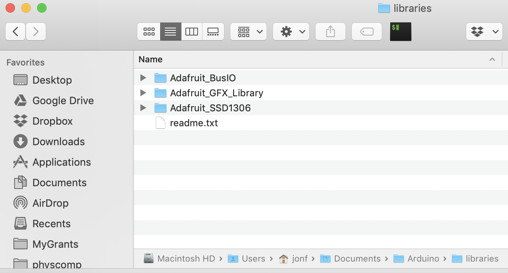
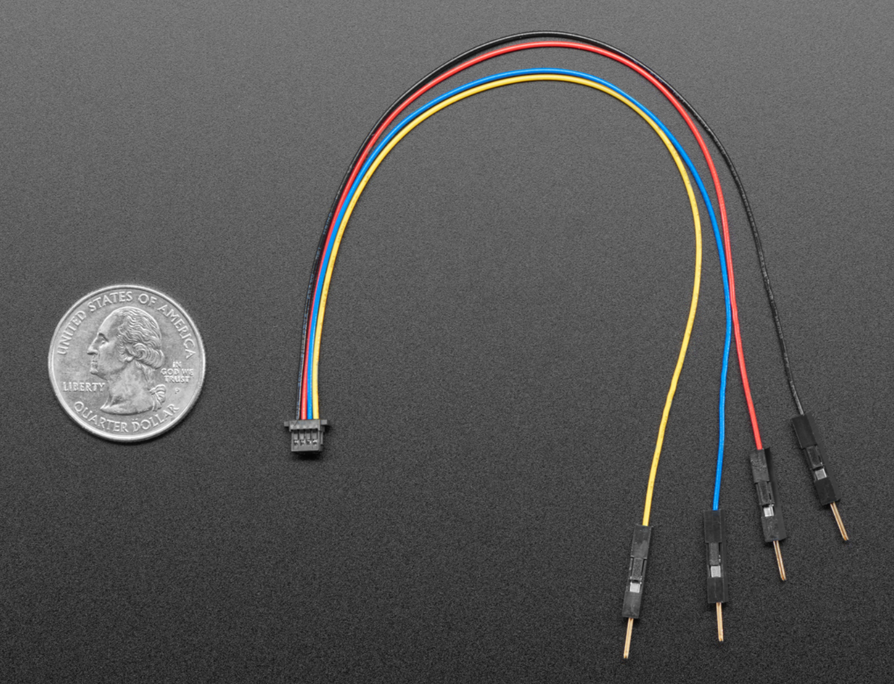

# {{ page.title | replace_first:'L','Lesson '}}
{: .no_toc }

## Table of Contents
{: .no_toc .text-delta }

1. TOC
{:toc}
---

## Outline
- What are OLED devices?
- I2C vs. SPI
  - Master/slave usage
- Pinout diagram for 128x64
- Can Leonardo actually use i2c pin confusion: https://forum.arduino.cc/t/can-leonardo-actually-use-its-i2c-pins/417516

## Serial communication protocols

TODO: intro i2c and SPI

### Terminology

Master/slave

### i2C

- With 7-bit addressing, 112 devices. With 10-bit addressing, 1008 devices
- Each device has a unique id
- Need pull-up resistors (importantly, the breakout boards that we use in class **already** have these pull-up resistors builtin to the PCBs)

## OLED Display

- Include overview of graphics
    - https://learn.adafruit.com/adafruit-gfx-graphics-library/overview
    - https://lastminuteengineers.com/oled-display-arduino-tutorial/

### Install Arduino libraries

To use the OLED display, we need two libraries:

- The [Adafruit_SSD1306](https://github.com/adafruit/Adafruit_SSD1306) library, which handles display communication, memory mapping, and low-level drawing routines
- The [Adafruit_GFX](https://github.com/adafruit/Adafruit-GFX-Library) library, which provides core graphics routines for all Adafruit displays like drawing points, lines, circles. 

Fortunately, the Arduino IDE makes library installation easy. We can do it right from the IDE itself.

#### Step 1: Open "Manage Libraries"

Open your Arduino IDE, then go to `Tools -> Manage Libraries`.

#### Step 2: Search for Adafruit SSD1306

In the Library Manager, search for "Adafruit SSD1306". There are other SSD1306 libraries so make sure you find the one by Adafruit. In this screenshot, the current version is 2.4.4.

#### Step 3: Install Adafruit SSD1306 library
Click on the `Install` button.

#### Step 4: Install all dependencies

The Adafruit SSD1306 library depends on two other libraries, which we also need to install. Fortunately, the Library Manager detects this and explicitly asks. So, select `Install all`.

<!-- The Arduino IDE Library Manager let's library designers to identify other library dependencies in their metadata. This allows the IDE to ask users about dependencies automatically.  -->

#### Step 5: Confirm installation

If the SSD1306 library was correctly installed, you should see a teal "INSTALLED" label next to it as we do below:

#### Library installation folder location on OS

To view the library and the underlying source code, you can open the Arduino `libraries` folder on your OS:
- On Windows, this defaults to `C:\Users\<username>\Documents\Arduino\libraries`
- On Mac, `/Users/<username>/Documents/Arduino/libraries`

| Arduino Library directory on Windows | Arduino Library directory on Mac |
|:------------------------------------:|:--------------------------------:|
|  |  |

### Wiring the OLED display

TODO.

- Insert Fritzing screenshots
- Insert actual photos

#### STEMMA QT wiring

Starting in ~2017, many Adafruit and SparkFun breakout boards began including standardized connectors to allow makers to more easily connect multiple electronic devices without soldering and working with lots of individual wires. The Sparkfun connection standard for i2c devices, called [Qwicc](https://www.sparkfun.com/qwiic), was later adopted by Adafruit, which they call [STEMMA QT](https://learn.adafruit.com/introducing-adafruit-stemma-qt/what-is-stemma-qt).

Adafruit sells a variety of STEMMA QT cables, including this [female-to-female](https://www.adafruit.com/product/4210) version (for ~$0.95) and this [female-to-male](https://www.adafruit.com/product/4209) jumper cable version ($0.95). You can use the female-to-female cable to daisy chain multiple devices together.

| STEMMA QT / Qwiic Female-to-Female Cable | STEMMA QT / Qwiic Female-to-Male Jumper Cable |
|:------------------------------------:|:--------------------------------:|
|  |  |

The video below shows the OLED display hooked up to a STEMMA QT [female-to-male jumper cable](https://www.adafruit.com/product/4209):

<video autoplay loop muted playsinline style="margin:0px">
  <source src="assets/videos/AdafruitSTEMMAQT_IMG_6163-TrimmedAndCropped720p.mov" type="video/mp4" />
</video>

**Video** Running the demo [`ssd1306_128x64_i2c`](https://github.com/adafruit/Adafruit_SSD1306/blob/master/examples/ssd1306_128x64_i2c/ssd1306_128x64_i2c.ino) with a STEMMA QT cable.
{: .fs-1 }

### Testing the OLED display

To test the OLED display, we will run one of the examples that ships with the [Adafruit_SSD1306](https://github.com/adafruit/Adafruit_SSD1306) library called [`ssd1306_128x64_i2c`](https://github.com/adafruit/Adafruit_SSD1306/blob/master/examples/ssd1306_128x64_i2c/ssd1306_128x64_i2c.ino). This example iterates through a variety of drawing demonstrations, including: drawing lines, outlined and filled rectangles, outlined and filled circles, outlined and filled rounded rectangles, outlined and filled triangles, text with different styles, and drawing and animating bitmaps. You can view the [source code here](https://github.com/adafruit/Adafruit_SSD1306/blob/master/examples/ssd1306_128x64_i2c/ssd1306_128x64_i2c.ino).

To open and run the example:

### Step 1: Open the example

In the Arduino IDE, go to `File -> Examples -> Adafruit SSD1306` and select `ssd1306_128x64_i2c`. You might have to scroll down in the `Examples` file menu to see it.

### Step 2: Compile and upload the example

Now, compile and upload the example.

### Step 3: Watch the demo

TODO: insert animation/movie from Adafruit

## The Adafruit GFX Library

The official [Adafruit GFX](https://learn.adafruit.com/adafruit-gfx-graphics-library/graphics-primitives) tutorial and the "Last Minute Engineers" website both offer great overviews of the Adafruit GFX library and how to [display text](https://lastminuteengineers.com/oled-display-arduino-tutorial/#arduino-code-displaying-text), [draw shapes](https://lastminuteengineers.com/oled-display-arduino-tutorial/#arduino-code-basic-drawings), and [load and display bitmaps](https://lastminuteengineers.com/oled-display-arduino-tutorial/#arduino-code-displaying-bitmap). 

Please read both webistes ([Adafruit GFX](https://learn.adafruit.com/adafruit-gfx-graphics-library/graphics-primitives), [Last Minute Engineers](https://lastminuteengineers.com/oled-display-arduino-tutorial/)) before moving forward.

In addition, you can:

- View the Adafruit GFX library source code [here](https://github.com/adafruit/Adafruit-GFX-Library), including the [Adafruit_GFX.h](https://github.com/adafruit/Adafruit-GFX-Library/blob/master/Adafruit_GFX.h), which shows the available API. Depending on your familiarity with C++ and reading .h files, the resources above are likely more straightforward.

- Examine our own OLED examples [here](https://github.com/makeabilitylab/arduino/tree/master/OLED), including a simple animation example called [BallBounce](https://github.com/makeabilitylab/arduino/blob/master/OLED/BallBounce/BallBounce.ino), an object-oriented version of the example 

### Coordinate system and pixels

TODO: https://learn.adafruit.com/adafruit-gfx-graphics-library/coordinate-system-and-units

### Drawing shapes

### Drawing

## Let's make stuff!

In this part of the lesson, we are going to make

### Try drawing a variety of shapes/text

See: https://lastminuteengineers.com/oled-display-arduino-tutorial/

### Adding interaction

- Draw analog input value centered

- Ball that changes size depending on analog input
- Switch to FSR

### Animation

- Animation with ball
- Ball that changes speed depending on analog input
- Switch to FSR

- Make analog input line graph visualization
- Link to scrolling version of analog graph

- Advanced OLED
- Where do we talk about using the Makeability_Lab_Library and drawing methods?
- Multiple i2c devices: accel + OLED
- Multiple OLED displays

- POSSIBLE TODO: hook up multiple OLED displays
  - You can hook up multiple OLED displays. But each will need a different address. By default, the address is 0x3D (show picture of back). The Adafruit breakout board makes it easy to set the address to 0x3C simply by tying `SA0` to `GND`.
  - Show ball bounce two screens?

## Resources

- [OLED Display Arduino Tutorial](https://lastminuteengineers.com/oled-display-arduino-tutorial/), Last Minute Engineers

- [Monochrome OLED Breakouts](https://learn.adafruit.com/monochrome-oled-breakouts), Adafruit

- [Adafruit_GFX Library](https://learn.adafruit.com/adafruit-gfx-graphics-library/overview), Adafruit

## Next lesson

In the next lesson, we TODO