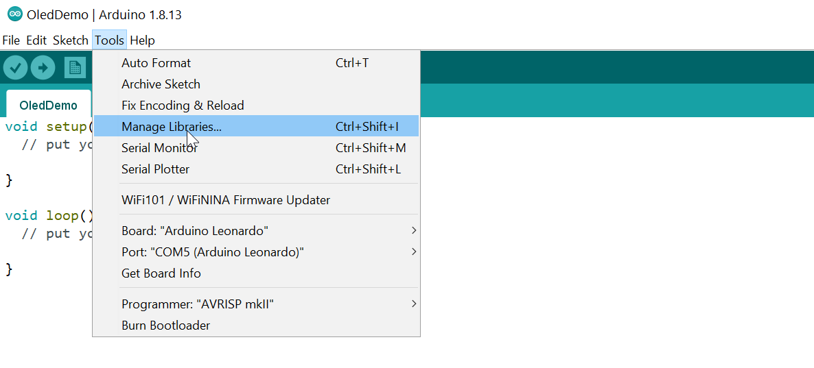
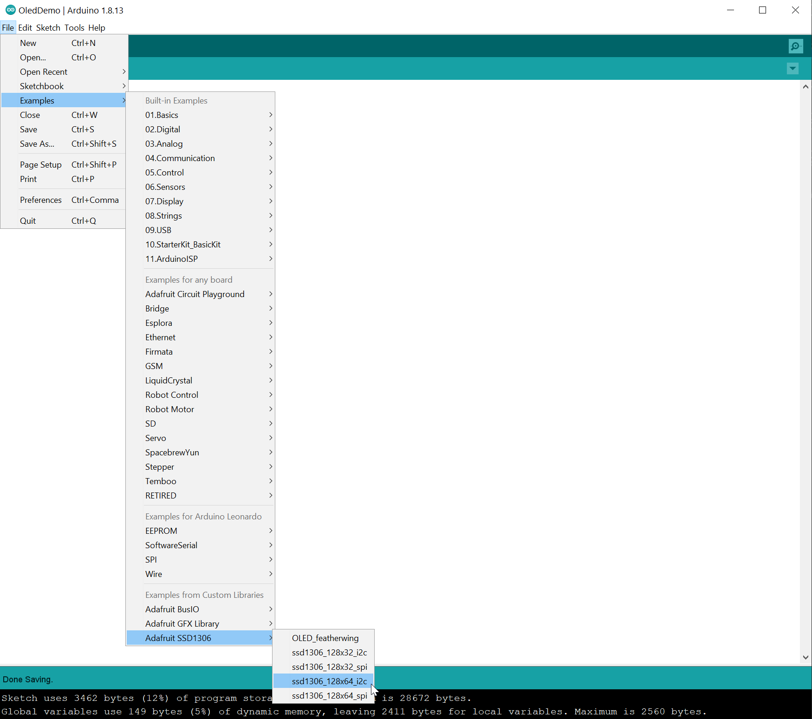

# {{ page.title | replace_first:'L','Lesson '}}
{: .no_toc }

## Table of Contents
{: .no_toc .text-delta }

1. TOC
{:toc}
---

## Outline
- What are OLED devices?
- I2C vs. SPI
  - Master/slave usage
- Pinout diagram for 128x64
- Can Leonardo actually use i2c pin confusion: https://forum.arduino.cc/t/can-leonardo-actually-use-its-i2c-pins/417516

## Install Arduino libraries

To use the OLED display, we will install two libraries:
- The [Adafruit_SSD1306](https://github.com/adafruit/Adafruit_SSD1306) display controller library, which handles display communication, memory mapping, and low-level drawing routines
- The [Adafruit_GFX](https://github.com/adafruit/Adafruit-GFX-Library) library, which provides core graphics routines for all Adafruit displays like drawing points, lines, circles. 

Fortunately, the Arduino IDE makes library installation easy. 

### Step 1: Open "Manage Libraries"

Open your Arduino IDE, then go to `Tools -> Manage Libraries`.

### Step 2: Search for Adafruit SSD1306

In the Library Manager, search for "Adafruit SSD1306". There are other SSD1306 libraries so make sure you find the one by Adafruit.

### Step 3: Install Adafruit SSD1306 library
Click on the `Install` button.

### Step 4: Install all dependencies

The Adafruit SSD1306 library depends on two other libraries, which we also need to install. So, select `Install all`.

<!-- The Arduino IDE Library Manager let's library designers to identify other library dependencies in their metadata. This allows the IDE to ask users about dependencies automatically.  -->

### Step 5: Confirm installation

If the library was installed, you should see a teal "INSTALLED" label next to the Adafruit SSD1306 library in the Library Manager

You can also open the Arduino `libraries` folder on your OS:
- On Windows, this defaults to `C:\Users\<username>\Documents\Arduino\libraries`
- On Mac, `/Users/<username>/Documents/Arduino/libraries`

| Arduino Library directory on Windows | Arduino Library directory on Mac |
|:------------------------------------:|:--------------------------------:|
|  |  |

## Wiring the OLED display

TODO.

## Testing the OLED display

To test the OLED display, we will run one of the examples that ships with the [Adafruit_SSD1306](https://github.com/adafruit/Adafruit_SSD1306) library called [`ssd1306_128x64_i2c`](https://github.com/adafruit/Adafruit_SSD1306/blob/master/examples/ssd1306_128x64_i2c/ssd1306_128x64_i2c.ino). This example iterates through a variety of drawing demonstrations, including: drawing lines, outlined and filled rectangles, outlined and filled circles, outlined and filled rounded rectangles, outlined and filled triangles, text with different styles, and drawing and animating bitmaps. You can view the [source code here](https://github.com/adafruit/Adafruit_SSD1306/blob/master/examples/ssd1306_128x64_i2c/ssd1306_128x64_i2c.ino).

To open and run the example:

### Step 1: Open the example

In the Arduino IDE, go to `File -> Examples` and select 

### Step 2: Compile and upload the example

### Step 3: Watch the demo

TODO: insert animation/movie

## Make stuff!
- Draw ball in center of screen
- Ball that changes size depending on analog input
- Make analog input line graph visualization
- Link to scrolling version
- Using my library

## Resources

- [OLED Display Arduino Tutorial](https://lastminuteengineers.com/oled-display-arduino-tutorial/), Last Minute Engineers

- [Monochrome OLED Breakouts](https://learn.adafruit.com/monochrome-oled-breakouts), Adafruit

- [Adafruit_GFX Library](https://learn.adafruit.com/adafruit-gfx-graphics-library/overview), Adafruit

## Next lesson

In the next lesson, we TODO