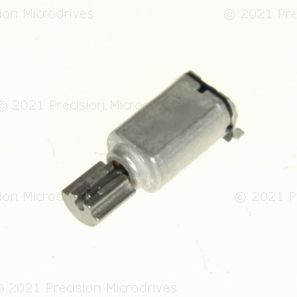
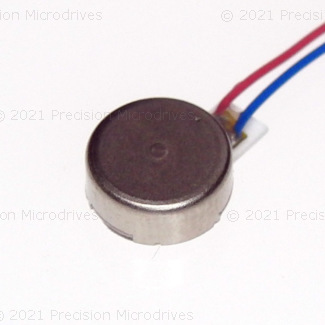
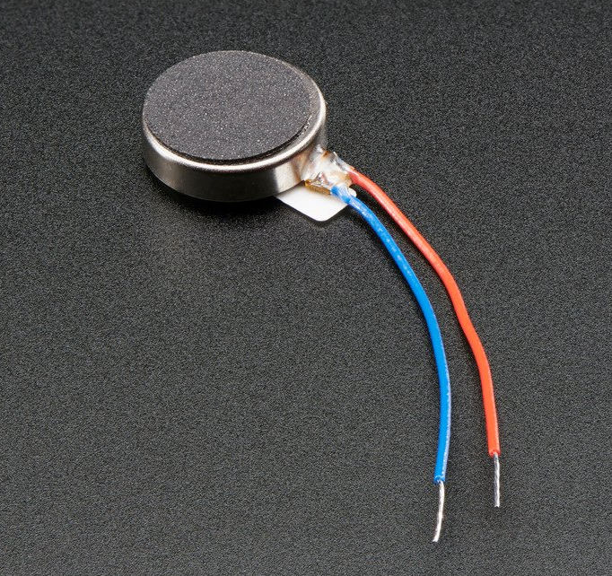
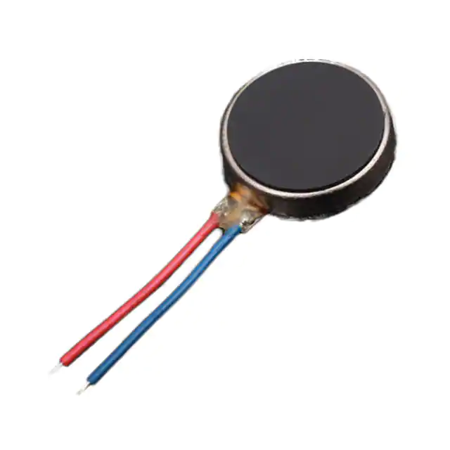
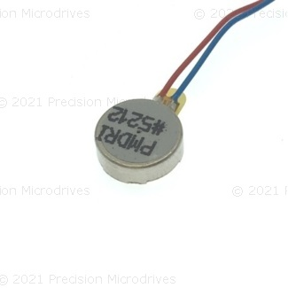
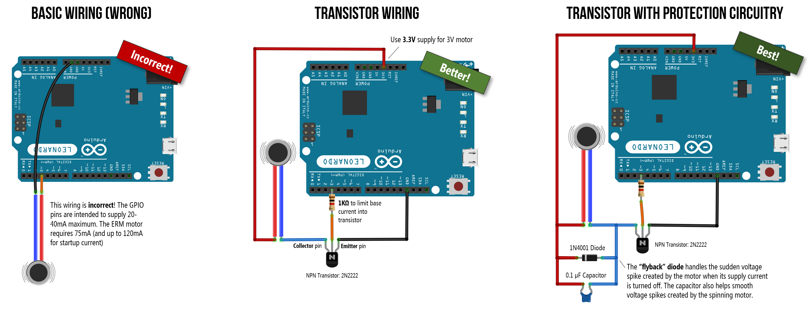
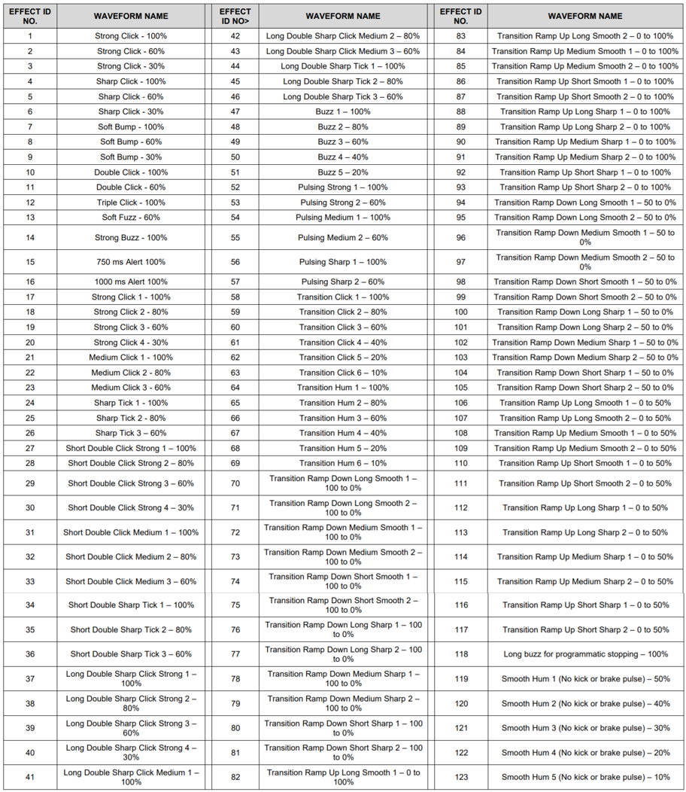

# {{ page.title }}
{: .no_toc }

## Table of Contents
{: .no_toc .text-delta }

1. TOC
{:toc}
---

Haptic or tactile actuator technology provides feedback to the user **via touch** by force, motion, or temperature. In this lesson, we will learn about vibration motors, which are commonly used to provide haptic feedback in game controllers, mobile phones, and smart watches. 

**Figure.** Examples of *eccentric rotating mass (ERM)* motors and *linear resonant actuators (LRA)* in mobile phones and watches. Images from [NFP Motors](https://youtu.be/k1iTLqAtd0U) and [Sosav](https://www.sosav.com/guides/mobiles/samsung/galaxy-s10/vibrator/)
{: .fs-1 }

## Vibromotors

<!-- https://www.fictiv.com/articles/intro-to-haptic-technology-vibration-motors -->

There are two common types of vibration motors: **eccentric rotating mass (ERM)** motors that have a small unbalanced mass attached to the DC motor axle that creates a displacement force when rotating and **linear resonant actuators (LRA)** that contain a small internal mass attached to a spring, which vibrates in a reciprocating linear motion with an applied AC signal. ERMs vibrate along two axes while LRAs are single-axis vibrators. We will be using ERM motors in this lesson. The video excerpt below from [Precision Microdrives](https://vimeo.com/132533086) shows how ERMs and LRAs vibrate.

<video autoplay loop muted playsinline style="margin:0px">
  <source src="assets/videos/PrecisionMicrodrives_ERMvsLRAMotors_Optimized.mp4" type="video/mp4" />
</video>
**Video.** A [video](https://vimeo.com/132533086) from Precision Microdrives showing the two most common types of vibration motors: eccentric rotating mass (ERM) motors and linear resonant actuators (LRA). ERM motors vibrate in two directions due to the centripetal force of the unbalanced mass attached to the DC motor axle. LRAs are similar in design to speakers: 
{: .fs-1 }

**ERMs** are built with DC motors and an off-centered mass: they are cheap, provide a strong vibration, and are pervasive in toys, game controllers, mobile phones, and watches; however, they have a comparatively long startup time (~20-30ms) and limited controllability. For ERMs, you cannot individually control the frequency of the vibration (*i.e.,* how fast the mass is spinning) and the amplitude of that vibration—they are tied together. As the applied DC voltage increases, the frequency and amplitude of the vibration linearly increases, which is perceived as overall vibration intensity. 

In contrast to ERMs, **LRAs** do not spin. They linearly move a mass (up and down) attached to a spring using a [magnetic voice coil](https://en.wikipedia.org/wiki/Voice_coil). LRAs require a smooth sine wave voltage signal (aka an AC signal) driven at specific resonant frequencies—usually 150-200Hz—which controls how often the mass moves and, therefore, the vibration oscillation. They are increasingly common in smartphones, watches, and trackpads to mimic the feeling of a click. For example, newer Apple MacBooks and iPhones feature the [Apple Taptic Engine](https://www.ifixit.com/News/16768/apple-taptic-engine-haptic-feedback), which uses LRA technology. While LRAs are more responsive than ERMs (~15-25ms startup times), their vibration strength is more minimal and the wiring circuitry more complicated. Moreover, their vibration frequency is strongest at a single frequency (the resonant frequency).

If a vibromotor is fully enclosed in a shell, you cannot necessarily tell whether it is ERM or LRA even though the technologies are fundamentally different. Below, we are showing "coin" (or "pancake") form factors of both ERM and LRA.

**Figure.** Depending on their enclosure and form factor, some ERMs and LRAs can look similar even though they are fundamentally different technologies. They require different driver circuits and actuation methods (DC for ERM and AC for LRA). Images from [Precision Microdrives](https://www.precisionmicrodrives.com/).
{: .fs-1 }

<!-- Nice resource for comparing ERM vs LRA: https://www.precisionmicrodrives.com/content/ab-028-vibration-motor-comparison-guide/ -->

### Eccentric Rotating Mass (ERM) Motors

Eccentric rotating mass (ERM) motors have an unbalanced mass attached to their axle. When the ERM motor spins, the rotating mass's centripetal force causes displacement. By attaching an ERM to an object—like a smartphone or game controller—the rotating irregular mass causes the motor and attached device to shake. The larger the object, the more force is needed to modulate the vibration onto the object. 

<video autoplay loop muted playsinline style="margin:0px">
  <source src="assets/videos/PrecisionMicrodrives_HowDoVibrationMotorsWork_ERM-OverviewOptimized.mp4" type="video/mp4" />
</video>
**Video.** A [video](https://vimeo.com/128603396) from [Precision Microdrives](https://www.precisionmicrodrives.com/vibration-motors/) demonstrating how eccentric rotating mass (ERM) motors work. The idea is quite simple: attach an asymmetric or unbalanced mass to the DC motor's axle. When it rotates, the weight shifts causing a vibration.
{: .fs-1 }

#### Vibration frequency and amplitude

There are two main characteristics of a vibration: the vibration **frequency**, which is how fast the mass is spinning and the vibration **amplitude**, which is the strength of the vibration force. For ERM motors, you *cannot* vary the vibration frequency and amplitude independently—both increase linearly with the applied voltage.

DC motors spin at a rate proportional to the applied voltage. We measure "spin rate" in revolutions per minute (RPM); however, we measure vibration frequency in Hz (cycles per second). So, to convert RPM to the vibration frequency $$V_F$$ in Hz, we simply divide by 60: 

$$
V_F = \frac{RPM}{60}
$$

The strength of the force generated by the ERM motor is:

$$
F = m \cdot r \cdot ω^2
$$

Where $$F$$ is the centripetal force in Newtons (N), $$m$$ is the mass of the eccentric mass (in kg), $$r$$ is the radius of the eccentric mass (in meters), and $$ω$$ is the angular velocity in radians/second (*i.e.,* the speed of the motor).

**Figure.** The strength of the force generated by the ERM motor is: $$F = m \cdot r \cdot ω^2$$ where $$F$$ is the centripetal force in Newtons (N), $$m$$ is the mass of the eccentric mass (in kg), $$r$$ is the radius of the eccentric mass (in meters), and $$ω$$ is the angular velocity in radians/second. Image based on [video](https://vimeo.com/128603396) from Precision Microdrives.
{: .fs-1 }

When attached to an object, the vibration amplitude is also affected by the size of that object. This should make intuitive sense. For example, the small ERM motor in your mobile phone (used for alerts and notifications) would not cause much displacement when attached to a larger object like a laptop or an office desk. If you know the size of the target object, you can use this to inform the size and operating characteristics of your ERM motor.

<video autoplay loop muted playsinline style="margin:0px">
  <source src="assets/videos/PrecisionMicrodrives_HowDoVibrationMotorsWork_ERM-VibrationAmplitudeOptimized.mp4" type="video/mp4" />
</video>
**Video.** An ERM's vibration amplitude is not just a function of motor speed and eccentric mass size but also the size of the attached object. A larger object requires more force to vibrate. Notice how the vibration displacement is greater with the smaller attached mass compared to the larger attached mass. Video from [Precision Microdrives](https://www.precisionmicrodrives.com/vibration-motors/).
{: .fs-1 }

#### ERM form factors

There are a variety of ERM form factors—see the figure below—from the basic cylindrical "pager" motor, which can be mounted directly to a PCB, to fully encapsulated waterproof versions, to the popular coin or "pancake" forms. The coin ERMs are compact, easy-to-use, and come with strong adhesive backing for mounting. Don't be confused: many LRAs also come in a coin form factor but are fundamentally different technology.

**Figure.** Example ERM motors, including the cylindrical (or pager) ERM and the coin or pancake ERM. Images from [Precision Microdrives](https://www.precisionmicrodrives.com/vibration-motors/vibration-motors-erms-and-lras/).
{: .fs-1 }

#### Example ERM motors

Below, we've highlighted example ERM motors from a popular supplier: [Precision Microdrives](https://www.precisionmicrodrives.com/). For each ERM motor, we include the body diameter and length, the eccentric mass radius and length, the operating voltage and current, and the motor speed and vibration frequency at that voltage/current. We specifically selected small ERMs that are common in handheld devices but they can get much larger.

Because vibration amplitude is dependent not just on the speed of the ERM motor and the size of its eccentric mass but also the size of the affixed target object (*e.g.,* smartphone or watch), vibromotor datasheets often quote a "normalized vibration amplitude", which is the ERM's motor performance at its rated voltage when attached to a fixed mass. The Precision Microdrive datasheets, for example, use a fixed mass of 100g to calculate a normalized vibration amplitude for its motors.

| Model | Body Diameter | Body Length | Eccentric Weight Radius | Eccentric Weight Length | Operating Voltage | Operating Current | Motor Speed | Vibration Frequency | Normalized Amplitude |
|---|---|---|---|---|---|---|---|---|
|  | 4.1mm | 6.8mm | 1.4mm | 3mm | 2.5V | 25mA | 11,000 rpm | 183 Hz | 0.25G |
|  | 4.5mm | 11mm | 2mm | 3mm | 1.5V | 17mA | 9,100 rpm | 152 Hz | 0.4G |
|  | 8mm | 3.4mm | -- | -- | 3V | 66mA | 12,500 rpm | 208 Hz | 1.13G |
|  | 10mm | 2.1mm | -- | -- | 3V | 60mA | 14,000 rpm | 233 Hz |  1.1G |
|  | 7mm | 24.5mm | -- | -- | 3V | 50mA | 13,800 rpm | 230 Hz | 1.84G |
|  | 8.7mm | 25.1mm | -- | -- | 3V | 100mA | 13,800 rpm | 230 Hz |  7G |
|  | 24.3mm | 12.5mm | 9mm | 4.8mm | 12V | 148mA | 5,500 rpm | 92 Hz | 13G |
{: .vibro-table }

<!-- |  | 4.4mm | 6mm | 1.7mm | 2.8mm | 2.7V | 65mA | 13,500 rpm | 0.5G | -->
<!-- |  | 20.4mm | 25mm | 9mm | 5.9mm | 3V | 413mA | 6,100 rpm | 15.9G | -->

<!-- - https://e2e.ti.com/blogs_/b/analogwire/posts/how-to-improve-the-startup-and-stop-behavior-of-erm-and-lra-actuators
- https://www.vibrationmotors.com/vibration-motor-product-guide/coin-vibration-motor/
- https://www.precisionmicrodrives.com/vibration-motors/ -->

#### Coin vibration ERM motors

In our [teaching hardware kits](../index.md/#example-hardware-kits), we often supply ERM motors in the coin form factor. These motors are also called pancake ERMs or vibrating mini-motor discs. Coin ERMs are compact, self-contained, and provide a strong vibration. Due to their small size, ease-of-use, and fully enclosed vibration mechanism, they are common in mobile phones, handheld devices (*e.g.,* controllers), and medical applications.

| Adafruit "Vibrating Mini-motor Disc" | Digikey ERM Vibration Motor |
|-----|----|
|  |  |
| [Product #1201](https://www.adafruit.com/product/1201) $1.95 | [Product #316040001](https://www.digikey.com/en/products/detail/seeed-technology-co.,-ltd/316040001/5487672) $1.20 |

Coin vibration motors are ERMs and generally have the same operating and functional characteristics as their cylindrical counterparts; however, their construction is different. See video below. You can read about their construction on the [Precision Microdrives](https://www.precisionmicrodrives.com/vibration-motors/coin-vibration-motors/) website.

<video autoplay loop muted playsinline style="margin:0px">
  <source src="assets/videos/CoinVibromotor_HowAMobilePhoneVibrationMotorLooksAndWorks_TrimmedOptimized.mp4" type="video/mp4" />
</video>
**Video.** A demonstration of an opened coin ERM from [Tech Vision](https://youtu.be/iwEGqBpYaqc). There is another [great video](https://youtu.be/lp7bwXXsVl8?t=537) looking at a coin ERM with a microscope by Marty Jopson.
{: .fs-1 }

<!-- - https://www.precisionmicrodrives.com/vibration-motors/coin-vibration-motors/
- https://nfpmotor.com/products-coin-vibration-motors.html
- https://www.androidpolice.com/2020/10/20/a-lot-more-goes-into-good-smartphone-haptics-than-youd-think/ -->

<!-- ### LRAs

Some helpful links:

- https://www.vibrationmotors.com/vibration-motor-product-guide/linear-resonant-actuator/
- https://www.precisionmicrodrives.com/vibration-motors/linear-resonant-actuators-lras/
- https://www.nfpmotor.com/products-linear-resonant-actuators-lras.html

LRAs are in iPhones since iPhone7: https://www.boreas.ca/blogs/piezo-haptics/last-decade-haptics-in-mobile-erm-to-lra-and-the-taptic-engine 

LRA Motors

| Model | Body Diameter | Body Length | Voltage (RMS) | Operating Current | Vibration Frequency | Amplitude |
|---|---|---|---|---|---|---|
|  | 8mm | 2.6mm | 1.2V | 28mA | 240Hz | 0.7G |
|  | 10mm | 3.7mm | 2V | 69mA | 175Hz | 1.5G |
|  | 6mm | 12mm | 2V | 111mA | 204Hz | 1.5G |
{: .vibro-table } -->

<!-- |  | 8mm | 2.6mm | 1.2V | 28mA | 240Hz | 0.7G | -->

<!-- Really neat inside-a-LRA demo: https://youtu.be/Nz3Z2XQZpJs?t=198 -->

<!-- Amazing LRA video of the Samsung S10 LRA: https://youtu.be/gOBhQRVmLsA -->

## Wiring ERM motors with Arduino

Although many online tutorials and YouTube videos show ERM motors directly hooked up to Arduino GPIO pins—using wirings similar to how we connect [LEDs](../arduino/led-blink.md)—this is incorrect and could damage your microcontroller. Why?

Recall that Arduino GPIO pins can supply a [maximum 40mA](https://www.arduino.cc/en/reference/board) per pin with a safe continuous current of 20mA. This is sufficient to turn on LEDs with current limiting resistors but not enough for higher-current loads. In the table [above](#example-erm-motors), most ERM motors have operating currents of 50mA or beyond. Moreover, as electromechanical devices, ERMs require a higher startup current to initiate motor movement from rest (due to inertia). The [coin ERM sold](https://www.adafruit.com/product/1201) by Adafruit has an operating current of 75mA and a startup current of up to 120mA.

So, what do we do? We need to use a **transistor**.

**Figure.** Three example wirings for hooking up ERM motors to your Arduino. The incorrect wiring on the left directly connects the ERM to the GPIO Pin 3 (using a similar wiring as we did with [LEDs](../arduino/led-blink.md)). This is wrong and could damage your Arduino. GPIO pins can only supply up to 40mA of current but the ERM motor requires 75mA with a startup current of up to 120mA. The other two wirings use transistors as switches to connect the ERM motors to the 3.3V supply pins, which are capable of supplying 150mA. You can right-click on this image and select "Open Image in a New Tab" to enlarge. See also this "[How to Build a Vibration Motor Circuit](http://www.learningaboutelectronics.com/Articles/Vibration-motor-circuit.php)" by Learning about Electronics.
{: .fs-1 }

---

**CAUTION:**

The two wires on the Adafruit coin ERMs are extremely fragile and can easily break or snap off their solder joints. Be careful!

---

<!-- TODO: in future, include figure showing how with red and blue wires reversed, simply reverses direction of motor -->

### Transistors

<!-- The invention of the transistor in 1947 marked the beginning of the [computing revolution](https://en.wikipedia.org/wiki/History_of_computing_hardware_(1960s%E2%80%93present)#Third_generation), allowing electrical circuits to rapidly switch off (`0`) and on (`1`) to create [logic gates](https://en.wikipedia.org/wiki/Logic_gate), [accumulators](https://en.wikipedia.org/wiki/Accumulator_(computing)), and other computational building blocks. Before transistors, computers used [vacuum tubes](https://en.wikipedia.org/wiki/Vacuum_tube_computer), which were slower, less robust, much larger, and required significantly more power.

TODO: insert picture of variety of transistors -->

[Transistors](https://en.wikipedia.org/wiki/Transistor) are semiconductor devices used to **amplify** or **switch** electronic signals. They are the basic building blocks of computers and used in almost every modern electronic device from smartphones to headphone amplifiers. Transistors come in a variety of shapes, sizes, and operating specifications. There are two common designs: [**BJTs**](https://en.wikipedia.org/wiki/Bipolar_junction_transistor) (Bipolar Junction Transistors), which we'll use in this lesson, and [**MOSFETS**](https://en.wikipedia.org/wiki/MOSFET) (Metal-Oxide Semiconductor Field Effect Transistors), which are better suited for higher-current loads.

There are two primary "form factors" or packages for transistors: [TO-92](https://en.wikipedia.org/wiki/TO-92) packages and [TO-220](https://en.wikipedia.org/wiki/TO-220) packages; the latter is more common for higher-current loads due to the built-in heat sinks. You can find both BJT and MOSFET transistors in either package type and we've included examples  of each below.

**Figure.** There are two primary "form factors" or packages for transistors: [TO-92](https://en.wikipedia.org/wiki/TO-92) packages and [TO-220](https://en.wikipedia.org/wiki/TO-220) packages. You can find both BJT and MOSFET transistors in either package type. Shown above: the [2N3904](https://www.sparkfun.com/datasheets/Components/2N3904.pdf) NPN BJT and [2N7000](https://www.onsemi.com/products/discretes-drivers/mosfets/2n7000) N-Channel MOSFET with TO-92 packaging and the [TIP120](https://components101.com/transistors/tip120-pinout-datasheet-equivalent) NPN BJT and [IRLB8721](https://cdn-shop.adafruit.com/datasheets/irlb8721pbf.pdf) N-Channel MOSFET with TO-220 packaging. Images from Wikipedia and respective datasheets.
{: .fs-1 }

<!-- Nice discussion of BJT vs. Mosfet: https://electronics.stackexchange.com/a/527268 -->

Transistors are a complex topic deserving of their own lesson; however, for our purposes here, two attributes are relevant:

- First, transistors can work as **electronically controlled switches**. You can control transistors with *small* amounts of current (to turn them on and off) but the signal they control can be much *larger*. Thus, transistors are commonly used to control high-current loads with microcontrollers such as [RGB LED strips](https://learn.adafruit.com/rgb-led-strips/usage) and [motors](https://itp.nyu.edu/physcomp/labs/motors-and-transistors/).
 
<!-- On the Arduino, recall that our GPIO pins can only supply 40mA of continuous current (maximum!); however, [RGB LED strips](https://learn.adafruit.com/rgb-led-strips/usage) can easily require 1A or more and even small [DC hobby motors](https://www.adafruit.com/product/711) use between 70-250mA. The tiny pancake vibromotor used in this lesson has a rated current of 75mA and a startup current of up to ~120mA—both beyond the maximum safe current of our microcontroller GPIO pins. -->

- Second, because transistors can **rapidly switch on and off**, they can use pulse-width modulation. That is, your microcontroller can supply a PWM signal to the transistor's control input, which will modulate the same PWM signal, but amplified, on the transistor's output. Thus, we can use PWM via our transistor to control the vibration strength of our vibromotor.

<!-- ### The BJT Transistor

Show  -->

### Wiring up the Adafruit ERM motor with 2N2222 Transistor

The [datasheet](https://cdn-shop.adafruit.com/product-files/1201/P1012_datasheet.pdf) for the [Adafruit vibrating mini-motor disc](https://www.adafruit.com/product/1201) states the following operating specifications.

| Attribute | Rating |
|-----------|--------|
| Rated operating voltage | 3.0V |
| Voltage range | ~2.5-3.8V |
| Rated operating current | 75mA |
| Rated speed | 11,000 ± 3,000rpm |
| Rated vibration frequency | 183 ± 50 Hz |
| Starting voltage | 2.3V |
| Starting current | Up to ~120mA |

Remember, the ERM vibromotor is a type of DC motor—though a very tiny one. You need to supply a starting voltage and current to initiate rotations from rest; these values are higher than the general operating voltage and current. While the operating range of the Adafruit ERMs are 2.5-3.8V, the Adafruit docs suggests that 2-5V works. Indeed, we have also found this to be the case with 5V resulting in stronger vibrations (as expected). However, for longitudinal use, the 3.3V supply is likely more prudent given the datasheet.

**Figure**. Two example wirings with an NPN BJT transistor. On the left, we are using the 3.3V supply pin and on the right, we're using the 5V supply pin. If you have the components, you should also add in a flyback diode and capacitor as we've shown earlier. To zoom in, right-click on the image to "Open Image in a New Tab"
{: .fs-1 }

<!-- How to improve start time and stop behavior of ERM and LRA actuators: https://e2e.ti.com/blogs_/b/analogwire/posts/how-to-improve-the-startup-and-stop-behavior-of-erm-and-lra-actuators -->

<!--  -->

Specifically, the NPN bipolar transistors we use in our courses are the [PN2222A](https://www.adafruit.com/product/756) transistors (and variants such as the [2N2222A](https://components101.com/transistors/2n2222a-pinout-equivalent-datasheet)). You need a resistor in series with the control input pin (base pin) on the transistor. In this case, a 1kΩ resistor works well. 

Make sure you orient the transistor correctly. We created the abstract diagram below to help with assembly. In this diagram, the text on the transistor is facing us and the bulbous part is facing away.

**Figure**. An additional diagram to help you wire up this transistor-based circuit. Play close attention to the orientation of the transistor. The text on the transistor is facing us and the bulbous part is facing away from us. Diagram idea based on [Learning About Electronics](http://www.learningaboutelectronics.com/Articles/Vibration-motor-circuit.php).
{: .fs-1 }

<!-- 1023 | 255 | 0.012 A | 75.55
900 | ~225 | 0.011 A | 65 mA
800 | 199 | 0.009A | 58 mA
700 | 174 | 0.008A | 52 mA
600 | 149 | 0.007A | 45 mA
400 | 99 | 0.005A | 32 mA
300 | 75 | 0.004A | 25 mA
200 | 50 | 0.002A | 15 mA
160 | 40 | 0.002A | 12 mA (turned off)
100 | 25 | 0.001A | 6.1 mA -->

<!-- TODO: Take video of experimental  setup.

- http://www.learningaboutelectronics.com/Articles/Vibration-motor-circuit.php
- https://www.precisionmicrodrives.com/content/how-to-drive-a-vibration-motor-with-arduino-and-genuino/ 
- http://www.ermicro.com/blog/?p=423
- Transistor gain: https://www.electronics-notes.com/articles/electronic_components/transistor/current-gain-hfe-beta.php
- [Discrete Driver Circuits for Vibration Motors](https://www.precisionmicrodrives.com/content/ab-001-discrete-driver-circuits-for-vibration-motors/), Precision Microdrives
- [Electrical Techniques for Driving Vibration Motors](https://www.precisionmicrodrives.com/content/ab-011-electrical-techniques-for-using-different-power-sources/), Precision Microdrives -->

<!-- Talk about using diodes and capacitor:
https://www.reddit.com/r/arduino/comments/a06hxr/why_do_motors_need_transistors_and_diodes/ -->

<!-- ### Tinkercad version

<iframe width="725" height="453" src="https://www.tinkercad.com/embed/dlqdbv0SFV4?editbtn=1" frameborder="0" marginwidth="0" marginheight="0" scrolling="no"></iframe>

Though messier, we also [made a version](https://www.tinkercad.com/things/jGRVrL9C8Jv) with ammeters to track (1) the current through the vibromotor and into the transistor emitter, (2) the current into the transistor's base pin (the control pin), and (3) current out of the emitter.

**Figure.** We remixed the original vibromotor Tinkercad circuit to include ammeters ([link](https://www.tinkercad.com/things/jGRVrL9C8Jv)).
{: .fs-1 } -->

<!-- ## Generating haptic patterns

TODO: have students make a haptic pattern or two. Maybe schedule a timer interrupt to do this?

Are there Arduino libraries for this? -->

## Haptic motor drivers

When haptics play a key role in your project, consider using a [haptic motor driver](https://learn.sparkfun.com/tutorials/haptic-motor-driver-hook-up-guide?_ga=2.87552344.1190007566.1620233503-935977820.1612992862), which makes it easier to interface with vibration motors and drive complex haptic patterns.

For example, Texas Instruments (TI) sells a variety of [haptic motor drivers](https://www.ti.com/motor-drivers/actuator-drivers/overview.html). The popular [TI DRV2605](https://www.ti.com/lit/ds/symlink/drv2605.pdf) provides a [I2C](https://en.wikipedia.org/wiki/I%C2%B2C)-based interface to control both ERM and LRA motors, generates its own the pulse-width modulated (PWM) waveforms, which relieves the host microcontroller of this responsibility saving hardware pins and reducing code complexity (*e.g.,* setting precise timer interrupts for waveform generation), and includes an integrated library of 123 licensed haptic patterns, reducing the need to design and implement software to create custom haptic effects.

**Figure.** The [TI DRV2605L](https://www.ti.com/lit/ds/symlink/drv2605l.pdf) includes a preprogrammed library of over 100 haptic waveform effects, including single, double, and triple clicks, alerts, and transitions. These haptic patterns are licensed from Immersion Corporation. See page 63 of the [TI DRV2605L](https://www.ti.com/lit/ds/symlink/drv2605l.pdf) datasheet. Right-click on the image and select "Open image in new tab" to zoom in.
{: .fs-1 }

Both [Adafruit](https://www.adafruit.com/product/2305) and [SparkFun](https://www.sparkfun.com/products/14538) provide custom breakout boards to interface with the [TI DRV2605](https://www.ti.com/lit/ds/symlink/drv2605.pdf) IC.

| SparkFun Haptic Breakout Board for TI DRV2605L | Adafruit Haptic Breakout Board for TI DRV2605L |
|  |  |
| $8.50 from [SparkFun](https://www.sparkfun.com/products/14538) | $7.95 from [Adafruit](https://www.adafruit.com/product/2305) |

You can also purchase breakout boards with the vibration motor and haptic driver integrated together like this [SparkFun DA7280 Haptic Driver](https://www.sparkfun.com/products/17590) with Qwiic [I2C](https://en.wikipedia.org/wiki/I%C2%B2C) connectors.

For more information on using haptic motor drivers with Arduino, see [SparkFun's Haptic Motor Driver Hook-up Guide](https://learn.sparkfun.com/tutorials/haptic-motor-driver-hook-up-guide).

## Prototyping journal activities

For your prototyping journal, please complete the **three** ERM motor activities we began in lecture (see [slides here](https://docs.google.com/presentation/d/1bV08Yjvlf1CtBgx1nD3IamVHx6wtGVE_HgxQQnEf7P4/edit?usp=sharing)). Take a video of your constructions and include a link to your video and code in your journal. Briefly describe what you did and what you learned.

<!-- TODO: in future step through each of these lessons (at least provide wiring diagrams and some basic example code) -->

## Resources

### Vibromotor resources

- [Vibration Motor Best Practices from Mobile Phones](https://www.precisionmicrodrives.com/content/ab-008-vibration-motor-best-practices-from-mobile-cell-phones/), Precision Microdrives

- [Vibration Motor Comparison Guide](https://www.precisionmicrodrives.com/content/ab-028-vibration-motor-comparison-guide/), Precision Microdrives

- [Understanding ERM Vibration Motor Characteristics](https://www.precisionmicrodrives.com/content/ab-004-understanding-erm-vibration-motor-characteristics/), Precision Microdrives

- [How to Build a Vibration Motor Circuit](http://www.learningaboutelectronics.com/Articles/Vibration-motor-circuit.php), Learning About Electronics

### Using transistors with Arduino

- [How to Drive a Vibration Motor with Arduino](https://www.precisionmicrodrives.com/content/how-to-drive-a-vibration-motor-with-arduino-and-genuino/), Precision Microdrives

- [Controlling RGB LED Strips with Transistors](https://learn.adafruit.com/rgb-led-strips/usage), Adafruit

- [Transistors 101](https://learn.adafruit.com/transistors-101/overview), Adafruit
  
- [Using a Transistor to Control High Current Loads with an Arduino](https://itp.nyu.edu/physcomp/labs/motors-and-transistors/using-a-transistor-to-control-high-current-loads-with-an-arduino/), NYU ITP Physical Computing Course

- [Motors and Transistors](https://itp.nyu.edu/physcomp/labs/motors-and-transistors/), NYU ITP Physical Computing Course

### Videos

- [BJTs as Transistor Switches](https://youtu.be/sRVvUkK0U80), AddOhms on YouTube

- [Transistor (BJT) as a Switch](https://youtu.be/WRm2oUw4owE), GreatScott! on YouTube

- [MOSFETS and Tranistors with Arduino](https://youtu.be/IG5vw6P9iY4), DroneBot Workshop on YouTube
