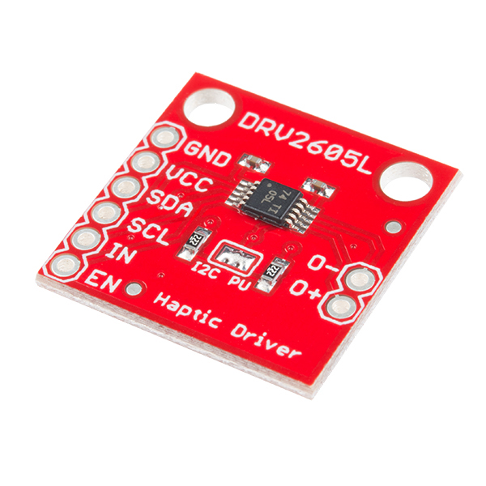
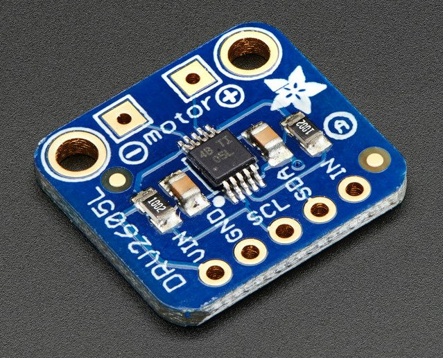

## Outline

- Bring in Jonggi's work about looking at diff between motors
- Go into my slides to find interesting haptic examples
- Linear resonate actuators vs. ERMs

- Coin or pancake motors:
  - https://www.precisionmicrodrives.com/vibration-motors/coin-vibration-motors/
  - 

- Show Tinkercad example?

- Show vibration motor. Talk about 3M adhesive tape. Affix to things, make them vibrate.

- Overview of Haptics generally with link to IEEE haptics conference. Define haptics, etc.
- Show pictures of lots of diff haptic motors (maybe drawn from precision microdrive website)

- Great overview of vibration motors with a video:
  - https://www.precisionmicrodrives.com/vibration-motors/

- Overview all of the tactile things that people can feel

- Silly examples of things people have made with vibromotors? Like the automatic moving robot thing
    - Also check my slides for examples

- Haptic drivers
  - TI DRV2605 Haptic Driver: https://youtu.be/y5nf-8N7J7g

## What are haptics?

Leaders:
[Dr. Hong Z. Tan](https://engineering.purdue.edu/~hongtan/), a professor in Electrical and Computer Engineering at Purdue University
[Dr. Stephen Brewster](https://scholar.google.com/citations?hl=en&user=uu7LudIAAAAJ), a professor in the School of Computing Science at the University of Glasgow
[Dr. Pedro Lopes](http://plopes.org/), a professor in Computer Science at the University of Chicago
[Dr. Karon MacLean](https://scholar.google.com/citations?user=qANkJFwAAAAJ&hl=en&oi=sra), a professor in Computer Science at the University of British Columbia
[Dr. Allison Okamura](http://charm.stanford.edu/), a professor in Mechanical Engineering at Stanford University

### Where are they used?

- Remote surgery feedback
- Gaming. Nintendo was the first to support haptic feedback in their controllers with the introduction of the rumble pack accessory for the N64, which was extended and concretized by PlayStation dualshock controllers (one vibromotor per "handle") 
- VR/AR applications
- Vehicle feedback (pilot warning)
- accessibility

### Vibrotactile feedback
TODO: describe

#### Vibrotactile feedback patterns
- Maybe look at stephen brewster work? Or our jonggi paper?

#### Just noticeable differences (JND)

### Some zanier examples

- Wireality by Cathy Fang and Chris Harrison, https://cathy-fang.com/project/wireality.html
- Impacto by Pedro Lopes, Alexandra Ion, and Patrick Baudisch, https://youtu.be/k5e4mXQLq54
- Magneto by Alex Mazurksy, Shan-Yuan Teng, et al. and Pedro Lopes: https://youtu.be/9bm7lBhwhwY. Shorter video: https://youtu.be/hsCo3g3JKy0  
- 
- Tesla touch: Olivier Bau, Ivan Poupyrev, Ali Israr, and Chris Harrison. 2010. TeslaTouch: electrovibration for touch surfaces. In Proceedings of the 23nd annual ACM symposium on User interface software and technology (UIST '10). Association for Computing Machinery, New York, NY, USA, 283–292. DOI:https://doi.org/10.1145/1866029.1866074. Video: https://youtu.be/3l3MDNZk-3I

Related to Tesla touch is follow-up work by the same team exploring how different tactile-rendering algorithms to simulate 3D geometric features such as bumps on a touch screen surface:

- Seung-Chan Kim, Ali Israr, and Ivan Poupyrev. 2013. Tactile rendering of 3D features on touch surfaces. In <i>Proceedings of the 26th annual ACM symposium on User interface software and technology</i> (<i>UIST '13</i>). Association for Computing Machinery, New York, NY, USA, 531–538. DOI:https://doi.org/10.1145/2501988.2502020. Video here: https://youtu.be/zo1n5CyCKr0

Also follow-up work with Revel: Programming the Sense of Touch: https://youtu.be/L7DGq8SddEQ. Olivier Bau, Ivan Poupyrev, Mathieu Le Goc, Laureline Galliot, and Matthew Glisson. 2013. Revel: programming the sense of touch. In CHI '13 Extended Abstracts on Human Factors in Computing Systems (CHI EA '13). Association for Computing Machinery, New York, NY, USA, 2785–2786. DOI:https://doi.org/10.1145/2468356.2479511

### Non-contact haptics

Propelled by virtual and augmented reality and the emergence of optical-based input techniques like the [Microsoft Kinect](https://en.wikipedia.org/wiki/Kinect) or [Leap Motion Controller](https://www.ultraleap.com/product/leap-motion-controller/) where a user interacts with a computer **without** touching or holding an input device, there has been increased interest in non-contact haptics. That is, haptics that are modulated through air.

TODO: insert brief looping video of Sidhant's work
https://youtu.be/b5vzvMCmiyQ

Sidhant Gupta, Dan Morris, Shwetak N. Patel, and Desney Tan. 2013. AirWave: non-contact haptic feedback using air vortex rings. In Proceedings of the 2013 ACM international joint conference on Pervasive and ubiquitous computing (UbiComp '13). Association for Computing Machinery, New York, NY, USA, 419–428. DOI:https://doi.org/10.1145/2493432.2493463

One leader in this area is [Dr. Sriram Subramanian](https://subramaniansri.github.io/), a professor at the University College London and an expert in inventing novel user interfaces using the "*computational manipulation of acoustic wavefronts*"

### Operating specifications

The [datasheet](https://cdn-shop.adafruit.com/product-files/1201/P1012_datasheet.pdf) for the [Adafruit vibrating mini-motor disc](https://www.adafruit.com/product/1201) states the following operating specifications.

| Attribute | Rating |
|-----------|--------|
| Rated voltage | 3.0V |
| Voltage range | ~2.5-3.8V |
| Rated current | 75mA |
| Rated speed | 11,000 ± 3,000rpm |
| Starting voltage | 2.3V |
| Starting current | Up to ~120mA |

### Wiring up the vibro-motor

- http://www.learningaboutelectronics.com/Articles/Vibration-motor-circuit.php
- https://www.precisionmicrodrives.com/content/how-to-drive-a-vibration-motor-with-arduino-and-genuino/ 

### Haptic motor drivers

When haptics play a key role in a project, you should consider using a [haptic motor driver](https://learn.sparkfun.com/tutorials/haptic-motor-driver-hook-up-guide?_ga=2.87552344.1190007566.1620233503-935977820.1612992862), which makes it easier to interface and work with vibration motors and drive complex haptic patterns.

For example, Texas Instruments (TI) sells a variety of [haptic motor drivers](https://www.ti.com/motor-drivers/actuator-drivers/overview.html). The popular [TI DRV2605](https://www.ti.com/lit/ds/symlink/drv2605.pdf) provides a [I2C](https://en.wikipedia.org/wiki/I%C2%B2C)-based interface to control both ERM and LRA motors, generates its own the pulse-width modulated (PWM) waveforms, relieving the host microcontroller of this responsibility saving timer interrupts and hardware pins, and includes an integrated library of 123 licensed haptic patterns, reducing the need to design and implement software to create custom haptic effects.

**Figure.** The [TI DRV2605L](https://www.ti.com/lit/ds/symlink/drv2605l.pdf) includes a preprogrammed library of over 100 haptic waveform effects, including single, double, and triple clicks, alerts, and transitions. These haptic patterns are licensed from Immersion Corporation. See page 63 of the [TI DRV2605L](https://www.ti.com/lit/ds/symlink/drv2605l.pdf) datasheet. Right-click on the image and select "Open image in new tab" to zoom in.   

Both [Adafruit](https://www.adafruit.com/product/2305) and [SparkFun](https://www.sparkfun.com/products/14538) provide custom breakout boards to interface with the [TI DRV2605](https://www.ti.com/lit/ds/symlink/drv2605.pdf) IC.

| SparkFun Haptic Breakout Board for TI DRV2605L | Adafruit Haptic Breakout Board for TI DRV2605L |
|  |  |
| $8.50 from [SparkFun](https://www.sparkfun.com/products/14538) | $7.95 from [Adafruit](https://www.adafruit.com/product/2305) |

You can also purchase breakout boards with the vibration motor and haptic driver integrated together like this [SparkFun DA7280 Haptic Driver](https://www.sparkfun.com/products/17590) with Qwiic [I2C](https://en.wikipedia.org/wiki/I%C2%B2C) connectors.

For more information on using haptic motor drivers with Arduino, see [SparkFun's Haptic Motor Driver Hook-up Guide](https://learn.sparkfun.com/tutorials/haptic-motor-driver-hook-up-guide).

## Resources:

- [Haptic Motor Driver Arduino Hook-Up Guide](https://learn.sparkfun.com/tutorials/haptic-motor-driver-hook-up-guide), SparkFun.com

- http://www.learningaboutelectronics.com/Articles/Vibration-motor-circuit.php

- Shows a DIY eccentric rotating mass vibrator: https://www.youtube.com/watch?v=cF1p6x6mZiI. Has some potentially nice things we could excerpt as small animations.

- [Apple Taptic Engine Teardown](https://youtu.be/Nz3Z2XQZpJs), YouTube video by Chris M.

- [The Amazing Evolution of Rumble/Vibration in Controllers](https://youtu.be/O18cHHOB0yY), GamingBolt

- [Expanding the Sensory Experience with Core Haptics](https://developer.apple.com/videos/play/wwdc2019/223/), WWDC2019

Nice overview article:
- Fleury, A Survey on the Use of Haptic Feedback for Brain-Computer Interfaces and Neurofeedback, https://www.ncbi.nlm.nih.gov/pmc/articles/PMC7325479/
- Haptics book by Lynette Jones, https://www.google.com/books/edition/Haptics/SrT4DwAAQBAJ?hl=en&gbpv=0
- Karon MacLean, Designing with haptic feedback: https://www.cs.ubc.ca/labs/lci/papers/docs2000/maclean-icra00-DesignWithHaptic-reprint.PDF

- Culbertson, H., Schorr, S. B., Okamura, A. M., [Haptics: The Present and Future of Artificial Touch Sensation](https://doi.org/10.1146/annurev-control-060117-105043), Annual Review of Control, Robotics, and Autonomous Systems 2018. This paper is available online via the UW library website.

## Fun
- Giant controller rumbler (huge motor): https://youtu.be/fxmLD8y0RNQ
- Apple WWDC2020 talk on the Apple Core Haptics API for game controllers: https://developer.apple.com/videos/play/wwdc2020/10614/

Pallesthesia is the ability to perceive vibration:
https://en.wikipedia.org/wiki/Pallesthesia#:~:text=Pallesthesia%20(%5C%CB%8Cpal%2Des%2D%CB%88th%C4%93,disk%20receptors%2C%20and%20tactile%20corpuscles.

Apple iOS Haptics:
- https://developer.apple.com/design/human-interface-guidelines/ios/user-interaction/haptics/
- https://developer.apple.com/documentation/uikit/animation_and_haptics

- A nice video explaining haptics 101: https://developer.apple.com/videos/play/wwdc2019/223/
  - Starts at 4min. Discusses continuous and transient haptics. Finishes at 5:51 mins
  - 10:37: great overview of visual, audio, and haptics synchronized. Talks alot about multimodality.
  - Nice overview of how they did some watch feedback at 24 mins
