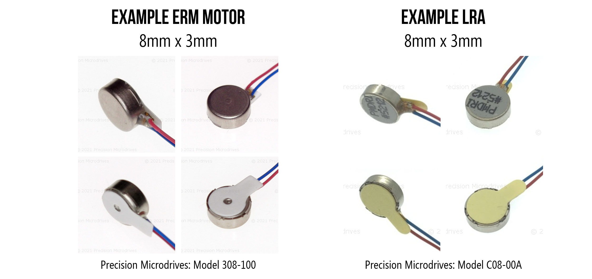
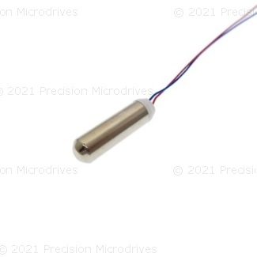
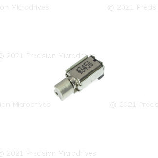
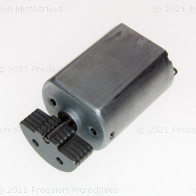
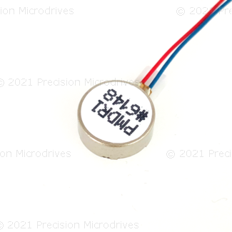
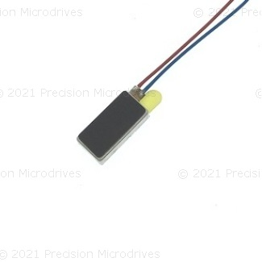
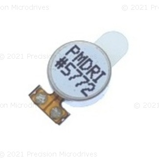
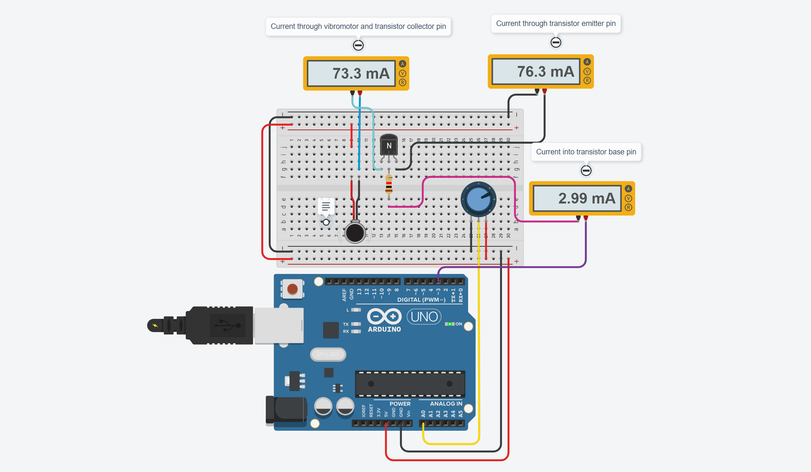

# {{ page.title }}
{: .no_toc }

## Table of Contents
{: .no_toc .text-delta }

1. TOC
{:toc}
---

## Transistors

The invention of the transistor in 1947 marked the beginning of the [computing revolution](https://en.wikipedia.org/wiki/History_of_computing_hardware_(1960s%E2%80%93present)#Third_generation), allowing electrical circuits to rapidly switch off (`0`) and on (`1`) to create [logic gates](https://en.wikipedia.org/wiki/Logic_gate), [accumulators](https://en.wikipedia.org/wiki/Accumulator_(computing)), and other computational building blocks. Before transistors, computers used [vacuum tubes](https://en.wikipedia.org/wiki/Vacuum_tube_computer), which were slower, less robust, much larger, and required significantly more power.

TODO: insert picture of variety of transistors

[Transistors](https://en.wikipedia.org/wiki/Transistor) are semiconductor devices used to **amplify** or **switch** electronic signals. They are used in almost every modern electronic device from smartphones to amplifiers in your headphones and come in a variety of shapes, sizes, and operating specifications. There are two common designs: **BJTs** (Bipolar Junction Transistors), which we'll use in this lesson and are applicable to small-current loads (< 1A), and **MOSFETS** (Metal-Oxide Semiconductor Field Effect Transistors), which are well-suited for higher-current loads (and often come with built-in heat sinks).

TODO: insert pictures of two transistors.

While transistors deserve a full lesson in their own right (indeed, multiple lessons), for our purposes here, two attributes are relevant:

- First, transistors can **amplify** electronic signals. You can control transistors with *small* amounts of current (to turn them on and off) but the signal they control can be much *larger*. On the Arduino, recall that our GPIO pins can only supply 40mA of continuous current (maximum!); however, [RGB LED strips](https://learn.adafruit.com/rgb-led-strips/usage) can easily require 1A or more and even small [DC hobby motors](https://www.adafruit.com/product/711) use between 70-250mA. The tiny pancake vibromotor used in this lesson has a rated current of 75mA and a startup current of up to ~120mA—both beyond the maximum safe current of our microcontroller GPIO pins.

- Second, because transistors can **rapidly switch on and off**, they can use pulse-width modulation. That is, your microcontroller can supply a PWM signal to the transistor's control input, which will modulate the same PWM signal, but amplified, on the transistor's output. Thus, we can use PWM via our transistor to control the vibration strength of our vibromotor.

### The BJT Transistor

Show 

## Vibromotors

There are two common types of vibration motors: **eccentric rotating mass (ERM)** motors that have a small unbalanced mass attached to the DC motor axle that creates a displacement force when rotating, which manifests as a vibration and **linear resonant actuators (LRA)** that contain a small internal mass attached to a spring, which XXX TODO.

<video autoplay loop muted playsinline style="margin:0px">
  <source src="assets/videos/PrecisionMicrodrives_ERMvsLRAMotors_Optimized.mp4" type="video/mp4" />
</video>
**Video.** A [video](https://vimeo.com/132533086) from Precision Microdrives showing the two most common types of vibration motors: **eccentric rotating mass (ERM)** motors and **linear resonant actuators (LRA)**.
{: .fs-1 }

If the vibromotor is fully enclosed in a shell, you cannot tell necessarily whether it is ERM or LRA even though the technologies are fundamentally different.

| Model | Body Diameter | Body Length | Eccentric Weight Radius | Eccentric Weight Length | Operating Voltage | Operating Current | Vibration Speed | Amplitude |
|---|---|---|---|---|---|---|---|---|
|  | 4.1mm | 6.8mm | 1.4mm | 3mm | 2.5V | 25mA | 11,000 rpm | 0.25G |
|  | 4.5mm | 11mm | 2mm | 3mm | 1.5V | 17mA | 9,100 rpm | 0.4G |
|  | 8mm | 3.4mm | -- | -- | 3V | 66mA | 12,500 rpm | 1.13G |
|  | 10mm | 2.1mm | -- | -- | 3V | 60mA | 14,000 rpm | 1.1G |
|  | 7mm | 24.5mm | -- | -- | 3V | 50mA | 13,800 rpm | 1.84G |
|  | 8.7mm | 25.1mm | -- | -- | 3V | 100mA | 13,800 rpm | 7G |
|  | 24.3mm | 12.5mm | 9mm | 4.8mm | 12V | 148mA | 5,500 rpm | 13G |
{: .vibro-table }

<!-- |  | 4.4mm | 6mm | 1.7mm | 2.8mm | 2.7V | 65mA | 13,500 rpm | 0.5G | -->
<!-- |  | 20.4mm | 25mm | 9mm | 5.9mm | 3V | 413mA | 6,100 rpm | 15.9G | -->

LRA Motors

| Model | Body Diameter | Body Length | Voltage (RMS) | Operating Current | Vibration Frequency | Amplitude |
|---|---|---|---|---|---|---|
|  | 8mm | 2.6mm | 1.2V | 28mA | 240Hz | 0.7G |
|  | 10mm | 3.7mm | 2V | 69mA | 175Hz | 1.5G |
|  | 6mm | 12mm | 2V | 111mA | 204Hz | 1.5G |
{: .vibro-table }

<!-- |  | 8mm | 2.6mm | 1.2V | 28mA | 240Hz | 0.7G | -->

### Eccentric Rotating Mass (ERM) Motors

Eccentric rotating mass (ERM) motors have an unbalanced mass attached to its axle. When the ERM motor spins, an unbalanced centripetal force is created, which causes displacement. When attached the ERM motor is physically attached an object—like a smartphone or game controller—this vibrational movement is transferred to the underlying object.

<video autoplay loop muted playsinline style="margin:0px">
  <source src="assets/videos/PrecisionMicrodrives_HowDoVibrationMotorsWork_ERM-OverviewOptimized.mp4" type="video/mp4" />
</video>
**Video.** A [video](https://vimeo.com/128603396) from [Precision Microdrives](https://www.precisionmicrodrives.com/vibration-motors/) demonstrating how eccentric rotating mass (ERM) motors work. The idea is quite simple: attach an asymmetric or unbalanced mass to the DC motor's axle. When it rotates, the weight shifts causing a vibration.
{: .fs-1 }

The amplitude of the vibration is affected by the mass of the attached object.

<video autoplay loop muted playsinline style="margin:0px">
  <source src="assets/videos/PrecisionMicrodrives_HowDoVibrationMotorsWork_ERM-VibrationAmplitudeOptimized.mp4" type="video/mp4" />
</video>
**Video.** TODO DESCRIPTION. Video from [Precision Microdrives](https://www.precisionmicrodrives.com/vibration-motors/).
{: .fs-1 }

- [Understanding ERM Vibration Motor Characteristics](https://www.precisionmicrodrives.com/content/ab-004-understanding-erm-vibration-motor-characteristics/) <-- very useful content on ERMs, etc.

- https://e2e.ti.com/blogs_/b/analogwire/posts/how-to-improve-the-startup-and-stop-behavior-of-erm-and-lra-actuators

- Zoomed in look at a coin vibromotor spinning: https://youtu.be/lp7bwXXsVl8?t=569
- https://www.vibrationmotors.com/vibration-motor-product-guide/coin-vibration-motor/
- https://www.precisionmicrodrives.com/vibration-motors/

### Coin vibration motors
- https://nfpmotor.com/products-coin-vibration-motors.html
- https://www.androidpolice.com/2020/10/20/a-lot-more-goes-into-good-smartphone-haptics-than-youd-think/

#### Coin-based ERMS

Popular in mobile phones.

<video autoplay loop muted playsinline style="margin:0px">
  <source src="assets/videos/CoinVibromotor_HowAMobilePhoneVibrationMotorLooksAndWorks_TrimmedOptimized.mp4" type="video/mp4" />
</video>
**Video.** TODO DESCRIPTION. Video from [Tech Vision](https://youtu.be/iwEGqBpYaqc). There is another [great video](https://youtu.be/lp7bwXXsVl8?t=537) looking at a coin ERM with a microscope by Marty Jopson.
{: .fs-1 }

https://www.precisionmicrodrives.com/vibration-motors/coin-vibration-motors/

<!-- LRAs are in iPhones since iPhone7: https://www.boreas.ca/blogs/piezo-haptics/last-decade-haptics-in-mobile-erm-to-lra-and-the-taptic-engine -->

### LRAs

- https://www.vibrationmotors.com/vibration-motor-product-guide/linear-resonant-actuator/
- https://www.precisionmicrodrives.com/vibration-motors/linear-resonant-actuators-lras/
- https://www.nfpmotor.com/products-linear-resonant-actuators-lras.html

### Operating specifications

The [datasheet](https://cdn-shop.adafruit.com/product-files/1201/P1012_datasheet.pdf) for the [Adafruit vibrating mini-motor disc](https://www.adafruit.com/product/1201) states the following operating specifications.

| Attribute | Rating |
|-----------|--------|
| Rated voltage | 3.0V |
| Voltage range | ~2.5-3.8V |
| Rated current | 75mA |
| Rated speed | 11,000 ± 3,000rpm |
| Starting voltage | 2.3V |
| Starting current | Up to ~120mA |

The ERM vibromotor is a type of DC motor—though a very tiny one. STARTUP VOLTAGE to overcome inertia.

<!-- How to improve start time and stop behavior of ERM and LRA actuators: https://e2e.ti.com/blogs_/b/analogwire/posts/how-to-improve-the-startup-and-stop-behavior-of-erm-and-lra-actuators -->

### Wiring up the vibro-motor

- Many examples online are wrong and directly hook up the vibromotor to a microcontroller's GPIO pins
- Be careful with the small wires. This is one of the most fragile components we've worked with: the tiny stranded wires soldered to the motor are prone to snap off.
- The vibromotor in our kits is this one supplied by [Adafruit](https://www.adafruit.com/product/1201), which has a rated voltage of 2.5-3.8V; however, the Adafruit docs suggest that 2-5V work. We have also found this to be the case; however, to be safe, you could use the 3.3V supply rather than the 5V on your board. 

Specifically, the NPN bipolar transistors we use in our courses are the [PN2222A](https://www.adafruit.com/product/756) transistors (and variants such as the [2N2222A](https://components101.com/transistors/2n2222a-pinout-equivalent-datasheet)).

You need a resistor in series with the control input pin (base pin) on the transistor. In this case, a 1kΩ resistor works well.

<!-- 1023 | 255 | 0.012 A | 75.55
900 | ~225 | 0.011 A | 65 mA
800 | 199 | 0.009A | 58 mA
700 | 174 | 0.008A | 52 mA
600 | 149 | 0.007A | 45 mA
400 | 99 | 0.005A | 32 mA
300 | 75 | 0.004A | 25 mA
200 | 50 | 0.002A | 15 mA
160 | 40 | 0.002A | 12 mA (turned off)
100 | 25 | 0.001A | 6.1 mA -->

TODO: Take video of experimental  setup.

- http://www.learningaboutelectronics.com/Articles/Vibration-motor-circuit.php
- https://www.precisionmicrodrives.com/content/how-to-drive-a-vibration-motor-with-arduino-and-genuino/ 
- http://www.ermicro.com/blog/?p=423
- Transistor gain: https://www.electronics-notes.com/articles/electronic_components/transistor/current-gain-hfe-beta.php
- [Discrete Driver Circuits for Vibration Motors](https://www.precisionmicrodrives.com/content/ab-001-discrete-driver-circuits-for-vibration-motors/), Precision Microdrives
- [Electrical Techniques for Driving Vibration Motors](https://www.precisionmicrodrives.com/content/ab-011-electrical-techniques-for-using-different-power-sources/), Precision Microdrives

<!-- Talk about using diodes and capacitor:
https://www.reddit.com/r/arduino/comments/a06hxr/why_do_motors_need_transistors_and_diodes/ -->

### Tinkercad version

You 

<iframe width="725" height="453" src="https://www.tinkercad.com/embed/dlqdbv0SFV4?editbtn=1" frameborder="0" marginwidth="0" marginheight="0" scrolling="no"></iframe>

Though messier, we also [made a version](https://www.tinkercad.com/things/jGRVrL9C8Jv) with ammeters to track (1) the current through the vibromotor and into the transistor emitter, (2) the current into the transistor's base pin (the control pin), and (3) current out of the emitter.

**Figure.** We remixed the original vibromotor Tinkercad circuit to include ammeters ([link](https://www.tinkercad.com/things/jGRVrL9C8Jv)).
{: .fs-1 }

## Generating haptic patterns

TODO: have students make a haptic pattern or two. Maybe schedule a timer interrupt to do this?

Are there Arduino libraries for this?

### Haptic motor drivers

When haptics play a key role in a project, consider using a [haptic motor driver](https://learn.sparkfun.com/tutorials/haptic-motor-driver-hook-up-guide?_ga=2.87552344.1190007566.1620233503-935977820.1612992862), which makes it easier to interface and work with vibration motors and drive complex haptic patterns.

For example, Texas Instruments (TI) sells a variety of [haptic motor drivers](https://www.ti.com/motor-drivers/actuator-drivers/overview.html). The popular [TI DRV2605](https://www.ti.com/lit/ds/symlink/drv2605.pdf) provides a [I2C](https://en.wikipedia.org/wiki/I%C2%B2C)-based interface to control both ERM and LRA motors, generates its own the pulse-width modulated (PWM) waveforms, which relieves the host microcontroller of this responsibility saving hardware pins and reducing code complexity (*e.g.,* setting precise timer interrupts for waveform generation), and includes an integrated library of 123 licensed haptic patterns, reducing the need to design and implement software to create custom haptic effects.

**Figure.** The [TI DRV2605L](https://www.ti.com/lit/ds/symlink/drv2605l.pdf) includes a preprogrammed library of over 100 haptic waveform effects, including single, double, and triple clicks, alerts, and transitions. These haptic patterns are licensed from Immersion Corporation. See page 63 of the [TI DRV2605L](https://www.ti.com/lit/ds/symlink/drv2605l.pdf) datasheet. Right-click on the image and select "Open image in new tab" to zoom in.   

Both [Adafruit](https://www.adafruit.com/product/2305) and [SparkFun](https://www.sparkfun.com/products/14538) provide custom breakout boards to interface with the [TI DRV2605](https://www.ti.com/lit/ds/symlink/drv2605.pdf) IC.

| SparkFun Haptic Breakout Board for TI DRV2605L | Adafruit Haptic Breakout Board for TI DRV2605L |
|  |  |
| $8.50 from [SparkFun](https://www.sparkfun.com/products/14538) | $7.95 from [Adafruit](https://www.adafruit.com/product/2305) |

You can also purchase breakout boards with the vibration motor and haptic driver integrated together like this [SparkFun DA7280 Haptic Driver](https://www.sparkfun.com/products/17590) with Qwiic [I2C](https://en.wikipedia.org/wiki/I%C2%B2C) connectors.

For more information on using haptic motor drivers with Arduino, see [SparkFun's Haptic Motor Driver Hook-up Guide](https://learn.sparkfun.com/tutorials/haptic-motor-driver-hook-up-guide).

## Resources

- [How to Drive a Vibration Motor with Arduino](https://www.precisionmicrodrives.com/content/how-to-drive-a-vibration-motor-with-arduino-and-genuino/), Precision Microdrives

- [Controlling RGB LED Strips with Transistors](https://learn.adafruit.com/rgb-led-strips/usage), Adafruit

- [Transistors 101](https://learn.adafruit.com/transistors-101/overview), Adafruit
  
- [Using a Transistor to Control High Current Loads with an Arduino](https://itp.nyu.edu/physcomp/labs/motors-and-transistors/using-a-transistor-to-control-high-current-loads-with-an-arduino/), NYU ITP Physical Computing Course

- [Motors and Transistors](https://itp.nyu.edu/physcomp/labs/motors-and-transistors/), NYU ITP Physical Computing Course

- [Vibration Motor Best Practices from Mobile Phones](https://www.precisionmicrodrives.com/content/ab-008-vibration-motor-best-practices-from-mobile-cell-phones/), Precision Microdrives

### Videos

- [BJTs as Transistor Switches](https://youtu.be/sRVvUkK0U80), AddOhms on YouTube

- [Transistor (BJT) as a Switch](https://youtu.be/WRm2oUw4owE), GreatScott! on YouTube

- [MOSFETS and Tranistors with Arduino](https://youtu.be/IG5vw6P9iY4), DroneBot Workshop on YouTube
