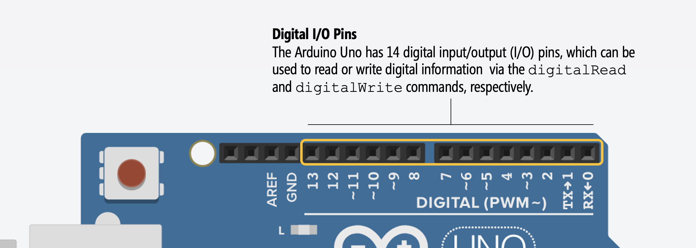

# {{ page.title | replace_first:'L','Lesson '}}
{: .no_toc }

## Table of Contents
{: .no_toc .text-delta }

1. TOC
{:toc}
---

This is the first lesson in the [**Intro to Arduino Input**](intro-input.md) lesson series. This series builds on knowledge gained in the [**Intro to Arduino Output**](intro-output.md) lesson series, so please complete that first!

In this lesson, we'll finally get to build something interactive: we are going to turn on an LED with a button. This lesson will cover buttons (aka momentary switches), how to use digital input with the [`digitalRead`](https://www.arduino.cc/reference/en/language/functions/digital-io/digitalread/) function, and pull-up and pull-down resistors.

TODO: show animation from Tinkercad-based circuit working and current flow

## Tinkercad circuits
- https://www.tinkercad.com/things/9skzhTypQRh-button-with-breadboard/
- https://www.tinkercad.com/things/hlkxqsvSz2E-button-no-breadboard

## Digital I/O refresher

Recall that the Arduino Uno and Leonardo have 14 digital pins that can be used for input using [`digitalRead()`](https://www.arduino.cc/reference/en/language/functions/digital-io/digitalread/) or output using [`digitalWrite()`](https://www.arduino.cc/reference/en/language/functions/digital-io/digitalwrite/), respectively. In our [**Intro to Arduino Output**](intro-output.md) lesson series, we covered output. Here, we'll cover input but the same 14 digital I/O pins apply:

As previously noted, you can control any of these 14 digital I/O pins with three functions:

1. [`pinMode(int pin, int mode)`](https://www.arduino.cc/reference/en/language/functions/digital-io/pinmode/) configures a specified pin as either an `INPUT` or `OUTPUT`
2. [`digitalRead(int pin)`](https://www.arduino.cc/reference/en/language/functions/digital-io/digitalread/) reads digital input from the specified pin, either `HIGH` or `LOW`.
3. [`digitalWrite(int pin, int value)`](https://www.arduino.cc/reference/en/language/functions/digital-io/digitalwrite/) writes digital output to the specified pin, either `HIGH` or `LOW`.

## Outline
- The button is funky: why four legs? what's connected. Maybe show multimeter?
- We are going to cover three separate circuit designs: pull-down resistor, pull-up resistor, internal pull-up resistor
- Why do we need these resistors. Explain.
- Make pull-down circuit + code
- Make pull-up circuit + code
- Show using internal pull-up + code

## Notes:
Things to remember:
- include Jeff Feddersen video of pull-up and pull-down
- ITP has some good content on switches that we should link to
- show calculation about pull-down and pull-up resistors (and the fact that they should be high to not waste current)

