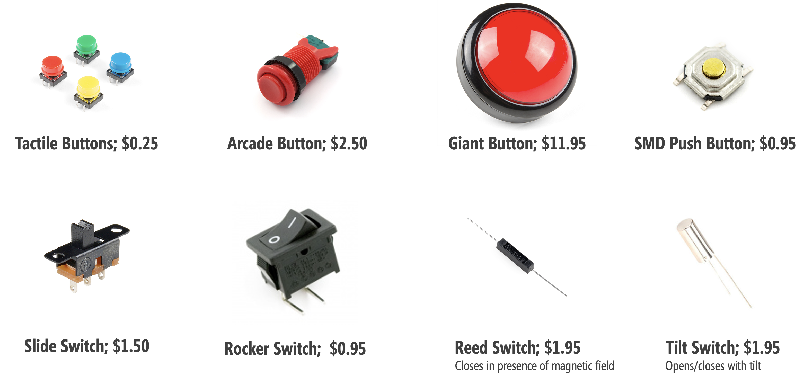

# {{ page.title | replace_first:'L','Lesson '}}
{: .no_toc }

## Table of Contents
{: .no_toc .text-delta }

1. TOC
{:toc}
---

This is the first lesson in the [**Intro to Arduino Input**](intro-input.md) lesson series, which builds on knowledge gained in the [**Intro to Arduino Output**](intro-output.md) series, so please complete that first!

In this lesson, we'll finally get to build something interactive: turning on an LED with a button. We'll cover buttons (aka momentary switches), how to use digital input with the [`digitalRead`](https://www.arduino.cc/reference/en/language/functions/digital-io/digitalread/) function, and pull-up and pull-down resistors.

TODO: show animation from Tinkercad-based circuit working and current flow

## Tinkercad circuits
- https://www.tinkercad.com/things/9skzhTypQRh-button-with-breadboard/
- https://www.tinkercad.com/things/hlkxqsvSz2E-button-no-breadboard

## Materials

For this lesson, we're going to use the Arduino's built in LED (`LED_BUILTIN`) so we only need the following:

| Arduino | Button | Resistor |
|:-----:|:-----:|:-----:|
|     |  |  |
| Arduino Uno, Leonardo, or similar  | Button (aka momentary switch) | 10KΩ Resistor |

## Digital I/O refresher

Recall that the Arduino Uno and Leonardo have 14 digital I/O pins that can be used either for input with [`digitalRead()`](https://www.arduino.cc/reference/en/language/functions/digital-io/digitalread/) or output with [`digitalWrite()`](https://www.arduino.cc/reference/en/language/functions/digital-io/digitalwrite/), respectively. In our [**Intro to Arduino Output**](intro-output.md) lesson series, we covered output. Here, we'll cover input but the same 14 digital I/O pins apply:

As previously noted, you can control any of these 14 digital I/O pins with three functions:

1. [`pinMode(int pin, int mode)`](https://www.arduino.cc/reference/en/language/functions/digital-io/pinmode/) configures a specified pin as either an `INPUT` or `OUTPUT`
2. [`digitalRead(int pin)`](https://www.arduino.cc/reference/en/language/functions/digital-io/digitalread/) reads digital input from the specified pin, either `HIGH` or `LOW`.
3. [`digitalWrite(int pin, int value)`](https://www.arduino.cc/reference/en/language/functions/digital-io/digitalwrite/) writes digital output to the specified pin, either `HIGH` or `LOW`.

### Digital input

Digital input is any input that can be either **on** (`HIGH` or 5V) or **off** (`LOW` or 0V). For example, a push button, a reed switch, or a binary tilt sensor.

Prices are from Sparkfun.com, Jan 2020; parts can be cheaper in bulk from suppliers like [Digi-Key](https://www.digikey.com/) or [Mouser Electronics](https://www.mouser.com/).
{: .fs-1 }

## Outline
- The button is funky: why four legs? what's connected. Maybe show multimeter?
- We are going to cover three separate circuit designs: pull-down resistor, pull-up resistor, internal pull-up resistor
- Why do we need these resistors. Explain.
- Make pull-down circuit + code
- Make pull-up circuit + code
- Show using internal pull-up + code

## Pull-down and pull-up resistors

To use a digital input—say, a push button, a slider switch, a tilt switch, *etc.*—you need either a pull-down or pull-up resistor. Why? See below (right-click on the image and select 'Open Image in New Tab' for a enlarged version).

In this example, the button is hooked up to digital I/O pin 12 but any I/O pin will work.
{: .fs-1 }

While a **pull-down resistor** configuration biases the input pin to GND when a switch or button is in the open state, a **pull-up resistor** configuration does the opposite: in an open state, the microcontroller input pin reads `HIGH` (5V). When the switch is closed, the microcontroller reads `LOW` (0V).

Finally, many microcontrollers include an internal pull-up resistor that can be activated with software. On the Arduino, we can configure an input pin with an internal pull-up resistor with: `pinMode(<pin>, INPUT_PULLIP);`. This eliminates the need for any external resistors (thus simplifying your circuit).

We'll go through each of these circuit configurations below.

### What value should I use for my pull-down or pull-up resistors?

The official [Arduino docs](https://www.arduino.cc/en/Tutorial/DigitalPins) recommend a 10kΩ pull-down or pull-up resistor for digital input pins. On the ATmega microcontrollers (those on the Arduino Uno and Leonardo), the internal pull-up resistor is 20kΩ. On the Arduino Due, the internal pull-up is between  50kΩ and 150kΩ.

TODO: talk about tradeoffs in setting pull-up and pull-down resistor values

### Want to dive deeper?

To learn more about pull-up and pull-down resistors, watch this fantastic video by NYU ITP's Jeff Feddersen:

<iframe src="https://player.vimeo.com/video/241209240?title=0&byline=0&portrait=0" style="position:absolute;top:0;left:0;width:100%;height:100%;" frameborder="0" allow="autoplay; fullscreen" allowfullscreen></iframe>

## Tactile button (momentary switch)

## Pull-down resistor configuration

## Notes:
Things to remember:
- [done] include Jeff Feddersen video of pull-up and pull-down
- ITP has some good content on switches that we should link to
- show calculation about pull-down and pull-up resistors (and the fact that they should be high to not waste current)

