# {{ page.title | replace_first:'L','Lesson '}}
{: .no_toc }

## Table of Contents
{: .no_toc .text-delta }

1. TOC
{:toc}
---

This is the first lesson in the [**Intro to Arduino Input**](intro-input.md) lesson series. We assume you've already completed the [**Intro to Arduino Output**](intro-output.md) series. If not, please complete that that first!

In this lesson, we'll finally get to build something interactive: turning on an LED with a push button. We'll cover buttons (aka momentary switches), how to use digital input with the [`digitalRead`](https://www.arduino.cc/reference/en/language/functions/digital-io/digitalread/) function, and pull-up and pull-down resistors.

Switches themselves are conceptually easy to understand—they are either "closed" or "open". We use switches everyday when we turn on and off our light circuits in our home. However, when using switches with microcontrollers, we've found that students often struggle to understand why pull-up or pull-down resistors are necessary. So, take your time with this lesson. Try to understand the **why**  and **how** of these resistors in your circuits.

For example, in the animation below, we show a button circuit with a pull-down resistor hooked up to Pin 2. Importantly, notice **where** the current flows when the button is pressed—perhaps surprisingly, it does **not** flow into Pin 2. In fact, (virtually) no current flows into Pin 2! Why not? We'll talk about this and more in this lesson!

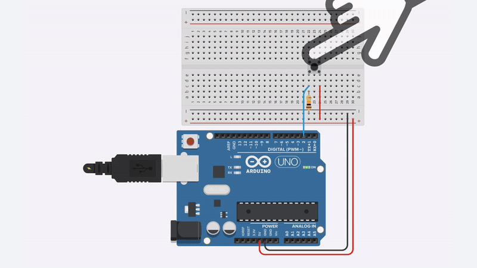
Animation shows the Arduino's built-in LED illuminating when the button on Pin 2 is pressed. When the button is pressed, current flows from $$V_{CC}$$ through the pull-down resistor to GND. We'll learn more about this circuit in this lesson.
{: .fs-1 }

## Switches

As noted above, switches are simple components: they're typically either "open" (disconnected) or "closed" (connected). There are lots of different types of switches from **momentary switches** (aka buttons) to **toggle** or **slide** switches (which maintain their state) to switches that activate based on environmental conditions like a **tilt switch** or a **reed switch**.

Prices and pictures are from Sparkfun.com, Jan 2020; parts can be cheaper in bulk from suppliers like [Digi-Key](https://www.digikey.com/) or [Mouser Electronics](https://www.mouser.com/).
{: .fs-1 }

In this lesson, we are going to use a **four-legged push button** (momentary switch), which look like:

<!-- TODO: in future, make this into a table with links for improved accessibility -->

If you want to learn more about switches in general, see these articles by [Sparkfun](https://learn.sparkfun.com/tutorials/switch-basics/all) and [ITP NYU](https://itp.nyu.edu/physcomp/labs/labs-electronics/switches/).

<!-- TODO: show animation of a switch -->

<!-- TODO: add in schematic icons? Also, different types like SPST, DPST? -->

## Making an initial button circuit

We'll first learn how to use a button **without** a microcontroller. This will strengthen our understanding of buttons, in general, before switching over to digital input.

### Materials

We'll need the following materials:

| Breadboard | Arduino | LED | Resistor | Button |
|:-----:|:-----:|:-----:|:-----:|:-----:|
|  |  |  |  |  |
| Breadboard | Arduino Uno, Leonardo, or similar  | Red LED | 220Ω Resistor | [12x12mm "Tactile Switch Buttons"](https://www.adafruit.com/product/1119) |

### Four-legged tactile buttons

The four-leg push button is one of the most common button types for breadboarding circuits; however, it's also a bit funky and non-intuitive at first. You might be wondering: why **four legs** instead of two? How does this button work?

We created the following animation to help explain. And, of course, the best way to learn it is to try it yourself (and hopefully the animation will help).

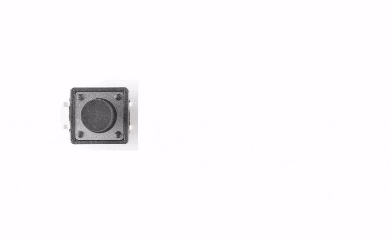

<!-- TODO: I like this simple picture by LadyAda, consider adding it? https://www.ladyada.net/images/arduino/pushbuttons.gif -->

In general, if you're confused about how to use a component, it's a good idea to consult the [datasheet](https://cdn-shop.adafruit.com/datasheets/B3F-1000-Omron.pdf). You can also use a multimeter to check for continuity between the four legs.

<!-- TODO video of using a multimeter to figure out how the four legs are hooked up -->

### Using buttons without a microcontroller

We'll make a simple button-based circuit that turns on an LED when the button is pressed. 

Below, we've included two wiring diagrams: one using an external power source like a 9V battery with a snap connector and the other using Arduino's 5V pin for power, just like we did in the [LED on](led-on.md) lesson. We suggest the 9V battery approach just to avoid confusion—this circuit is completely independent of Arduino!

| With 9V Battery | With Arduino 5V Pin |
|:-------------:|:-----------:|
| 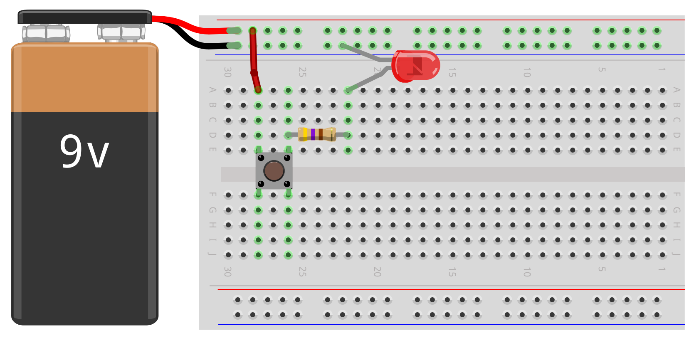 | 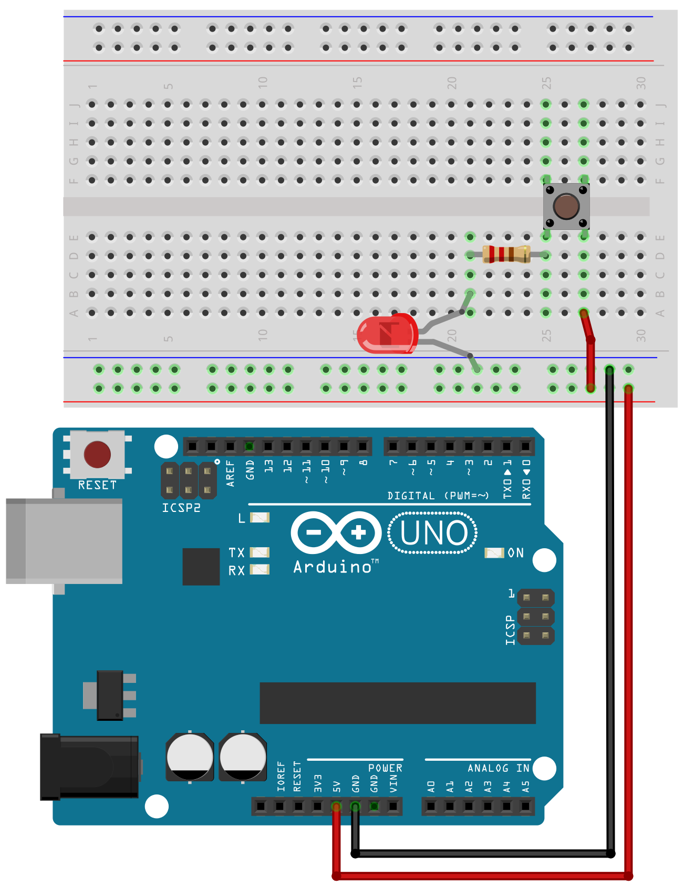 |
| Circuit powered by 9V battery | Circuit powered by 5V Arduino pin | 

If you build the 9V battery circuit, then we suggest a 680Ω or 1kΩ resistor rather than a 220Ω resistor.
{: .fs-1 }

That's it! Once you've created the circuit, give it a try by pushing the button and the LED should turn on. See the animation below.

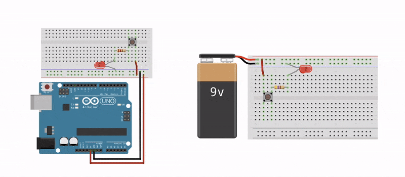

<!-- TODO: Consider a circuit simulation of how this is working here? -->

Now that we understand how this button works, let's move on to using switches/buttons with a microcontroller.

## Intro to digital input

In our [Blink](led-blink.md) lesson, we introduced [digital I/O](led-blink.md#introducing-digital-output) with a specific focus on **digital output**. Here, we are going to talk about **digital input**, which is a bit more complicated.

### Digital I/O refresher

Recall that the Arduino Uno and Leonardo have 14 digital I/O pins that can be used either for input with [`digitalRead()`](https://www.arduino.cc/reference/en/language/functions/digital-io/digitalread/) or output with [`digitalWrite()`](https://www.arduino.cc/reference/en/language/functions/digital-io/digitalwrite/), respectively.

As noted in our [Blink](led-blink.md) lesson, you can control any of these 14 digital I/O pins with three functions:

1. [`pinMode(int pin, int mode)`](https://www.arduino.cc/reference/en/language/functions/digital-io/pinmode/) configures a specified pin as either an `INPUT` or `OUTPUT`. For our buttons, we'll be using `INPUT` and a variant called `INPUT_PULLUP`.
2. [`digitalRead(int pin)`](https://www.arduino.cc/reference/en/language/functions/digital-io/digitalread/) reads digital input from the specified pin, either `HIGH` or `LOW`.
3. [`digitalWrite(int pin, int value)`](https://www.arduino.cc/reference/en/language/functions/digital-io/digitalwrite/) writes digital output to the specified pin, either `HIGH` or `LOW`.

### What is digital input?

Digital input is any input that can be considered either **on** (typically, `HIGH` or 5V) or **off** (typically, `LOW` or 0V). Simple, right? However, using digital input with microcontrollers can be confusing, at first.

The **most critical** concept to understand is that microcontrollers read voltage, not current. This directly (and dramatically) affects how we setup our input circuits.

Indeed, the [Arduino documentation ](https://www.arduino.cc/en/Tutorial/DigitalPins) states that pins configured as digital input "are in a high-impedance state" equivalent to a 100,000,000Ω (100MΩ) resistor added to the front of the input pin. This means that once you configure a microcontroller pin as input, very little current will "seep" into the pin (on the orders of picoamps).

<!-- TODO: add illustrative figure here. -->

### Is it LOW or is it HIGH?

You might be wondering: what's the precise voltage-related definition of `HIGH` and `LOW` from the microcontroller's perspective? And what happens if our voltage signal is not 0V and not 5V? Great questions!

As Lee describes in [his Arduino lecture notes](https://web.stanford.edu/class/archive/engr/engr40m.1178/slides_sp17/arduino-io.pdf), "the value returned from `digitalRead()` is only well-defined when the input pin voltage is *close* to $$V_{CC}$$ or $$0V$$. The precise meaning of "close" varies between microcontrollers"

For the ATmega328, the input voltage needs to be at least $$0.6\cdot V_{CC}\to 0.6\cdot5 V=3$$ to qualify as `HIGH` and between $$0$$ and $$0.3\cdot V_{CC}\to 0.3\cdot 5V=1.5$$ to qualify as `LOW`. For the middle range $$0.3\cdot V_{CC}$$ to $$0.6\cdot V_{CC}$$, the behavior of the pin is undefined.

In general, this is unlikely to affect how you wire your digital input circuits with switches, buttons, or binary sensors (like reed switches)—because your two states will be 5V and 0V—but it may affect whether and how you hook up other sensors to a microcontroller, if you want to interpret them as digital input.

## Hooking up digital input with microcontrollers

Let's walk through how one might try to hook up a button to a microcontroller. In doing so, we'll learn about what **not** to do and **why** as well as **what to do** and the role of **pull-down resistors**.

You might initially think to hook up your button like the following:

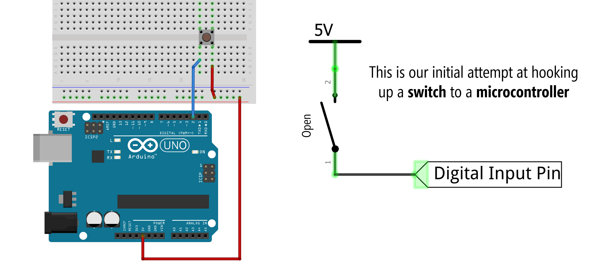
This circuit will "sort of" work but has a problem related to a "floating pin" when the switch is open.
{: .fs-1 }

However, if you do this, what will the digital input pin read when the switch is **open** (that is, when the button is **not** pressed). Well, this is called a "floating pin" and it's not good. A floating pin is susceptible to randomly oscillating between `HIGH` and `LOW`. See the animation below. <!-- TODO: add in reasons why pin could oscillate -->

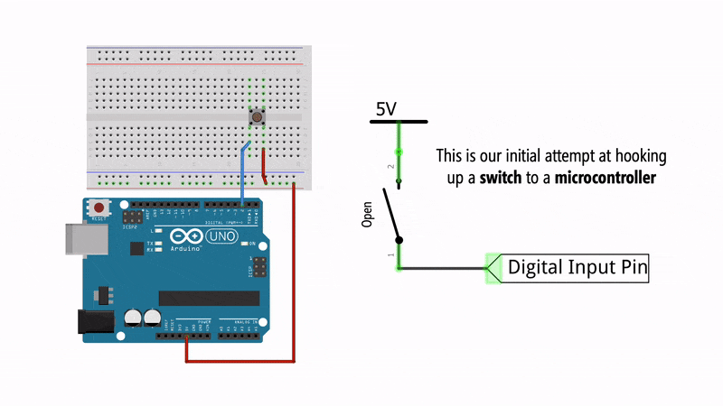

<!-- TODO: consider adding in video of floating pin and effect. Use external resistor + LED. Have current video so reshooting could be low priority -->

To solve this, we need to bias the digital input pin to a known voltage state when the circuit is open (the button is not pressed). 

You might try to do this by adding `GND` to the other leg of the button like this: 

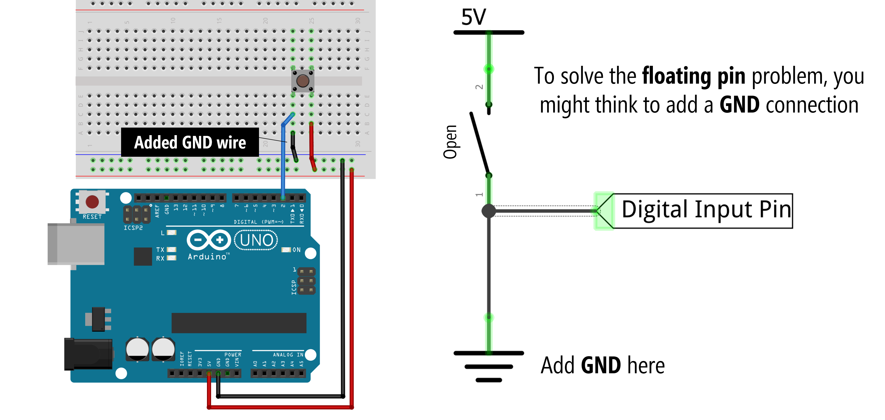
Warning: Do **not** do this. When the switch closes, a short circuit occurs, which could damage your microcontroller or Arduino.
{: .fs-1 }

And you're on the right track. Now, when the switch is open, the digital input pin is in a known voltage state—it reads 0V. But what happens when we actually press the button? Oh no, a short circuit occurs! This could damage your microcontroller and/or Arduino! <!-- TODO: expand on why short circuits are bad? -->

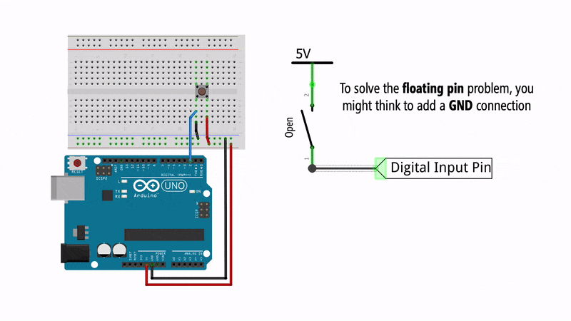
Animation showing the effect of adding `GND` without a resistor. A short circuit!
{: .fs-1 }

So, what to do? **Pull-down resistors** to the rescue!

### Pull-down resistors

To solve this problem, we can add in what's called a **pull-down resistor** before the GND connection, which prevents short circuits when the switch is closed while still biasing the pin to 0V when the switch is open. Typically, this pull-down resistor value is 10kΩ, which is also what the official [Arduino documentation recommends](https://www.arduino.cc/en/Tutorial/DigitalPins).

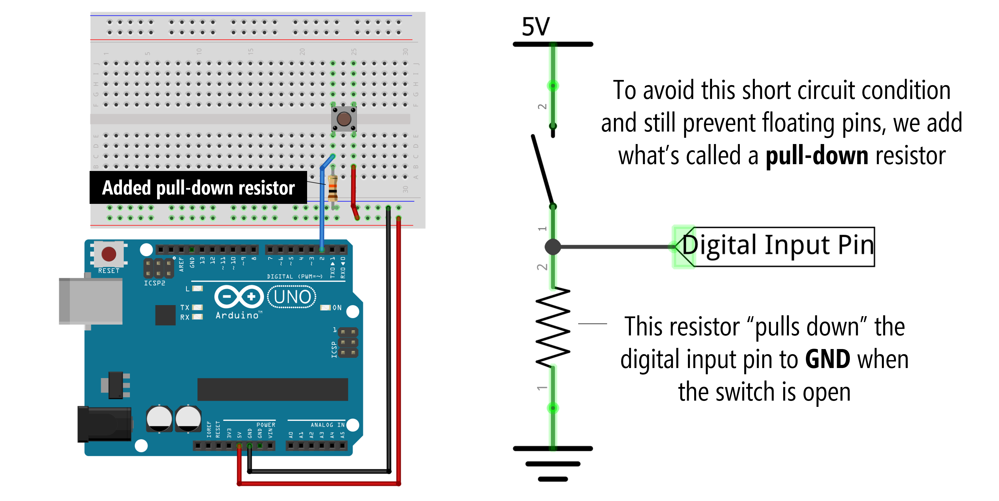
The pull-down resistor is quite large: 10,000Ω (10kΩ)
{: .fs-1 }

Here's an animation showing how a pull-down resistor configuration works:

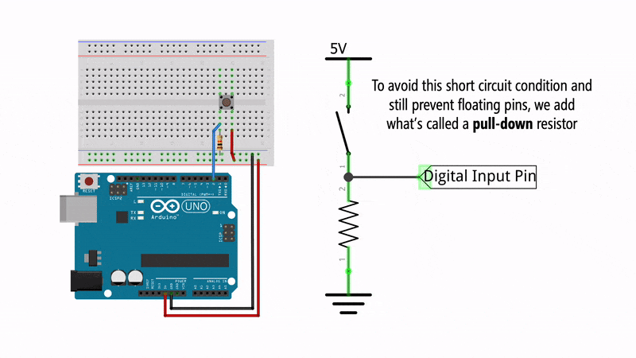

### Pull-up resistors

So, what's a **pull-up resistor** then? With a **pull-down resistor** configuration, the input pin is biased to GND when the circuit is in an open state. With a **pull-up resistor** configuration, the resistor moves from the GND side of the circuit to the 5V side and logic is flipped: the input pin is "pulled up" to $$V_{CC}$$ when the switch is open and goes to GND when the switch is closed.

<!-- TODO: insert pull-up resistor animation -->

Pull-up resistor configurations can be confusing because the `HIGH` and `LOW` values are flipped. Now, when the switch is open, the digital input pin is `HIGH`. When the switch closes, the input pin goes `LOW`.

| Switch State | Input pin with pull-down | Input pin with pull-up |
| ------------ | ------------------------ | ---------------------- |
| Open         | `LOW`                    | `HIGH`                 |
| Closed       | `HIGH`                   | `LOW`                  |

For convenience, here are side-by-side diagrams of a pull-down *vs.* pull-up resistor configuration:

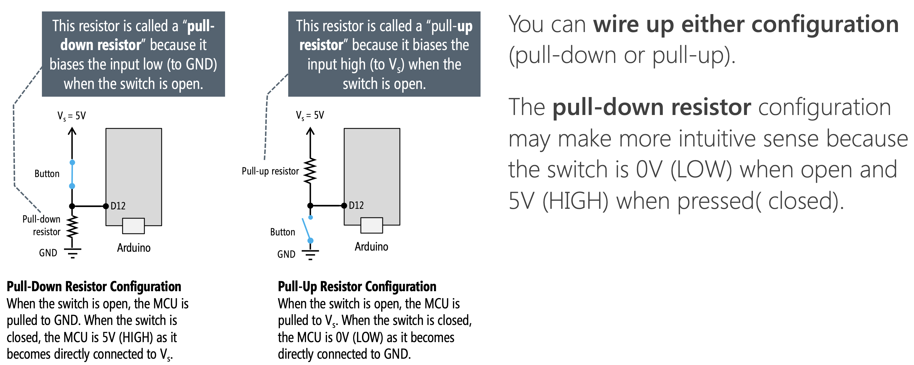 

### Internal pull-up resistors

Finally, many microcontrollers include an internal pull-up resistor that can be activated with software. On the Arduino, we can configure an input pin to use its internal pull-up resistor with: `pinMode(<pin>, INPUT_PULLUP);`. This eliminates the need for any external resistors (thus simplifying your circuit).

Some microcontrollers have both internal pull-up *and* pull-down resistors. The popular ESP32 chip, for example, used in the [Adafruit Huzzah32](https://learn.adafruit.com/adafruit-huzzah32-esp32-feather/overview) has built-in pull-up and pull-down resistors on all GPIO pins except for GPIO34-GPIO39 (see [link](https://github.com/espressif/arduino-esp32/issues/316)). These can be enabled with either `pinMode(<pin>, INPUT_PULLUP);` or `pinMode(<pin>, INPUT_PULLDOWN);`

<!-- TODO: fix syntax mistake in figure; have its instead of it's in the diagram above -->
<!-- TODO: maybe also add a switch after the internal pull-up to show that it's a software controlled switch like this: https://electronics.stackexchange.com/q/185953-->

### What value should I use for my pull-down or pull-up resistors?

As mentioned above, the official [Arduino docs](https://www.arduino.cc/en/Tutorial/DigitalPins) recommend a 10kΩ pull-down or pull-up resistor for digital input pins. On the ATmega microcontrollers (those on the Arduino Uno and Leonardo), the internal pull-up resistor is 20kΩ. On the Arduino Due, the internal pull-up is between 50kΩ and 150kΩ.

<!-- TODO: talk about tradeoffs in setting pull-up and pull-down resistor values -->

### Want to dive deeper?

Still feeling confused or want to learn more about pull-up and pull-down resistors? Try watching this [video](https://youtu.be/wxjerCHCEMg) by AddOhms: 

<iframe width="736" height="414" src="https://www.youtube.com/embed/wxjerCHCEMg" frameborder="0" allow="accelerometer; autoplay; encrypted-media; gyroscope; picture-in-picture" allowfullscreen></iframe>
[Video](https://youtu.be/wxjerCHCEMg) by AddOhms demonstrating floating pins and why pull-up resistors are necessary for digital input with microcontrollers.
{: .fs-1 }

Or this video by NYU ITP's Jeff Feddersen:

<iframe src="https://player.vimeo.com/video/241209240?title=0&byline=0&portrait=0" style="position:absolute;top:0;left:0;width:100%;height:100%;" frameborder="0" allow="autoplay; fullscreen" allowfullscreen></iframe>

See also:
- [Sparkfun's tutorial on Pull-up Resistors](https://learn.sparkfun.com/tutorials/pull-up-resistors/all)
- [Arduino's official `INPUT_PULLUP` tutorial](https://www.arduino.cc/en/Tutorial/InputPullupSerial)
- [Electronics Tutorials' Pull-up Resistors](https://www.electronics-tutorials.ws/logic/pull-up-resistor.html)

## Let's make stuff!

Whew, OK. We've now explained how to use four-legged tactile buttons, how to use pull-down, pull-up, and internal pull-up resistors and their purpose, and provided a general overview of digital input.

It's time to make stuff. We're going to start with a button in a pull-down configuration before making circuits (and programs) for pull-up and internal pull-up configurations. Then, in the [next lesson](piano.md), we'll make a simple "piano" synthesizer that puts our skills to the test!

## Pull-down resistor configuration

Let's begin with a pull-down resistor configuration.

### Pull-down resistor wiring diagram

As with any circuit, there are many ways to wire up a button with a pull-down resistor configuration. Here are some examples—all are functionally equivalent. I tend to use the wiring shown on the far left, which is the same one shown above.

### Code to turn on LED with button press


const int INPUT_BUTTON_PIN = 2;
const int OUTPUT_LED_PIN = LED_BUILTIN;

void setup()
{
  pinMode(INPUT_BUTTON_PIN, INPUT);
  pinMode(OUTPUT_LED_PIN, OUTPUT);
}

void loop()
{
  // read the state of the pushbutton value
  int buttonState = digitalRead(INPUT_BUTTON_PIN);
  digitalWrite(OUTPUT_LED_PIN, buttonState);
  delay(30);
}


## Pull-up resistor configuration

Here's the wiring for a pull-up resistor configuration. Modify the code above to turn on the LED when the button is pressed.

## Internal pull-up resistor configuration

Now try it with the internal pull-up resistor.

The schematic is for illustrative purposes. The internal software controlled switch is a transistor so the actual circuit looks something like [this](assets/images/Arduino_InputPinWithPullUpResistor_Schematic.png) (from [Lee, Input/output pins on Arduino, Stanford ENGR40M](https://web.stanford.edu/class/archive/engr/engr40m.1178/slides_sp17/arduino-io.pdf))
{: .fs-1 }

## Putting it all together

Make a circuit that has three buttons wired to digital input and three corresponding (external) LEDs wired to digital output. Use a different pull-down or pull-up configuration for each button. Then write code to respond accordingly.

## Next Lesson

In the [next lesson](piano.md), we'll get to apply our newfound digital input skills to build a simple interactive piano with tactile buttons and a piezo buzzer.

[Next: Make a simple piano](piano.md){: .btn .btn-outline }

<!-- ## TODO/Outline
- The button is funky: why four legs? what's connected. Maybe show multimeter?
- We are going to cover three separate circuit designs: pull-down resistor, pull-up resistor, internal pull-up resistor
- Why do we need these resistors. Explain.
- Make pull-down circuit + code
- Make pull-up circuit + code
- Show using internal pull-up + code

## Notes:
Things to remember:
- [done] include Jeff Feddersen video of pull-up and pull-down
- [done] ITP has some good content on switches that we should link to
- show calculation about pull-down and pull-up resistors (and the fact that they should be high to not waste current)
- Talk about super high impedance on input pin?

## References
- [Arduino Internal Pull-up Resistor Tutorial](https://www.baldengineer.com/arduino-internal-pull-up-resistor-tutorial.html), James Lewis

## Tinkercad circuits
- https://www.tinkercad.com/things/9skzhTypQRh-button-with-breadboard/
- https://www.tinkercad.com/things/hlkxqsvSz2E-button-no-breadboard -->