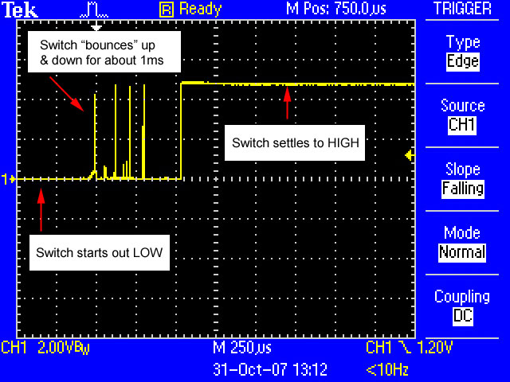

# {{ page.title | replace_first:'L','Lesson '}}
{: .no_toc }

## Table of Contents
{: .no_toc .text-delta }

1. TOC
{:toc}
---

<!--  -->

<video autoplay loop muted playsinline style="margin:0px">
  <source src="assets/movies/DebouncingButton_CurrentSource_720p-Optimized-WithLabels.mp4" type="video/mp4" />
</video>
**Video**. A slow-motion video of a switch mechanically bouncing off its contacts. Buttons are mechanical devices. When a button is pressed or a contact switch moved, it creates a rapid oscillation of open- and closed-circuits before settling to its final state. In comparison to computation, mechanical motion is slow. Microcontrollers—even old, slow ones like the ATmega328—work so fast that they will read these rapid oscillations as `HIGH` and `LOW` input state changes. Video from Episode 37 ["Contact and Bounce"](https://youtu.be/jI-rC2FCKo4) of [The Current Source](https://www.youtube.com/channel/UCw0U6DtO0PHb3l37eKEAdSg) YouTube channel.
{: .fs-1 }

When you press a button or slide a switch, you are interacting with an electro-mechanical device. There is a **physical** mechanism moving to close a connection. When a switch/button first hits its contact point, it does not immediately stick. Instead, it rapidly "bounces" back and forth before eventually settling into a steady state. This "bouncing" action only takes a few milliseconds (rarely more) but can cause problems if you naively assume that every contact is a new button press.

Indeed, if you look at a button signal with an oscilloscope, you can see the "bouncing" action—the voltage rapidly fluctuates between `LOW` (0V) and `HIGH` (5V) before finally settling into its steady state of `HIGH`. If you counted each of these fluctuations as a button press, you would have very erroneous input!

**Figure.** Image from [ladyada.net](https://www.ladyada.net/learn/arduino/lesson5.html)
{: .fs-1 }

So, what can you do? The solution is to "debounce" your switches, which can be done via software or [pure hardware solutions](#pure-hardware-solutions), which we'll address below. 

## Button without debouncing

TODO: show video of Arduino code with and without debouncing

## Outline
- Describe problem and include snippets (or animated gifs) of videos we typically show in class
- Talk about potential solutions
- Show off the simplest: just check value wait for some amount of time and then check value again (using sleep)
- Show and talk about test code that shows why debouncing is important (maybe with video?). Could have top-down video of OLED display showing counting differences.
- Introduce class to do debouncing for us (and other things like deal with both pull-down and pull-up resistor configs)
  - Maybe talk about callback functions for handling buttonDown vs. buttonUp events? Or even like double click?
  - Some potential libraries to check out:
    -  [PushButton](https://github.com/kristianklein/PushButton) (looks quite nice)
    -  [SensorToButton](https://github.com/nathanRamaNoodles/SensorToButton) includes setting thresholds to interpret sensor states as "button" triggers
    -  [DebounchedSwitch](https://github.com/ThomasGravekamp/Arduino-Debounced-Switch) uses callback functions
 -  Consider also showing how to use a tilt switch? (just as another example digital input?)
 -  There are also hardware solutions using, for example, RC circuits (could include links?)

## Pure hardware solutions

Like with many microcontroller+circuit problems, there are multiple solutions including **pure** hardware techniques. Typically, as computer scientists, we often default to the programmatic solution. But the hardware solution can be just as good or better. For example, in this Texas Instruments video, the instructor shows how to use a capacitor and a [Schmitt Trigger](https://en.wikipedia.org/wiki/Schmitt_trigger) to debounce a switch. The capacitor smooths out the the rising and falling edges of a button state transition and the Schmitt Trigger converts this smoothed signal back into digital output.

<iframe width="560" height="315" src="https://www.youtube.com/embed/e1-kc04jSE4" title="YouTube video player" frameborder="0" allow="accelerometer; autoplay; clipboard-write; encrypted-media; gyroscope; picture-in-picture" allowfullscreen></iframe>

## Notes
- Check this: https://www.reddit.com/r/embedded/comments/gf74p8/reliable_user_input_with_unreliable_physical/

## Resources

- [Chapter 13: Microcontrollers - Debouncing](https://learning.oreilly.com/library/view/practical-electronics-for/9781259587559/xhtml/24_Chapter_13.xhtml), Scherz and Monk, Practical Electronics for Inventors