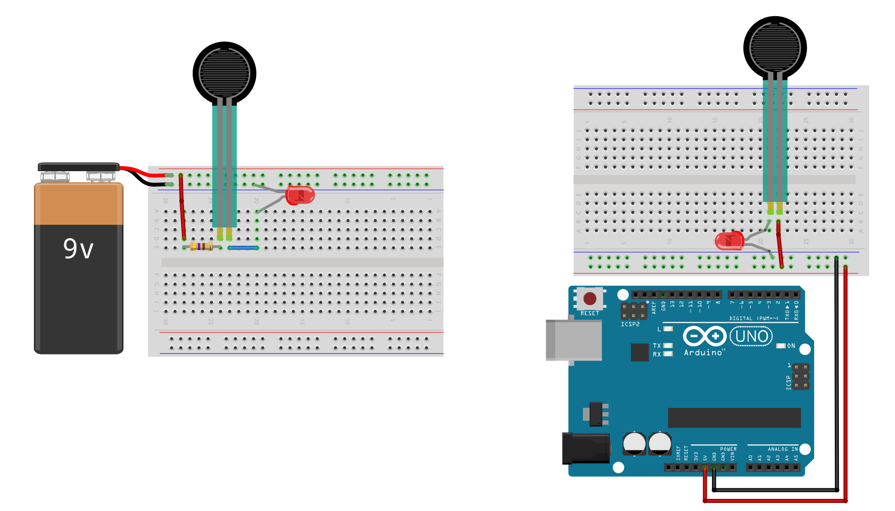
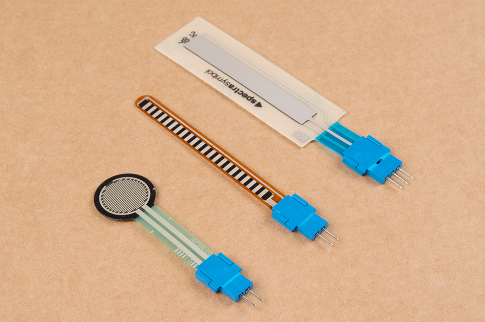

# {{ page.title | replace_first:'L','Lesson '}}
{: .no_toc }

## Table of Contents
{: .no_toc .text-delta }

1. TOC
{:toc}
---

In this lesson, you'll learn about force-sensitive resistors (FSRs) and how to use FSRs and two-legged variable resistors more generally with microcontrollers. We'll conclude with building a "force-sensitive" musical instrument—very Jedi-like!

This lesson directly builds on the prior one ([potentiometers](potentiometers.md)), so definitely complete that first.

## Materials

We'll need the following materials:

| Breadboard | Arduino | FSR | Resistor | Piezo Buzzer |
|:-----:|:-----:|:-----:|:-----:|:-----:|
|  |  |  |  |  |
| Breadboard | Arduino Uno, Leonardo, or similar  | [Force-Sensitive Resistor](https://www.adafruit.com/product/166) | 10kΩ Resistor | [Piezo Buzzer](https://www.mouser.com/ProductDetail/810-PS1240P02BT) |

## Force-sensitive resistors (FSRs)

Force-sensing (or force-sensitive) resistors (FSRs) are two-legged variable resistors that **decrease** in resistance with an **increase** in applied force. FSRs can differ in size, shape, and force sensing sensitivity. There are a variety of different form factors, including square and circular (which host the active sensor area). In our hardware kits, we typically purchase and provide the popular [Interlink FSR 402]({{ site.baseurl }}/assets/datasheets/ForceSensitiveResistor_InterlinkFSR402_2010-10-26-DataSheet-FSR402-Layout2.pdf) (either from [Sparkfun](https://www.sparkfun.com/products/9375) or [Adafruit](https://www.adafruit.com/product/166)), which is the product in the upper-left below.

Prices and products from [Sparkfun.com](https://learn.sparkfun.com/tutorials/force-sensitive-resistor-hookup-guide/all)
{: .fs-1 }

While FSRs respond to force, they are not precision measurement instruments like [load cells](https://learn.sparkfun.com/tutorials/getting-started-with-load-cells) or [strain gauges](https://learn.sparkfun.com/tutorials/getting-started-with-load-cells/strain-gauge-basics), so use those if you want to measure weight, load, or strain.

<!-- TODO: How do FSRs work? Include figure from datasheet -->

### FSR applications

What can we do with FSRs?

The [FSR 402 datasheet]({{ site.baseurl }}/assets/datasheets/ForceSensitiveResistor_InterlinkFSR402_2010-10-26-DataSheet-FSR402-Layout2.pdf) describes a number of example applications, including:
- **Detecting human interaction.** Sense whether a touch is accidnetal or intended by a reading force (or other signal processing)
- **Using force for UI feedback.** Detect user's touch force to make a more intuitive interface
- **Enhancing tool safety.** Differentiate a grip from a touch as a safety lock
- **Finding centroid of force.** Use multiple sensors to determine centroid of force
- **Detecting presence, position, or motion** Sense a person/patient in a bed, chair, or medical device
- **Detecting liquid blockage.** Detect tube or pump occlusion or blockage by measuring back pressure

### FSR force-resistance graph

So, what exactly is the relationship between an FSR's resistance and an applied force?

A graph of the force (g) vs. resistance (kΩ) of the FSR 402 is shown below (plotted on a log-log scale). As can be observed from the graph, the FSR has two response phases: 

1. An initial "break force" or "turn on threshold" that dramatically swings the resistance from >10MΩ to roughly 10kΩ
2. After this threshold, the FSR resistance becomes linear: inversely proportional to the applied force (following an inverse power-law characteristic).  

At the high-end of the force range (greater than 1000g), the FSR saturates and does not continue to drop resistance.

A graph of the force (g) vs. resistance (kΩ) plotted on a log-log scale for the Interlink FSR 402. Graph from the [Interlink FSR Integration Guide]({{ site.baseurl }}/assets/datasheets/ForceSensitiveResistor_Interlink_IntegrationGuide.pdf).
{: .fs-1 }

For more details, see the Interlink [FSR 402 datasheet]({{ site.baseurl }}/assets/datasheets/ForceSensitiveResistor_InterlinkFSR402_2010-10-26-DataSheet-FSR402-Layout2.pdf) and [Integration Guide]({{ site.baseurl }}/assets/datasheets/ForceSensitiveResistor_Interlink_IntegrationGuide.pdf) for details.

## Making an LED dimmer with an FSR

Let's make something!

To begin, just like we did with the [buttons](buttons.md) and [potentiometers](potentiometers.md) lessons, we'll make a simple LED circuit without a microcontroller. In fact, this circuit will be the exact same as the "rheostat" potentiometer circuit [here](potentiometers.md#build-the-potentiomer-based-led-dimmer) (but we'll replace the rheostat with an FSR).

Below, we show two possible wiring diagrams: the first (preferred) shows the FSR circuit powered by a 9V battery while the second shows power derived from the 5V and GND pins on the Arduino. (Again, we prefer the former just to further emphasize that at this point, we're not using microcontrollers!)

Two wiring options of an FSR using a breadboard. Like typical resistors, FSRs can be inserted into your circuits in either direction.
{: .fs-1 }

You'll note that unlike with the rheostat circuit, here we're **not** using a backup resistor. This is because both the [FSR 402 datasheet]({{ site.baseurl }}/assets/datasheets/ForceSensitiveResistor_InterlinkFSR402_2010-10-26-DataSheet-FSR402-Layout2.pdf) and our own empirical use demonstrate that even with 1,000g of force, the FSR still has roughly 500Ω-1kΩ of resistance. So, it never drops to dangerously low resistance levels like the potentiometer. You can, of course, use one if you want.

### Positioning FSR on breadboard

The two contact legs are 2.54mm apart (0.1"), so should fit snugly into your breadboard. Just like a traditional resistor, the FSR can be inserted in either direction.

Image from [Sparkfun.com](https://learn.sparkfun.com/tutorials/force-sensitive-resistor-hookup-guide/all#res).
{: .fs-1 }

If you want a more permanent connection, see this [fantastic guide](https://learn.sparkfun.com/tutorials/force-sensitive-resistor-hookup-guide/all#hardware-assembly) from Sparkfun on soldering FSRs (difficult) or using Amphenol FCI Clinchers (recommended):

Image from [Sparkfun.com](https://learn.sparkfun.com/tutorials/force-sensitive-resistor-hookup-guide/all#hardware-assembly)
{: .fs-1 }

### Workbench video of completed circuit

Once you've made the circuit, have fun playing with the FSR. Get a sense of its responsiveness and how hard you have to press.

Here's a workbench video of our completed circuit (this is the same video as the one in the [potentiometers](potentiometers.md) lesson, so there is a backup resistor):

<iframe width="736" height="414" src="https://www.youtube.com/embed/YMCqDcnwMYo" frameborder="0" allow="accelerometer; autoplay; encrypted-media; gyroscope; picture-in-picture" allowfullscreen></iframe>
Workbench video of the FSR LED dimmer circuit
{: .fs-1 }

## Using FSRs with microcontrollers

To use an FSR—or any variable resistor—with a microcontroller, you must add a fixed resistor to form a voltage divider like this:

### Make your own lo-fi pressure sensor

TODO: show super simple lo-fi pressure sensor out of pencil. Show both alligator clip version and taped jumper wire version.

## References
- [Interlink FSR 402 Data Sheet]({{ site.baseurl }}/assets/datasheets/ForceSensitiveResistor_InterlinkFSR402_2010-10-26-DataSheet-FSR402-Layout2.pdf)
- [Interlink FSR Integration Guide]({{ site.baseurl }}/assets/datasheets/ForceSensitiveResistor_Interlink_IntegrationGuide.pdf)
- [Force Sensing Resistor (FSR) with Arduino Tutorial](https://www.makerguides.com/fsr-arduino-tutorial/), Makerguides.com
- [Force Sensitive Resistors (FSRs)](http://www.openmusiclabs.com/learning/sensors/fsr/), Open Music Labs
- [Force Sensitive Resistor (FSR)](https://learn.adafruit.com/force-sensitive-resistor-fsr), Adafruit Learn
- [Force Sensitive Resistor Hookup Guide](https://learn.sparkfun.com/tutorials/force-sensitive-resistor-hookup-guide/all), Sparkfun Tutorials
- 