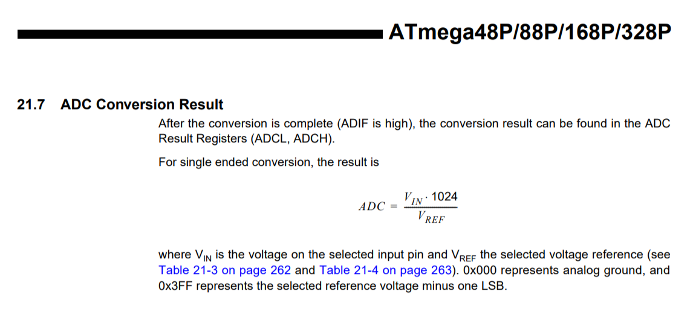

This page is intended to provide more advanced information about the Arduino. Rest assured,you do not need to read or understand this page to use the Arduino! :)

## What's calling loop() and how fast?

Because Arduino is [open source](https://github.com/arduino), we can look up the source code to answer this question. In short, `loop()` is called within an infinite `for` (or `while` loop) and the only overhead is checking for whether there is data available on the serial port and then reading the serial buffers. The entire `int main(void)` function in [main.cpp](https://github.com/arduino/ArduinoCore-avr/blob/2f67c916f6ab6193c404eebe22efe901e0f9542d/cores/arduino/main.cpp) is:


int main(void)
{
    init();
    initVariant();

    #if defined(USBCON)
    USBDevice.attach();
    #endif

    setup();

    for (;;) {
        loop();
        if (serialEventRun) serialEventRun();
    }
    return 0;
}


Interestingly, this [Arduino forum post ](https://forum.arduino.cc/index.php?topic=615714.0)suggests that because `serialEventRun()` is weakly defined in the core, you can define it locally in your sketch to override the default definition, which, according to the OP, will "save a little memory and makes the loop() run a little faster too!" You can do this if you don't need to user serial communication.


void serialEventRun() {}

void setup() {
}

void loop() {
}


## Secrets of Arduino PWM

- https://www.arduino.cc/en/Tutorial/SecretsOfArduinoPWM

## Converting analogRead to voltages

Interesting thread on [Arduino forums](https://forum.arduino.cc/index.php?topic=303189.msg2109121) discussing whether to convert Arduino Uno `analogRead` values to voltages using a divisor of 1023 or 1024. The maximum `analogRead` value is 1023; however, there are 1024 'steps' between 0 and 5V. The official [Arduino tutorial uses 1023](https://www.arduino.cc/en/Tutorial/ReadAnalogVoltage)--which effectively translates 0 - 1023 to 0 to 5V; however, others argue that this is wrong.

I think the key here is to remember that an ADC conversion represents a range of values. `5V/1024 = 0.0048828125V`. So if `analogRead` returns 0, this is really a range of 0V to 0.0048828125V, and 1 is a range of 0.0048828125V to 0.009765625V, *etc.* In that regard, we would want to divide analogRead by 1024 and if analogRead returns 1023, 1023/1024 * 5V=4.9951171875V to 5V. 0.9990234375.

The [ATmega datasheet](https://www.sparkfun.com/datasheets/Components/SMD/ATMega328.pdf) says:

For most practical purposes, dividing by 1023 or 1024 won't matter. :)

## What does delay() actually do?

As you might expect—given our warnings about avoiding overuse of [`delay(int ms)`](https://www.arduino.cc/reference/en/language/functions/time/delay/)—the delay code consists of a `while` loop that simply waits for the given amount of delay time to pass. There is a `yield()` call within the `while` loop but this is, by default, an empty function—though you could implement it to create a "real cooperative scheduler." The code for `yield()` is [here](https://github.com/arduino/ArduinoCore-avr/blob/2f67c916f6ab6193c404eebe22efe901e0f9542d/cores/arduino/hooks.c).

The [`delay(int ms)`](https://www.arduino.cc/reference/en/language/functions/time/delay/) function is found in [wiring.c](https://github.com/arduino/ArduinoCore-avr/blob/2f67c916f6ab6193c404eebe22efe901e0f9542d/cores/arduino/wiring.c) and is, in its entirety, copied below:


void delay(unsigned long ms)
{
	uint32_t start = micros();

	while (ms > 0) {
		yield();
		while ( ms > 0 && (micros() - start) >= 1000) {
			ms--;
			start += 1000;
		}
	}
}


## How does the Arduino Uno ADC work exactly?

- http://www.gammon.com.au/adc
- http://www.skillbank.co.uk/arduino/adc.htm

The [ATmega328 datasheet](http://ww1.microchip.com/downloads/en/DeviceDoc/ATmega48A-PA-88A-PA-168A-PA-328-P-DS-DS40002061A.pdf) says that the analog input resistance is 100 megohms:

