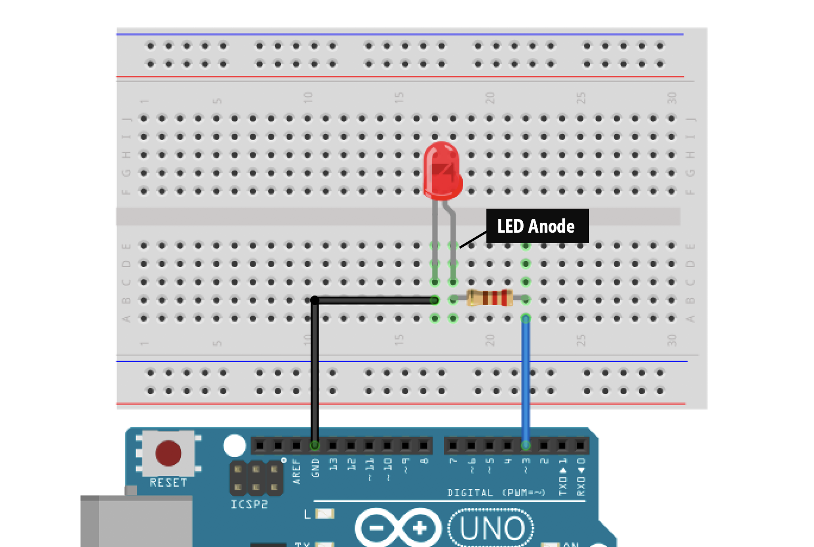
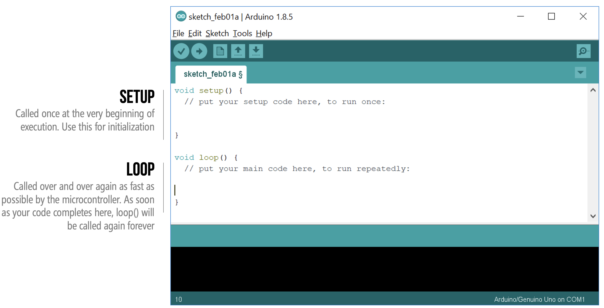
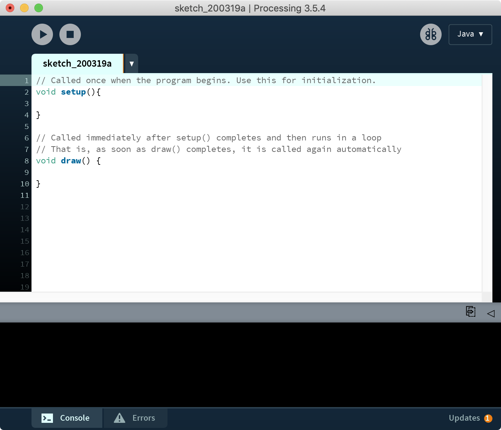
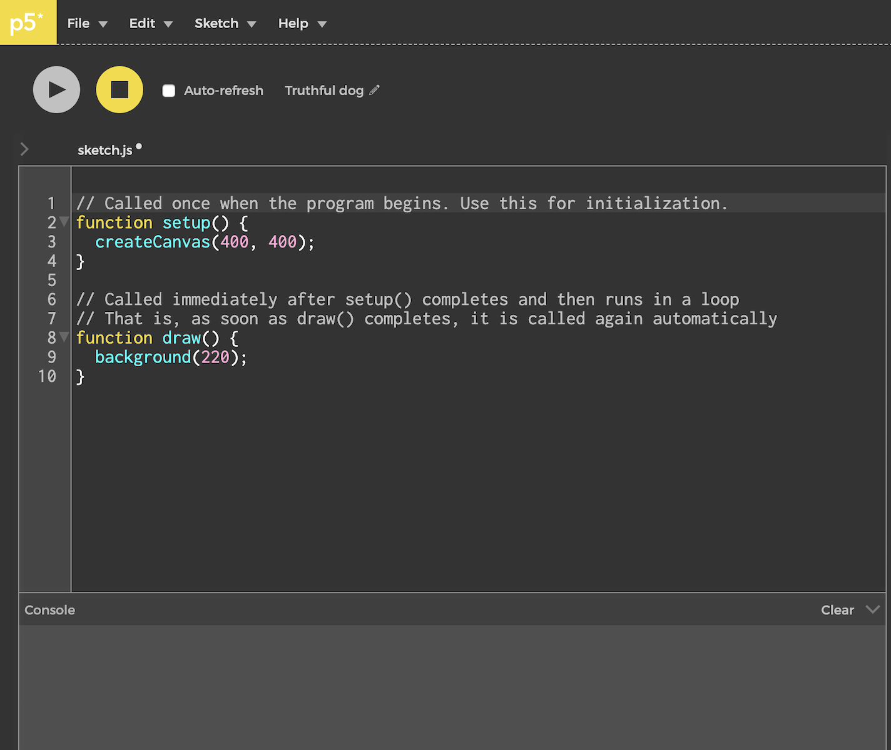

# {{ page.title | replace_first:'L','Lesson '}}
{: .no_toc }

## Table of Contents
{: .no_toc .text-delta }

1. TOC
{:toc}
---
In our [first activity](led-on.md), we directly hooked up an LED circuit to the Arduino's 5V pin. While this enabled us to learn about Arduino's supply voltage and GND pins and gave us practical experience wiring electrical components into the Arduino ports, it was admittedly, a toy exercise.

In this activity, we are going to do something more exciting: use the Arduino to turn the LED on and off by *programatically* controlling the output voltage on one of Arduino's GPIO pins. This begins our entrée into the two key aspects of working with microcontrollers: (1) building circuits and (2) writing code to interact with those circuits.

<!-- TODO: Add in a version that makes a tone for accessibility reasons? 
     See: https://itp.nyu.edu/physcomp/labs/labs-arduino-digital-and-analog/digital-input-and-output-with-an-arduino/ -->

## Materials

You will use the same materials as before. You will also need the [Arduino IDE](https://www.arduino.cc/en/main/software) and a USB cable to upload your program from your computer to your Arduino.

| Arduino | LED | Resistor |
|:-----:|:-----:|:-----:|
|     |  |  |
| Arduino Uno, Leonardo, or similar  | Red LED | 220Ω Resistor |

## Making the circuit

Using the same resistor-wrapped red LED from [before](led-on.md#step-1-wrap-resistor-around-led-leg), plug the anode + resistor side into Pin 3 and the cathode into GND. 

---

**TIP:** Double check to make sure that you've correctly connected GND and Pin 3—it's easy to be "off-by-one-pin" (a frustrating error!).

---

While it's not necessary to use a breadboard for this simple circuit, here are two functionally equivalent breadboard-based  wiring options. As our circuits get more complex, you will need to use a breadboard—so it's good to start building up familiarity. Which breadboarded design makes most sense to you? Use your finger to trace the flow current from Pin 3 to GND. To zoom in on the images, you can right click and select "Open Image in a New Tab."

| Breadboard Option 1 | Breadboard Option 2 |
|:----:|:-----:|
| |  |

Next, we'll write C code for the Arduino to turn on the LED from Pin 3, which will programmatically set Pin 3 to 5V.

## Get the Arduino IDE

But first, we need to download and install the Arduino IDE (if you haven't already).

### Step 1: Download and install the Arduino IDE

Download and install the local Mac, Windows, or Linux version of the [Arduino IDE](https://www.arduino.cc/en/main/software). We will **not** be using the Cloud version.

### Step 2: Open the IDE

After installation is complete, open the Arduino IDE. Notice that there are **two blocks** of code (called functions):

1. The first block: `setup()`, which is called once and only once when the Arduino is turned on
2. And the second block: `loop()`, which is called as soon as `setup()` completes. When `loop()` completes, it's automatically called again and again (until the Arduino is turned off). Want to learn more, read [Inside Arduino](inside-arduino.md#whats-calling-loop-and-how-fast).

For those who have used [Processing](https://processing.org/)—a programming environment for digital artists and creators (and a favorite of mine)—this code structure should seem familiar. Indeed, the Arduino IDE derives from Processing ([link](https://github.com/arduino/Arduino/tree/ee1967cd530ceb9a1d638875e385157e90d532e8/arduino-core/src/processing/app)).

| Processing | p5js |
|----|----|
|  |  |

### Step 3: Select your Arduino board and port
TODO

## Turn on LED programatically via Pin 3

Now, we are going to write code to turn on our LED by setting Pin 3 to HIGH (or 5V). Then, we will modify this code to flash the LED both on *and* off.

The Arduino Uno has 14 general-purpose input/output ([GPIO](https://en.wikipedia.org/wiki/General-purpose_input/output)) pins that can be used for digital input/output (I/O)—that is, to read or write digital information (HIGH or LOW) using [`digitalRead()`](https://www.arduino.cc/reference/en/language/functions/digital-io/digitalread/) and [`digitalWrite()`](https://www.arduino.cc/reference/en/language/functions/digital-io/digitalwrite/), respectively. We could have selected any of these pins for this lesson but we chose Pin 3 (in part, because we want to use this same pin in the next lesson and using it now simplifies things!).

You can control any of these 14 digital I/O pins with three functions:

1. [`pinMode(int pin, int mode)`](https://www.arduino.cc/reference/en/language/functions/digital-io/pinmode/) configures a specified pin as either an `INPUT` or `OUTPUT`
2. [`digitalRead(int pin)`](https://www.arduino.cc/reference/en/language/functions/digital-io/digitalread/) reads digital input from the specified pin, either `HIGH` or `LOW`.
3. [`digitalWrite(int pin, int value)`](https://www.arduino.cc/reference/en/language/functions/digital-io/digitalwrite/) writes digital output to the specified pin, either `HIGH` or `LOW`.

---

**NOTE:** The Arduino Uno and Leonardo both use the [ATmega328P](http://ww1.microchip.com/downloads/en/DeviceDoc/Atmel-7810-Automotive-Microcontrollers-ATmega328P_Datasheet.pdf) microcontroller, which can supply an absolute maximum of 40 mA per digital output pin or about ~two LEDs in parallel (each with a forward current of 20mA). According to Section 28.1 in the [ATmega328P datasheet](http://ww1.microchip.com/downloads/en/DeviceDoc/Atmel-7810-Automotive-Microcontrollers-ATmega328P_Datasheet.pdf), anything beyond these limits "may cause permanent damage to the chip". The maximum total current draw **across all I/O pins** together should not exceed 200mA.

You may be thinking: "um, what?" That's OK. In our years of teaching, we have had very few Arduinos damaged due to current overdraw. And you won't need to worry about these limits for any of the introductory lessons.

In general, microcontroller digital output pins were designed to send **control signals** and not to act as **power supplies**. While these pins can supply enough current to use LEDs, piezo speakers, or control servo motors, if you need to control a high-current DC load such as a DC motor, you'll need to use a transistor. NYU's ITP course has a [nice tutorial](https://itp.nyu.edu/physcomp/labs/motors-and-transistors/using-a-transistor-to-control-high-current-loads-with-an-arduino/), which shows how to use a transistor, external power supply, and an Arduino to drive a DC motor.

<!-- TODO: add in a link to powering circuits via the 5V port directly or an external power source with a transistor -->

---

Let's write our program to set Pin 3 to HIGH (5V).

### Step 1: Start a new sketch in the Arduino IDE

Start a new sketch in the Arduino IDE:

### Step 2: Set the pinMode for Pin 3

Because the 14 digital I/O pins can used for either input or output, we need to specify that Pin 3 should be used for *output*. That is, we want the Arduino to **output** a 5V signal on Pin 3 to turn on our LED. We configure pins in the  `setup()` block and use the [`pinMode(int pin, int mode)`](https://www.arduino.cc/reference/en/language/functions/digital-io/pinmode/) command, which takes in a pin as the first parameter and a mode (`INPUT` or `OUTPUT`) as the second.


void setup() {
  // put your setup code here, to run once:
  pinMode(3, OUTPUT);
}


### Step 3: Set Pin 3 HIGH

Lastly, we need to actually set the Pin 3 signal to HIGH. For this, we use the  [`digitalWrite(int pin, int value)`](https://www.arduino.cc/reference/en/language/functions/digital-io/digitalwrite/) command, which takes in a pin as the first parameter and a value (`HIGH` or `LOW`) as the second. We could do this either in `setup()` or in `loop()` but since we're not currently changing the output signal, there is no reason to put it in `loop()`, so let's put it in `setup()` like the `pinMode` code.


void setup() {
  // put your setup code here, to run once:
  pinMode(3, OUTPUT);
  digitalWrite(3, HIGH); // turn LED on (output 5V)
}


### Step 4: Compile the code

We did it! Now it's time to compile and upload the code to Arduino.

Compile the code by clicking on the "verify" checkmark button in the upper-left corner of the Arduino IDE. If you haven't already, the Arduino IDE will also ask you to save your sketch. If there are any syntax or other identifiable errors in the code, the Arduino IDE will print them out in the console window at the bottom.

### Step 5: Upload the code to Arduino

Finally, upload the code to the Arduino by clicking on the "right arrow" button (next to verify). Importantly, you must have already set your Arduino board and port in `Tools->Board` and `Tools->Port`, respectively.

Once complete, the code automatically runs and the LED should turn on!

TODO: insert real-world video of compiling code + arduino turning on pin 3. Maybe use the logicapture setup?

## Turn on and off the LED programatically via Pin 3

Now, let's modify our code to turn on *and* off the LED programatically. More specifically, we will alternate between having the LED on for one second and having the LED off for one second. To do this, we'll use the [`delay(int ms)`](https://www.arduino.cc/reference/en/language/functions/time/delay/) function, which pauses the program for the specified amount of time (in milliseconds).

### Step 1: Move the digitalWrite code from setup() to loop()

First, move the digitalWrite code from `setup()` to `loop()`:


void setup() {
  // set Pin 3 to output
  pinMode(3, OUTPUT);
}

void loop() {
  digitalWrite(3, HIGH);  // turn LED on (output 5V)
}


### Step 2: Add in delays and code to turn off LED

Now, add in code to pause (for one second) and then turn off the LED (for one second) using `delay()`. Remember, when `loop()` completes, it is automatically called again (making the LED blink continuously).


void setup() {
  // set Pin 3 to output
  pinMode(3, OUTPUT);
}

void loop() {
  digitalWrite(3, HIGH);  // turn LED on (output 5V)
  delay(1000);            // wait one second
  digitalWrite(3, LOW);   // turn LED off (output 0V)
  delay(1000);            // wait another second
}


### Step 3: Compile and upload

We're done! Now, compile and upload the code and see it run!

<video controls="controls">
  <source src="assets/movies/BlinkWithCodeAndWorkbenchCamera.mp4" type="video/mp4">
</video>

**Note:** On my Windows machine, I use a [dark theme](https://create.arduino.cc/projecthub/konradhtc/one-dark-arduino-modern-dark-theme-for-arduino-ide-2fca81) for the Arduino IDE.
{: .fs-1 }

### Step 4: Replace constants

Typically, we want to limit the use of *literal constants* in our code and replace them by variables. In this case, let's replace `3` with `LED_OUTPUT_PIN` defined as a global variable at the top of our program (`const int LED_OUTPUT_PIN = 3;`). This will make our code more maintainable and less prone to accidental mistakes. Try to do this for all literals in the future.


const int LED_OUTPUT_PIN = 3;
void setup() {
  // set Pin 3 to output
  pinMode(LED_OUTPUT_PIN, OUTPUT);
}

void loop() {
  digitalWrite(LED_OUTPUT_PIN, HIGH);  // turn LED on (output 5V)
  delay(1000);                         // wait one second
  digitalWrite(LED_OUTPUT_PIN, LOW);   // turn LED off (output 0V)
  delay(1000);                         // wait another second
}


### Walking through the code

How does this work? See the code walkthrough video below:

<video controls="controls">
  <source src="assets/movies/Arduino_BlinkWithCode_Pin3.mp4" type="video/mp4">
</video>

### Mental model check: code is loaded and running on the Arduino

As a quick mental model check, it's worth emphasizing that once you upload the code to your Arduino, you no longer need the USB cable. Instead, you could use some other power source like a 9V battery plugged in to the barral jack port. Why? Because after you clikc `Upload` in the Arduino IDE, the code is stored **locally** on your Arduino and stays there even when the Arduino loses power.

<video controls="controls">
  <source src="assets/movies/Arduino_LEDBlink_Pin3-9VPower.mp4" type="video/mp4">
</video>

### Our Blink code is in GitHub

You can access our Blink code in our [Arduino GitHub repository](https://github.com/jonfroehlich/arduino). It's also displayed below:

## Use the built-in LED

Finally, the Arduino has a built-in LED (with an in-series resistor) that's often useful for some quick debugging (*e.g.,* turn on the built-in LED to indicate some program state). On the Arduino Uno and Leonardo, the built-in LED is on Pin 13. So, if you write `digitalWrite(13, HIGH);` in your code, the built-in LED will turn on. Because not all Arduino boards have the built-in LED at Pin 13, you can also use the constant `LED_BUILTIN`.

The official [Arduino Blink example](http://www.arduino.cc/en/Tutorial/Blink) uses the built-in LED and the constant `LED_BUILTIN` to demonstrate blinking. 


// the setup function runs once when you press reset or power the board
void setup() {
  // initialize digital pin LED_BUILTIN as an output.
  pinMode(LED_BUILTIN, OUTPUT);
}

// the loop function runs over and over again forever
void loop() {
  digitalWrite(LED_BUILTIN, HIGH);   // turn the LED on (HIGH is the voltage level)
  delay(1000);                       // wait for a second
  digitalWrite(LED_BUILTIN, LOW);    // turn the LED off by making the voltage LOW
  delay(1000);                       // wait for a second
}


You can access this example directly in the Arduino IDE:

## Next Lesson

In the next lesson, we will learn how to control the output voltage not just at `LOW` (0V) or `HIGH` (5V) but at finer levels between 0 and 5V using [`analogWrite(int pin, int value)`](https://www.arduino.cc/reference/en/language/functions/analog-io/analogwrite/).

[Previous: Turning on an LED with Arduino](led-on.md){: .btn .btn-outline }
[Next: Fading an LED with Arduino](led-fade.md){: .btn .btn-outline }
