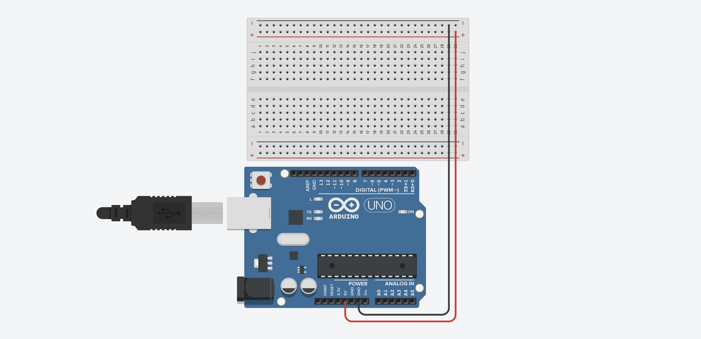
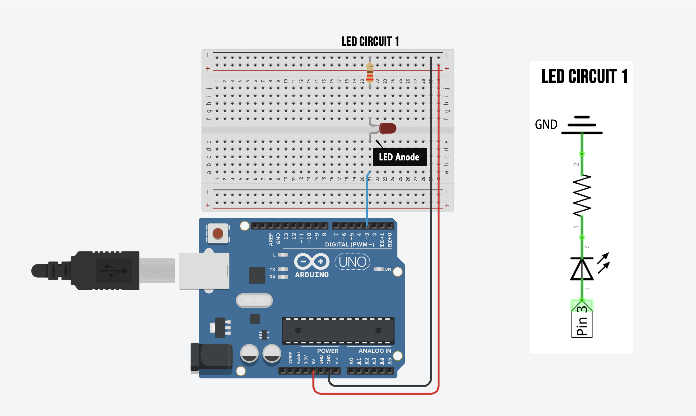
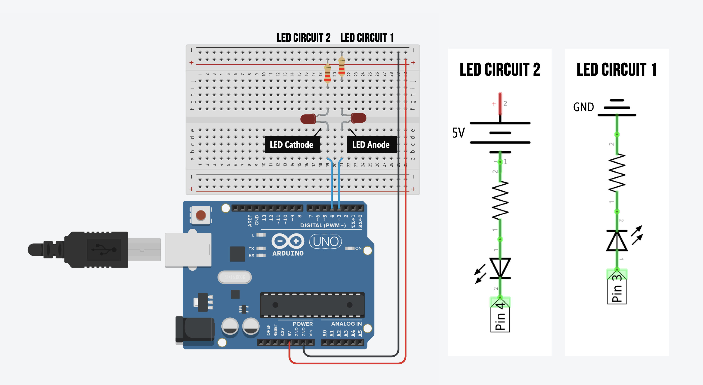

# {{ page.title | replace_first:'L','Lesson '}}
{: .no_toc }

## Table of Contents
{: .no_toc .text-delta }

1. TOC
{:toc}
---

In this tutorial, we will learn the difference between **current sourcing** and **current sinking** by revisiting our [LED Blink](led-blink.md) example. We are going to TODO.

TODO: insert video of two LEDS blinking (alternatively). Should have annotations? Should have current animation?

## Materials

Our materials are *almost* the same as before but this time, we are going to make two separate LED circuits (with the same components). So, we need **two** red LEDs and **two** 220Ω resistors. Now that we're using more components, we'll also need a **breadboard**—which will make it easier to make a clean, organized circuit.

| Arduino | LED | Resistor |
|:-----:|:-----:|:-----:|
|     |  |  |
| Arduino Uno, Leonardo, or similar  | **2** Red LEDs | **2** 220Ω Resistors |

TODO: insert breadboard here.

## Making the circuit

### Step 1: Wire up the power and GND rails

### Step 2: Wire up the first LED circuit

In this step, you'll wire up the exact same circuit used in our previous examples (*e.g.,* [LED Blink](led-blink.md) and [LED Fade](led-fade.md)) but this time using a breadboard. Make sure the LED anode (the long leg) is facing Pin 3.

### Step 3: Wire up the second LED circuit

In this step, you'll wire up the second LED circuit. This time, however, connect the LED cathode (short leg) to Pin 4 and the resistor to the 5V rail.

## Writing the code: blinking Pins 3 and 4

We are going to write code to blink the LEDs hooked up to Pins 3 and 4. The Pin 3 circuit (**LED Circuit 1** in our diagram) will turn ***on*** with `digitalWrite(3, HIGH)` whereas the Pin 4 circuit (**LED Circuit 2**) will turn ***off*** with `digitalWrite(4, HIGH)`.

### Step 1: Write the setup and initialization code


const int LED1_OUTPUT_PIN = 3; // Anode faces Pin 3 (cathode connected to 0V)
const int LED2_OUTPUT_PIN = 4; // Cathode faces Pin 4 (anode connected to 5V)
const int DELAY_MS = 1000; // delay for 1 sec between blinks

// The setup function runs once when you press reset or power the board
void setup() {
  // Set our LED pins as output
  pinMode(LED1_OUTPUT_PIN, OUTPUT);
  pinMode(LED2_OUTPUT_PIN, OUTPUT);
}


### Step 2: Write the blink code in loop()

// The loop function runs over and over again forever
void loop() {
  // Below, you're going to see that driving Pin 3 HIGH will turn on LED1
  // but driving Pin 4 HIGH will actually turn *off* LED2
  digitalWrite(LED1_OUTPUT_PIN, HIGH);  // turns ON LED1
  digitalWrite(LED2_OUTPUT_PIN, HIGH);  // turns OFF LED2
  delay(DELAY_MS);                      // delay is in milliseconds; so wait one second
  
  digitalWrite(LED1_OUTPUT_PIN, LOW);   // turns OFF LED1 (Pin 3 is now 0V and other leg of LED is 0V)
  digitalWrite(LED2_OUTPUT_PIN, LOW);   // turns ON LED2 (Pin 4 is now 0V and other leg of LED is 5V)
  delay(DELAY_MS);                      // wait for a second
}


### Step 3: Compile, upload, and run the code!

[Previous: LED Fade](led-fade.md){: .btn .btn-outline }
[Next: RGB LEDs](rgb-led.md){: .btn .btn-outline }
