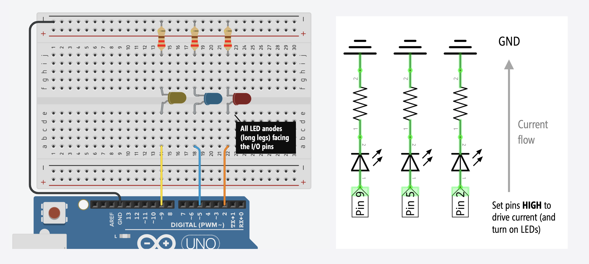

# {{ page.title | replace_first:'L','Lesson '}}
{: .no_toc }

## Table of Contents
{: .no_toc .text-delta }

1. TOC
{:toc}
---

In this lesson, we will learn how to blink multiple LEDs at different rates and build our first [C/C++ class](http://www.cplusplus.com/doc/tutorial/classes/), which will greatly simplify our code and, as an added bonus, reduce its size by eliminating code redundancy! 

As with our previous lesson on [crossfading RGB LEDs](rgb-led-fade.md), this lesson involves **simple circuits** but comparatively **complex code**. Often, when using microcontrollers, our code is the magic sauce—the circuits are straightforward but the code can be complicated.

## Background

The canonical and beloved **first Arduino sketch**, [Blink](https://www.arduino.cc/en/tutorial/blink), enables beginners to quickly build and write code for a circuit. The code looks something like this, which we covered in our own [Blink lesson](led-blink.md):


void setup() {
  // set Pin 3 to output
  pinMode(3, OUTPUT);
}

void loop() {
  digitalWrite(3, HIGH);  // turn LED on (output 5V)
  delay(1000);            // wait one second
  digitalWrite(3, LOW);   // turn LED off (output 0V)
  delay(1000);            // wait another second
}


Blink is easy. It's gratifying. But... it sets up a flawed mental model about how to structure programs and when/how to use [`delay()`](https://www.arduino.cc/reference/en/language/functions/time/delay/).

What if you want to blink multiple LEDs at **different rates**? How would you do this with `delay()`? Well, **you can't.** While in a `delay()`, your program is literally *doing nothing* (well, it's stuck in a `while` loop waiting for the delay period to finish but that's essentially nothing).

So, what should we do instead? We **eliminate all delays** and track time and state using [state machines](https://en.wikipedia.org/wiki/Finite-state_machine).

## Materials

You'll need **three LEDs**—we'll use red, blue, and yellow but you can use whatever LEDs you want—along with current limiting resistors, a breadboard, and an Arduino.

| Breadboard | Arduino | Three LEDs | Three Resistors |
|:-----:|:-----:|:-----:|:-----:|
|  |     |  |  |
| Breadboard | Arduino Uno, Leonardo, or similar  | Three LEDs (We'll use a red, blue, and yellow) | **Three** 220Ω Resistors |

## Circuit

The circuit is the same as our basic [LED blink lesson](led-blink.md) but we duplicate it three times—once for each LED. By now, this should feel familiar. Indeed, you may not even need a wiring diagram like this to help!

## Writing code

We are going to implement two approaches:

1. The first introduces the overall idea of using state tracking variables and state change timestamps to control timing output without `delays()`.
2. The second will use the same approach but simplified using object-oriented programming. Here, we'll also show you how to make and use a `C++` class in Arduino.

### Multi-rate blinking: a simple approach

For our first approach, we need three variables for each LED circuit:

1. A per-LED **blink interval** stored in `const` variables like `LED1_BLINK_INTERVAL_MS` and `LED2_BLINK_INTERVAL_MS`
2. The **last time the LED was toggled** from `HIGH` to `LOW` or `LOW` to `HIGH`—*e.g.,* `_led1LastToggledTimestampMs` and `_led2LastToggledTimestampMs`. To capture timestamps, we use Arduino's [`millis()` ](https://www.arduino.cc/reference/en/language/functions/time/millis/) function, which returns the number of **milliseconds** passed since the Arduino board began running the current program. On the Arduino, the `unsigned long` data type is 32 bits (4 bytes), which ranges from `0` to `4,294,967,295` (2^32 - 1). Thus, `millis()` will overflow (go back to zero and begin counting again) after `4,294,967,295` milliseconds  (~approximately 50 days). If you need more precise timing, you could use `micros()`, which provides **microsecond resolution** (micros() overflows every ~70 minutes)
3. The **current LED state** (either `HIGH` or `LOW`)—*e.g.,* `_led1State` and `_led2State`—which is toggled after passing the aforementioned per-LED threshold.

The code, in full, is below:

### Multi-rate blinking: an object-oriented approach

TODO

## Exercises

Want to go further? Here are some design challenges to help improve your skills:

- **Morse code**. Try adapting the Blinker class to support a sequence of on and off intervals like [Morse code](https://en.wikipedia.org/wiki/Morse_code)
- **Fade**. What about *fading* the LEDs rather than flashing them. How would you do this? **Stuck?** Nick Gammon wrote a class for this on his [blog](https://www.gammon.com.au/blink) called LedFader but don't look at his solution until you've tried your own!

## References
- [Multi-tasking the Arduino: Part 1 - Blinking without delays](https://learn.adafruit.com/multi-tasking-the-arduino-part-1/overview), Adafruit Learn
- [Multi-tasking the Arduino: Part 2 - Using interrupts](https://learn.adafruit.com/multi-tasking-the-arduino-part-2/overview), Adafruit Learn
- [Multi-tasking the Arduino: Part 3](https://learn.adafruit.com/multi-tasking-the-arduino-part-3/overview), Adafruit Learn
- [How to do multiple things at once](https://www.gammon.com.au/blink), Nick Gammon

## Next Lesson

We did it! This completes our [Intro to Output](intro-output.md) series. Let's now begin [Intro to Input](intro-output.md) to learn about buttons, sensors, voltage dividers, and more!

<!-- In the next lesson, we'll learn about making sound with passive piezoelectric buzzers and the [`tone()`](https://www.arduino.cc/reference/en/language/functions/advanced-io/tone/).

[Previous: LED Blink 2](led-blink2.md){: .btn .btn-outline }
[Next: Cross-fading RGB LEDs](rgb-led-fade.md){: .btn .btn-outline }
 -->