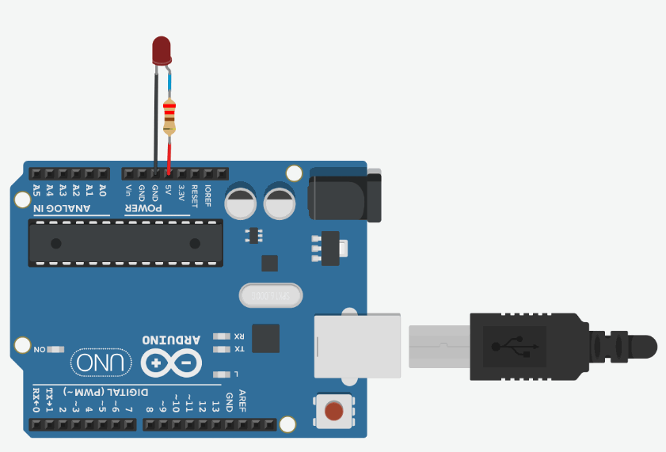
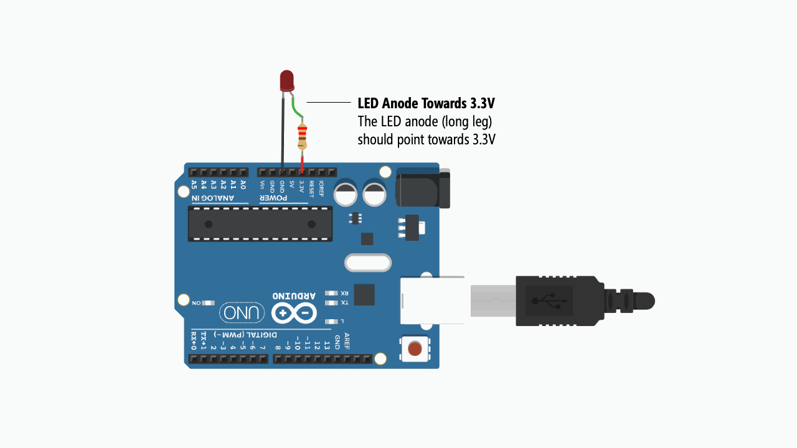

# {{ page.title | replace_first:'L','Lesson '}}
{: .no_toc }

## Table of Contents
{: .no_toc .text-delta }

1. TOC
{:toc}
---
For our first learning activity, we are going to use Arduino to turn on an [LED]({{ site.baseurl }}/pages/electronics/leds.md). We're **not** going to write any code. Instead, our goal is to build some initial familiarity with Arduino hardware and connecting components to Arduino pins before we introduce programming, which we do in the [next lesson](led-blink.md).

The movement of **current** in the circuit is illustrated by the animated yellow circles (but is a coarse abstraction).
{: .fs-1 }

## Materials

You will need the following materials:

| Arduino | LED | Resistor |
|:-----:|:-----:|:-----:|
|     |  |  |
| Arduino Uno, Leonardo, or similar  | Red LED | 220Ω Resistor |

## Hook up LED to Arduino's 5V supply pin

### Step 1: Wrap resistor around LED leg

Grab a 220Ω resistor (or any resistor 220Ω or greater) and twist one leg around an LED leg. If you want to follow my example, connect the resistor to the LED's anode (long leg) but either leg will work.

### Step 2: Connect components to Arduino

Insert the LED + resistor into the Arduino: the LED's cathode (short leg) to GND and the LED's anode (long leg) + resistor to the Arduino's voltage supply, which you can access via the 5V pin. 

### Step 3: Connect your Arduino to power

Now connect your Arduino to power and the LED should light up. You did it!

Here's a photo of the version I made. I found it easier to stretch the wiring across the Arduino from the 5V port to the GND on the opposite side.

For power, you can use a USB cable (which supplies 5V) or a 9V battery (which supplies 9V). Either way, the Arduino **supplies 5V** through the 5V pin. How? Using a [voltage regulator](https://itp.nyu.edu/physcomp/labs/labs-electronics/components/). See "More Info" below.

| USB Power        | 9V Power          |
|:-------------|:------------------|
|  |  |
| With USB power, the 5V pin supplies 5V | With a 9V battery, the 5V pin still supplies 5V |

---

**MORE INFO:**

If we use a 9V battery (which supplies ~9V) then how does the Arduino convert 9V to 5V? Using a component called a [voltage regular](https://itp.nyu.edu/physcomp/labs/labs-electronics/components/#Voltage_Regulator), which can take in a range of DC voltages and step it down (but not up) to a stable constant voltage. You can buy and use voltage regulators in your own projects. If you want to learn more about about the Arduino Uno's power supply sub-system, read this [technobyte blog post](https://www.technobyte.org/arduino-uno-power-supply-arduino-hardware-core/).

---

## How can we make the LED less bright?

LED brightness is controlled by **current**. So, to dim an LED, we need to reduce current. But how? Recall Ohm's Law: $$V=I * R$$ or $$I = \frac{V}{R}$$. Thus, we can reduce current either by:

1. Decreasing **voltage**
2. Increasing **resistance**

In future tutorials, we'll show how you can **control voltage output programmatically** by writing code for the Arduino microcontroller. But, for now, let's dim the LED by first decreasing voltage using the Arduino's 3.3V pin (rather than the 5V pin) and then by using higher value resistors.

### Hooking up the LED to the 3.3V supply pin

The Arduino Uno provides both a 5V power supply (which we just used) and a 3.3V power supply.

Let's move the LED anode (long leg) from the 5V pin to the 3.3V pin. What do you observe? The LED should be less bright!

Let's compare the current and brightness between supplying 5V *vs.* 3.3V.

| 5V        | 3.3V          |
|:-------------|:------------------|
|  |  |
| With a 5V supply, the voltage drop across the 220Ω is ~3V. Thus, $$I = \frac{3V}{220Ω}= 13.6mA $$ | With a 3.3V supply, the voltage drop across the 220Ω resistor is ~1.3V, thus $$I = \frac{1.3V}{220Ω}= 5.9mA $$|

Here's a workbench photo of the LED wired to the 3.3V port. The LED is noticeably less bright:

### Full video walkthrough

Here's a full video walkthrough of wrapping the resistor around the LED anode leg, wiring the circuit to 5V and GND, and then switching from the 5V to the 3.3V supply.

<iframe width="736" height="414" src="https://www.youtube.com/embed/47DH_Odi068" frameborder="0" allow="accelerometer; autoplay; encrypted-media; gyroscope; picture-in-picture" allowfullscreen></iframe>

### How can we determine the current through the circuit?

To determine the current through the circuit, we can use Ohm's Law ($$I = \frac{V}{R}$$) and Kirchhoff's Voltage Law. The key component here is the **resistor**, which limits the current in our circuit.

---

**NOTE:**

As mentioned, If you want to make your LED dimmer (without writing microcontroller code), you can either (1) add more resistance or (2) reduce your supply voltage—both have the same effect: reducing current. This is sufficient conceptual knowledge to start building circuits. If you want to know more, read on! Otherwise, you can skip to the [next lesson](led-blink.md).
{: .notice}

---

To use Ohm's Law, we need to calculate the **voltage drop** across the resistor ($$V_R$$). For this, we need to know the LED's forward voltage $$V_f$$, which is the minimum voltage necessary to turn the LED on and allow current to pass. In this case, our forward voltage is 2V—a common $$V_f$$ for red LEDs. From Kirchhoff's Voltage Law, we know that the total voltage drop in our circuit—between the LED ($$V_f$$) and resistor ($$V_R$$)—must equal the supply voltage $$V_s$$, which is 3.3V. More formally:

$$V_{total} = V_R + V_f  \\
3.3V = V_R + V_f \\
V_R = 3.3V - V_f \\
V_R = 3.3V - 2V\to1.3V$$

With ($$V_R=1.3V$$), we can now use Ohm's Law to calculate $$I$$: $$I = \frac{V}{R}\to\frac{1.3V}{220}\to5.9mA$$

<!-- TODO: in future Fix Ohm's Law animations to use Vr, Vf nomenclature -->

To learn more about calculating the current through an LED, watch [this video](https://vimeo.com/78674965) by NYU ITP's Jeff Feddersen:

<iframe src="https://player.vimeo.com/video/78674965" style="position:absolute;top:0;left:0;width:100%;height:100%;" frameborder="0" allow="autoplay; fullscreen" allowfullscreen></iframe>

<!-- TODO: and read our LED guide ... write the LED guide :) -->

### Using higher value resistors

We just showed how reducing the supply voltage ($$V_s$$) proportionally reduces current and, therefore, the LED brightness. Now, let's play around with higher-value resistors such as a 680Ω, 2.2kΩ, or 10kΩ, and see their effect. What happens?

You should observe that the LED's brightness *decreases* as the resistance *increases*. 

| Resistor | Resistor Image | Vs | Resulting Current | 
|:-------------|:-------------|:-------------|:-------------|
| 220Ω | | 5V | $$I = \frac{3V}{220Ω}= 13.6mA $$ |
| 680Ω | | 5V | $$I = \frac{3V}{680Ω}= 4.4mA $$ |
| 1kΩ | | 5V | $$I = \frac{3V}{1,000Ω}= 3mA $$ |
| 2.2kΩ | | 5V | $$I = \frac{3V}{2,200Ω}= 1.4mA $$ |
| 10kΩ | | 5V | $$I = \frac{3V}{10,000Ω}= 0.3mA $$ | 

We can verify these theoretical predictions using a multimeter to measure ($$V_s$$), the actual resistor values, and the current $$I$$. We conducted these measurements using a [Fluke 115 True RMS Multimeter](https://www.fluke.com/en-us/product/electrical-testing/digital-multimeters/fluke-115).

A few important notes:

- Each electronic component that we use from the LED to the resistors to the supply voltage ($$V_s$$) are going to differ slightly from ideal. Our carbon film resistors, for example, have a tolerance of 5% (indicated by the gold band), and I measured our supply voltage on the Arduino Uno to be ($$V_s$$=4.902V) rather than 5V. 
- The Fluke 115 provides three digits of precision. So, the multimeter reads 0.013A, 0.004A, *etc.* Thus, it's not possible to compare our theoretical predictions to the 4th digit of precision (which impacts our low current—milliamp—comparisons).

Again, we assume a $$V_f=2V$$ for our red LED (we could also measure this directly in each circuit):

| Resistor | Resistor Image | Measured Resistance | Measured Vs | Measured Current | Ohm's Law
|:-------------|:-------------|:-------------|:-------------|:-------------|:-------------|
| 220Ω | | 218.8Ω | 4.902V | 13mA | $$I = \frac{2.902V}{218.8Ω}= 13.3mA $$ |
| 680Ω | | 680Ω | 4.902V | 4mA | $$I = \frac{2.902V}{680Ω}= 4.3mA $$ |
| 1kΩ | | 994Ω | 4.902V | 3mA | $$I = \frac{2.902V}{994Ω}= 2.9mA $$ |
| 2.2kΩ | | 2.204kΩ | 4.902V | 1mA | $$I = \frac{2.902V}{2,204Ω}= 1.3mA $$ |
| 10kΩ | | 9.92kΩ | 4.902V | < 0mA | $$I = \frac{2.902V}{9,920Ω}= 0.3mA $$ |

If you want to know more about how to use a multimeter, here are a few "getting started" guides:

- [How to use a multimeter](https://learn.sparkfun.com/tutorials/how-to-use-a-multimeter/all), Sparkfun Tutorials
- [Multimeters](https://learn.adafruit.com/multimeters), Adafruit Learning

## Next Lesson

In the next lesson, we will learn how to programmatically control the output voltage of a digital I/O pin to switch between `LOW` (0V) or `HIGH` (5V) using [`digitalWrite(int pin, int value)`](https://www.arduino.cc/reference/en/language/functions/digital-io/digitalwrite/).

[Next: Blinking an LED with Arduino](led-blink.md){: .btn .btn-outline }
