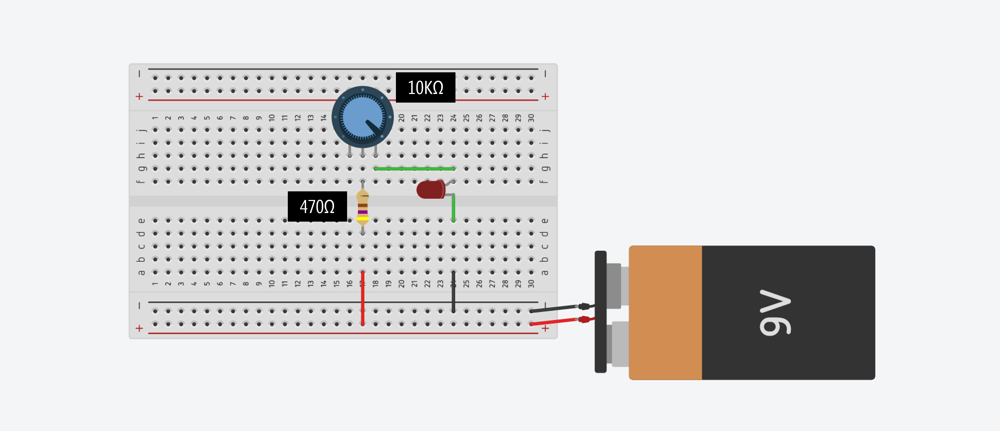
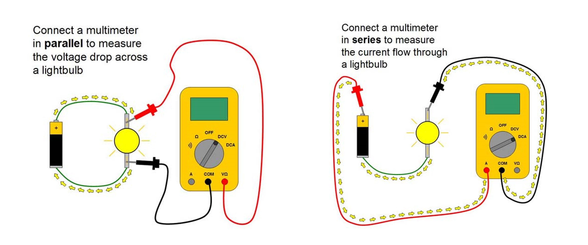
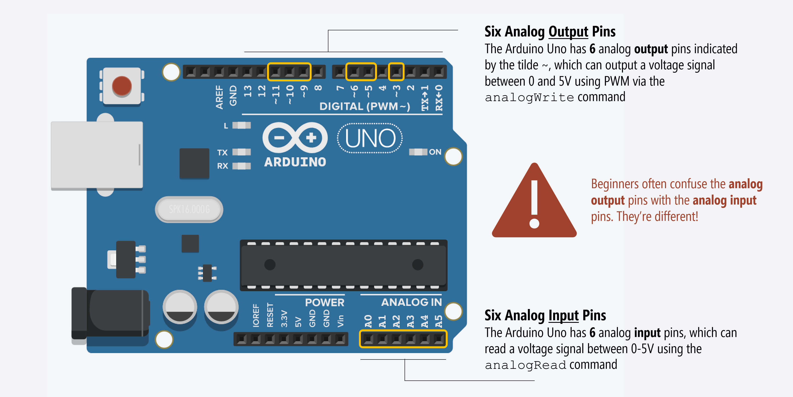

# {{ page.title | replace_first:'L','Lesson '}}
{: .no_toc }

## Table of Contents
{: .no_toc .text-delta }

1. TOC
{:toc}
---

In this lesson, we'll refresh our memories about potentiometers, learn a bit about multimeters, and then introduce the concept of **analog input** and hook-up potentiometers as voltage dividers to Arduino! Similar to the [buttons lesson](buttons.md), we are going to use potentiometers on their own before learning how to use them with microcontrollers.

<iframe width="736" height="414" src="https://www.youtube.com/embed/MJt9kSNlsU4" frameborder="0" allow="accelerometer; autoplay; encrypted-media; gyroscope; picture-in-picture" allowfullscreen></iframe>

A [video](https://youtu.be/MJt9kSNlsU4) demonstration of a [trimpot](https://www.adafruit.com/product/356) hooked up to analog input A0 on the Arduino. The A0 value is graphed on an OLED display in real-time. The code is available [here](https://github.com/makeabilitylab/arduino/blob/master/OLED/AnalogGraphScrolling/AnalogGraphScrolling.ino).
{: .fs-1 }

## Potentiometers: a refresher

In our [Intro to Electronics](../electronics/index.md) lessons, we learned about [potentiometers](../electronics/variable-resistors.md). Recall that a potentiometer (or pot) is a three-terminal resistor with a sliding or rotating contact that can be used to dynamically vary resistance.

<video autoplay loop muted playsinline style="margin:0px">
  <source src="../electronics/assets/videos/Potentiometer_Overview_ByJonFroehlich.mp4" type="video/mp4" />
</video>
**Video.** This animation shows how the wiper can be used to vary resistance in a rotary potentiometer. The figure on the right is the formal electrical symbol. Animation by Jon Froehlich. Created in PowerPoint.
{: .fs-1 }

Potentiometers are common electronic components found in everything from volume controls to analog joysticks. In our UW courses, we often provide 10kΩ potentiometers in our kits like the [10K panel mount potentiometer](https://www.adafruit.com/product/562) and [10K trim potentiometer](https://www.sparkfun.com/products/9806), shown below.

**Figure.** Two example potentiometers commonly included in our hardware kits: a 10kΩ panel mount and and a 10kΩ trim potentiometer.
{: .fs-1 }

### How does a potentiometer work

Potentiometers have three legs: the resistance between the outer two legs (Leg 1 and Leg 3) will not vary. For example, if you are using a 10kΩ potentiometer, then the resistance between Legs 1 and 3 will **always be 10kΩ** regardless of wiper position (Leg 2). If you're using a 1kΩ resistor, then the resistance between Legs 1 and 3 will be 1kΩ, and so on.

The power of a potentiometer is in that middle leg (Leg 2) whose resistance varies depending on the potentiometer's sliding or rotating contact (the wiper) position. It may help to think of a potentiometer as containing two interdependent resistors $$R_1$$ and $$R_2$$ that always sum to $$R_{Total}$$ (where $$R_{Total}$$ is the potentiometer's total value like 1kΩ or 10kΩ). As you move the slider contact, $$R_1$$'s resistance will increase as $$R_2$$'s resistance decreases. See animation below.

<!-- As you move the wiper, the resistance across Legs 1 and 2 ($$R_{1}$$) and Legs 2 and 3 ($$R_{2}$$) proportionally change but always sum to $$R_{total}$$. -->

<video autoplay loop muted playsinline style="margin:0px">
  <source src="../electronics/assets/videos/PotentiometerIntroduction_TrimmedAndCropped.mp4" type="video/mp4" />
</video>
**Video.** Animation by Jon Froehlich. Created in PowerPoint.
{: .fs-1 }

### Potentiomers as variable resistors vs. voltage dividers

There are two common ways to use a potentiometer: as a variable resistor or rheostat—where you only hook up two legs (the wiper leg and an outer leg)—and as a voltage divider. The latter is how we'll use potentiometers as input to our microcontrollers.

<!-- To use these two-leg variable resistors with a microcontroller, we will need to add an additional fixed resistor to create a voltage divider. We'll show you how to do that in our [next lesson](force-sensitive-resistors.md). -->

Below, we are going to focus on using a potentiometer first as a two-legged variable resistor and then as a voltage divider with our Arduino.

## Materials

Let's start building with the potentiometer! We'll need the following materials:

| Breadboard | Arduino | LED | Resistor | Trimpot |
|:-----:|:-----:|:-----:|:-----:|:-----:|
|  |  |  |  |  |
| Breadboard | Arduino Uno, Leonardo, or similar  | Red LED | 220Ω Resistor | 10kΩ Trimpot |

## Making an LED dimmer with a potentiometer

For our first making activity, we're going to create a potentiometer-based LED dimmer. We won't yet be using an Arduino. This will be a pure electrical circuit (no microcontrollers for a bit!).

### A Tinkercad prototype

Let's build a prototype in [Tinkercad Circuits](https://www.tinkercad.com/) before building a physical prototype. While similar to the activity in [Variable Resistors](../electronics/variable-resistors.md), we add in uses of Tinkercad's multimeter to check our circuits and also emphasize correct and incorrect hookups. Moreover, doing this activity before the Arduino-based one will help reinforce differences between using a potentiometer simply as a two-legged variable resistor and as a three-legged voltage divider.

#### Step 1: Build the potentiomer-based LED dimmer

First, let's build the potentiometer-based LED dimmer. In Tinkercad, you could make your dimmer with or without a breadboard (both are shown in the figure below). Let's prototype something we would actually make in real life, so go with the breadboarded version:

You can access these Tinkercad circuits [here](https://www.tinkercad.com/things/f4mL9xm0C7z) (no breadboard) and [here](https://www.tinkercad.com/things/2CTd0LQTHRk) (with breadboard).
{: .fs-1 }

---

**IMPORTANT NOTE:** Recall that it's important to include that additional resistor because many potentiometers, including those provided in your hardware kits, go all the way down to 0Ω. If you don't have that "backup" current-limiting resistor, you will blow your LED if the potentiometer dial is set to 0Ω. (Indeed, try it out in Tinkercad and see what happens—kablooey!)

---

Here's one possible wiring for a potentiometer-based LED fading circuit:

#### Step 2: Now simulate your circuit

Once you're done, try simulating your circuit. Click the "Start Simulation" button (see animation below):

In the circuit above, we hooked up legs 2 and 3 of the potentiometer. What happens if you, instead, hook up legs 1 and 3 or 1 and 2? Try it!

### Add ammeter to Tinkercad prototype

To help us observe the effect of the potentiometer's wiper position on the total current in our circuit, we can use Tinkercad's multimeter tool. A multimeter can be used for a variety of circuit measurements, including measuring resistance (ohmeter), current (ammeter), voltage (voltmeter), and testing for short circuits (continuity testing).

#### How to measure current with a multimeter

Voltmeter's **measure voltage** in **parallel**. Ammeter's **measure current** in **series** (ammeter comes from Amperage meter). See the wiring diagram below. 

Image from this great ["Science Buddies" tutorial](https://www.sciencebuddies.org/science-fair-projects/references/how-to-use-a-multimeter#usingamultimeter) on using multimeters.
{: .fs-1 } 

To help us think about and remember how to measure current, I like to return to [our water analogies](../electronics/electricity-basics.md) from our [Intro to Electronics](../electronics/index.md) lessons: think of the ammeter as if it's a mechanical water flow meter (aka a turbine) that must be in-line within a pipe to measure water flow. An ammeter must be "in line" to measure current—you must rewire your circuit such that current is forced through your ammeter (just like water flowing through a turbine in a pipe).

Image adapted from ["Science Buddies"](https://www.sciencebuddies.org/science-fair-projects/references/how-to-use-a-multimeter#usingamultimeter).
{: .fs-1 }

#### Updated Tinkercad circuit with ammeter

Because there is only one path for the current to flow in this circuit (no branches), we could hook up the ammeter at any in-series location—for example, in between the potentiometer and LED or the resistor and potentiometer. I just selected a position that I found convenient.

Note: when you drag over a multimeter, make sure you click on it and change the mode to ammeter to measure current (select Amperage).

#### Tinkercad simulation with ammeter

Here's our circuit with the ammeter running in the simulator. Does the simulation match your expectations? 

Because we have Leg 2 hooked to the positive voltage source and Leg 3 as our "output", as we move the wiper from left-to-right, there is a smaller amount of resistance and an increase in current. You'll notice a jump in current when the $$V_f$$ condition of the LED is met (recall the [LED IV curves](../electronics/leds.md#the-iv-graph-for-leds) from our [LED lesson](../electronics/leds.md).

<!-- TODO insert animation from Tinkercad with voltage drop across LED showing IV curve -->

Before moving on, play around with the multimeter in Tinkercad. You can add multiple voltmeters and ammeters to your Tinkercad circuits, which is a handy way to learn how voltages and currents are working, verify Ohm's Law, and double check your mental model of a circuit before expending effort actually building it.

#### Circuit simulation in CircuitJS

We also made this circuit in  [CircuitJS](https://www.falstad.com/circuit/circuitjs.html), which offers a far more powerful and feature-rich simulation compared with Tinkercad but is still relatively accessible to novices. We like it because it shows an illustrative animation of current (just like some of the animations from our previous lessons that we've manually made).

There are two differences in this circuit compared to the Tinkercad one above. First, we used a 1kΩ potentiometer rather than a 10kΩ but the general effect is the same. Second, here we have Leg 1 hooked up towards the positive voltage source and Leg 2 as our "output", so resistance is minimized when the dial is all the way left (it was the opposite for our Tinkercad circuit).

<iframe width="736" height="414" src="https://www.youtube.com/embed/F92_-MOqzM4" frameborder="0" allow="accelerometer; autoplay; encrypted-media; gyroscope; picture-in-picture" allowfullscreen></iframe>

### Let's build it for real

OK, let's build this thing for real with our hardware parts.

Because not all of us have access to a 9V battery + snap connector (or alligator clips) to easily interface with our breadboards, we can again use our Arduino for a power source (just like we did in our very first Arduino lesson: [LED On](led-on.md)).

Given that the Arduino supplies 5V rather than 9V, we can replace our 470Ω resistor with a smaller resistor like a 220Ω (but you can certainly use a 470Ω or 680Ω if you'd like—remember, this is a backup resistor for when the potentiometer's wiper resistance goes to 0Ω).

You can play with this Tinkercad circuit [here](https://www.tinkercad.com/things/cDMY5BmSacm).
{: .fs-1 }

#### Workbench video of my trimpot dimmer

Here's a workbench video of my trimpot circuit where the potentiometer is simply a two-legged variable resistor and we're using the Arduino only as a 5V voltage source:

<!--  -->

<iframe width="736" height="414" src="https://www.youtube.com/embed/3LoxVFlc4r4" frameborder="0" allow="accelerometer; autoplay; encrypted-media; gyroscope; picture-in-picture" allowfullscreen></iframe>

Whew, we did it! 

By now, you should feel pretty confident with using a potentiometer as a variable resistor; however, using potentiometers (or any variable resistor) with a microcontroller requires a different circuit configuration as you'll see below.

## Intro to analog input

In our previous lessons, we learned about [**digital output**](led-blink.md), then [**analog output**](led-fade.md), and finally [**digital input**](buttons.md). Now, it's time for the last frontier: **analog input**!

So, what's analog input?! The world—in all its beauty and complexity—is analog. It's not simply `HIGH` and `LOW` but everything in between. How can we sense and access that complexity?

Analog input!

More formally, just like **analog output** enabled us to write out voltages between 0V and 5V, analog input enables us to read voltages between 0V and 5V. How does this work? Via an [ADC](https://en.wikipedia.org/wiki/Analog-to-digital_converter).

<!-- TODO: The arduino.cc docs mention adding a short delay before using analogReads on successive pins: https://www.arduino.cc/en/Tutorial/AnalogInputPins. Add this? Here's the full quote: "The ATmega datasheet also cautions against switching analog pins in close temporal proximity to making A/D readings (analogRead) on other analog pins. This can cause electrical noise and introduce jitter in the analog system. It may be desirable, after manipulating analog pins (in digital mode), to add a short delay before using analogRead() to read other analog pins." -->

### Analog input pins

The Arduino Uno and Leonardo have six analog inputs, which can be read using [`analogRead(int pin)`](https://www.arduino.cc/reference/en/language/functions/analog-io/analogread/). The `analogRead` function reads voltage values between 0 and the Arduino's operating voltage (5V on the Uno and Leonardo) and converts this into integer values between 0 and 1023.

While the digital I/O pins on the Arduino microcontroller are shared. The **analog input** pins are different from the **analog output** pins.

### How does the Arduino read analog input?

Remember how we said that Arduino input pins work like voltmeters? Just as voltmeters measure voltage in parallel—you connect the probes to two nodes in your circuit and the voltmeter measures the voltage difference between them—microcontrollers work similarly. Of course, microcontrollers have a single pin per input while voltmeters have two. Why the difference? Well, with voltmeters, you provide two reference points. With microcontrollers, the voltage at an input pin is always compared to `GND` (so, that second "probe point" is always ground).

It's important that you conceptually understand that microcontrollers work by measuring voltages and not current. In fact, the [ATmega328 datasheet](http://ww1.microchip.com/downloads/en/DeviceDoc/ATmega48A-PA-88A-PA-168A-PA-328-P-DS-DS40002061A.pdf) says analog input pins have an effective resistance of 100,000,000Ω (100MΩ), which means almost **no current** goes into an input pin (see Table 29.8).

This means that we have to configure our variable resistor sensors as **voltage dividers** to work with microcontrollers.

### Analog-to-digital converter (ADC)

The Arduino's microcontroller contains an analog-to-digital converter (ADC), which converts analog voltage signals to computational bits that can be processed by a computer. On the Arduino and Leonardo, the ADC is 10 bits. So, it converts voltages between 0 and $$V_{cc}$$ (5V) to a $$0 - 2^{10}$$ range (0-1023). Thus, the resolution between readings is 5V / 1024 or 0.0049 volts (4.9 mV).

Why does this matter?

For many purposes, it probably doesn't. But the practical implication is that with a 0.0049V resolution, you won't be able to tell the difference between, for example, 2.0140V and 2.0152V (both which would convert to 411) or 4.9148V and 4.9190V (both which would be read as 1003). Does this matter? It depends on the context—for most things we do, it won't. We discuss quantization in more depth in the [Sensors](../sensors/index.md) and [Signals](../signals/index.md) sections.

#### Changing the HIGH reference voltage

If you want to improve the ADC resolution, you have two choices: (1) up the bitrate, which would require different hardware (you can use an external ADC like this 12-bit [ADS1015](https://www.adafruit.com/product/1083)) or (2) decrease the convertible voltage range (so, applying the same 10-bits across a smaller voltage range).

It's possible to do the latter on the Arduino. You can change the `HIGH` reference voltage from $$V_{cc}$$ (which is 5V on the Uno and Leonardo) to a different value between 1.0V to $$V_{cc}$$ using [analogReference()](https://www.arduino.cc/reference/en/language/functions/analog-io/analogreference/). The `LOW` reference voltage is fixed to $$GND$$.

Changing the reference voltage may be useful if you know your max analog input value is less than $$V_{cc}$$ because you will increase your ADC precision.

On the Uno and Leonardo, the options are:
- **DEFAULT**: the default analog reference of 5V (on 5V boards) or 3.3V (on 3.3V boards)
- **INTERNAL**: a built-in reference equal to 1.1V on the ATmega328
- **EXTERNAL**: the voltage applied to the AREF pin (between 1.0V-5V)

#### How does the ADC actually work?

But wait, you might wonder, how does the actual conversion from analog-to-digital work? This question is beyond the scope of our class (and even our own knowledge); however, from our research, we found that the ATmega328 uses a successive approximation ADC, which converts continuous analog signals via a binary search through all possible quantization levels before converging on a digital output for each conversion ([Wikipedia](https://en.wikipedia.org/wiki/Successive_approximation_ADC)). According to the ATmega328 datasheet, "the successive approximation circuity requires an input clock frequency between 50 kHz and 200kHz to get maximum resolution. If a lower resolution than 10 bits is needed, the input clock frequency to the ADC can be higher than 200 kHz to get a higher sample rate." See this [EE StackExchange discussion](https://electronics.stackexchange.com/questions/97606/analog-digital-conversion-clock-prescaling-atmega328p).

<!-- TODO: even more interesting discussions about how for one ADC clock period, the ADC has to charge a capacitor that it uses to measure voltage on the input pin. See: https://www.avrfreaks.net/forum/minumum-current-required-analog-pin-atmega328 -->

## Hooking up variable resistors with microcontrollers

Just like with our [button](buttons.md) lesson, let's walk through how one might try to hook up a potentiometer with a microcontroller. As before, we'll learn about what **not** to do and **why** as well as **what to do.**

### Simple program to read analog input

Let's first introduce a simple program to read and print analog input values to Serial. This will provide a convenient way to test our input circuits.


void setup()
{
  Serial.begin(9600); // for printing values to console
}

void loop()
{
  int potVal = analogRead(A0); // returns 0 - 1023 (due to 10 bit ADC)
  Serial.println(potVal);      // print value to Serial
  delay(50);                   // Reading new values at ~20Hz
}


### Building an initial circuit

Let's build an initial circuit in Tinkercad—first, the wrong way. And then we'll fix it and show how to do it the right way.

#### Incorrect potentiometer-based analog input circuit

To begin, you might treat the potentiometer similar to how we did with our LED circuits above—as a rheostat where we only use two legs (an outer leg and Leg 2). However, this won't work. Build and try these configurations yourself. Make sure to add the above code to the "Code" window in Tinkercad and then hit the "Simulation" button.

To try these incorrect circuits on Tinkercad, go [here](https://www.tinkercad.com/things/cvIBIowVyxG) and [here](https://www.tinkercad.com/things/fQOFEwZKUg6).
{: .fs-1 }

Why don't these work?

Because, remember, our input pins measure **voltage** and there is no voltage difference across our potentiometer (because no current is flowing!). Here's an illustrative video of what's happening (and not happening) in our circuit:

<iframe width="736" height="414" src="https://www.youtube.com/embed/gp379BG-aeE" frameborder="0" allow="accelerometer; autoplay; encrypted-media; gyroscope; picture-in-picture" allowfullscreen></iframe>
This is a circuit simulation of Leg 1 of the potentiometer hooked to 5V and Leg 2 (wiper leg) hooked to A0. The "inside the microcontroller" view is for illustrative purposes. The input pin circuitry does not actually look like this. Simulation made in [CircuitJS](https://www.falstad.com/circuit/circuitjs.html).
{: .fs-1 }

Notice how the analog input voltage $$V_{A0}$$ to the microcontroller is always 5V? And, indeed, if you play with the Tinkercad circuits above, you'll note that the Serial console simply prints `1023` continuously (which translates to 5V).

#### Correct potentiometer-based analog input circuit: voltage divider

So, what do we do? We hook up all three potentiometer legs to form a voltage divider: Leg 1 to $$V_{CC}$$ and Leg 2 to $$A0$$ but we'll also wire Leg 3 to $$GND$$. This will create a voltage difference across the potentiometer and cause current to flow from $$V_{CC}$$ to $$GND$$ (and a voltage divider network to emerge):

Try this circuit+code out on [Tinkercad](https://www.tinkercad.com/things/7K7OLIUWCdj).
{: .fs-1 }

Now $$V_{A0}=V_{CC} \cdot \frac{R_2}{R_1 + R_2}$$.

And here's an illustrative video of what's happening in our circuit:

<iframe width="736" height="414"  src="https://www.youtube.com/embed/rJr4TgoFZ2Q" frameborder="0" allow="accelerometer; autoplay; encrypted-media; gyroscope; picture-in-picture" allowfullscreen></iframe>
This is a circuit simulation of the potentiometer correctly hooked up to a microcontroller with Leg 1 hooked to 5V, Leg 2 (wiper leg) hooked to analog input A0, and Leg 3 to GND. The "inside the microcontroller" view is for illustrative purposes. The input pin circuitry does not actually look like this. Simulation made in [CircuitJS](https://www.falstad.com/circuit/circuitjs.html).
{: .fs-1 }

### Build it for real

Once you get the potentiometer-based analog input working in Tinkercad, build the physical circuit and, to begin, copy the code from above.

For your prototyping journals, we'd also like you to make a version that reads in the analog input (using `analogRead`) and appropriately sets the brightness of an LED (using `analogWrite`).

<!-- TODO: now adapt to change LED brightness. Use LED built-in -->

<!-- ## Exercises

Here are some exercises to try.

- Try to use the slide potentiometer (also in your kits)
- Hook up an external LED that fades based on analog input
- Hook up the piezo buzzer to make sound based on analog input -->

<!-- ## Resources

UIUC Analog Input: https://courses.engr.illinois.edu/ece110/sp2021/content/labs/Modules/M005_ArduinoAnalogInputs.pdf 

TODO: add more resources
-->

## Next Lesson

In the next lesson, we'll learn how to add a fixed resistor to a two-leg variable resistor like a force-sensitive resistor or photocell to create a voltage divider that can be read by a microcontroller.

[Previous: Make a simple piano](piano.md){: .btn .btn-outline }
[Next: Using force-sensitive resistors](force-sensitive-resistors.md){: .btn .btn-outline }
