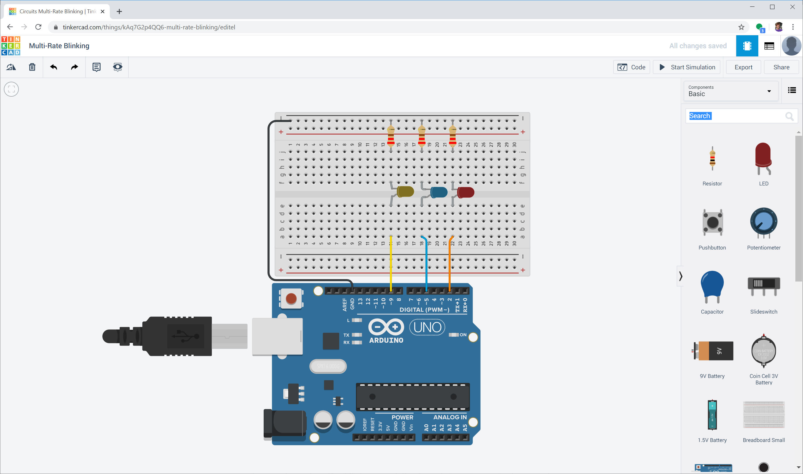
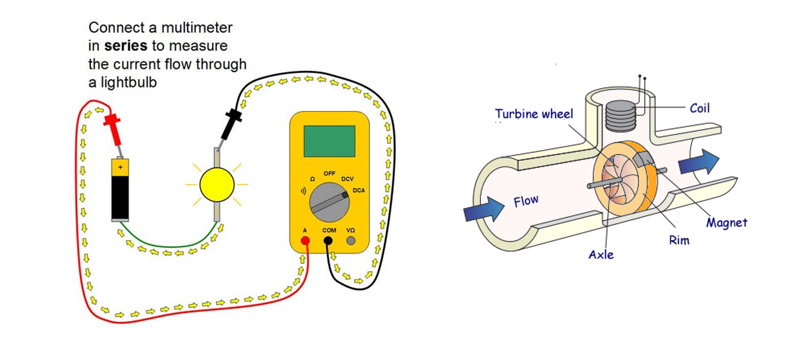
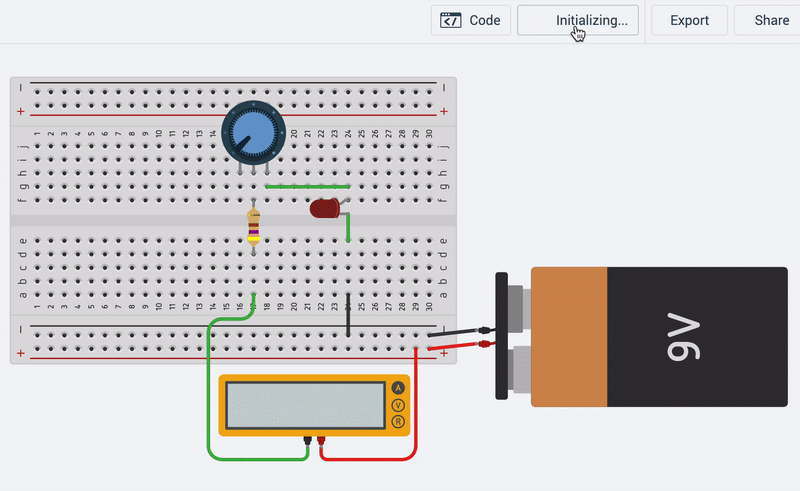

# {{ page.title | replace_first:'L','Lesson '}}
{: .no_toc }

## Table of Contents
{: .no_toc .text-delta }

1. TOC
{:toc}
---

In this lesson, we'll learn about potentiometers, analog input, voltage dividers, and, as a bonus, multimeters too! Similar to the [buttons lesson](buttons.md), we are going to use potentiometers on their own before learning how to use them with microcontrollers.

## Potentiometers

A [potentiometer](https://en.wikipedia.org/wiki/Potentiometer) (or pot) is a three-terminal resistor with a sliding or rotating contact that can be used to dynamically vary resistance. 

Potentiometers are truly ubiquitous electronic components found in everything from volume controls to analog joysticks.

Let's look at the same animation as before but this time with the resistance values emphasized:

<iframe width="736" height="414" src="https://www.youtube.com/embed/QPVuZbW9Nsg" frameborder="0" allow="accelerometer; autoplay; encrypted-media; gyroscope; picture-in-picture" allowfullscreen></iframe>

Notice how the resistance across the two outer legs never changes. This is the total potentiometer resistance. Let's call this $$R_{1-3}$$. In our UW courses, we often provide 10KΩ potentiometers in our kits (like [this one](https://www.adafruit.com/product/356) from Adafruit), so $$R_{1-3}=10KΩ$$. 

As you move the wiper, the resistance across legs 1 and 2 $$R_{1-2}$$ and 2 and 3 $$R_{2-3}$$ proportionally change and always sum to $$R_{1-3}$$. Again, regardless of wiper position, $$R_{1-3}$$ is equal to the potentiometer's total resistance (in this case, 10KΩ). 

Jeff Feddersen, from NYU's ITP program, has a great video about potentiometers and nicely relates them to Ohm's Law and voltage dividers. Please watch this video before continuing.

<iframe src="https://player.vimeo.com/video/76442431" style="position:absolute;top:0;left:0;width:100%;height:100%;" frameborder="0" allow="autoplay; fullscreen" allowfullscreen></iframe>

<a href="https://vimeo.com/76442431">Ohm Part 2</a> from <a href="https://vimeo.com/fddrsn">Jeff Feddersen</a> on <a href="https://vimeo.com">Vimeo</a>.

{: .fs-1 }

<!-- TODO: talk about different taper types? -->

We're going to start with using only **two legs** of the potentiometer (as **rheostats**). When we use potentiometers with microcontrollers, however, we will use them as voltage dividers, which requires all three legs.

### Variable resistors

When only two terminals (or legs) of the potentiometer are used—an outer leg and the wiper (or signal) leg—the potentiometer acts as **rheostat** or a two-terminal **variable resistor**. 

Many common **sensors** are variable resistors—they dynamically change their resistance in response to some human or environmental input. For example, thermistors change their resistance based on temperature, photocells based on light, force-sensitive resistors (FSRs) based on force. You have both photocells and FSRs in your hardware kits!

<!-- TODO: Where to bring in circuit theory here? -->

## Making an LED dimmer with a potentiometer

For our first making activity, we're going to create a potentiometer-based LED dimmer. We won't yet be using an Arduino. This will be a pure electrical circuit.

### A Tinkercad prototype

Let's build a prototype in [Tinkercad Circuits](https://www.tinkercad.com/) before building a physical prototype. Tinkercad makes it easy to rapidly prototype, build, and simulate circuits in a software environment. And, for those that do not have access to electronic tools, Tinkercad also provides a simple multimeter and oscilloscope—so we can test and measure our circuits too!

In Tinkercad, you could make your dimmer with or without a breadboard. Let's prototype something we would actually make in real life, so go with the breadboarded version:

You can access these Tinkercad circuits [here](https://www.tinkercad.com/things/f4mL9xm0C7z) (no breadboard) and [here](https://www.tinkercad.com/things/2CTd0LQTHRk) (with breadboard).
{: .fs-1 }

#### Step 1: Open Tinkercad Circuits

Visit [tinkercad.com](https://www.tinkercad.com/) and login (if you already have an Autodesk account) or register if not. We are not using any of the "In School?" features, so create a personal account:

#### Step 2: Create a new circuit

In your dashboard, click on "Circuits":

Then click on "Create new Circuit":

#### Step 3: Aquaint yourself with the UI

Tinkercad works by dragging and dropping components from the right sidebar menu onto the Circuit canvas. You can click on the "Start Simulation" button to simulate circuits (and even Arduino code + circuits). If you've dragged over an Arduino, you can also click on the "Code" button and write code either in `C/C++` or in a visual, block-based language.

#### Step 4: Build the potentiomer-based LED dimmer

Now, build the potentiometer-based LED dimmer. It's important to include that additional resistor because many potentiometers, including those provided in your hardware kits, go all the way down to 0Ω. If you don't have that "backup" current-limiting resistor, you will blow your LED.

#### Step 5: Now simulate your circuit

Once you're done, try simulating your circuit:

In the circuit above, we hooked up legs 2 and 3 of the potentiometer. What happens if you, instead, hook up legs 1 and 3 or 1 and 2? Try it!

### Add ammeter to Tinkercad prototype

To help us observe the effect of the potentiometer's wiper position on the total current in our circuit, we can use Tinkercad's multimeter tool. A multimeter can be used for a variety of circuit measurements, including to measure resistance (ohmeter), current (ammeter), voltage (voltmeter), and to test for short circuits (continuity testing).

#### How to measure current with a multimeter

While we measure voltage in parallel, we measure current in series: 

To help us think about and remember how to measure current, I like to return to our water analogy and think of the ammeter as if it is a mechanical water flow meter (aka a turbine) that must be in-line within a pipe to measure water flow.

#### Updated Tinkercad circuit with ammeter

So, here are updated versions of our circuits with ammeters attached. Because there is only one path for the current to flow in this circuit (no branches), we could hook up the ammeter at in-series any location. I just selected a position that I found convenient.

Note: when you drag over a multimeter, make sure you click on it and change the mode to ammeter.

#### Tinkercad simulation with ammeter

Here's our circuit with the ammeter running in the simulator:

### Let's build it for real

Because not all of you have access to a 9V battery + snap connector to easily interface with your breadboard, we can again use our Arduino for a power source (just like we did in our very first lesson: [LED On](led-on.md)).

Given that the Arduino supplies 5V rather than 9V, we can replace our 470Ω resistor with a 220Ω.

You can play with this Tinkercad circuit [here](https://www.tinkercad.com/things/cDMY5BmSacm).
{: .fs-1 }

### Workbench video of my trimpot dimmer

Here's an animated gif of my trimpot circuit:

### Replace trimpot with FSR and photocell

As long as we have this circuit, let's have a bit of fun: try replacing the trimpot with the force-sensitive resistor:

<iframe width="736" height="414" src="https://www.youtube.com/embed/YMCqDcnwMYo" frameborder="0" allow="accelerometer; autoplay; encrypted-media; gyroscope; picture-in-picture" allowfullscreen></iframe>
The same circuit as before but replace the trimpot with a force-sensitive resistor.
{: .fs-1 }

Or the photocell:

<iframe width="736" height="414" src="https://www.youtube.com/embed/Y0GOsocDCGU" frameborder="0" allow="accelerometer; autoplay; encrypted-media; gyroscope; picture-in-picture" allowfullscreen></iframe>

### Making your own lo-fi potentiometer

Inspired by Jeff's video, I made my own potentiometer using paper, a 12B pencil, and, for the wiper, cardboard and a paper clip. You could try something similar. Note: in this video, only two terminals (or legs) of the potentiometer are used: an outer leg and the wiper (or signal) leg. In this configuration, the potentiometer acts as **rheostat** or a two-terminal variable resistor. You should try something like this too!

<iframe width="736" height="414" src="https://www.youtube.com/embed/NRlJbuj5jr4" frameborder="0" allow="accelerometer; autoplay; encrypted-media; gyroscope; picture-in-picture" allowfullscreen></iframe>

## Outline
- Use trimpot on own to change brightness of LED
- Just focus on trimpot or also slide potentiometer (could close with that?)?