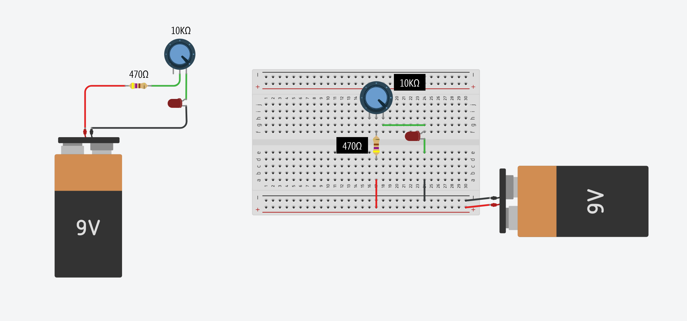

# {{ page.title | replace_first:'L','Lesson '}}
{: .no_toc }

## Table of Contents
{: .no_toc .text-delta }

1. TOC
{:toc}
---

A [potentiometer](https://en.wikipedia.org/wiki/Potentiometer) (or pot) is a three-terminal resistor with a sliding or rotating contact that can be used to dynamically vary resistance. They are truly ubiquitous electronic components found in everything from volume controls to analog joysticks. 

In this lesson, we'll learn about potentiometers, analog input, and voltage dividers. Similar to the [buttons lesson](buttons.md), we are going to use potentiometers on their own before learning how to use them with microcontrollers.

## Potentiometers

<iframe src="https://player.vimeo.com/video/76442431" style="position:absolute;top:0;left:0;width:100%;height:100%;" frameborder="0" allow="autoplay; fullscreen" allowfullscreen></iframe>

<a href="https://vimeo.com/76442431">Ohm Part 2</a> from <a href="https://vimeo.com/fddrsn">Jeff Feddersen</a> on <a href="https://vimeo.com">Vimeo</a>.

{: .fs-1 }

TODO: different tapers

### Variable resistors

When only two terminals (or legs) of the potentiometer are used—an outer leg and the wiper (or signal) leg—the potentiometer acts as **rheostat** or a two-terminal **variable resistor**. 

There are many types of sensors that change their resistance based on some human input or environmental condition. For example, thermistors change their resistance based on temperature, photocells based on light, force-sensitive resistors based on force.

TODO: insert figure of variable resistors

<!-- TODO: Where to bring in circuit theory here? -->

## Making an LED dimmer with a potentiometer

We're first going to make a potentiometer-based LED dimmer in [Tinkercad Circuits](https://www.tinkercad.com/) before building a physical prototype. Tinkercad makes it easy to rapidly prototype, build, and simulate circuits in a software environment. And, for those that do not have access to electronic tools, Tinkercad also provides a simple multimeter and oscilloscope—so we can test and measure our circuits too!

<!-- TODO: before we make, show and have them play around with Tinkercad and Falstad JS simulator? -->

In Tinkercad, you could make your dimmer with or without a breadboard. Let's prototype something we would actually make in real life, so go with the breadboarded version:

You can access these Tinkercad circuits [here](https://www.tinkercad.com/things/f4mL9xm0C7z) (no breadboard) and [here](https://www.tinkercad.com/things/2CTd0LQTHRk) (with breadboard).
{: .fs-1 }

To help us observe the effect of the potentiometer's wiper position on the total current in our circuit, we can use Tinkercad's multimeter tool (switched to ammeter mode). A multimeter can be used for a variety of circuit measurements, including resistance (ohmeter), current (ammeter), voltage (voltmeter), and to test for short circuits (continuity testing).

While we measure voltage in parallel, we measure current in series. 

TODO: insert figure from slides of how to use a multimeter to measure
TODO: insert turbine figure

I like to return to our water analogy for current and think of the ammeter like a turbine that must be in-line within a pipe to measure water flow.

So, here are updated versions of our circuits with ammeters attached

#### Run the simulator

#### What happens if we connect the two outer legs?

TODO: talk about and show video

### Let's build it for real

Because not all of you have access to a 9V battery + snap connector to easily interface with your breadboard, we can again use our Arduino for a power source (just like we did in our very first lesson: [LED On](led-on.md)).

Given that the Arduino supplies 5V rather than 9V, we can replace our 470Ω resistor with a 220Ω.

You can play with this Tinkercad circuit [here](https://www.tinkercad.com/things/cDMY5BmSacm).
{: .fs-1 }

### Workbench video of my trimpot dimmer

Here's an animated gif of my trimpot circuit:

### Replace trimpot with FSR and photocell

As long as we have this circuit, let's have a bit of fun: try replacing the trimpot with the force-sensitive resistor:

<iframe width="736" height="414" src="https://www.youtube.com/embed/YMCqDcnwMYo" frameborder="0" allow="accelerometer; autoplay; encrypted-media; gyroscope; picture-in-picture" allowfullscreen></iframe>
The same circuit as before but replace the trimpot with a force-sensitive resistor.
{: .fs-1 }

Or the photocell:

<iframe width="736" height="414" src="https://www.youtube.com/embed/Y0GOsocDCGU" frameborder="0" allow="accelerometer; autoplay; encrypted-media; gyroscope; picture-in-picture" allowfullscreen></iframe>

In Tinkercad, need to make breadboard version

### Making your own lo-fi potentiometer

Inspired by Jeff's video, I made my own potentiometer using paper, a 12B pencil, and, for the wiper, cardboard and a paper clip. You could try something similar. Note: in this video, only two terminals (or legs) of the potentiometer are used: an outer leg and the wiper (or signal) leg. In this configuration, the potentiometer acts as **rheostat** or a two-terminal variable resistor. You should try something like this too!

<iframe width="736" height="414" src="https://www.youtube.com/embed/NRlJbuj5jr4" frameborder="0" allow="accelerometer; autoplay; encrypted-media; gyroscope; picture-in-picture" allowfullscreen></iframe>

## Outline
- Use trimpot on own to change brightness of LED
- Just focus on trimpot or also slide potentiometer (could close with that?)?