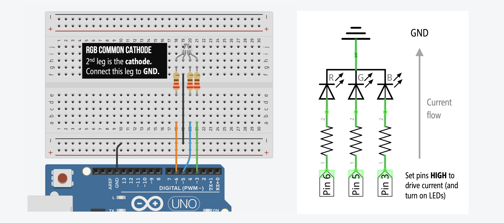

# {{ page.title | replace_first:'L','Lesson '}}
{: .no_toc }

## Table of Contents
{: .no_toc .text-delta }

1. TOC
{:toc}
---

In this lesson, you will learn how to fade between RGB colors and how to use the [HSL colorspace](https://en.wikipedia.org/wiki/HSL_and_HSV) to more easily (and independently) control hue and brightness.

## Materials

You'll need the same materials as the previous [RGB LED lesson](rgb-led.md). Recall that there are **two types** of RGB LEDs: a **common cathode design** and a **common anode design**, so make sure you know which one you have as it will affect the circuit you make and the code you write.

| Breadboard | Arduino | RGB LED | Resistors |
|:-----:|:-----:|:-----:|:-----:|
|  |     |  |  |
| Breadboard | Arduino Uno, Leonardo, or similar  | RGB LED (Either Common Cathode or Common Anode) | **Three** 220Ω Resistors |

## Making the circuit

The circuit is the same as the previous [RGB LED lesson](rgb-led.md). Make sure you follow the appropriate wiring based on wheter you are using a **common cathode** or **common anode** RGB LED.

| RGB Common Cathode Wiring | RGB Common Anode Wiring |
|:-----:|:-----:|
|  |  |

## Writing the code

We are going to explore and implement two different RGB crossfade approaches.

1. First, we will use `for` loops to step through dyadic combinations between red, green, and blue LED colors (note: we limit ourselves to powering **two** RGB LEDs simultaneously because powering all three would result in "white"). 
2. Second, we will use the HSL color space to manipulate **hue**—what colloquially we refer to as *color*—and then convert this to the RGB color space for our `analogWrite` calls. This approach is cleaner and less convoluted but requires using a [separate library](https://github.com/ratkins/RGBConverter) for the HSL-to-RGB conversion.

### Crossfading in RGB color space

The code for crossfading an RGB LED is the most complex that we've covered thus far (and, if you don't have a coding background, it's OK if you don't fully understand it). For those in our engineering courses (like Ubiquitous Computing or Prototyping Interactive Systems), you should read and understand this code.

In short, we have an array `int _rgbLedValues[3]` that stores our `{int red, int green, int blue}` values. We initialize the array to `{255, 0, 0}`—so `red=255`, `green=0`, and `blue=0`—and then use two `for` loops to simultaneously increase one of the color values while decreasing another. We start by **increasing green** and **decreasing red** as controlled by `enum RGB _curFadingUp = GREEN;`) and (`enum RGB _curFadingDown = RED;`). Once we reach our maximum color value `255` for the current `_curFadingUp` color, we select the next color to increase (from `RED` to `GREEN` to `BLUE` then back to `RED`). Similarly, once we reach our minimum color value `0` for `_curFadingDown`, we select the next color to decrease (same order as before: from `RED` to `GREEN` to `BLUE` then back to `RED`).

In total, we crossfade between 765 color combinations (`3*255`) though this can be controlled with `const int FADE_STEP`—the total amount to step up and down the `analogWrite` LED values per loop iteration. It's set to `5` by default.

The code, in full, looks like this:

<!--TODO: add in a p5js that demonstrates how this works? And maybe let's reader play with different color values? -->

## Crossfading in HSL color space

TODO

---
**NOTE:**

The downside of this implementation is that we must use `floats` with the [RGBConverter](https://github.com/ratkins/RGBConverter) library. TODO: expand on why floats can be costly for embedded programming with microcontrollers

---

## TODO: fade between colors
- First with simple for loops
- Then with HSL
- Probably want to move this to some advanced section, so students can move on to input

<!-- Could be fun to write a p5js sketch that shows how the initial RGB LED naive code works and then the HSL version -->