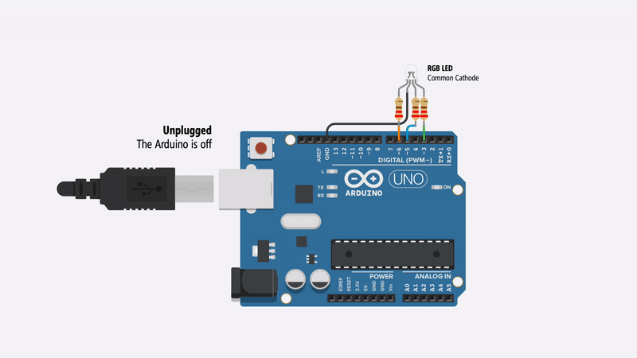
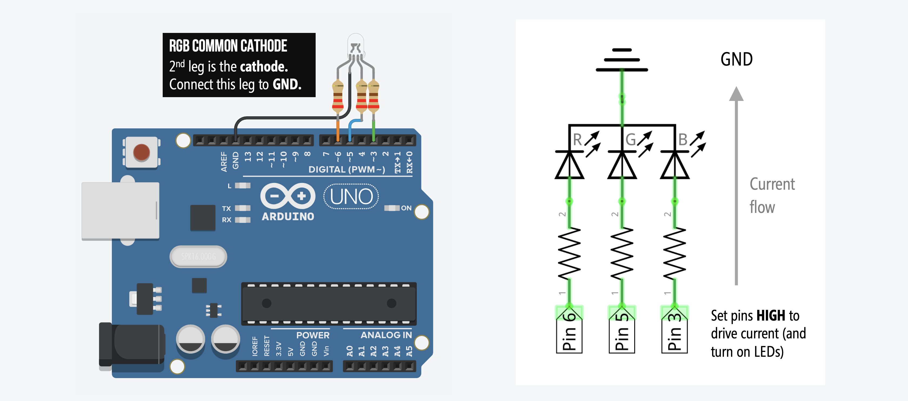
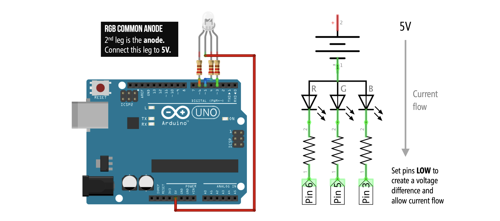
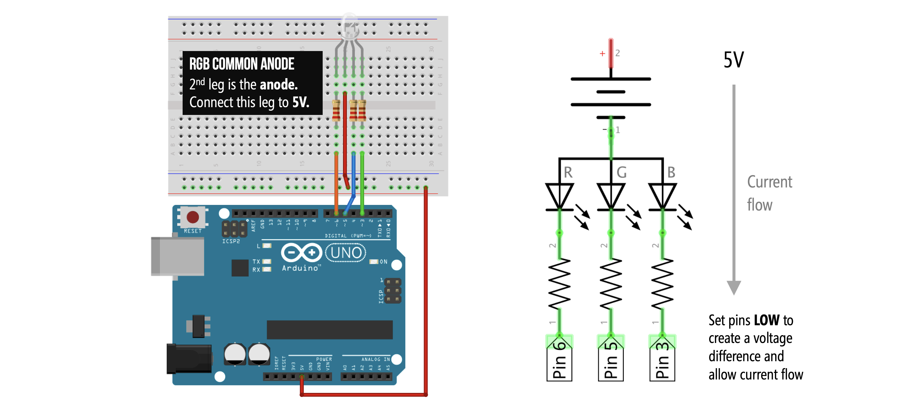

# {{ page.title | replace_first:'L','Lesson '}}
{: .no_toc }

## Table of Contents
{: .no_toc .text-delta }

1. TOC
{:toc}
---

In this tutorial, we will flash through a sequence of colors using an RGB LED (RGB stands for Red, Green, Blue) and learn about the difference between a Common Anode and Common Cathode RGB LED design.

## Materials

You'll need the following materials. Importantly, there are **two types** of RGB LEDs—described below—so make sure you **determine** which type of RGB LED you are using as it will affect how you configure your circuit. But don't worry, we'll walk through both RGB LED types.

| Arduino | RGB LED | Resistor |
|:-----:|:-----:|:-----:|
|     |  |  |
| Arduino Uno, Leonardo, or similar  | RGB LED | **3** 220Ω Resistor |

### Common Anode vs. Common Cathode

While capable of displaying thousands of color combinations, RGB LEDs are actually quite simple; they contain three LEDs in one package: red, green, and blue. Importantly but somewhat confusingly, there are two RGB LED designs—the **Common Anode** and the **Common Cathode**—which differ in the leg shared between the three embedded LEDs.

1. With the **Common Anode**, the three embedded LEDs share the anode leg. To control the RGB LED's color and drive current, you must hook up the anode to the higher voltage source and connect the red, green, and blue legs to lower voltage levels (*e.g.,* ground). 

<!-- For example, with a 5V voltage source connected to the common anode leg, setting the three other legs (red, green, blue) to 5V would, somewhat counterintuively, turn off the LED. In contrast, setting the red leg to 0V, for example, and the other two legs to 5V would turn the RGB LED red. -->

2. In contrast, the **Common Cathode** works much more like a typical LED (and like the red LED from our previous examples). Here, all three embedded LEDs share the cathode leg. So, you drive each individual color leg with a higher voltage source. 

<!-- For example, to turn the Common Cathode RGB LED red, you would set the cathode leg to ground, the red leg to 5V -->

#### How can I tell if I have a Common Anode or Cathode RGB LED?
You **cannot** tell whether you have a Common Anode or Common Cathode RGB LED by visual inspection. Instead, consult the supplier website, the datasheet, or experiment with the LED yourself (remember, diodes only work in one directly so as long as you include your current limiting resistors, you should be fine!).

| Common Anode | Common Cathode |
|:-----:|:-----:|
|  |  |
| A diffused **Common Anode** RGB LED from [Adafruit](https://www.adafruit.com/product/159). It's called diffused because the epoxy casing is scratchy and not perfectly transparent | A clear **Common Cathode** RGB LED from [Sparkfun](https://www.sparkfun.com/products/105). |

Here are two screenshots of supplier websites ([Sparkfun](https://sparkfun.com) and [Adafruit](https://adafruit.com)). Notice how the RGB LED type is clearly labeled.

## Common Cathode

We're going to start with a Common Cathode circuit + code because it's more intuitive (and similar to our red LED tutorials) before covering the Common Anode version.

### Making the circuit

With a Common Cathode design, the 2nd leg needs to be hooked up to the `GND` pin and the 1st (red), 3rd (blue), and 4th (green) legs should connect to digital I/O pins (don't forget a current limiting resistor for each). We could have used any digital I/O pins; however, we chose Pins 6, 5, and 3 for red, blue, and green respectively (these pins support PWM and thus, we'll be able to use the same circuit for our next tutorial on [cross-fading colors with RGB LEDs](rgb-led-fade.md)).

Here's the wiring without a breadboard (not recommended but perhaps easier to see the circuit itself):

And here's the wiring with a breadboard (the schematic on the right is the same either way). Notice how the schematic highlights how the current flows from the I/O pins, through the resistors, into the RGB LED, and then down to ground.

### Writing the code

We are going to write code that flashes through a sequence of colors. Recall that the embedded red LED is hooked up to Pin 6, the blue LED to Pin 5, and the green LED to Pin 3. We will control the RGB LED color by outputting `HIGH` (5V) or `LOW` (0V) using [`digitalWrite` ](https://www.arduino.cc/reference/en/language/functions/digital-io/digitalwrite/) to these pins.

For example, to make the RGB LED turn red, we would write:

digitalWrite(RGB_RED_LED_PIN, HIGH);
digitalWrite(RGB_GREEN_LED_PIN, LOW);
digitalWrite(RGB_BLUE_LED_PIN, LOW);


Similarly, to make the RGB LED turn green, we would write:

digitalWrite(RGB_RED_LED_PIN, LOW);
digitalWrite(RGB_GREEN_LED_PIN, HIGH);
digitalWrite(RGB_BLUE_LED_PIN, LOW);


In this example, we will flash the following sequence:

| Color | Red, Green, Blue Pin Values
|:----|:-----|
| &nbsp;&nbsp; Red | `HIGH`, `LOW`, `LOW` |
| &nbsp;&nbsp; Green | `LOW`, `HIGH`, `LOW` |
| &nbsp;&nbsp; Blue | `LOW`, `LOW`, `HIGH` |
| &nbsp;&nbsp; Purple | `HIGH`, `LOW`, `HIGH` |
| &nbsp;&nbsp; Turqoise | `HIGH`, `LOW`, `HIGH` |
| &nbsp;&nbsp; White | `HIGH`, `HIGH`, `HIGH` |

---

**NOTE:** For those familiar with html, this is very similar to html hexadecimal color codes where red, for example, is specified by #FF0000, green by #00FF00, 
blue by #0000FF, and so on.

---

#### Step 1: Write initialization code

As usual, we introduce some constants for our literal assignments and then setup our pins as `OUTPUT`.


const int DELAY_MS = 1000;       // delay between color changes in ms
const int RGB_RED_LED_PIN = 6;   // indicated by orange wire
const int RGB_BLUE_LED_PIN = 5;  // indicated by blue wire
const int RGB_GREEN_LED_PIN = 3; // indicated by green wire

void setup()
{
  // Set the red, green, and blue RGB LED pins to output
  pinMode(RGB_RED_LED_PIN, OUTPUT);
  pinMode(RGB_BLUE_LED_PIN, OUTPUT);
  pinMode(RGB_GREEN_LED_PIN, OUTPUT);
}


#### Step 2: Write a new helper function called setRgbLedColor

To help set RGB LED colors, we are going to write a new function called `setRgbLedColor(int red, int green, int blue)`, which takes in either a `HIGH` or `LOW` for the red, green, and blue int parameters.


// TODO: put in appropriate code comments
void setRgbLedColor(int red, int green, int blue){
  digitalWrite(RGB_RED_LED_PIN, red);
  digitalWrite(RGB_GREEN_LED_PIN, green);
  digitalWrite(RGB_BLUE_LED_PIN, blue);
}


#### Step 3: Write the color sequence

Now, in `loop()`, we'll write the specific color sequence that we want:


void loop()
{
  // red
  setRgbLedColor(HIGH, LOW, LOW);
  delay(DELAY_MS);
  
  // green
  setRgbLedColor(LOW, HIGH, LOW);
  delay(DELAY_MS);
  
  // blue
  setRgbLedColor(LOW, LOW, HIGH);
  delay(DELAY_MS);
  
  // purple
  setRgbLedColor(255, LOW, HIGH);
  delay(DELAY_MS);
  
  // turqoise
  setRgbLedColor(LOW, HIGH, HIGH);
  delay(DELAY_MS);
  
  // white
  setRgbLedColor(HIGH, HIGH, HIGH);
  delay(DELAY_MS);
}


#### Step 4: Compile, upload, and run

That's it. Now compile, upload, and run your code!

Below, we show a video animation of the code executing and resulting circuit behavior. Pay close attention to the direction of current—it will flow in the opposite direction with the Common Anode design (covered next).

<video controls="controls">
  <source src="assets/movies/Arduino_RGBLED_CommonCathode_Animation.mp4" type="video/mp4">
</video>

## Common Anode

Now, let's work on the Common Anode version. The circuit wiring is almost the exact same as before: the 1st leg (red), 3rd leg (blue), and 4th leg (green) of the RGB LED connect to digital I/O Pins 6, 5, and 3 respectively (along with a current limiting resistor for each); however, the 2nd leg is now a **common anode** and thus, should be connected to 5V (and not `GND` as it was for the common cathode). 

To drive current through our circuit and turn on an embedded LED—say the red LED—we counterintuitively have to set the corresponding LED pin to `LOW` (Pin 6, in this case) and the other LED pins to `HIGH` (Pins 5 and 3). Why? Remember that current always flows from **high potential** to **low potential**. With a Common Anode, the 2nd leg is the anode (high potential or, in this case, 5V) so we must connect the other legs to lower potential to create a voltage difference and allow current to flow. 

---

**Note:**
Does this setup seem familiar? It should. With the Common Anode RGB LED, the digital I/O pins become *current sinks* just like LED Circuit 2 in the [LED Blink 2 tutorial](led-blink2.md).

---

### Making the circuit

As before, here's a circuit wiring diagram without a breadboard (which more cleanly shows connections but would be difficult, in practice, to reliably make):

And here's the more practical breadboarded version (again, the circuit diagram is the same in both the non-breadboard and breadboard version):

### Writing the code

The Common Anode RGB LED works **opposite** to the Common Cathode version—to turn on a particular color, we write out `LOW` rather than `HIGH`. For example, to make the RGB LED turn red, we would write:


digitalWrite(RGB_RED_LED_PIN, LOW);
digitalWrite(RGB_GREEN_LED_PIN, HIGH);
digitalWrite(RGB_BLUE_LED_PIN, HIGH);


Similarly, to make the RGB LED turn green, we would write:

digitalWrite(RGB_RED_LED_PIN, HIGH);
digitalWrite(RGB_GREEN_LED_PIN, LOW);
digitalWrite(RGB_BLUE_LED_PIN, HIGH);


We will flash the same sequence as before but again our `HIGH`s and `LOW`s are flipped:

| Color | Red, Green, Blue Pin Values
|:----|:-----|
| &nbsp;&nbsp; Red | `LOW`, `HIGH`, `HIGH` |
| &nbsp;&nbsp; Green | `HIGH`, `LOW`, `HIGH` |
| &nbsp;&nbsp; Blue | `HIGH`, `HIGH`, `LOW` |
| &nbsp;&nbsp; Purple | `LOW`, `HIGH`, `LOW` |
| &nbsp;&nbsp; Turqoise | `LOW`, `HIGH`, `LOW` |
| &nbsp;&nbsp; White | `LOW`, `LOW`, `LOW` |

Here's an animation. Pay close attention to the current direction—it flows from 5V down through the LED, the current limiting resistors, and into the digital I/O pins.

<video controls="controls">
  <source src="assets/movies/Arduino_RGBLED_CommonAnode_Animation.mp4" type="video/mp4">
</video>

We're not going to include code specifically for the Common Anode RGB LED. Instead, we'll show how to adapt our previous Common Cathode code with only a few additional lines.

## Coding for both Common Cathode and Anode

Because the only difference between the Common Cathode code and the Common Anode code is inverting `HIGH`s and `LOW`s, we can simply update our previous Common Cathode code by adding in a `boolean` to check for which RGB LED version we are using. If a Common Anode then we will invert the `HIGH` and `LOW` signals—see the `setRgbLedColor` function.


const int DELAY_MS = 1000;       // delay between color changes in ms
const int RGB_RED_LED_PIN = 6;   // indicated by orange wire
const int RGB_BLUE_LED_PIN = 5;  // indicated by blue wire
const int RGB_GREEN_LED_PIN = 3; // indicated by green wire
const boolean RGB_COMMON_CATHODE = false;

void setup()
{
  // Set the red, green, and blue RGB LED pins to output
  pinMode(RGB_RED_LED_PIN, OUTPUT);
  pinMode(RGB_BLUE_LED_PIN, OUTPUT);
  pinMode(RGB_GREEN_LED_PIN, OUTPUT);
}

// TODO: put in appropriate code comments
// Set red to HIGH to turn on red, green to HIGH for green, 
// and blue to HIGH for blue (etc.). If you are using a common
// anode RGB LED, make sure to set RGB_COMMON_CATHODE to false
void setRgbLedColor(int red, int green, int blue){
  if(!RGB_COMMON_CATHODE){
    red = !red;
    green = !green;
    blue = !blue;
  }

  digitalWrite(RGB_RED_LED_PIN, red);
  digitalWrite(RGB_GREEN_LED_PIN, green);
  digitalWrite(RGB_BLUE_LED_PIN, blue);
}

void loop()
{
  // red
  setRgbLedColor(HIGH, LOW, LOW);
  delay(DELAY_MS);
  
  // green
  setRgbLedColor(LOW, HIGH, LOW);
  delay(DELAY_MS);
  
  // blue
  setRgbLedColor(LOW, LOW, HIGH);
  delay(DELAY_MS);
  
  // purple
  setRgbLedColor(255, LOW, HIGH);
  delay(DELAY_MS);
  
  // turqoise
  setRgbLedColor(LOW, HIGH, HIGH);
  delay(DELAY_MS);
  
  // white
  setRgbLedColor(HIGH, HIGH, HIGH);
  delay(DELAY_MS);
}


TODO: 
- add in gist link to code in github
- add tinkercad circuit link for common cathode

[Previous: LED Blink 2](led-blink2.md){: .btn .btn-outline }
[Next: Cross-fading RGB LEDs](TODO){: .btn .btn-outline }
