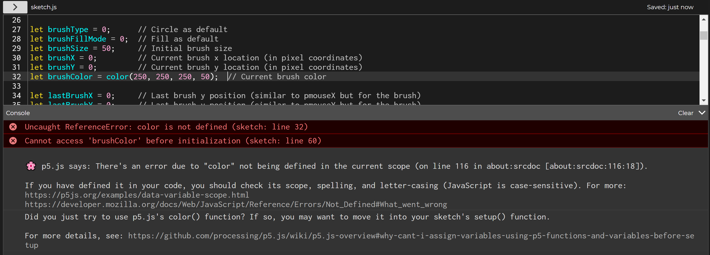
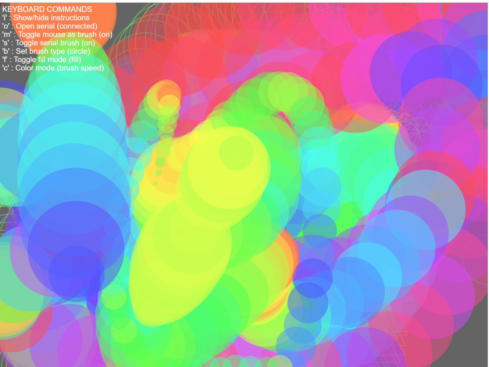
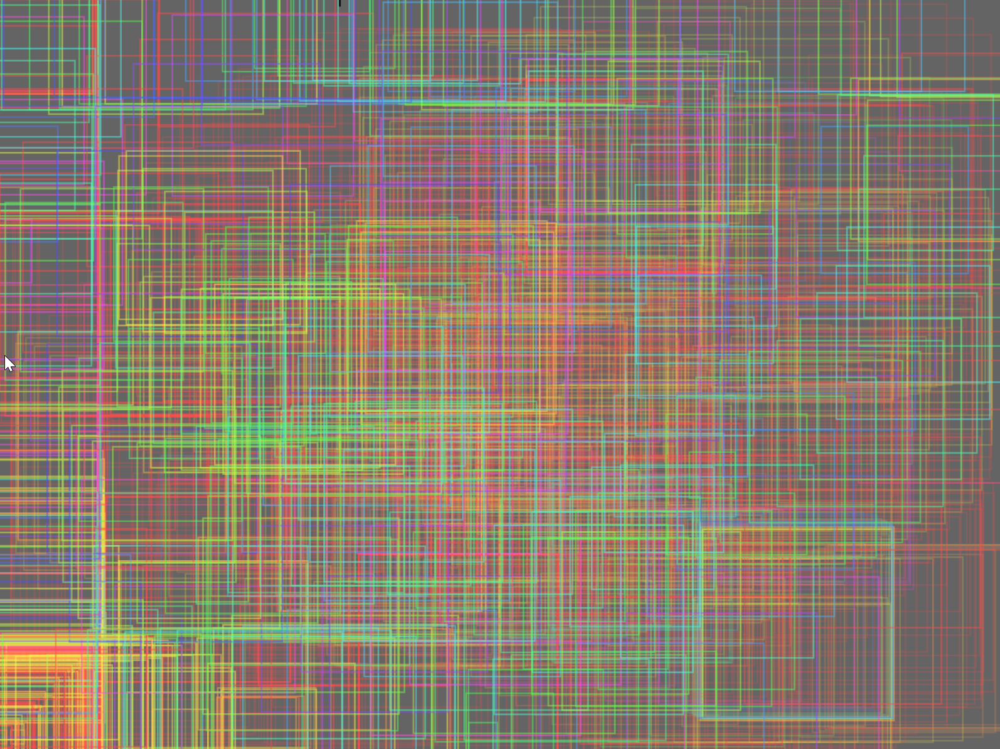

# {{ page.title }}
{: .no_toc }

## Table of Contents
{: .no_toc .text-delta }

1. TOC
{:toc}
---

In the past few lessons, we've learned about [serial communication](serial-intro.md), [web serial](web-serial.md), and using serial to create [p5.js](https://p5js.org/) + Arduino applications ([first lesson](p5js-serial.md), [second lesson](p5js-serial-io.md)). In this lesson, we're going to build on our growing knowledge and existing code to create a full end-to-end p5.js + Arduino application, which we'll call **PaintIO**. PaintIO includes a custom "paintbrush" controller with OLED display that controls and bidirectionally communicates with a custom painting application in p5.js.

<video autoplay loop muted playsinline style="margin:0px">
  <source src="assets/videos/PaintIO2-JustAHeart-TrimmedAndOptimized.mp4" type="video/mp4" />
</video>
**Video.** A quick demonstration of one PaintIO controller using the LIS3DH 3-axis accelerometer to set the paintbrush location, the paintbrush's speed to set the color, the force-sensitive resistor to set the brush size, and three buttons for changing the brush shape, the brush fill *vs.* outline, and for clearing the drawing. The Arduino code is in our GitHub as [PaintIOAccel.ino](https://github.com/makeabilitylab/arduino/blob/master/Serial/PaintIOAccel/PaintIOAccel.ino). The p5.js app is here: [live page](https://makeabilitylab.github.io/p5js/WebSerial/p5js/PaintIO), [code](https://github.com/makeabilitylab/p5js/tree/master/WebSerial/p5js/PaintIO).
{: .fs-1 }

A painting app is a wonderfully fertile Physical Computing example and helps culminate our learning thus far because:
- There are many **different paint properties to control** such as paint brush size, speed, color, shape
- We can **explore** and **play** with different types of **sensors** and **hardware** **input** to control these properties
- Painting is an **openly creative** and **rich practice**—there are very few rules! And our custom hardware-based paintbrush" can directly influence *how* we paint and *what* we paint. From an interaction design perspective, this is exciting and fun!
- Finally, as we've already experienced, making a painting application in p5.js is **fairly easy** (and fun)! But how can we make it even more interesting with Arduino and custom input?

Previously, we created this [simple painting application](https://editor.p5js.org/jonfroehlich/embed/MSGdVYUle) in only ~20 lines of code (impressive). In this painting app, the brush size is changed proportionally via mouse speed, the color is mapped to the mouse's x location, and you can mouse click to switch between fill *vs.* outline. Play with it below!

<iframe width="736" height="400" scrolling="no" src="https://editor.p5js.org/jonfroehlich/embed/MSGdVYUle"></iframe>
**Code.** A simple p5.js painting application in ~20 lines of code. You can view, edit, and play with it [here](https://editor.p5js.org/jonfroehlich/sketches/MSGdVYUle) via the p5.js online editor. In this lesson, we'll extend this example to include [web serial](web-serial.md) and a custom "paintbrush" controller.
{: .fs-1 }

In this lesson, we will build on this example but with a custom "paintbrush" controller and different interaction mappings.

## Paint I/O Design Requirements

First, let's establish some design requirements for Paint I/O. The app should:

- Have **bidirectional communication** between the Arduino and p5.js app. While the Arduino should serve as the primary painting input, we should be able to also change settings in p5.js, which should be immediately reflected on the controller

- At a minimum, the Arduino-based paintbrush controller should control paintbrush's **x,y location**, **size**, **shape**, and **fill mode** (fill vs. outline). These properties should sound familiar—we'll build directly on our previous lessons!

- The paintbrush controller must also include the **OLED** to provide feedback to our painter about the paintbrush.

### Serial communication

Let's specify how we will meet these requirements using serial communication.

#### From Arduino to p5.js

From the Arduino to p5.js, we will transmit a comma-separated string as: `xPosFrac, yPosFrac, sizeFrac, brushType, brushFillMode` where:
- `xPosFrac` is a float between [0, 1] inclusive representing the brush's x position
- `yPosFrac` is a float between [0, 1] inclusive representing the brush's y position
- `sizeFrac` is a float between [0, 1] inclusive representing the brush's size
- `brushType` is either 0, 1, 2 corresponding to CIRCLE, SQUARE, TRIANGLE 
- `brushFillMode` is either 0, 1 corresponding to FILL, OUTLINE

We will also "echo back" received data for debugging purposes. We will prefix these echo backs with `#` as we did in our [previous lesson](p5js-serial-io.md#add-onserialdatareceived-parsing-code) to indicate to the p5.js app that these lines are for debugging. 

#### From p5.js to Arduino

As our app will be bidirectional, we will also communicate information from p5.js to Arduino. For this, we'll build off the [DisplayShapeBidirectionl](p5js-serial-io.md#displayshapebidirectional-p5js-to-arduino-and-arduino-to-p5js) example from the previous lesson and transmit a comma-separated string of `brushType, brushFillMode` where, again:
- `brushType` is either 0, 1, 2 corresponding to CIRCLE, SQUARE, TRIANGLE
- `brushFillMode` is either 0, 1 corresponding to FILL, OUTLINE

## Paint I/O Basic Application

As usual, let's start with a basic prototype and build outwardly. First, let's make a basic drawing p5.js application without any dependency on Arduino.

### Copy SerialTemplate and create initial PaintIO structure

Begin by copying [`SerialTemplate`](https://github.com/makeabilitylab/p5js/tree/master/WebSerial/p5js/SerialTemplate). If you're using VSCode, copy [`SerialTemplate`](https://github.com/makeabilitylab/p5js/tree/master/WebSerial/p5js/SerialTemplate) and rename the folder to `PaintIO`. If you're using the p5.js online editor, simply open this project, [Serial Template](https://editor.p5js.org/jonfroehlich/sketches/vPfUvLze_C), and rename your project to `PaintIO`.

In `sketch.js`, scroll down and remove the following. We will use a different approach to connect to serial.


function mouseClicked() {
  if (!serial.isOpen()) {
    serial.connectAndOpen(null, serialOptions);
  }
}


Also comment out this line of code in `setup()`, which attempts to automatically connect with previously approved serial devices:


// serial.autoConnectAndOpenPreviouslyApprovedPort(serialOptions);


We want to ignore anything serial related for now.

### Add in and initialize painting variables

For the painting code, we will use similar variables and drawing code from [DisplayShapeBidirectional](https://github.com/makeabilitylab/p5js/tree/master/WebSerial/p5js/DisplayShapeBidirectional) in our [previous lesson](p5js-serial-io.md#displayshapebidirectional-p5js-to-arduino-and-arduino-to-p5js). But we'll build this anew.

Add in the following global variables, which include the current `brushType`, `brushSize`, `brushFillMode`, `brushColor`, and brush location (`brushX`, `brushY`). Additionally, rather than paint directly to the canvas, we'll use an off-screen graphics buffer called `offscreenGfxBuffer`—so declare that too. We'll talk more about that next.  


let mapBrushTypeToShapeName = {
  0: "Circle",
  1: "Square",
  2: "Triangle"
};

let mapBrushFillMode = {
  0: "Fill",
  1: "Outline",
};

const MAX_BRUSH_SIZE = 150; // the maximum brush size

let brushType = 0;      // Circle as default
let brushFillMode = 0;  // Fill as default
let brushSize = 50;     // Initial brush size
let brushX = 0;         // Current brush x location (in pixel coordinates)
let brushY = 0;         // Current brush y location (in pixel coordinates)
let brushColor;         // Current brush color
 
let lastBrushX = 0;     // Last brush y position (similar to pmouseX but for the brush)
let lastBrushY = 0;     // Last brush y position (similar to pmouseY but for the brush)

let showInstructions = true; // If true, shows the app instructions on the screen

// We will paint to an offscreen graphics buffer
// See: https://p5js.org/reference/#/p5/createGraphics
let offscreenGfxBuffer;


Because we cannot use any p5.js constructs or functions until `setup()` is called, we need to initialize `brushColor` and `offscreenGfxBuffer` in `setup()`. That is, we cannot do it durin declaration like `let brushColor = color(250, 250, 250, 50);` because [`color()`](https://p5js.org/reference/#/p5/color) is a p5.js specific function.

In fact, if we try this, the p5.js online editor is smart enough to catch and hint at the problem:

**Figure.** You cannot use any p5.js functions or classes before `setup()` has been called. If you do, you'll likely receive an error like the above where we tried to use [`color()`](https://p5js.org/reference/#/p5/color) during a global variable declaration. The specific error says: "Did you just try to use p5.js's color() function? If so, you may want to move it into your sketch's setup() function. For more details, see the p5.js wiki"


function setup() {
  ...
  // Initialize the brush color to a ~white with a ~20% opacity (50/255 is 19.6%)
  brushColor = color(250, 250, 250, 50);
  
  // Rather than storing individual paint strokes + paint properties in a
  // data structure, we simply draw immediately to an offscreen buffer
  // and then show this offscreen buffer on each draw call
  // See: https://p5js.org/reference/#/p5/createGraphics
  offscreenGfxBuffer = createGraphics(width, height);
  offscreenGfxBuffer.background(100); 
}


The [`createGraphics()`](https://p5js.org/reference/#/p5/createGraphics) function let's us create a new offscreen graphics buffer. The function returns a new [p5.Renderer](https://p5js.org/reference/#/p5.Renderer) object, which has the same drawing API as core p5.js. So, if we want to set the background of the offscreen buffer, we would write `offscreenGfxBuffer.background(100);`. If we want to draw a red circle at pixel coordinate `10, 10` with a diameter of 50 on the offscreen buffer, we would write: 


offscreenGfxBuffer.fill(255, 0, 0);    // set fill color in offscreen graphics context to red
offscreenGfxBuffer.circle(10, 10, 50); // draw the circle to the offscreen buffer.


And so on. We can make the offscreen buffer any size but, in this case, we want it the same size as our canvas, so we pass the canvas  `width` and `height` in the `createGraphics` call.

### Add in painting code

In the `draw()` method, we will draw brush strokes to the offscreen buffer and then draw this buffer to canvas.


function draw() {
  // Draw the current brush stroke at the given x, y position
  // But we don't draw to canvas, we draw to the offscreenGfxBuffer
  drawBrushStroke(mouseX, mouseY);
  
  // Draw the offscreen buffer to the screen
  image(offscreenGfxBuffer, 0, 0);
}


Obviously, we also need to add the `drawBrushStroke()` method, which should feel familiar and understandable from [previous lessons](p5js-serial-io.md). The only difference is that we are drawing to the offscreen buffer object `offscreenGfxBuffer`:


function drawBrushStroke(xBrush, yBrush){
  if(brushSize > 0){

    // set the fill and outline brush settings
    if (brushFillMode == 0) { // brushFillMode 0 is fill
      offscreenGfxBuffer.fill(brushColor);
      offscreenGfxBuffer.noStroke();
    } else { // brushFillMode 0 is outline
      offscreenGfxBuffer.stroke(brushColor);
      offscreenGfxBuffer.noFill();
    }

    // draw the specific shapes depending on brushType
    let xCenter = xBrush;
    let yCenter = yBrush;
    let halfShapeSize = brushSize / 2;
    switch (brushType) {
      case 0: // draw circle
        offscreenGfxBuffer.circle(xCenter, yCenter, brushSize);
        break;
      case 1: // draw square
        // Draw rectangle based on center coordinates
        offscreenGfxBuffer.rectMode(CENTER);
        offscreenGfxBuffer.square(xCenter, yCenter, brushSize);
        break;
      case 2: // draw triangle
        let x1 = xCenter - halfShapeSize;
        let y1 = yCenter + halfShapeSize;

        let x2 = xCenter;
        let y2 = yCenter - halfShapeSize;

        let x3 = xCenter + halfShapeSize;
        let y3 = y1;

        offscreenGfxBuffer.triangle(x1, y1, x2, y2, x3, y3)
    }
  }
}


### Why use an offscreen buffer?

But **why** are we using an offscreen buffer? For simplicity and rendering speed!

We are going to put all "painting" related rendering into the offscreen buffer and then we can still draw stuff over it, like onscreen instructions or a crosshair cursor, *etc.*

It's very common to use offscreen graphics (or frame) buffers in gaming and visualization code because it let's us draw computationally complex objects once—to a buffer—and then simply render this buffer whenever we need that object drawn again. As one example, this [sound visualizer](https://editor.p5js.org/jonfroehlich/sketches/d2euV09i) computes real-time sound processing on incoming microphone data and draws a variety of real-time visualizations, including scrolling waveforms and spectrograms—both which render sound data for a given sound sample buffer once and only once to an offscreen graphics buffer and then simply add new graphics to that buffer over time.

We can have many simultaneous offscreen graphics buffers and then use various blending algorithms to combine them.

But that's not why we're using a graphics buffer here, necessarily (as the number of points we're drawing to the screen is pretty small).

Instead, it's simply an easy approach for us to "store" all of the painting operations thus far that the user has performed. Alternatively, we could create a data structure—say a `PaintStroke` class that takes in a x,y position, brush color, and all of the other brush-related properties—to store individual paint strokes in an array. For each new paint operation (*i.e.,* each new circle, square, or triangle drawn), we would create a corresponding `PaintStroke` object and store it in this array. And then, on each new `draw()` call, we would iterate through these `PaintStroke` objects and perform the appropriate p5.js draw operations. This object-oriented approach has many benefits: you could support undo/redo (by removing parts of the array), you could "change" previously drawn strokes, *etc.* In fact, you could certainly combine both approaches—they are not mutually exclusive.

### Add in on-screen instructions

Because we're using this offscreen buffer, it's easy to draw a "layer" on top of the user's painting with instructions. Notably, we are **not** drawing these instructions on to the offscreen buffer but rather directly onto the canvas.


function drawInstructions(){
  // Some instructions to the user
  noStroke();
  fill(255);
  let tSize = 10;

  textSize(tSize);
  let yText = 2;
  let yBuffer = 1;
  let xText = 3;
  text("KEYBOARD COMMANDS", xText, yText + tSize);
  yText += tSize + yBuffer;
  text("'i' : Show/hide instructions", xText, yText + tSize);
  
  yText += tSize + yBuffer;
  text("'l' : Clear the screen", xText, yText + tSize)
  
  yText += tSize + yBuffer;
  let strBrushType = "'b' : Set brush type (" + mapBrushTypeToShapeName[brushType].toLowerCase() + ")";
  text(strBrushType, xText, yText + tSize);
  
  yText += tSize + yBuffer;
  let strToggleFillMode = "'f' : Toggle fill mode (" + mapBrushFillMode[brushFillMode].toLowerCase() + ")";
  text(strToggleFillMode, xText, yText + tSize);
}


Let's go back to our `draw()` function and add in the call to `drawInstructions()` but only if `showInstructions` is enabled:


function draw() {
  // Draw the current brush stroke at the given x, y position
  // But we don't draw to canvas, we draw to the offscreenGfxBuffer
  drawBrushStroke(mouseX, mouseY);
  
  // Draw the offscreen buffer to the screen
  image(offscreenGfxBuffer, 0, 0);
  
  // Check to see if we are supposed to draw our instructions
  if(showInstructions){
    drawInstructions();
  }
}


### Hook up keyboard commands

As our instructions suggest, we are going to use the keyboard to control different properties and behaviors of our PaintIO program. The instructions state that:

- The **i** key will show/hide instructions
- The **l** key (lowercase L) will clear the screen
- The **b** key will iterate through brush shapes (CIRCLE, SQUARE, TRIANGLE)
- The **f** key will iterate through fill mode types (FILL, OUTLINE)

We'll implement keyboard support via the [`keyPressed()`](https://p5js.org/reference/#/p5/keyPressed) method, which is called once every time a key is pressed.


function keyPressed() {
  let lastFillMode = brushFillMode;
  let lastBrushType = brushType;
  print("keyPressed", key);
  if(key == 'f'){
    brushFillMode++;
    if (brushFillMode >= Object.keys(mapBrushFillMode).length) {
      brushFillMode = 0;
    }
  }else if(key == 'b'){
    brushType++;
    if (brushType >= Object.keys(mapBrushTypeToShapeName).length) {
      brushType = 0;
    }
  }else if(key == 'i'){
    showInstructions = !showInstructions;
  }else if(key == 'l'){
    // To clear the screen, simply "draw" over the existing
    // graphics buffer with an empty background
    offscreenGfxBuffer.background(100);
  }
}


To clear the screen, notice how we simply overwrite the current graphics buffer with a background of a given color (grayscale 100 in this case).

### A fully functional grayscale drawing app

Here's what we have so far. A grayscale drawing app that has a fixed brush size but multiple brush types (circle, square, triangle)—selectable by the `b` key—and fill types (fill, outline)—selectable by the `f` key. You can also clear the screen with the `l` key and show/hide the instructions with `i`. Try it out below or open the code in the p5.js online editor [here](https://editor.p5js.org/jonfroehlich/sketches/bl5o1BeZd) to view, edit, and play with the code yourself!

<iframe width="736" height="400" scrolling="no" src="https://editor.p5js.org/jonfroehlich/embed/bl5o1BeZd"></iframe>
**Code.** You need to click on the gray canvas to give it "focus" in order for the keyboard commands to work. You can view, edit, and play with the code in the [p5.js online editor](https://editor.p5js.org/jonfroehlich/sketches/bl5o1BeZd).
{: .fs-1 }

### Add in web serial support

So, we now have a basic mouse-based painting application in p5.js; however, we need to add in support for web serial so we can communicate with our custom "paintbrush" controller.

For now, just support input only and x,y.

TODO: make very simple Arduino program that just transmits X,Y (in fact, we already have that.. it's called XYAnalogOut, I believe).

<!-- 

 -->

<!-- The paint brush size could be set by temperature, sound, etc. -->

- Impressionist?
- Live video impressionist?

- If we use color sensor version, can link to one of our favorite all time examples: I/O Brush from Ishii and Ryokai.
- Use joystick for input rather than two pots?