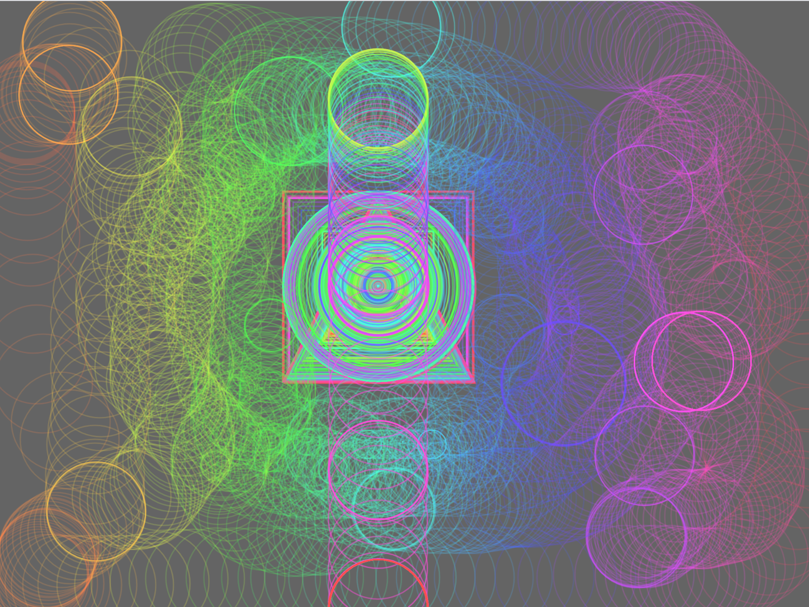

# {{ page.title }}
{: .no_toc }

## Table of Contents
{: .no_toc .text-delta }

1. TOC
{:toc}
---

In the past few lessons, we've learned about [serial communication](serial-intro.md), [web serial](web-serial.md), and using serial to create [p5.js](https://p5js.org/) + Arduino applications ([first lesson](p5js-serial.md), [second lesson](p5js-serial-io.md)). In this lesson, we're going to build on our growing knowledge and existing code to create a full end-to-end p5.js + Arduino application, which we'll call **PaintIO**. PaintIO includes a custom "paintbrush" controller with OLED display that controls and bidirectionally communicates with a custom painting application in p5.js.

<video autoplay loop muted playsinline style="margin:0px">
  <source src="assets/videos/PaintIO2-JustAHeart-TrimmedAndOptimized.mp4" type="video/mp4" />
</video>
**Video.** A quick demonstration of one PaintIO controller using the LIS3DH 3-axis accelerometer to set the paintbrush location, the paintbrush's speed to set the color, the force-sensitive resistor to set the brush size, and three buttons for changing the brush shape, the brush fill *vs.* outline, and for clearing the drawing. The Arduino code is in our GitHub as [PaintIOAccel.ino](https://github.com/makeabilitylab/arduino/blob/master/Serial/PaintIOAccel/PaintIOAccel.ino). The p5.js app is here: [live page](https://makeabilitylab.github.io/p5js/WebSerial/p5js/PaintIO), [code](https://github.com/makeabilitylab/p5js/tree/master/WebSerial/p5js/PaintIO).
{: .fs-1 }

A painting app is a wonderfully fertile Physical Computing example and helps culminate our learning thus far because:
- There are many **different paint properties to control** such as paint brush size, speed, color, shape
- We can **explore** and **play** with different types of **sensors** and **hardware** **input** to control these properties
- Painting is an **openly creative** and **rich practice**—there are very few rules! And our custom hardware-based paintbrush" can directly influence *how* we paint and *what* we paint. From an interaction design perspective, this is exciting and fun!
- Finally, as we've already experienced, making a painting application in p5.js is **fairly easy** (and fun)! But how can we make it even more interesting with Arduino and custom input?

Previously, we created this [simple painting application](https://editor.p5js.org/jonfroehlich/embed/MSGdVYUle) in ~20 lines of code, which you can play with below by mousing over the gray canvas. In this painting app, the brush size is changed proportionally via mouse speed, the color is mapped to the mouse's x location, and you can mouse click to switch between fill *vs.* outline.

<iframe width="736" height="400" scrolling="no" src="https://editor.p5js.org/jonfroehlich/embed/MSGdVYUle"></iframe>
**Code.** A simple p5.js painting application in ~20 lines of code. You can view, edit, and play with it [here](https://editor.p5js.org/jonfroehlich/sketches/MSGdVYUle) via the p5.js online editor. In this lesson, we'll extend this example to include [web serial](web-serial.md) and a custom "paintbrush" controller.
{: .fs-1 }

In this lesson, we will build on this example but with a custom "paintbrush" controller and different interaction mappings.

## Paint I/O Design Requirements

Before moving forward, let's establish some design requirements for Paint I/O. The app should:

- Have **bidirectional communication** between the Arduino and p5.js app. While the Arduino should serve as the primary painting input, we should be able to also change settings in p5.js, which should then be immediately reflected on the controller

- The Arduino-based paintbrush controller must use the **OLED** to provide feedback to our painter about the paintbrush.

- At a minimum, the paintbrush controller should control paintbrush's **x,y location**, **size**, **shape**, and **fill mode** (fill vs. outline). These properties should sound familiar—we'll build directly on our previous lessons!

### Serial communication

Let's specify how we will meet these requirements using serial communication.

#### From Arduino to p5.js

From the Arduino to p5.js, we will transmit a comma-separated string as: `xPosFrac, yPosFrac, sizeFrac, brushType, brushFillMode`:
- `xPosFrac` is a float between [0, 1] inclusive representing the brush's x position
- `yPosFrac` is a float between [0, 1] inclusive representing the brush's y position
- `sizeFrac` is a float between [0, 1] inclusive representing the brush's size
- `brushType` is either 0, 1, 2 corresponding to CIRCLE, SQUARE, TRIANGLE 
- `brushFillMode` is either 0, 1 corresponding to FILL, OUTLINE

We will also "echo back" received data, which we will 

#### From p5.js to Arduino

## Paint I/O Basic Application

As usual, let's start with a basic prototype and build outwardly. 

<!-- 

 -->

<!-- The paint brush size could be set by temperature, sound, etc. -->

- Impressionist?
- Live video impressionist?

- If we use color sensor version, can link to one of our favorite all time examples: I/O Brush from Ishii and Ryokai.