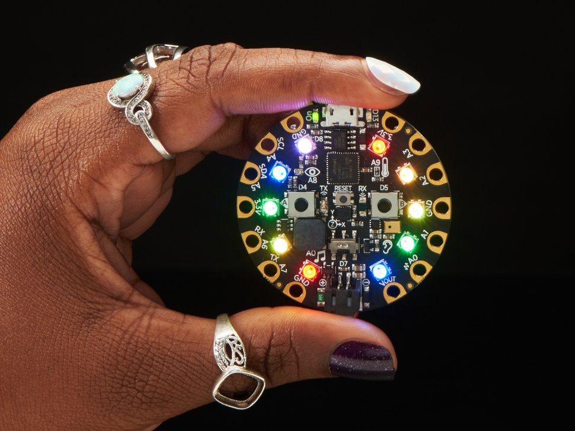
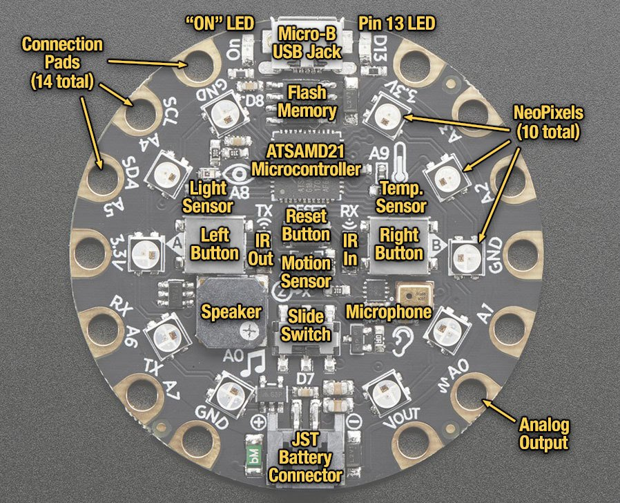
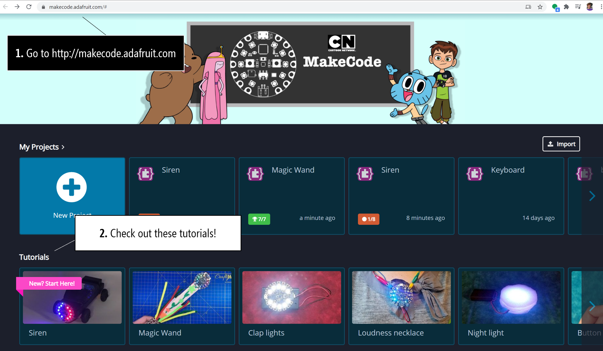

# {{ page.title | replace_first:'L','Lesson '}}
{: .no_toc }

## Table of Contents
{: .no_toc .text-delta }

1. TOC
{:toc}
---

The Circuit Express Playground. Image from [Adafruit](https://www.adafruit.com/product/3333). 
{: .fs-1 } 

## Overview

The Circuit Express Playground (CPX) is an introductory physical computing board created through a partnership by [Adafruit](https://adafruit.com) and [Code.org](https://code.org). The CPX can be programmed with the block-based programming language [MakeCode](https://makecode.adafruit.com/) (which is similar to [Scratch](https://scratch.mit.edu/)) and is intended to be both an introductory board for learning *electronics* and *programming*.

Because the CPX includes a host of on-board I/O components—including a [LIS3DH accelerometer](https://learn.adafruit.com/adafruit-lis3dh-triple-axis-accelerometer-breakout), a light-level sensor (a phototransistor), multiple push buttons, a microphone, RGB LEDs, a speaker, IR receivers/transmitter, and more—the CPX is a great choice for rapidly prototyping physical computing experiences. For many applications, you do not even need to use an external breadboard.

For programming, the board supports a variety of languages, including: [MakeCode](https://learn.adafruit.com/makecode) (block-based and JavaScript), [CircuitPython](https://learn.adafruit.com/adafruit-circuit-playground-express/what-is-circuitpython) (Python), or [Arduino](https://learn.adafruit.com/adafruit-circuit-playground-express/arduino) (C/C++).

Given the CPX's low floor (approachable, easy to use for beginners), high ceiling (you can make increasingly advanced things as you learn), and wide walls (supports a wide variety of projects)*, the CPX is a perfect platform for introductory physical computing or prototyping courses. We now use the CPX in our [MHCI+D program](https://mhcid.washington.edu/) at UW.

\* This notion of low floors, high ceilings, and wide walls derives from Resnick and Silverman's fantastic IDC'05 paper ["Some Reflections on Designing Construction Kits for Kids"](https://doi.org/10.1145/1109540.1109556)
{: .fs-1 }

## Hardware

An annotated version of the CPX showing the location of all main components. Image from [Adafruit](https://learn.adafruit.com/adafruit-circuit-playground-express/guided-tour). 
{: .fs-1 } 

One key benefit of the CPX—compared with vanilla Arduino boards, for example—is that it's  full of amazing input/output (IO) components. See Adafruit's helpful ["guided tour"](https://learn.adafruit.com/adafruit-circuit-playground-express/guided-tour) for more but, in short, the board includes:

### Input

- 1 x Motion sensor (LIS3DH triple-axis accelerometer with tap detection, free-fall detection)
- 1 x Temperature sensor (thermistor)
- 1 x Light sensor (phototransistor). Can also act as a color sensor and pulse sensor.
- 1 x Sound sensor (MEMS microphone)
- 7 pads can act as capacitive touch inputs and the 1 remaining is a true analog output
- Reset button

### Output

- 10 x mini NeoPixels, each one can display any color
- 1 x Mini speaker with class D amplifier (7.5mm magnetic speaker/buzzer)
- 2 x Push buttons, labeled A and B
- 1 x Slide switch
- Green "ON" LED so you know its powered
- Red "#13" LED for basic blinking

### I/O

- Infrared (IR) receiver and transmitter: can receive and transmit any remote control codes, as well as send messages between Circuit Playground Expresses. Can also act as a proximity sensor.
- 8 x alligator-clip friendly input/output pins
- Includes I2C, UART, 8 pins that can do analog inputs, multiple PWM output

The CPX itself is powered by a ATSAMD21 ARM Cortex M0 Processor, running at 3.3V and 48MHz. Compare this with the Arduino Uno, which is powered by an ATmega328P microcontroller at 5V and 16 MHz. Like the Arduino Leonardo, the CPX can act like a keyboard, mouse, joystick, MIDI, or simply a serial port. So you can easily make custom input to your computer—neat!

## Programming

An additional key benefit of the CPX is that it can be programmed multiple ways—for novices with limited programming background or for those who simply like visual programming languages, you can use [MakeCode](https://learn.adafruit.com/adafruit-circuit-playground-express/makecode). But you can also program the CPX in Python via [CircuitPython](https://learn.adafruit.com/adafruit-circuit-playground-express/what-is-circuitpython) or C/C++ via the [Arduino IDE](https://learn.adafruit.com/adafruit-circuit-playground-express/arduino).

### MakeCode
Microsoft's MakeCode was designed to provide a visual, drag-and-drop interface to programming microcontrollers. This visual programming style—called block-based programming—was popularized by and is similar to [Scratch](https://scratch.mit.edu/). The animation below shows how you program the CPX simply by dragging-and-dropping "puzzle pieces" (blocks).

<video class="img img-responsive lazy" preload="auto" muted="muted" loop="loop" autoplay="autoplay" playsinline="" poster="https://cdn-learn.adafruit.com/assets/assets/000/048/088/medium800thumb/makecodedragdemo.jpg?1510260958">
    <source src="https://cdn-learn.adafruit.com/assets/assets/000/048/088/large1024mp4/makecodedragdemo.mp4?1510260958">
    <source src="https://cdn-learn.adafruit.com/assets/assets/000/048/088/large1024webm/makecodedragdemo.webm?1510260958" type="video/webm; codecs=vp8,vorbis">
    <source src="https://cdn-learn.adafruit.com/assets/assets/000/048/088/large1024ogv/makecodedragdemo.ogv?1510260958" type="video/ogg; codecs=theora,vorbis">
    Your browser does not support the video tag.
</video>
An animation showing how to program the CPX in MakeCode. Animation from [Adafruit](https://learn.adafruit.com/adafruit-circuit-playground-express/what-is-makecode).
{: .fs-1 }

As someone who has worked with and taught physical computing for nearly a decade, MakeCode addresses several barriers to entry for novices (in rough order of importance):

- First, the block-based, drag-and-drop interface is far more accessible to novice programmers than Arduino's IDE and C/C++ environment. And MakeCode generates **real** JavaScript code based on your block program so you can go back and forth between the two.
- Second, **event handling**. A key challenge with Arduino for novices is handling events (e.g., when a button is pressed, do this), especially when programs contain lots of loops (which can make the system seem unresponsive, see this [discussion](https://makeabilitylab.github.io/physcomp/arduino/led-fade.html#improved-fading-approach-limiting-delays))
- Third, there is a built-in **simulation environment** that immediately lets you see how your code will perform before uploading it to your physical CPX device
- Finally, it is a **web-based editor**. There is nothing to install and you can program the CPX from your web browser. And once you've loaded the editor, it stays cached in your browser (so works offline).

## Learning Resources

A screenshot of the [Adafruit MakeCode website](https://makecode.adafruit.com/) that has links to tutorials and example projects.
{: .fs-1 }

Adafruit and MakeCode have published a series of thoughtful, easy-to-understand tutorials:
- A ["What is MakeCode and How to Use it"](https://learn.adafruit.com/makecode) primer

- You can find [step-by-step MakeCode + CPX tutorials](https://makecode.adafruit.com/) within the MakeCode editor itself. The nice thing here is that the MakeCode editor walks you through each step. Pretty awesome!

- You can also access the above tutorials as [traditional, linear step-by-step guides here](https://makecode.adafruit.com/tutorialss).

- Microsoft's [Peli de Halleux](https://learn.adafruit.com/users/pelikhan) has created a few CPX+MakeCode guides on the Adafruit website, including one on [NeoPixels](https://learn.adafruit.com/neopixels-with-makecode) and the other on [CPX Sensors](https://learn.adafruit.com/sensors-in-makecode).

- Adafruit also publishes individual "courses", including [Using the CPX Pins](https://makecode.adafruit.com/learnsystem/pins-tutorial), [Logic Lab](https://makecode.adafruit.com/learnsystem/logic-lab), and a [Maker Course](https://makecode.adafruit.com/courses/maker).

- Finally, if you want to dive deeper into some of the CPX's individual hardware components, [Shawn Hymel](https://shawnhymel.com/), Adafruit, and MakeCode teamed up to make a video-based tutorial series called [Behind the MakeCode Hardware](https://makecode.adafruit.com/behind-the-makecode-hardware), including topics on:
  - [Neopixels](https://youtu.be/Bo0cM2qmuAE)
  - [Speaker](https://youtu.be/JjJ-KGwKh_4)
  - [Accelerometer](https://youtu.be/2HzNKz-QlV0)
  - [Light Sensor](https://youtu.be/9LrWQ68lO20)
  - [Infrared](https://youtu.be/0EMuaMClfos)
  - [Microphone](https://youtu.be/g5894PVYOF4)

## Example projects

- Adafruit publishes [example MakeCode+CPX example projects](https://learn.adafruit.com/category/makecode) along with tutorials.