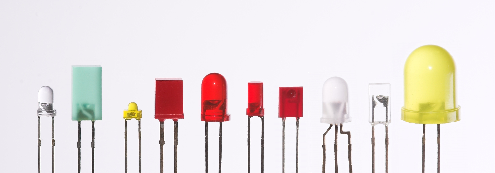
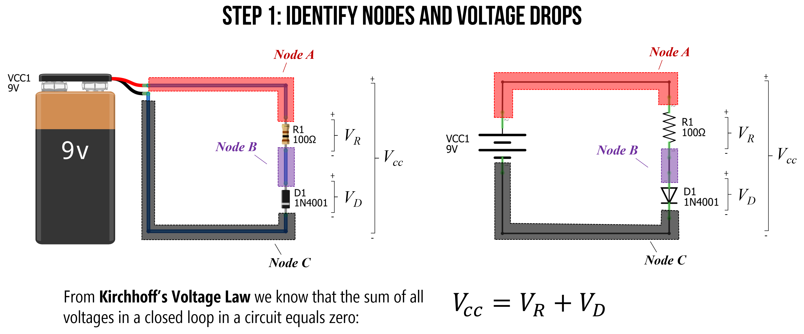
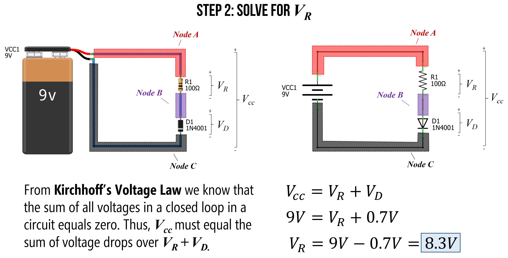
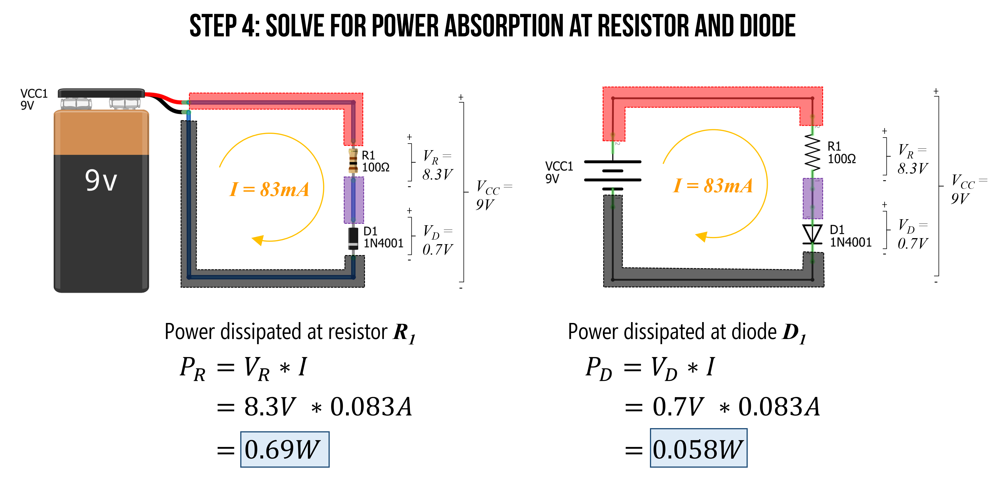
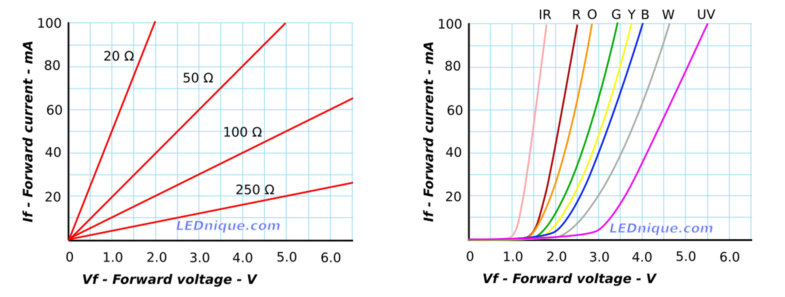
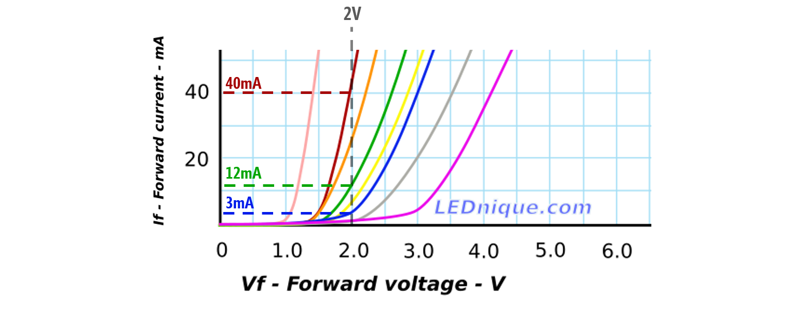
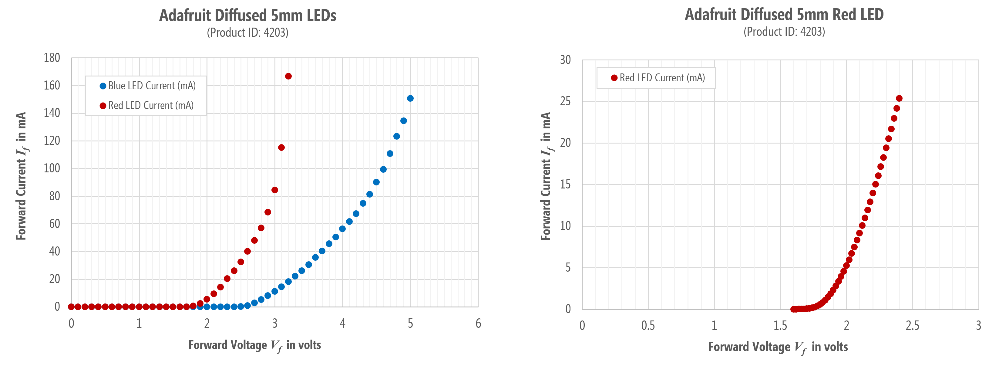

# {{ page.title | replace_first:'L','Lesson '}}
{: .no_toc }

## Table of Contents
{: .no_toc .text-delta }

1. TOC
{:toc}
---

Second only to [resistors](resistors.md), light-emitting diodes (LEDs) are the most common electrical components used in physical computing. LEDs are power-efficient light sources *not* based on resistive properties and thus, are non-ohmic devices. They come in a variety of shapes and sizes (see image below). In this lesson, you will learn about diodes and how they work before diving into LEDS, the importance of current-limiting resistors, and how to use them.

**Figure.**  LEDs range in color, size, and shape. Image from [Wikipedia](https://en.wikipedia.org/wiki/File:Verschiedene_LEDs.jpg).
{: .fs-1 }

## What are LEDs?

LEDs are a type of [diode](https://en.wikipedia.org/wiki/Diode), which is an electrical component that only allows current to flow in one direction—like a one way street or a back flow valve in plumbing. In contrast to traditional lamps (incandescent light sources), LEDs have many advantages including: lower energy consumption, longer lifetimes, improved physical robustness, smaller size, and faster switching (you can turn them on and off very quickly). 

For example, an incandescent bulb converts roughly 5% of its energy into visible light, the rest is lost to heat. More specifically, the typical incandescent bulb at 120V can output 16 lumens per watt *vs.* 60 lm/W for compact fluorescent bulbs and 150 lm/W for white LED lamps ([source](https://en.wikipedia.org/wiki/Incandescent_light_bulb)). Moreover, a typical incandescent bulb lasts for roughly 1,000 hours compared to 20,000-30,000 hours for LEDs.

While the basis for LED technology was discovered in 1927 ([Wikipedia](https://en.wikipedia.org/wiki/Light-emitting_diode#History)), it was not until the 1960s that the first visible-spectrum LEDs were demonstrated (red LEDs) and much later until they were commercially viable. Incredibly, the blue LED was not invented until the 1990s—earning co-inventors [Shuji Nakamura](https://en.wikipedia.org/wiki/Shuji_Nakamura), [Hiroshi Amano](https://en.wikipedia.org/wiki/Hiroshi_Amano), and [Isamu Akasaki](https://en.wikipedia.org/wiki/Isamu_Akasaki) the 2014 Nobel Prize in Physics—and there are still LED-based breakthroughs today (*e.g.,* high-efficiency, experimental white LEDs were demonstrated in the mid 2010s producing 303 lumens per watt of electricity). Akasaki recently passed away (in April 2021) and the [New York Times](https://www.nytimes.com/2021/04/06/science/isamu-akasaki-dead.html?referringSource=articleShare) has a nice obituary with an interesting history of the blue LED invention.

So, while LEDs are now pervasive, they're relatively new technology with active research.

## What are diodes?

To better understand light-emitting diodes, it's first useful to learn a bit about regular **diodes** and how to use them. As noted, diodes are a special type of [semiconductor device](https://en.wikipedia.org/wiki/Semiconductor_device) that, ideally, conduct current in **only one direction**. See animation below.

<video autoplay loop muted playsinline style="margin:0px">
  <source src="assets/videos/DiodeOnlyWorksInOneDirection_CircuitJS_ByJonFroehlich.mp4" type="video/mp4" />
</video>

**Video.** Diodes allow current to flow in only one direction—like traffic cops directing cars on a one way street. In the video above, we show how current flows through a diode from its anode lead to its cathode. But if we swap the orientation, current stops! You can play with the circuit [here](https://www.falstad.com/circuit/circuitjs.html?ctz=CQAgjCAMB0l3BWcMBMcUHYMGZIA4UA2ATmIxAUgpABZsKBTAWjDACgA3cYlWub3mEJURfEMSiSYCNgHcB4YRRR5FVdgCdlqsBkLaQKBPqrZcchTX4IVfdRZs6lj8HsMPbR-S5WqUH1WwbAysqfwAPRV4iCTA8CExeGkVxADU2ABMDXwMg6JAMhgAzAEMAVwAbABc2IA).
{: .fs-1 }

Similar to a resistor, a diode has two leads (aka terminals or legs). Unlike resistors, they are non-ohmic and thus, do not follow Ohm's Law. And a diode is a *polarized* component—which means its orientation matters (as the video above highlights). The schematic symbol for a diode indicates its directional placement: the arrow faces the direction of current (and, similarly, the vertical cathode line, which is visible both on the symbol and on the device itself, should point towards `-`).

**Figure.**  The diode schematic symbol and an image of a real diode, the popular [1N4001](https://www.adafruit.com/product/755). Image made in PowerPoint.
{: .fs-1 }

### A diode's "on" or "forward" voltage

To use a diode, you must apply a *minimum voltage*, which is typically called the "on voltage" ($$V_{on}$$) or "forward voltage" ($$V_{f}$$). Drawing again on a hydraulic analogy, think of a diode like a spring-triggered door in a water pipe (see image below). The door will only open when the water pressure exceeds a certain threshold (overcoming the strength of the spring). The door also prevents back flow as it can only open in one direction (thus, water can only travel in one direction in the pipe). Pretty cool!

A typical value for $$V_{f}$$ is 0.6-0.7V—so it "costs" only ~0.7V to install a "current" backflow preventer in your circuit. Why would you need this? For example, to protect your circuit in case you stick a battery in the wrong way.

**Figure.**  A hydraulic analogy for diodes. I cannot find the original source for this image. It originally came from [Bjoern Hartmann's CS294 course at UC Berkeley](http://husk.eecs.berkeley.edu/courses/cs294-84-fall14/images/a/a3/Slides-02-electronics101.pdf) (but that webpage is long gone!).
{: .fs-1 }

### The I-V graph for diodes

With resistors, there is a linear relationship between voltage and current. With diodes, this current-voltage relationship is *non-linear*. When the applied voltage is less than $$V_f$$, the diode is similar to a open circuit (disconnected). When the applied voltage $$V_s$$ exceeds $$V_f$$, the "valve" opens causing a voltage drop of $$V_{D} = V_{f}$$ over the component, and current flows with very little resistance (in the ideal, like a closed switch).

**Figure.**  An approximate current-voltage (or I-V) graph for resistors and diodes. Notice that after the applied voltage $$V$$ exceeds the forward voltage $$V_f$$ of the diode, that the diode "turns on" and current flows (and flows as if the diode were just a closed switch). Image made in PowerPoint.
{: .fs-1 }

Typically, once $$V_f$$ is reached, we assume that the voltage drop $$V_D$$ across a diode remains relatively constant (at, say, 0.7V) regardless of the current through it. But this is not entirely true. In fact, $$V_D$$ continues to change slightly—however, this change is so small over a wide range of currents that we can model $$V_D$$ as constant. And this approximation will be perfectly fine for our purposes.

**Figure.**  The current-voltage relationship of a diode is often simplified like the figure on the right, even though $$V_D$$ does indeed change slightly as current increases. Image on right from [UIUC ECE110](https://courses.engr.illinois.edu/ece110/sp2021/content/courseNotes/files/?diodes).
{: .fs-1 }

### Diode power dissipation

Just like resistors, which have [maximum power capacity ratings](resistors.md#calculating-the-power-dissipation-of-a-resistor), diodes do too! For a resistor $$R$$, we calculate power dissipation by the voltage drop across it $$V$$ multiplied by the current $$I$$ through it (so, $$P=V * I$$). It's the same thing for a diode!

### Breakdown voltage

Ideally, diodes would block any current flowing in the *reverse* direction; however, if a large enough "reverse" voltage is applied (*e.g.,* -50V to -100V), then the "trap door" is overpowered and current will begin flowing in the reverse direction (again, just like a closed switch). This is called the "breakdown voltage" or "peek inverse voltage" rating in a diode's datasheet.

How would you get a "reverse voltage"? Well, the easiest way would be to hook up your voltage source backwards. Generally, for our purposes, you need not worry about this. See [more here](https://learn.sparkfun.com/tutorials/diodes/all#real-diode-characteristics).

This is why we use the term "forward voltage" and "forward current" to distinguish against the breakdown case (with "reverse voltage" and "reverse current"). 

<!-- See also using a protection diode for a motor to prevent reverse current from voltage spike: https://learn.adafruit.com/adafruit-arduino-lesson-13-dc-motors/transistors?view=all -->

### Analyzing a diode in a circuit

Let's analyze a [1N4001 general-purpose diode](https://www.mouser.com/datasheet/2/149/1N4001-81693.pdf) in a simple circuit with a 9V battery and a 100Ω resistor. The key here is to recognize that once our supplied voltage exceeds the "on" voltage of our diode $$V_f$$, that we can model the diode as a wire. Though imperfect, it's a reasonable simplification for our purposes.

So, let's solve for current $$I$$ in the following circuit.

**Figure.**  In this simple circuit, we have a 9V battery, a 100Ω resistor, and a 1N4001 diode. How can we solve for current $$I$$? Image made in [Fritzing](http://fritzing.org/) and PowerPoint.
{: .fs-1 }

#### Step 1: Identify nodes and voltage drops

As we've done before, when we first begin analyzing a circuit, we identify what we know. In this circuit, there are no branches. Thus, we know that current $$I$$ is shared throughout. We can also identify three separate nodes with different voltage levels, *Node A*, which is directly connected to our battery, and thus is $$9V$$, *Node C*, which is connected to our battery's negative terminal, so is $$0V$$, and *Node B*, which is between the resistor $$R_1$$ and the diode $$D_1$$, so must have a voltage somewhere between *Node A* and *Node C*.

**Figure.** When analyzing a circuit, the first thing to do is to observe and identify what we know. I like to label my individual nodes (colored here for clarity). Image made in [Fritzing](http://fritzing.org/) and PowerPoint.
{: .fs-1 }

#### Step 2: Solve for $$V_R$$

[Kirchhoff’s Voltage Law](https://www.khanacademy.org/science/physics/circuits-topic/circuits-resistance/v/ee-kirchhoffs-voltage-law) states that for a closed loop series path the algebraic sum of all the voltages is zero. This is due to the conservation of energy—the circuit loop is a closed conducting path, so no energy is lost.

In this case, the voltage supply of 9V plus the voltage drop $$V_R$$ over the resistor $$R_1$$ plus the voltage drop $$V_D$$ over the diode $$D_1$$ must equal zero. Another way to write this is:

$$V_{CC} = V_R + V_D$$

We know that $$V_{CC} = 9V$$. We also know that the "on" voltage for the [1N4001 diode](https://www.mouser.com/datasheet/2/149/1N4001-81693.pdf) is 0.7V (anything less and the diode has near infinite resistance, so no current flows). Thus, we can substitute 0.7V for $$V_D$$, which results in:

$$
V_R = V_{CC} - V_D \\
V_R = 9V - 0.7V \\
V_R = 8.3V
$$

Thus, $$V_R$$ is equal to 8.3V.

**Figure.** Using Kirchhoff’s Voltage Law, we know that $$V_{CC} = V_R + V_D$$. Substituting knowns for $$V_{CC}=9V$$ and $$V_D=0.7V$$, let's us solve for the voltage drop $$V_R$$ around the resistor $$R_1$$, which is 8.3V. Image made in [Fritzing](http://fritzing.org/) and PowerPoint.
{: .fs-1 }

#### Step 3: Solve for current $$I$$

Now that we know $$V_R=8.3V$$, we can use Ohm's Law to solve for the current $$I$$ in our circuit, which is simply $$I = \frac{V_R}{R_1} = \frac{8.3V}{100Ω} = 0.083A = 83mA$$. Thus, there is $$83mA$$ of current flowing around our circuit (through the resistor and diode).

**Figure.** Using Ohm's Law, we can solve for current $$I$$ in our circuit. Image made in [Fritzing](http://fritzing.org/) and PowerPoint.
{: .fs-1 }

We can also use our trusty [CircuitJS](https://www.falstad.com/circuit/circuitjs.html) tool to simulate this circuit and check our answer. As the simulation shows below, our calculation of $$83mA$$ was spot on (even though we simplified the diode's true current-voltage operation).

<video autoplay loop muted playsinline style="margin:0px">
  <source src="assets/videos/DiodeResistorCircuitBasic_CircuitJS_ByJonFroehlich.mp4" type="video/mp4" />
</video>

**Video.** This video shows a [CircuitJS](https://www.falstad.com/circuit/circuitjs.html) simulation of a basic resistor-diode circuit with a 9V battery, a 100Ω resistor, and a 1N4001 diode. You can play with the circuit [here](https://www.falstad.com/circuit/circuitjs.html?ctz=CQAgjCAMB0l3BWcMBMcUHYMGZIA4UA2ATmIxAUgpABZsKBTAWjDACgA3cYlWub3mEJURfEMSiSYCNgHcB4YRRR5FVdgCdlqsBkLaQKBPvVw5CmvwQq+689Z1KH4PYfs2j+5ytUp3q7GsDSyo-AA9FXiIJMDwITF4aRXEANTYAEwMfA0CokHSGADMAQwBXABsAFzYgA).
{: .fs-1 }

#### Step 4: Solve for power at resistor and diode

The last step is to check to see what our power dissipation rates are for our resistor and diode. This would help us choose an appropriate resistor and diode if we were to actually build this thing.

For the resistor:

$$P_R = V_R * I = 8.3V * 0.083A = 0.69W$$

For the diode:

$$P_D = V_D * I = 0.7V * 0.083A = 0.058W$$

**Figure.** As the last step, let's figure out the power demands at each electrical component. We can use the power equation: $$P = I * V$$. Image made in [Fritzing](http://fritzing.org/) and PowerPoint.
{: .fs-1 }

Thus, for this circuit, we would need a bulkier resistor than the 0.25W resistors we put in our hardware kits (you can get a pack of 1,000 1 Watt resistors on [Amazon for $19.99](https://www.amazon.com/WiMas-Resistor-Resistance-Assorted-1000Pcs/dp/B0797QLGGB/), which is about 2 cents a resistor). However, from the [1N4001 datasheet](https://www.mouser.com/datasheet/2/149/1N4001-81693.pdf), 0.058W is well within the maximum rating of 3W, so the 1N4001 is fine.

**Figure.** Screenshot of the the [1N4001 datasheet](https://www.mouser.com/datasheet/2/149/1N4001-81693.pdf).
{: .fs-1 }

#### Reflecting on our solution

In our solution, we assumed that the voltage drop over the diode ($$V_D$$) is constant at $$0.7V$$ (once the diode "turns on"). This is generally a fine approximation for our purposes; however, the actual current-voltage relationship in a diode is far more complicated. And, indeed, $$V_D$$ will change slightly as the current $$I$$ increases. So, for example, if we used a different resistor than 100Ω above, $$V_D$$ will also change. 

If you care for the details, read on. Otherwise skip forward!

In fact, the I-V equation for a diode is:
$$I_D = I_S(e^\frac{q * V_D}{k * T}-1)$$

Where $$I_S$$ is the saturation current, $$V_D$$ is the voltage across the diode, $$q$$ is the charge on an electron (in coulombs), $$k$$ is Boltzmann's constant, and $$T$$ is temperature (in kelvin). I have never had to use this equation but including it here for thoroughness. If you want to learn more, read this [Khan Academy article](https://www.khanacademy.org/science/electrical-engineering/ee-semiconductor-devices/ee-diode/a/ee-diode-circuit-element).

## Using LEDs

Whew, we finally made it back to LEDs, which are amazingly flexible, fun, and elegant electronic components (see image below). We will also use LEDs in many of our [Intro to Arduino](../arduino/index.md) lessons. 

**Figure.** A variety of relatively simple LED-based projects. The top row projects are built with just LEDs, resistors, and a battery. The bottom row are built with microcontrollers. From top-left: (a) Flower LED lamp built with plastic spoons by [Wemyour](https://www.youtube.com/watch?v=OsTKdKdMXKU); (b and c)  Paper-based nightlights and a starry water bottle built by [I Love Creativity](https://youtu.be/3frVM7J0nO8); (d) an 8x8x8 LED cube built with Arduino Uno by [Harry Le](https://youtu.be/T5Aq7cRc-mU); (e) hanging LED cloud by [Richard Clarkson](https://vimeo.com/111889143); (f) air quality balloons by Stacey Kuznetsov and colleagues ([UbiComp'11 paper](http://doi.acm.org/10.1145/2030112.2030145), [Instructables](https://www.instructables.com/Air-quality-balloons/))
{: .fs-1 }

Building on our diode knowledge, we are now prepared to understand how LEDs work, how to use them, and why we need current-limiting resistors. Let's go!

### LED Parts

LEDs are like super diodes—they function similarly but have this magical property of emitting light.

Just like other diodes, an LED has two legs and is a polarized component—it will only work in one direction. The anode `+` is indicated by the *longer* leg of the LED and the cathode `-` is subtly indicated by the flat side of the LED's casing (see image below). The anode must face toward the higher electric potential part of your circuit and current flows from the anode to the cathode.

**Figure.** The schematic symbol and labeled parts of a light-emitting diode (LED). There are two key ways to discern an LED's orientation. First, by looking for the long leg, which is the anode. If the LED legs (or leads) have been trimmed or are otherwise not visible, then you can also look at the shape of the epoxy casing, which has a subtle *flat* side. This flat side is pointed towards the cathode leg. Image made in PowerPoint. I don't know the source of the LED picture.
{: .fs-1 }

LEDs are semiconductor devices that use [electroluminscence](https://en.wikipedia.org/wiki/Electroluminescence) to emit light in response to current. More specifically, when electrons pass through an LED they release energy in the form of photons. If you're curious to learn more, see this [video by Today I Found Out](https://youtu.be/uyse_I-zo4Q).

**Figure.** An incredibly cool inside look a functioning LED by [TubeTimeUS](https://twitter.com/tubetimeus/status/1111807450141745152?s=11) on Twitter. Slight modifications to annotations by Jon E. Froehlich.
{: .fs-1 }

### The IV graph for LEDs

Earlier, we showed a simple current-voltage graph (IV plot or IV curve) both for resistors, which follows Ohm's Law, $$I=\frac{V}{R}$$, and diodes, which does not.

We can expand our IV graph for resistors to show how current linearly increases at different rates depending on the underlying resistance (literally just graphing $$I=\frac{V}{R}$$ for different values of $$R$$). See graph on the left below.

We can also graph the IV curve for LEDs, which again demonstrates non-linearity (remember, diodes are non-ohmic). Some important things to point out: first, like diodes, very little current flows through an LED until its "on" or "forward" voltage $$V_f$$ is reached. Second, the forward voltage $$V_f$$ differs by the LED's color. For example, notice how blue (B) and white (W) LEDs require more $$V_f$$ than red (R) and orange (O) in the graph below.

**Figure.** This figure shows the IV curve for various resistor values (following $$I=\frac{V}{R}$$) and for various LED values (on the right). Notice how the forward voltage, $$V_f$$ is different based on the LED color. Image from [LEDnique.com](http://lednique.com/current-voltage-relationships/iv-curves/).
{: .fs-1 }

#### Careful putting mixed-color LEDs in parallel

Because differently colored LEDs have unique $$V_f$$, you need to be especially careful with mixed color LED circuit configurations—especially if you are wiring them in parallel. You'll need to account for the differences in $$V_f$$ and select an appropriate current-limiting resistor for each parallel branch.

For the LEDs used to produce these IV graphs, the red LED draws 40mA at 2V while the green and blue LEDs only draw 12mA and 3mA, respectively.

**Figure.** Image based on [LEDnique.com](http://lednique.com/current-voltage-relationships/iv-curves/).
{: .fs-1 }

#### Experimenting with LED current-voltage relationships

To evaluate the current-voltage response curve for the LEDs in our hardware kits (the [Adafruit 5mm LED pack](https://www.adafruit.com/product/4203)), I ran my own measurement experiments using a benchtop variable DC power supply (I have the [Siglent SPD3303X-E](https://siglentna.com/power-supplies/spd3303x-spd3303x-e-series-programmable-dc-power-supply/)) and my trusty multimeter.

I conducted two small experiments. First, using both a red LED and then a blue LED, I output a fixed voltage starting at 0V and incremented by 0.1V (ending at 3.2V for the red LED and 5V for the blue LED). For each step, I measured the current draw using my multimeter. The results are shown below (left graph). For the second experiment, I only used the red LED. This time, I started at 1.6V and incremented by 0.01V (ending at 2.4V)—again measuring the current draw. The results are shown on the right graph below.

**Figure.** IV graphs from my own experiments with the [Adafruit 5mm LED pack](https://www.adafruit.com/product/4203). 
{: .fs-1 }

Notably, the IV curve generally matches [LEDnique.com](http://lednique.com/current-voltage-relationships/iv-curves/). The red LED has a much smaller $$V_f$$ than the blue LED and the current draw after the $$V_f$$ threshold is reached seems exponential. However, unlike the [LEDnique.com](http://lednique.com/current-voltage-relationships/iv-curves/) graphs, at $$V_f=2V$$, the red LED was only drawing $$5.2mA$$ of current and the blue LED was completely off ($$0mA$$ of current).

To show how the LED brightness varies with current, I've replotted the results of the second experiment and overlaid corresponding images of my experimental setup plus the red LED output. At $$V_f=1.6V$$, the red LED was drawing $$4μA$$ of current but was not illuminated. At $$V_f=1.8V$$, the red LED was drawing $$0.57mA$$ of current and on. By $$V_f=2V$$ and beyond, the red LED was very bright.

**Figure.** The second experiment shown with images overlaid.
{: .fs-1 }

## Current-limiting resistors

As our IV graphs demonstrate, once $$V_f$$ is surpassed, LED's current draw increases exponentially. Without a current limiting resistor, the LEDs will draw as much current as they can and destroy themselves! Yikes!

So, how can we determine what resistor to use? Using the same process that we did for the [diodes](#analyzing-a-diode-in-a-circuit).

### Determining which resistor to use

To determine what type of current-limiting resistor to use, you need to consult the LED's datasheet. The [Adafruit product page](https://www.adafruit.com/product/4203) for the diffused 5mm LEDs has a link to five datasheets—one for each color in the pack. For this example, let's go with the [red LED datasheet](https://cdn-shop.adafruit.com/product-files/4203/C53-002_Fedy_FD-5AR35-1.pdf), which we've also copied [locally](assets/pdfs/RedLEDDatasheet_C53-002_Fedy_FD-5AR35-1.pdf) just in case.

The datasheet states that the forward voltage $$V_f$$ for the red LED is between $$1.9V$$ and $$2.1V$$ with a typical value of $$2.0V$$. At $$V_f=2V$$, the datasheet states that the forward current $$I_f$$ is $$20mA$$. All specifications are for 25 ℃. 

Perfect, we can use this information to solve for our resistor! 

Let's build a simple LED circuit with a 9V battery, a red LED, and a yet-to-be-determined resistor.

#### Step 1: Identify nodes and voltage drops

TODO

#### Step 2: XXXXX

<!-- Watch Mike HArrison's "Everything I've Learned about LEDS" talk: https://youtu.be/5SQt1f4PsRU -->

#### Check work with simulator

https://www.falstad.com/circuit/circuitjs.html?ctz=CQAgjCAMB0l3BWcMBMcUHYMGZIA4UA2ATmIxAUgpABZsKBTAWjDACgA3cYlWub3mEJURfEMSiSYCNgHcB4YRRR5FVdgCdlqsBkLaQKBPqrZcchTX4IVfdRZs6lj8HsMPbR-S5WqUH1WwbAysqfwAPRV4iCTA8CExeGkVxADU2IV4fPFUXIOiQABMGADMAQwBXABsAFyYqhkLwKShYdiA

### Does it matter which side of the LED I place the resistor?

No. A resistor limits the current throughout the circuit loop.

### What happens if you forget the current-limiting resistor?

<video autoplay loop muted playsinline style="margin:0px">
  <source src="assets/videos/LEDBurnOut_Afrotechmods_Trimmed.mp4" type="video/mp4" />
</video>

**Video.** This video shows what happens when the applied voltage significantly exceeds the LED's forward voltage $$V_f$$ with no current limiting resistor. Video from [Afrotechmods](https://youtu.be/Yo6JI_bzUzo).
{: .fs-1 }

### Addressable LED strips

Wiring up, powering, and controlling a large number of RGB (red, green, blue) LEDs with a microcontroller is complicated and messy. Thus, in the last decade, we've seen the emergence of low-cost "smart" RGB LED strips like [Adafruit's Neopixel](https://www.adafruit.com/product/1376?length=1) (aka, the WS2812B LED from WorldSemi), which contain strips of RGB LEDs—each with a small embedded microcontroller—that can be addressed and controlled individually. They are truly awesome but beyond the scope of this lesson because they are not raw electrical components and require a microcontroller to use.

<!-- ## Constant current source

See video: [Constant current source / LED driver tutorial](https://youtu.be/iuMngik0GR8), Afrotechmods

See discussion of LM317 (constant current driver) here: [Chapter 3: LEDs](https://learning.oreilly.com/library/view/hacking-electronics-an/9780071802369/ch04.html#ch4)

## Addressable LED strips

Wiring up, powering, and controlling a large number of RGB (red, green, blue) LEDs with a microcontroller is complicated and messy. Thus, in the last decade, we've seen the emergence of low-cost "smart" RGB LED strips like [Adafruit's Neopixel](https://www.adafruit.com/product/1376?length=1) (aka, the WS2812B LED from WorldSemi), which contain strips of RGB LEDs—each with a small embedded microcontroller—that can be addressed and controlled individually. They are truly awesome but beyond the scope of this lesson because they are not raw electrical components and require a microcontroller to use.

The NeoPixel has quickly become a prototyping standard because of Adafruit's [Arduino](https://learn.adafruit.com/adafruit-neopixel-uberguide/arduino-library-installation), [CircuitPython](https://learn.adafruit.com/adafruit-neopixel-uberguide/python-circuitpython), and [MakeCode](https://learn.adafruit.com/adafruit-neopixel-uberguide/makecode) libraries and their production of [widely read tutorials](https://learn.adafruit.com/adafruit-neopixel-uberguide).

There are many tutorials and comparisons of LED strips online, including:
- [How to use WS2812B NeoPixels with FastLED on Arduino](https://youtu.be/YgII4UYW5hU), Gadget Reboot
- [LED Strips, What's the Difference?](https://www.youtube.com/watch?v=QnvircC22hU), The Hook Up
- [DotStars vs NeoPixels](https://learn.adafruit.com/adafruit-dotstar-leds/overview), Adafruit

## Notes

https://courses.engr.illinois.edu/ece110/sp2021/content/courseNotes/files/?diodes

Outline:

* What are LEDs
* Using LEDs and current limiting resistors
* Wiring up multiple LEDs -->

## Resources

### Videos

* [LED Circuit Design: How to Design LED Circuits](https://youtu.be/7d4ymjU9NqM), Engineering Mindset

* [How to select resistor values for LEDs](https://youtu.be/hduuUDiku80), JohnAudioTech

* [LED Basics](https://youtu.be/Yo6JI_bzUzo), Afrotechmods

* [Constant current source / LED driver tutorial](https://youtu.be/iuMngik0GR8), Afrotechmods

### Text

* [Adafruit's LED tutorial](https://learn.adafruit.com/all-about-leds)

* [Sparkfun's LED Tutorial](https://learn.sparkfun.com/tutorials/light-emitting-diodes-leds/all)

* [Chapter 3: LEDs](https://learning.oreilly.com/library/view/hacking-electronics-an/9780071802369/ch04.html#ch4) in Monk, *Hacking Electronics: An Illustrated DIY Guide for Makers and Hobbyists*, McGraw-Hill, 2013.

* [Chapter 22: LEDs](https://learning.oreilly.com/library/view/encyclopedia-of-electronic/9781449334178/ch22.html#SECTION_LED_INDICATOR) in Platt, *Make: Encyclopedia of Electronic Components Volume 2: LEDs, LCDs, audio, thyristors, digital logic, and amplification*, O'Reilly, 2015.

* [Diodes and How to Use Them](https://learning.oreilly.com/library/view/electronics-for-beginners/9781484259795/html/488495_1_En_8_Chapter.xhtml) in Bartlett, *Electronics for Beginners*, Apress, 2020 

* [Diodes](https://courses.engr.illinois.edu/ece110/sp2021/content/courseNotes/files/?diodes), UIUC ECE 110
