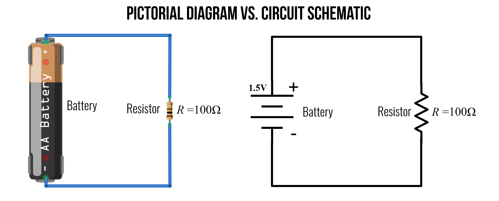

# {{ page.title | replace_first:'L','Lesson '}}
{: .no_toc }

## Table of Contents
{: .no_toc .text-delta }

1. TOC
{:toc}
---

In this lesson, we will learn about **Ohm's Law**, one of the most important empirical laws in electrical circuits that describes how *current*, *voltage*, and *resistance* relate together. While Ohm's Law is incredibly useful in analyzing and understanding how circuits work, like many "laws", it is not always obeyed (particularly for what are called "non-ohmic" devices like LEDs).

## Ohm's Law

Ohm's Law states that the current ($$I$$ in amperes) in a conductor is directly proportional to the applied voltage ($$V$$ in volts) *vs.* the conductor's resistance ($$R$$ in ohms):

$$I = \frac{V}{R}$$

Thus, if we double the voltage in our circuit—for example, by stacking two batteries—then we will also double the current. Ohm's Law has many implications for how we build circuits with microcontrollers, including voltage dividers and resistive sensors.

Importantly, you will see and use Ohm's Law in all three equivalent incarnations (which can be derived with simple algebra):

When you want to solve for **current** in your circuit, you use:
$$I = \frac{V}{R}$$

To solve for **voltage**, use:
$$V = I * R$$

To solve for **resistance**, use:
$$R = \frac{V}{I}$$

From these equations, you  

### Why $$I$$ and not $$C$$?

You might be asking, "If $$R$$ is the *resistance* in ohms (Ω) and V is the *voltage* in volts (V) then why is $$I$$ used to represent the *current* in amperes (A)?" or "Why is current $$I$$ and not $$C$$?" Two reasons: first, $$C$$ is already reserved for the SI unit of coloumbs (C), which is used in the very definition of amperes (recall that $$1\ A = 1\ C / s$$) and thus, could get confusing! Second, the ampere is named after [André-Marie Ampère](https://en.wikipedia.org/wiki/Andr%C3%A9-Marie_Amp%C3%A8re), considered the father of electromagnetism, who referred to amperage as the "***i**ntensity of current." So, current is $$I$$ and not $$C$$.

## Circuit diagrams

Before analyzing circuits with Ohm's Law, it's useful to introduce [**circuit schematics**](https://en.wikipedia.org/wiki/Circuit_diagram), which are diagrammatic abstractions of circuits. Unlike the more realistic pictorials that we have used thus far, circuit schematics are compact, standardized, visual representations of circuits used in electronic datasheets, CAD layout software, and circuit analysis.

Below, we've included some common electronic symbols for basic circuits. For more examples, see [Wikipedia's entry](https://en.wikipedia.org/wiki/Electronic_symbol). 

**Figure.** Common electronic symbols. For the battery, the long line is used to indicate the positive terminal and the short line is the negative terminal (which is typically used as ground). Image made in PowerPoint.
{: .fs-1 }

To demonstrate the difference and utility of pictorial vs. circuit schematics, we provide some examples below. 

**Figure.** An example pictorial diagram and circuit schematic of a basic switching circuit with a 1.5V battery, a switch, a resistor, and an LED. Note: in a circuit schematic, the long line on the battery is used to indicate the positive terminal. Image made in [Fritzing](https://fritzing.org/) and PowerPoint.
{: .fs-1 }

**Figure.** Additional examples of pictorial diagrams vs. circuit schematics for two more circuits. Image made in [Fritzing](https://fritzing.org/) and PowerPoint.
{: .fs-1 }

Note that while a circuit schematic captures the relative ordering of and connections between components, the spacing and overall layout does not matter. Thus, the following five schematics of a basic LED circuit are all functionally equivalent! Take your time reading them—do you agree that they are all equivalent? What stands out to you?

**Figure.** Though they *look* different, all five of these basic LED circuits are functionally equivalent. Each of them have the positive terminal of the battery connected to a resistor, then an LED, and the cathode of the LED is connected to the negative terminal of the battery.
{: .fs-1 }

### Telling connected vs. unconnected wires apart

When reading a circuit schematic, it can be difficult to properly interpret crossing wires—*i.e.,* are they connected or not—there is a standard for this as well (though some deviations are possible).

**Figure.** When reading a circuit schematic, it's important to properly assess and understand which wires are connected and how—but determining whether a crossing wire is unconnected (*e.g.,* jumping over a wire) or connected (*i.e.,* forming a node) can be confusing. Above, we show various examples of how to interpret whether wires are connected in a circuit diagram. Image made in PowerPoint.
{: .fs-1 }

But this can quickly get confusing. For example, are the two circuits below equivalent or not? In fact, they are. (It would be easier to parse this example if we used the arc over unconnected wires). When in doubt, redraw the circuit yourself on a piece of paper!

An example of how even simple circuits can start to get confusing. What's connected to what? When in doubt, redraw the circuit on paper. Image from [Stanford's ENGR 40M course](https://web.stanford.edu/class/archive/engr/engr40m.1178/slides/lecture01.pdf).
{: .fs-1 }

<!-- - https://web.stanford.edu/class/archive/engr/engr40m.1178/slides/lecture01.pdf
- https://web.stanford.edu/class/archive/engr/engr40m.1178/slides/lecture02.pdf -->

## Notes
- Single loop one resistor
- Single loop two resistors in series

## Some gotchas

- Make sure all of your units are the same—convert to base metric units! In digital circuits, the current is often in milliamperes (milliamps or mA). Make sure to convert mA to A in your equation. So, $$3mA$$ would be $$3x10^{-3}A$$ or $$0.03A$$. 

## Notes

https://ccrma.stanford.edu/wiki/Introduction_to_Electronics_(condensed)