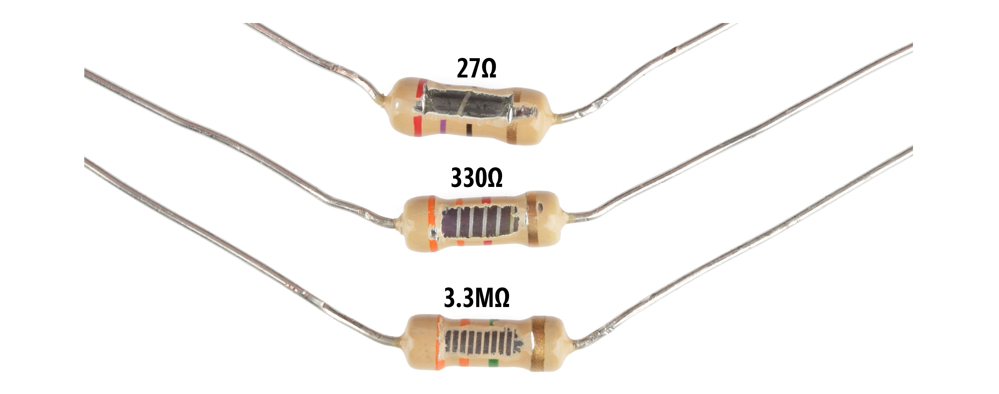
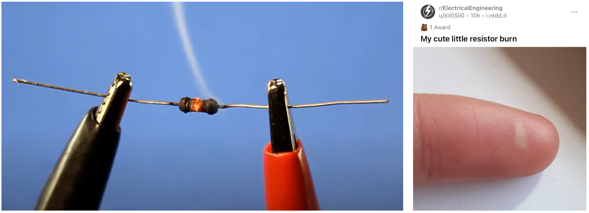

# {{ page.title | replace_first:'L','Lesson '}}
{: .no_toc }

## Table of Contents
{: .no_toc .text-delta }

1. TOC
{:toc}
---

Resistors are one of the most common electrical components in digital circuits. We briefly described them in our first lesson on [electricity basics](electricity-basics.md) but they are worth more attention!

A resistor is a specially formulated component that *resists* the flow of charge (current) in a circuit. Just as we can reduce the flow of water in a pipe by inserting a valve packed with sand, clay, hair (bleah), or other permeable blockages, so too can we reduce the flow of electrons by inserting a component that has less conductive material than a normal wire.

## How do resistors work?

**Figure.** This animation shows how a resistor can be placed between two wires to reduce current flow. Notice how electrons flow freely through the copper wire. With the resistor, these electrons "collide" with other atoms and themselves, which transforms the electrical energy to thermal energy and induces a voltage drop. Animation from [The Engineering Mindset](https://youtu.be/kcL2_D33k3o?t=891).
{: .fs-1 }

In a resistor, flowing electrons collide with atoms making them vibrate, which converts *electrical energy* to *heat energy* and induces a voltage drop $$V$$. The amount by which a resistor *resists* the flow of charge is called its resistance $$R$$ and is measured in Ohms (Ω). The amount of voltage drop over a resistor captured by Ohm's Law: $$V = I * R$$.

As noted in [Lesson 1](electricity-basics.md), some materials like metals—silver, copper, and gold—have low resistances. They have easily displaceable electrons in their outer atomic shells and make good *conductors*. Other materials such as glass, rubber, and air have high resistance and poor conductivity ("low electron mobility")—these materials are called *insulators*.

## How are resistors made?

To make a resistor with a specific resistance $$R$$, component manufacturers carefully select the *type* and *amount* of a resistive material embedded into insulated packaging. In the image below, for example, a resistive material (like carbon) is wrapped around an insulator and covered by an insulating material as well. The more wraps, the higher resistance. And this should intuitively make sense: increasing the number of wraps simply increases the *length* of the resistive material (or the amount of resistive material electrons have to navigate through).

**Figure.**  Image from [Sparkfun.com](https://learn.sparkfun.com/tutorials/resistors) with annotations by Jon Froehlich.
{: .fs-1 }

Other resistors look like this inside:

**Figure.** Two cross sections of non-wrapping resistors. Image from [TubeTimeUS](https://twitter.com/tubetimeus/status/1111785671650242560?s=11) on Twitter with adapted annotations by Jon Froehlich. Right-click and "Open image in new tab" to expand.
{: .fs-1 }

Depending on their type and manufacturing, resistors have a certain "accuracy" tolerance. For example a 100Ω resistor with a ±5% tolerance could be, in actuality, a 95Ω or 105Ω resistor.

## Characterizing resistors

Resistors are characterized according to their **resistance value** (in Ohms or Ω) and **maximum power capacity** (in Watts), which is the maximum rate at which they can convert electrical energy to thermal energy (heat).

### Power dissipation

TODO: talk about power stuff.

**Figure.** Two cross sections of non-wrapping resistors. Image on left from this [Being Engineers video](https://youtu.be/HhUiWLlx1oA) and image on the right from the Electrical Engineering sub-reddit by user Xil0Sil0 ([link](https://www.reddit.com/r/ElectricalEngineering/comments/mh6jee/my_cute_little_resistor_burn/?utm_source=share&utm_medium=web2x&context=3))
{: .fs-1 }

## Resistor kits

In our prototyping classes, we tend to purchase resistor kits, which come with a set of resistors organized by resistance value and labeled (though you pay more per resistor for the convenience).

**Figure.** The Sparkfun resistor kit comes with 500 $$\frac{1}{4}W$$ resistors with ±5% tolerance (and costs ~$7.55 in bulk, which is $0.015/resistor) while the Plusivo resistor kit comes with 600 $$\frac{1}{4}W$$ resistors with ±1% tolerance (currently $8.99 on Amazon, which is $0.015/resistor).
{: .fs-1 }

## Reading resistors

If you don't have your resistors pre-labeled in a pack, you'll need a method to determine their resistance value. Unfortunately, unlike capacitors, resistors do *not* have textual labels. Instead, they use a color coding system that is a bit arcane. 

**Figure** A legend for the color bands used on resistors and two examples: on the top, a tan ±5% tolerance resistor with green (5) and blue (6) digits and an orange multiplier (1000) color bands, which is $$56 * 1000 = 56kΩ$$. On the bottom, a blue ±1% tolerance resistor with yellow (4), purple (7), black (0) digits and a multipler of red (100), which is $$470 * 100 = 47kΩ$$. Image modified from [here](http://www.imajeenyus.com/electronics/20120315_resistor_colour_code/resistor-color-code2.jpg).
{: .fs-1 }

To read the resistor color bands, orient the resistor such that the "tolerance" band (*e.g.,* the gold band for tan resistors or a brown band for blue resistors) is on the *right*. Then you read the color bands left-to-right based on the color chart below. Notably, the color band just before the tolerance band is a multiplier. So, if you have a four band resistor that ends in a gold stripe (±5% tolerance) and has the colors red, red, brown. Then those colors correspond to 2, 2, and a multiplier of 10, which would be $$22 * 10 = 220Ω$$. 

Confused? That's ok!

In the video below, I show how to decode the color bands on resistors and walk through some examples. Then I show how to use a multimeter to read the resistance values directly.

<iframe width="736" height="414" src="https://www.youtube.com/embed/rHiSMNXyuHI" title="YouTube video player" frameborder="0" allow="accelerometer; autoplay; clipboard-write; encrypted-media; gyroscope; picture-in-picture" allowfullscreen></iframe>
**Video** A [video tutorial](https://youtu.be/rHiSMNXyuHI) of how to decode the resistor color codes and how to "read" a resistor's value using a multimeter.
{: .fs-1 }

## Activity

For your learning activity, pick out three different resistors from your kits. For each resistor, take a picture, write down the color bands, and then calculate the resistance. In the Plusivo kits, the resistors come in labeled strips, which you can use to check your work (ground truth!) or, if you have access to a multimeter, you could do that too. 

<!-- Links:
- Introduce resistors and how they work
- Power?
- Rheostats (and make own resistor with graphite pencil) -->

<!-- <video autoplay loop muted playsinline style="margin:0px">
  <source src="assets/videos/ResistorAndCurrentFlow_WaterHoseAnalogy_TrimmedAndCropped_EngineeringMindset.mp4" type="video/mp4" />
</video>
**Figure.** Resistors are specially electronic components to reduce current flow. Just as a kink in a water hose will provide increased resistance and reduce water flow, so too will a resistor placed between two wires in a circuit. Animation from the [What is Current?](https://youtu.be/8Posj4WMo0o?t=521) video by The Engineering Mindset.
{: .fs-1 } -->

- A very nice animation and explanation from [Engineering Mindset](https://youtu.be/kcL2_D33k3o?t=901)

<iframe src="https://player.vimeo.com/video/76442431" style="position:absolute;top:0;left:0;width:100%;height:100%;" frameborder="0" allow="autoplay; fullscreen" allowfullscreen></iframe>

<a href="https://vimeo.com/76442431">Ohm Part 2</a> from <a href="https://vimeo.com/fddrsn">Jeff Feddersen</a> on <a href="https://vimeo.com">Vimeo</a>.

<!-- ACTIVITY IDEA: have them make their own resistors with graphite pencils. I think this activity is better suited for the LEDs lesson -->

## Resources

-[Experiment 3: Your First Circuit](https://learning.oreilly.com/library/view/make-electronics-2nd/9781680450255/ch01.html), Platt, *Make: Electronics, 2nd Edition*

- [Chapter 10: Resistor](https://learning.oreilly.com/library/view/encyclopedia-of-electronic/9781449333881/ch10.html) in Platt, *Make: Encyclopedia of Electronic Components Volume 1: Resistors, Capacitors, Inductors, Switches, Encoders, Relays, Transistors*, O'Reilly, 2012.

- [Resistance and Ohm's Law](https://courses.engr.illinois.edu/ece110/sp2021/content/courseNotes/files/?resistanceAndOhmsLaw), UIUC ECE101

- [Power](https://courses.engr.illinois.edu/ece110/sp2021/content/courseNotes/files/?power), UIUC ECE101

<!-- [Potentiometer](https://learning.oreilly.com/library/view/Encyclopedia+of+Electronic+Components+Volume+1/9781449333881/ch11.html) -->

## Next Lesson

In the [next lesson](leds.md), we will learn about light-emitting diodes (LEDs)

[Previous: Resistors](resistors.md){: .btn .btn-outline }
[Next: LEDs](leds.md){: .btn .btn-outline }
