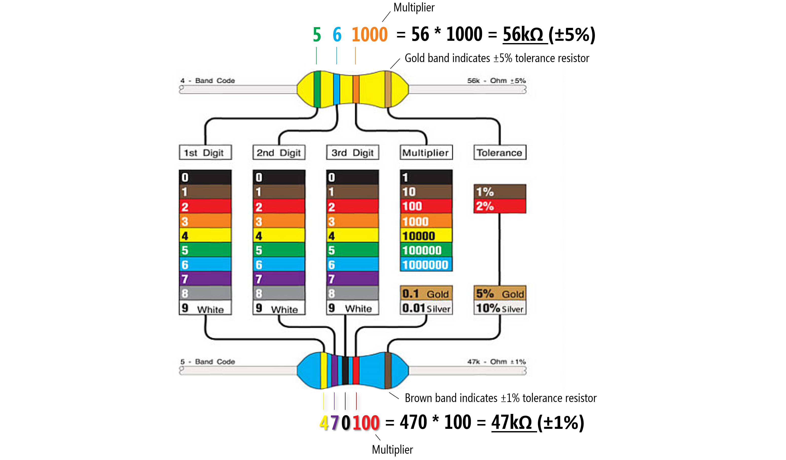
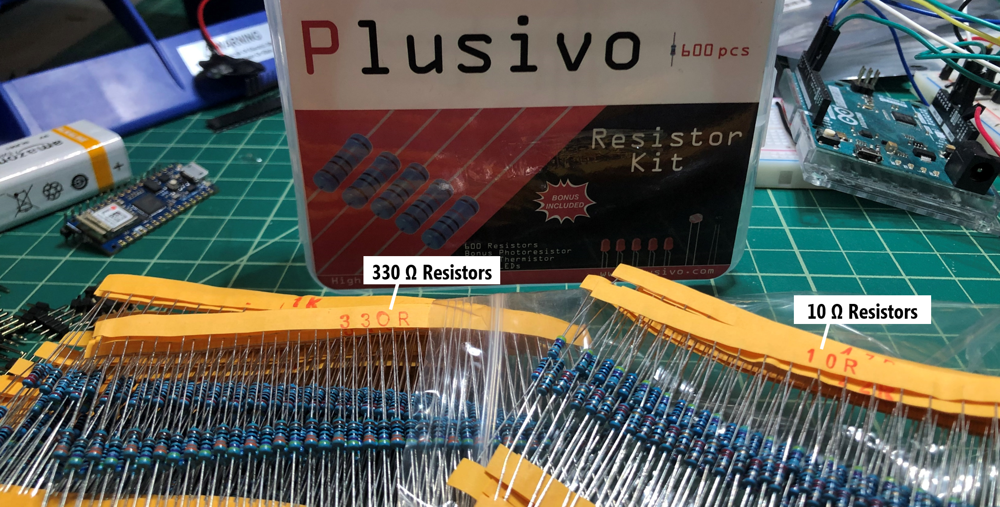

# {{ page.title | replace_first:'L','Lesson '}}
{: .no_toc }

## Table of Contents
{: .no_toc .text-delta }

1. TOC
{:toc}
---

Resistors are one of the most common and important electrical components in digital circuits. A resistor is a specially formulated component that *resists* the flow of charge (current) in a circuit. Just as we can reduce the flow of water in a pipe by inserting a valve packed with sand, clay, hair (bleah), or other permeable blockages, so too can we reduce the flow of electrons by inserting a component that has less conductive material than a normal wire.

In previous lessons, you learned about the [concept of resistance](electricity-basics.md#what-is-electrical-resistance), [Ohm's Law](ohms-law.md)—how voltage, current, and resistance relate together—as well as [series and parallel resistor configurations](series-parallel.md). In this lesson, we will expand on how resistors work, how they're characterized in terms of both resistance $$R$$ and power $$P$$, and how to "read" them.

**Figure.**  The above image shows a variety of resistor types from $$\frac{1}{4}W$$ to $$5W$$ resistors. I no longer have the source for the original image. Annotations made by Jon Froehlich in PowerPoint.
{: .fs-1 }

## How do resistors work?

**Figure.** This animation shows how a resistor can be placed between two wires to reduce current flow. Notice how electrons flow freely through the copper wire. With the resistor, these electrons "collide" with other atoms and themselves, which transforms the electrical energy to thermal energy and induces a voltage drop. Animation from [The Engineering Mindset](https://youtu.be/kcL2_D33k3o?t=891).
{: .fs-1 }

In a resistor, flowing electrons collide with atoms making them vibrate, which converts *electrical energy* to *heat energy* and induces a voltage drop $$V$$. The amount by which a resistor *resists* the flow of charge is called its resistance $$R$$ and is measured in Ohms (Ω). The amount of voltage drop over a resistor is captured by Ohm's Law: $$V = I * R$$.

### Factors determining resitivity

As noted in [Lesson 1](electricity-basics.md), some materials like metals—silver, copper, and gold—have low resistances. Other materials such as glass, rubber, and air have high resistance and poor conductivity ("low electron mobility")—these materials are called *insulators*.

But why?

There are three main factors that determine conductivity (see [UIUC ECE110 notes](https://courses.engr.illinois.edu/ece110/sp2021/content/labs/Modules/M001_What_is_Resistor.pdf)):
1. The ease at which electrons can be dislodged by an applied electric field. Metals like copper have easily displaceable electrons in their atom's valance (outer) shells. It takes very little energy to cause electrons to "jump" or "move."
2. The atomic arrangement of the material. If you were able to look microscopically at metal, you would see a particular structural arrangement of atoms called a [lattice](https://opentextbc.ca/chemistry/chapter/10-6-lattice-structures-in-crystalline-solids/)—this structure depends on the material. For metals, atoms are densely packed that lets electrons move relatively freely through the lattice, again reducing resistance.
3. The temperature of the material. As a material heats up, its atoms vibrate with greater amplitude. This atomic motion has a negative effect on the material's ability to conduct electric current, causing greater electrical resistance ([link](http://matse1.matse.illinois.edu/sc/b.html)).

## Resistors slow current everywhere

A common confusion is that resistors only reduce current at the resistors themselves or that resistors are like a traffic jam, slowing "traffic" (electrons) before the resistor but then the electrons (cars) "can pick up the pace" again after getting through the jam (the resistor). No, this is not correct!

Resistors restrict the flow of electrons throughout a circuit path. Think of a small valve in a water pipe: this valve restricts the total water flow through the pipe—both before and after the valve. The animation below shows three simple circuits with different amounts of resistance: notice how the current flow is the same throughout each circuit, it is not faster or slower before or after a resistor.

<video autoplay loop muted playsinline style="margin:0px">
  <source src="assets/videos/ResistorsSlowCurrentEverywhereOnCircuitPath.mp4" type="video/mp4" />
</video>
**Video.** In the animation above, we are showing how current is the *same* for each individual circuit. It does not speed up before or after a resistor. Animations made in CircuitJS ([left](https://www.falstad.com/circuit/circuitjs.html?ctz=CQAgjCAMB0l3BWcMBMcUHYMGZIA4UA2ATmIxAUgpABZsKBTAWjDACgA3cYlWsQ7rxQIBVKjSrEo0mAjYB3QSGEDshPMpHg2AJxBqNuGvvX68xqpUgKlNfiY12B7RQc2rTR5TbfZzDvgEUNgAPcEJjbBR6MDx6KIFje2IANTYgA), [middle](https://www.falstad.com/circuit/circuitjs.html?ctz=CQAgjCAMB0l3BWcMBMcUHYMGZIA4UA2ATmIxAUgpABZsKBTAWjDACgA3cYlWsQ7rxQIBVKjSrEo0mAjYB3QSGECUKGspHg2AJxDZCefZA0Gj2PBqqVIC-Yc0CzxjSjvOLphzX7K2AD3BCUxR6MDx6bCJaIJBiADVdfQM+VXVU6Rs7MB4MtQ0fAXY9bBSVZXTy6zh3Mq1nKtqBQvsjFtsgA), [right](https://www.falstad.com/circuit/circuitjs.html?ctz=CQAgjCAMB0l3BWcMBMcUHYMGZIA4UA2ATmIxAUgpABZsKBTAWjDACgA3cYlWsQ7rxQIBVKjSrEo0mAjYB3QSGECUKGspHg2AJxDZCefZA0Gj2PBqph4C-Yc0CzxjSjvOLphzX7K2AD3BCUxR6MDx6bCJaIJBiADVdfQM+VXVU6Rs4OzAeDLUNHwF2PWwUlWV0iutbRTLVLWdq9xSi+yM2yDYgA))
{: .fs-1 }

## How are resistors made?

To make a resistor with a specific resistance $$R$$, component manufacturers carefully select the *type*, *amount*, and *shape* of a resistive material and embed it into insulated packaging. In the image below, for example, a resistive material (like carbon) is wrapped around an insulator and covered by a tan insulating material. The more wraps, the higher resistance. And this should intuitively make sense: increasing the number of wraps simply increases the *length* of the resistive material (or the amount of resistive material electrons have to navigate through).

**Figure.**  Image from [Sparkfun.com](https://learn.sparkfun.com/tutorials/resistors) with annotations by Jon Froehlich.
{: .fs-1 }

Other resistors look like this inside:

**Figure.** Two cross sections of non-wrapping resistors. Image from [TubeTimeUS](https://twitter.com/tubetimeus/status/1111785671650242560?s=11) on Twitter with adapted annotations by Jon Froehlich. Right-click and "Open image in new tab" to expand.
{: .fs-1 }

Depending on their type and manufacturing, resistors have a certain "accuracy" tolerance. For example a 100Ω resistor with a ±5% tolerance could be, in actuality, a 95Ω or 105Ω resistor.

<!-- 
I'm not sure what to do with the video below. I think it's possibly conceptually helpful but also maybe not. Keeping commented out for now.

<video autoplay loop muted playsinline style="margin:0px">
  <source src="assets/videos/ResistorAndCurrentFlow_WaterHoseAnalogy_TrimmedAndCropped_EngineeringMindset.mp4" type="video/mp4" />
</video>
**Figure.** Resistors are specially electronic components to reduce current flow. Just as a kink in a water hose will provide increased resistance and reduce water flow, so too will a resistor placed between two wires in a circuit. Animation from the [What is Current?](https://youtu.be/8Posj4WMo0o?t=521) video by The Engineering Mindset.
{: .fs-1 }  -->

## Characterizing resistors

Resistors are characterized according to their **resistance value** (in Ohms or Ω) and **maximum power capacity** (in Watts), which is the maximum rate at which they can convert electrical energy to thermal energy (heat). We've previously described resistance but what do we mean by power capacity?

### What is electrical power?

Electric power—just like mechanical power—is the rate of doing work. The power $$P$$ at a circuit element is a measure of how quickly it converts energy: a battery converts chemical potential energy to electrical energy (producing power), a resistor converts electrical energy to heat energy (absorbing power). Due to the conversation of energy, the total power delivered in a circuit is equal to the total power absorbed. The SI unit of power is the *watt*, one joule per second ($$\frac{J}{s}$$).

The amount of power $$P$$ absorbed at a circuit element is dependent on **both** voltage and current:

$$P = V * I$$

These [UIUC ECE110 notes](https://courses.engr.illinois.edu/ece110/sp2021/content/courseNotes/files/?power) provide a nice explanation:

> Voltage drop is the amount of electrical energy absorbed per +1 C of charge as it moves from the + label to the − label. Current is the amount of positive charge that flows per second in the direction of the arrow label. Multiplying these two quantities cancels out charge, and produces the amount of electrical energy absorbed per second, which is power.
{: .fs-3 }

That is, we know that $$P = V * I$$. Adding in units, we get $$P = 1 V * 1 A$$. From here, we can determine joules/second, which is the definition of power.  

$$P = (1V)(1A) \Rightarrow (1 \frac{J}{C})(1\frac{C}{s}) \Rightarrow 1 \frac{J}{s} \Rightarrow 1 W$$

Thus, electric power is the amount of charge $$Q$$ coloumbs passing through an electric potential (voltage) difference $$V$$ over time $$t$$.

But the most critical thing to understand and remember is $$P=V * I$$!

### Calculating the power dissipation of a resistor

While $$P$$ is defined as $$P=V * I$$, we can use Ohm's Law and simple substitution to derive two other formulations:

$$P = V*I = I^2 * R =\frac{V^2}{R}$$

For example, consider a circuit with a 9V battery and a 100Ω resistor, how much power does the resistor absorb? $$P = \frac{V^2}{R} \Rightarrow \frac{9^2V}{100Ω} = 0.81W$$. In our prototyping kits, we typically supply $$\frac{1}{4}W$$ resistors, which are 3.2x **too small** to dissipate 0.81W of power.

**Figure.** Calculating the power dissipation of the resistor $$R_1=100Ω$$ in a circuit with a 9V battery. Using Ohm's Law to replace the $$I$$ with $$\frac{V}{R}$$ in $$P=I * V$$, we can solve for $$P$$ with $$\frac{V^2}{R} \Rightarrow \frac{9^2V}{100Ω} = 0.81W$$
{: .fs-1 }

To meet the minimum power ratings of our $$\frac{1}{4}W$$ resistors, we would need to replace the 100Ω resistor with a ~330Ω resistor. To determine this, we can simply solve for $$R$$ with $$P=\frac{1}{4}W$$. That is, $$P = \frac{V^2}{R} \Rightarrow 0.25W = \frac{9^2V}{R}$$. Solving for $$R$$, we get: $$R = \frac{9^2 V}{0.25W} = 324Ω$$.

<!-- We define power $$P$$ at a circuit element as the amount of electrical energy absorbed per second. In a circuit, some elements

The SI unit of power is the *watt*, one joule per second, and is represented by the letter *P*. More specifically, electric power is the amount of charge $$Q$$ coloumbs passing through an electric potential (voltage) difference $$V$$ over time $$t$$:

$$P = work done per unit time \Rightarrow \frac{V * Q}{t} \Rightarrow V * I$$

Importantly, observe that power is a function of both *voltage* and *current*. I like this analogy by [allaboutcircuits.com](https://www.allaboutcircuits.com/):

> Remember that voltage is the specific work (or potential energy) per unit charge, while current is the rate at which electric charges move through a conductor. Voltage (specific work) is analogous to the work done in lifting a weight against the pull of gravity. Current (rate) is analogous to the speed at which that weight is lifted. Together as a product (multiplication), voltage (work) and current (rate) constitute power. -->

<!-- You'll typically see the electrical power equation written as (sometimes called the "Power Law"):

$$P = IV$$

Using Ohm's Law for substitution, there are two common equivalents:

$$P = I^2 * R => \frac{V^2}{R}$$ -->

### What if the maximum power capacity is exceeded?

If we exceed a resistor's power capacity, it will begin to heat up and eventually burn out. Once a resistor "burns out", it typically creates an "open circuit"—that is, current will no longer travel through that path (air is a good insulator).

**Figure.** Resistors are made of materials that cause electron collisions with atoms, generating heat. Resistors have "power ratings" that, when exceeded, can heat up too much and burn out (left image). If you overpower your resistor, it could burn you—be careful. On the right image, a Reddit user posted their resistor burn imprint on their finger. Image on left from this [Being Engineers video](https://youtu.be/HhUiWLlx1oA) and image on the right from the Electrical Engineering sub-reddit by user Xil0Sil0 ([link](https://www.reddit.com/r/ElectricalEngineering/comments/mh6jee/my_cute_little_resistor_burn/?utm_source=share&utm_medium=web2x&context=3))
{: .fs-1 }

Notably, I've never had a resistor start on fire or burn up (though I have had them heat up to the point in which they are "hot to the touch"). If you smell something burning, immediately unplug your power supply.

## Reading resistors

There are three ways to "read" resistors: (1) keep them arranged in pre-labeled packs (sidestepping the problem a bit); (2) learn how to decode the color-coded bands; or (3) use a multimeter on the "read resistance" setting.

### Resistor kits

In our prototyping classes, we tend to purchase $$\frac{1}{4}W$$ resistor kits, which come with a set of resistors organized by resistance value and labeled (though you pay more per resistor for the convenience).

**Figure.** The Sparkfun resistor kit comes with 500 $$\frac{1}{4}W$$ resistors with ±5% tolerance (and costs ~$7.55 in bulk, which is $0.015/resistor) while the Plusivo resistor kit comes with 600 $$\frac{1}{4}W$$ resistors with ±1% tolerance (currently $8.99 on Amazon, which is $0.015/resistor).
{: .fs-1 }

### Reading resistor color bands

If you don't have your resistors pre-labeled in a pack, you'll need a method to determine their resistance value. Unfortunately, unlike capacitors, resistors do *not* have textual labels printed on them. Instead, they use a color coding system that has long been standardized but is a bit arcane (and not particularly accessible to people with [color vision deficiency](https://www.aoa.org/healthy-eyes/eye-and-vision-conditions/color-vision-deficiency?sso=y#:~:text=Color%20vision%20deficiency%20is%20the,the%20eye%20known%20as%20cones.)). 

But knowing *how* to read these color bands is a nice skill for any prototyper, even if you do not memorize the color legend (I tend to look back at a reference, even now!).

**Figure** A legend for the color bands used on resistors and two examples: on the top, a tan ±5% tolerance resistor with green (5) and blue (6) digits and an orange multiplier (1000) color bands, which is $$56 * 1000 = 56kΩ$$. On the bottom, a blue ±1% tolerance resistor with yellow (4), purple (7), black (0) digits and a multipler of red (100), which is $$470 * 100 = 47kΩ$$. Image modified from [here](http://www.imajeenyus.com/electronics/20120315_resistor_colour_code/resistor-color-code2.jpg).
{: .fs-1 }

To read the resistor color bands, orient the resistor such that the "tolerance" band (*e.g.,* the gold band for tan resistors or a brown band for blue resistors) is on the *right*. Then you read the color bands left-to-right based on the color chart below. Notably, the color band just before the tolerance band is a *multiplier* and the preceding bands are *digit* bands that tell you what to multiply. 

So, if you have a four band resistor that ends in a gold stripe (±5% tolerance) and has the colors red, red, brown. Then those colors correspond to 2, 2, and a multiplier of 10, which would be $$22 * 10 = 220Ω$$. If you have a 4.7kΩ resistor, you would have colors yellow (4), purple (7), and a multiplier of red (100) so that $$47 * 100 = 4700 \Rightarrow 4.7kΩ$$.

Confused? That's ok!

In the video below, I slowly walk through how to decode the color bands on resistors with some examples. Then I show how to use a multimeter to read the resistance values directly. Hopefully, this will make things clearer.

<iframe width="736" height="414" src="https://www.youtube.com/embed/rHiSMNXyuHI" title="YouTube video player" frameborder="0" allow="accelerometer; autoplay; clipboard-write; encrypted-media; gyroscope; picture-in-picture" allowfullscreen></iframe>
**Video** A [video tutorial](https://youtu.be/rHiSMNXyuHI) of how to decode the resistor color codes and how to "read" a resistor's value using a multimeter.
{: .fs-1 }

## Activity

For your learning activity, pick out three different resistors from your kits. In your prototyping journals, for each selected resistor, take a picture, write down the color bands, and then manually calculate the resistance (showing your work). In the Plusivo kits, the resistors come in labeled strips, which you can use to check your work (ground truth!) or, if you have access to a multimeter, you could do that too. 

<!-- ACTIVITY IDEA: have them make their own resistors with graphite pencils. I think this activity is better suited for the LEDs lesson -->

## Resources

* [Experiment 3: Your First Circuit](https://learning.oreilly.com/library/view/make-electronics-2nd/9781680450255/ch01.html), Platt, *Make: Electronics, 2nd Edition*

* [Chapter 10: Resistor](https://learning.oreilly.com/library/view/encyclopedia-of-electronic/9781449333881/ch10.html) in Platt, *Make: Encyclopedia of Electronic Components Volume 1: Resistors, Capacitors, Inductors, Switches, Encoders, Relays, Transistors*, O'Reilly, 2012.

* [Resistance and Ohm's Law](https://courses.engr.illinois.edu/ece110/sp2021/content/courseNotes/files/?resistanceAndOhmsLaw), UIUC ECE110

* [What is Resistance?](https://courses.engr.illinois.edu/ece110/sp2021/content/labs/Modules/M001_What_is_Resistor.pdf), UIUC ECE110

* [Power](https://courses.engr.illinois.edu/ece110/sp2021/content/courseNotes/files/?power), UIUC ECE110

<!-- [Potentiometer](https://learning.oreilly.com/library/view/Encyclopedia+of+Electronic+Components+Volume+1/9781449333881/ch11.html) -->

## Next Lesson

In the [next lesson](leds.md), we will learn about light-emitting diodes and how to use them.

[Previous: Series and Parallel Resistors](series-parallel.md){: .btn .btn-outline }
[Next: LEDs](leds.md){: .btn .btn-outline }
