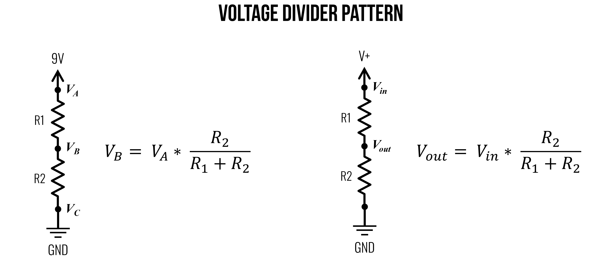
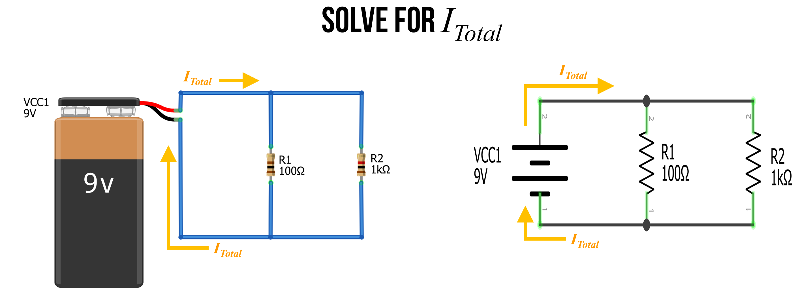
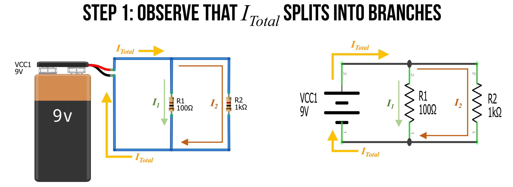
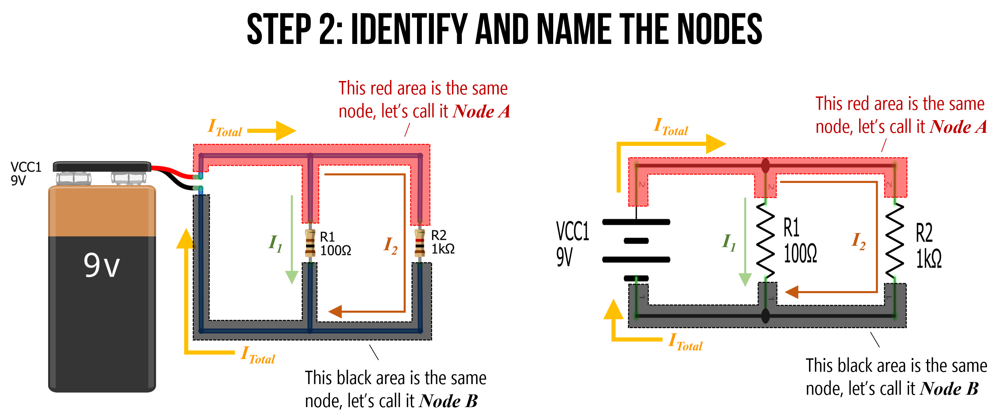
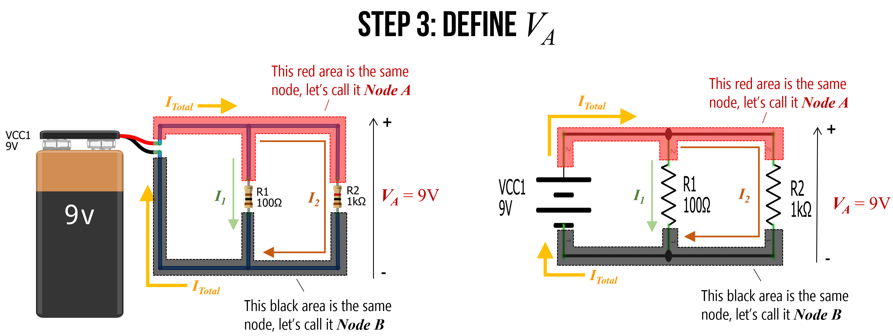

# {{ page.title | replace_first:'L','Lesson '}}
{: .no_toc }

## Table of Contents
{: .no_toc .text-delta }

1. TOC
{:toc}
---

In our Ohm's Law lesson we analyzed relatively straightforward circuits with a single resistor. These circuits helped us build a foundation for and a conceptual understanding of Ohm's Law and how to apply it; however, most circuits are not so simple.

In this lesson, we we're going to extend Ohm's Law to more complicated circuits: resistors in **series** and resistors in **parallel**. In short: 
* Resistors in series **divide voltage** and are one of the most common (and useful) circuit configurations when working with microcontrollers and resistive sensors like [potentiometers](../arduino/potentiometers.md), [force-sensitive resistors](../arduino/force-sensitive-resistors.md), and [photocells](../sensors/photoresistors.md).
* Resistors in parallel **divide current** (and more current travels down paths with less resistance). Parallel circuits are useful, for example, in powering multiple LEDs.

**Figure.** An example of **series** resistors (left) and **parallel** resistors (right). Images made  PowerPoint.
{: .fs-1 }

## Equivalent resistances

Using [Kirchhoff's circuit laws](https://en.wikipedia.org/wiki/Kirchhoff%27s_circuit_laws), we can derive "equivalent" resistances for series and parallel circuits.

For series resistors, we sum resistances to find the aggregate resistance $$R_{equivalent}$$:

$$R_{equivalent} = R_{1} + R_{2} + ... + R_{N-1} + R_{N}$$

For parallel resistors, it's a bit more complicated:

$$R_{equivalent} = \frac{1}{\frac{1}{R_{1}} + \frac{1}{R_{2}} + ... + \frac{1}{R_{N-1}} + \frac{1}{R_{N}}}$$

Yes, the parallel resistance equation is a bit enigmatic but you can derive it yourself (or even forget it all together) if you know Ohm's Law and [Kirchhoff's Laws](https://www.khanacademy.org/science/physics/circuits-topic/circuits-resistance/v/ee-kirchhoffs-current-law).

For us, the most important and useful concept to understand is that **series resistors** divide voltage (we'll use this later in our microcontroller circuits) and that **parallel resistors** divide current (with *more* current flowing through branches with less resistance). The image below attempts to concisely explain this.

**Figure.** An overview of how **series resistors** work (current is the same across each resistor but *voltage is divided*) and how **parallel resistors** work (voltage is the same across each resistor but *current is divdided*). Take a moment to study and understand why this might be. Right-click on the image and select 'Open in new tab' to enlarge. Image made in PowerPoint.
{: .fs-1 }

And, while the ability to manually understand and analyze a circuit is important in physical computing, if you become confused, you can always use a circuit simulator like [CircuitJS](https://www.falstad.com/circuit/circuitjs.html).

## Series resistors

[Resistors in series](https://www.khanacademy.org/science/electrical-engineering/ee-circuit-analysis-topic/ee-resistor-circuits/a/ee-series-resistors) are connected in sequence: head-to-tail. 

**Figure.** Components are in series if they are joined end-to-end (or head-to-tail) in sequence like the above. Image on left from [Khan Academy](https://www.khanacademy.org/science/electrical-engineering/ee-circuit-analysis-topic/ee-resistor-circuits/a/ee-series-resistors). Image made in PowerPoint. 
{: .fs-1 }

From Ohm's Law, we know that resistors *drop* voltage (indeed, the voltage drop $$V_{R}$$ over a resistor $$R$$ is $$V_{R} = I * R$$). Thus, multiple resistors "in a row" (in series) will *each* cause a drop in voltage—and the magnitude of this drop is proportional to the resistor (higher resistance, higher voltage drop).

Generally, when we are trying to analyze a circuit with multiple resistor configurations (series, parallel, or a combination), the first step is to determine an **equivalent resistance**. That is, how can we combine all the resistance in the circuit to a single value (called $$R_{total}$$ or $$R_{equivalent}$$) that enables us to apply Ohm's Law across the entire circuit. In the case of solving for current, this would be $$I=\frac{V}{R_{total}}$$

So, let's try it!

### Series example 1: Solve for current

Let's begin with the simplest series resistor circuit: a 9V battery with 100Ω and 1kΩ resistors in series.

**Figure.** A simple circuit with two series resistors (100Ω and 1kΩ) and a 9V battery. How much current $$I$$ is flowing through this circuit?
{: .fs-1 }

#### Step 1: Solve for total resistance

The first step is to solve for the total resistance in our circuit. We know that we sum resistances in series, so: $$R_{Total} = R_{1} + R_{2} \Rightarrow  100Ω + 1000Ω \Rightarrow 1100Ω$$. The total resistance is $$1100Ω$$.

**Figure.** To find the equivalent resistance of this circuit (let's call this $$R_{Total}$$), we can combine series resistors by summing them. 

#### Step 2: Solve for current I with equivalent resistance

We can now use this equivalent resistance value $$R_{Total}$$ to solve for the current $$I$$ by using Ohm's Law: $$I=9V/1100Ω \Rightarrow 0.0082A \Rightarrow 8.2mA$$

**Figure.** We now solve by current $$I$$ simply by Ohm's Law: $$I=9V/1100Ω \Rightarrow 8.2mA$$
{: .fs-1 }

That's it. We did it! The total current is $$I = 8.2mA$$.

### Series example 2: Solve for current

To reinforce understanding, let's try again but with three resistors instead of two. This time, $$R_{1}=2.2kΩ$$, $$R_{2}=1kΩ$$, and $$R_{3}=470Ω$$.

Again, we start by finding $$R_{Total}$$, which is:

$$R_{Total} = R_{1} + R_{2} + R_{3} \\
R_{Total} = 2200Ω + 1000Ω + 470Ω \\
R_{Total} = 3670Ω$$

We can then use this equivalent resistance value to solve for current $$I$$, which is $$I=\frac{9V}{3670Ω} \Rightarrow 0.0025A \Rightarrow 2.5mA$$.

**Figure.** In the image above, we solve for current with three series resistors. First, sum the resistances (because they are in series) and then use this aggregate resistance ($$R_{Total}$$) to determine current with Ohm's Law: $$I=\frac{V}{R_{Total}} \Rightarrow \frac{9V}{3670Ω$} \Rightarrow 2.5mA$$
{: .fs-1 }

#### Check our work in a circuit simulator

We can check our work in our favorite circuit simulator, which is whatever you like. :)

I will use the open-source tool [CircuitJS](https://www.falstad.com/circuit/circuitjs.html). The specific simulation is [here](https://www.falstad.com/circuit/circuitjs.html?ctz=CQAgjCAMB0l3BWcMBMcUHYMGZIA4UA2ATmIxAUgpABZsKBTAWjDACgA3cYlWwm7rzCEqo2lWJQpMBGwDug8CIoo8SquwBOKtWAyEdIFAgNUUaSG20JVRjLxtrsNqWHhXD2Qmse0aaqhoMSwUwHj4BXxp+cHlDYSpfPQMUON9jA3T7IzTbZwc87xyFKP9DaIFUoA).

We can click on the wires to magically show how much current is traveling through them or to show their electric potential (voltage) with respect to ground. And sure enough, you'll see that indeed $$2.5mA$$ is traveling through the circuit. What else do you observe?

Well, remember how we've been emphasizing that voltages are *split* or *divided* across resistors in series. You can clearly see this as well! The voltage is at $$9V$$ at the top node but drops by $$5.4V$$ over the $$2.2kΩ$$ resistor to $$3.6V$$, which then drops by $$2.4V$$ over the $$1kΩ$$ resistor leaving just $$1.2V$$ of electric potential before finally dropping down to $$0V$$ or $$GND$$ across the $$470Ω$$ resistor. We'll talk more about this next!

<video autoplay loop muted playsinline style="margin:0px">
  <source src="assets/videos/SeriesResistorThreeResistors9VBattery2.2k1k470_CircuitJSRecording.mp4" type="video/mp4" />
</video>

**Figure.** This video shows a [CircuitJS](https://www.falstad.com/circuit/circuitjs.html) simulation of a basic three resistor series circuit. You can play with the circuit [here](https://www.falstad.com/circuit/circuitjs.html?ctz=CQAgjCAMB0l3BWcMBMcUHYMGZIA4UA2ATmIxAUgpABZsKBTAWjDACgA3cYlWwm7rzCEqo2lWJQpMBGwDug8CIoo8SquwBOKtWAyEdIFAgNUUaSG20JVRjLxtrsNqWHhXD2Qmse0aaqhoMSwUwHj4BXxp+cHlDYSpfPQMUON9jA3T7IzTbZwc87xyFKP9DaIFUoA).
{: .fs-1 }

## Voltage dividers

The notion that **series resistors** split voltages is a critical concept when working with microcontrollers. So, it deserves its own emphasis.

The key thing to remember: there is a *voltage drop* across each resistor (this is always the case, not just in a series circuit configuration). Thus, between each resistor we have a different *electric potential* or voltage. And because microcontrollers "read" voltage rather than current, we can use this property to control dynamic input into our microcontroller!

Let's go over some examples.

### Example 1: Solve for voltage at VB

With this idea of voltages dropping across each resistor, let's look at how to calculate the voltage at the node $$V_{B}$$ with respect to ground (and remember, a node is just any junction point with two or more connections in a circuit).

Before moving through our example, stop and ask yourself: how would you calculate the voltage at $$V_{B}$$?

#### Step 1: Solve for the current through the circuit

As before, the first step is to solve for the current through the circuit. We do this, again, by finding the equivalent resistance $$R_{Total}$$ and using Ohm's Law. So, $$I=\frac{V}{R_{Total}} \Rightarrow \frac{9V}{250Ω} \Rightarrow 36mA$$.

#### Step 2: Calculate voltage drop across resistors

Now that we know the total current flowing through our circuit ($$36mA$$), we can use this to calculate the specific voltage drop across each resistor. Let's call the voltage drop over $$R_{1}$$: $$V_{1}$$ and the voltage drop over $$R_{2}$$: $$V_{2}$$. And because we are interested in calculating voltage, we will use this formulation of Ohm's Law: $$V = I * R$$.

Thus:

$$
{V_1} = I * R_1 \Rightarrow 0.0036A * 100Ω \Rightarrow 3.6V \\
{V_2} = I * R_2 \Rightarrow 0.0036A * 150Ω \Rightarrow 5.4V
$$

And, just as a quick check on our work (and without going into too much detail), we know from [Kirchoff's circuit laws](https://www.khanacademy.org/science/physics/circuits-topic/circuits-resistance/a/ee-kirchhoffs-laws), that $$V_{Total} = V_1 + V_2 \Rightarrow 9V = 3.6V + 5.4V \Rightarrow 9V = 9V$$. So, things are looking good so far!

#### Step 3: Now calculate VB

Now it is trivial to calculate $$V_B$$. We know that $$V_A = 9V$$ and that $$R_1$$ causes a $$3.6V$$ voltage drop. So, $$V_B$$ must be equal to $$9V - 3.6V$$, which is 5.4V.

### The voltage divider pattern

We call a two-resistor configuration like this a **voltage divider** precisely because, as you can see, it divides the voltages. In this case, we used $$100Ω$$ and $$150Ω$$ resistors in series to output a $$5.4V$$ at $$V_B$$.

Using Ohm's Law, we can [derive the voltage divider equation](https://www.khanacademy.org/science/electrical-engineering/ee-circuit-analysis-topic/ee-resistor-circuits/a/ee-voltage-divider) for $$V_B$$ in terms of the input voltage ($$V_A$$) into our voltage divider network and the two resistors: the top resistor $$R_1$$ and the bottom resistor $$R_2$$.

This voltage divider equation is thus:
$$V_{B} = V_{A} * \frac{R_2}{R_1 + R_2}$$

Or more commonly written as:
$$V_{out} = V_{in} * \frac{R_2}{R_1 + R_2}$$

**Figure.** The voltage divider pattern and equation. Image made in PowerPoint. See [Khan Academy](https://www.khanacademy.org/science/electrical-engineering/ee-circuit-analysis-topic/ee-resistor-circuits/a/ee-voltage-divider) for more.
{: .fs-1 }

Importantly, as you can tell from the equation, it is *not* the absolute resistances that matter but rather the ratio of $$R_1$$ to $$R_2$$ that controls $$V_{out}$$. Thus, for the purposes of *dividing voltages*, setting $$R_1 = 100Ω$$ and $$R_2 = 100Ω$$ would be the same as $$R_1 = 2.2kΩ$$ and $$R_2 = 2.2kΩ$$, they would both divide the voltages evenly. So, $$V_{out}$$ would equal $$4.5V$$ if $$V_{in}=9V$$.

However, the amount of current between the two circuits would be significantly different with the former: $$I = \frac{9V}{200Ω} \Rightarrow 45mA$$ and the latter: $$I = \frac{9V}{4.4kΩ} \Rightarrow 2.0mA$$.

Wouldn't it be cool to dynamically control one of those resistor values to output a variable voltage at $$V_{out}$$? Yes! And this is the basis of a [potentiometer](https://en.wikipedia.org/wiki/Potentiometer), which we will learn about in a later lesson.

<!-- TODO: update diagrams to make this more clear. I like the diagrams by https://www.khanacademy.org/science/electrical-engineering/ee-circuit-analysis-topic/ee-resistor-circuits/a/ee-voltage-divider -->

<!-- TODO: add in note here about how VB needs to have no load (or a very small load) -->

<!-- Electronics for beginners has some nice voltage divider examples: https://learning.oreilly.com/library/view/electronics-for-beginners/9781484259795/html/488495_1_En_9_Chapter.xhtml -->

<!-- Another discussion of voltage dividers: https://learning.oreilly.com/library/view/practical-electronics-components/9781449373221/ch01.html  -->

## Parallel resistors

Whereas **series resistors** have the same current but divide voltage, **[parallel resistors*](https://www.khanacademy.org/science/electrical-engineering/ee-circuit-analysis-topic/ee-resistor-circuits/a/ee-parallel-resistors)* have the same voltage but divide current. Components in parallel look like this:

**Figure.** Components are in parallel if their head’s share a node and their tail’s share a node.
 Image on left from [Khan Academy](https://www.khanacademy.org/science/electrical-engineering/ee-circuit-analysis-topic/ee-resistor-circuits/a/ee-parallel-resistors). Image made in PowerPoint. 
{: .fs-1 }

### Parallel example 1: Solve for $$I_{Total}$$

In the circuit below, we have two parallel resistors $$R_1=100Ω$$ and $$R_2=1kΩ$$. Let's solve for the total current $$I_{Total}$$ in the circuit.

#### Step 1: Observe that $$I_{Total}$$ splits into branches

The first thing to recognize is that $$I_{Total}$$ splits into two branches. Let's call the current down those two branches $$I_1$$ and $$I_2$$. From Kirchoff's Laws, we know that $$I_{Total} = I_1 + I_2$$. This is due to the conservation of energy—no charges are lost in our circuit (they simply flow around and around).

#### Step 2: Identify and name nodes

Also recognize that there are only two *nodes* in our circuit. We can label them $$Node A$$ and $$Node B$$. 

#### Step 3: Define $$V_A$$

Because $$Node A$$ is directly connected to the positive terminal of the battery, it has an electric potential of 9V. Let's call this $$V_A = 9V$$. Similarly, $$Node B$$ is directly connected to the negative terminal of the battery, so let's refer to this as $$GND$$ or $$OV$$.

#### Step 4: Solve for $$I_1$$ and $$I_2$$

Using Ohm's Law, we can now solve for $$I_1$$ and $$I_2$$ where: $$I_1 = \frac{V_A}{R_1}$$ and $$I_2 = \frac{V_A}{R_2}$$. Thus, $$I_1 = \frac{9V}{100Ω} \Rightarrow 90mA$$ and $$I_2 = \frac{9V}{1000Ω} \Rightarrow 9mA$$.

Stop for a moment. Think about these results. Do they *conceptually* make sense?

Using Ohm's Law, we found that **10 times** as much current flows through the $$I_2$$ branch as the $$I_1$$ branch. Indeed, this exactly matches the ratio of the two resistors $$R_1$$ to $$R_2$$—$$R_2$$ is **10 times** larger than $$R_1$$ and thus will restrict far more current. This makes sense: just as more water will flow through a branch with less resistance, so too will more current flow through the path of less resistance.

#### Step 5: Finally, solve for $$I_{Total}$$

Finally, we can use $$I_{Total} = I_1 + I_2$$ to solve for $$I_{Total}$$. In this case, $$I_{Total} = 90mA + 9mA \Rightarrow 99mA$$.

#### Step 6: Use equivalent resistance to check our work

Remember how we introduced an equation for equivalent resistance in parallel resistor circuits? The equation is:

$$R_{equivalent} = \frac{1}{\frac{1}{R_{1}} + \frac{1}{R_{2}} + ... + \frac{1}{R_{N-1}} + \frac{1}{R_{N}}}$$

As an aside, if you're curious about its derivation, see this [Khan Academy lesson](https://www.khanacademy.org/science/electrical-engineering/ee-circuit-analysis-topic/ee-resistor-circuits/a/ee-parallel-resistors)—but, in short, you can derive it from Ohm's Law (and the steps that we followed above).

We can use this equation to more quickly solve for $$I_{Total}$$, which is $$I_{Total} = \frac{V_A}{R_{equivalent}}$$.

We know that $${R_{equivalent} = \frac{1}{\frac{1}{100Ω} + \frac{1}{1kΩ}}} \Rightarrow 90.9Ω$$

Thus, $$I_{Total} = \frac{9V}{90.91Ω} \Rightarrow 99mA$$.

#### Check our work in a circuit simulator

We can also check our work in a circuit simulator. I built the same circuit in CircuitJS, which you can view [here](https://www.falstad.com/circuit/circuitjs.html?ctz=CQAgjCAMB0l3BWcMBMcUHYMGZIA4UA2ATmIxAUgpABZsKBTAWjDACgA3cYlWwm7rxR48UMTSrExVGAjYB3QSGGjsCISPBsATiDW9s2QnvW0wxqmDg7axY4eM07Zi8muL9yzU+MqoCpRp+E14ggXYPUzDbR2DIAM8-TwctRR8vUXSUiJCXXOj4tOcacxi+AXigA).

Does the visualization match your expectation?

<video autoplay loop muted playsinline style="margin:0px">
  <source src="assets/videos/SimpleParallelResistorCircuit_9VBattery100And1kOhmResistors_CircuitJSRecording.mp4" type="video/mp4" />
</video>

**Figure.** This video shows a [CircuitJS](https://www.falstad.com/circuit/circuitjs.html) simulation of a basic two resistor parallel circuit. You can play with the circuit [here](https://www.falstad.com/circuit/circuitjs.html?ctz=CQAgjCAMB0l3BWcMBMcUHYMGZIA4UA2ATmIxAUgpABZsKBTAWjDACgA3cYlWwm7rxR48UMTSrExVGAjYB3QSGGjsCISPBsATiDW9s2QnvW0wxqmDg7axY4eM07Zi8muL9yzU+MqoCpRp+E14ggXYPUzDbR2DIAM8-TwctRR8vUXSUiJCXXOj4tOcacxi+AXigA).
{: .fs-1 }

## Activity

Come up with two series resistor circuits and two parallel resistor circuits. Using what you've learned, manually solve for *current* in each circuit (either on pencil+paper or digitally). Show your step-by-step work. Check your work by building a simulation in [CircuitJS](https://www.falstad.com/circuit/circuitjs.html).

In your prototyping journals, include a sketch of the circuit (can be a smartphone picture of paper+pencil), your manual work to solve for current $$I$$ (again, can be paper+pencil), and a screenshot of the [CircuitJS](https://www.falstad.com/circuit/circuitjs.html) circuit along with a direct link. (Remember, you can create a CircuitJS link by going to File -> Export as Link).

## Resources

* [Resistors in series and parallel](https://opentextbc.ca/universityphysicsv2openstax/chapter/resistors-in-series-and-parallel/), opentextbc.ca
* [Series and Parallel Resistors](https://www.khanacademy.org/science/ap-physics-1/ap-circuits-topic/series-circuits-ap/v/ee-series-resistors), Khan Academy
* [Voltage Divider](https://www.khanacademy.org/science/electrical-engineering/ee-circuit-analysis-topic/ee-resistor-circuits/a/ee-voltage-divider), Khan Academy
* [Circuit Analysis Shortcuts](https://courses.engr.illinois.edu/ece110/sp2021/content/courseNotes/files/?circuitAnalysisShortcuts), UIUC ECE101

<!-- The UIUC lab page "Module 100: The Voltage Divider" has a nice description: https://courses.engr.illinois.edu/ece110/sp2021/content/labs/Modules/M100_Voltage%20Divider.pdf -->

<!-- TODO: Engineering Mindset has a nice [animation](https://youtu.be/kcL2_D33k3o?t=858) of differences between series and parallel -->

## Next Lesson

In the [next lesson](resistors.md), we will learn more about resistors, how they're made, how to use them, how they're characterized, and how to calculate their power dissipation.

[Previous: Schematics](ohms-law.md){: .btn .btn-outline }
[Next: Resistors](resistors.md){: .btn .btn-outline }
