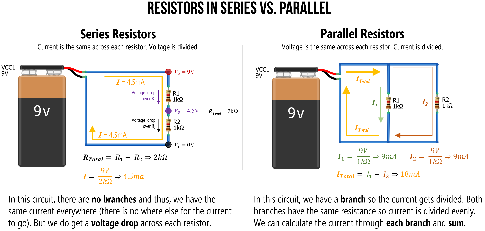

# {{ page.title | replace_first:'L','Lesson '}}
{: .no_toc }

## Table of Contents
{: .no_toc .text-delta }

1. TOC
{:toc}
---

In our Ohm's Law lesson we analyzed relatively straightforward circuits with a single resistor. These circuits helped us build a foundation for and a conceptual understanding of Ohm's Law and how to apply it; however, most circuits are not so simple.

In this lesson, we we're going to extend Ohm's Law to more complicated circuits: resistors in **series** and resistors in **parallel**. In short: 
* Resistors in series **divide voltage** and are one of the most common (and useful) circuit configurations when working with microcontrollers and resistive sensors like [potentiometers](../arduino/potentiometers.md), [force-sensitive resistors](../arduino/force-sensitive-resistors.md), and [photocells](../sensors/photoresistors.md).
* Resistors in parallel **divide current** (and more current travels down paths with less resistance). Parallel circuits are useful, for example, in powering multiple LEDs.

**Figure.** An example of **series** resistors (left) and **parallel** resistors (right). Images made  PowerPoint.
{: .fs-1 }

## Equivalent resistances

Using [Kirchhoff's circuit laws](https://en.wikipedia.org/wiki/Kirchhoff%27s_circuit_laws), we can derive "equivalent" resistances for series and parallel circuits.

For series resistors, we sum resistances to find the aggregate resistance $$R_{equivalent}$$:

$$R_{equivalent} = R_{1} + R_{2} + ... + R_{N-1} + R_{N}$$

For parallel resistors, it's a bit more complicated:

$$R_{equivalent} = \frac{1}{\frac{1}{R_{1}} + \frac{1}{R_{2}} + ... + \frac{1}{R_{N-1}} + \frac{1}{R_{N}}}$$

Yes, the parallel resistance equation is a bit enigmatic but you can derive it yourself (or even forget it all together) if you know Ohm's Law and [Kirchhoff's Laws](https://www.khanacademy.org/science/physics/circuits-topic/circuits-resistance/v/ee-kirchhoffs-current-law).

For us, the most important and useful concept to understand is that **series resistors** divide voltage (we'll use this later in our microcontroller circuits) and that **parallel resistors** divide current (with *more* current flowing through branches with less resistance). The image below attempts to concisely explain this.

And, while the ability to manually understand and analyze a circuit is important in physical computing, if you become confused, you can always use a circuit simulator like [CircuitJS](https://www.falstad.com/circuit/circuitjs.html).

## Series resistors

Resistors in series are connected in sequence: head-to-tail. From Ohm's Law, we know that resistors *drop* voltage (indeed, the voltage drop $$V_{R}$$ over a resistor $$R$$ is $$V_{R} = I * R$$). Thus, multiple resistors "in a row" (in series) will *each* cause a drop in voltage—and the magnitude of this drop is proportional to the resistor (higher resistance, higher voltage drop).

Generally, when we are trying to analyze a circuit with multiple resistor configurations (series, parallel, or a combination), the first step is to determine an **equivalent resistance**. That is, how can we combine all the resistance in the circuit to a single value (called $$R_{total}$$ or $$R_{equivalent}$$) that enables us to apply Ohm's Law across the entire circuit. In the case of solving for current, this would be $$I=\frac{V}{R_{total}}$$

So, let's try it!

### Series example 1: Solve for current

Let's begin with the simplest series resistor circuit: a 9V battery with 100Ω and 1kΩ resistors in series.

#### Step 1: Solve for total resistance

The first step is to solve for the total resistance in our circuit. We know that we sum resistances in series, so: $$R_{Total} = R_{1} + R_{2} \Rightarrow  100Ω + 1000Ω \Rightarrow 1100Ω$$.

#### Step 2: Solve for current I with equivalent resistance

TODO: text goes here. 

### Series example 2: Solve for current

Just to make sure you "get it", let's try one more time but with three resistors instead of two. This time, $$R_{1}=2.2kΩ$$, $$R_{2}=1kΩ$$, and $$R_{3}=470Ω$$.

Again, we start by finding $$R_{Total}$$, which is:
$$R_{Total} = R_{1} + R_{2} + R_{3}$$
$$R_{Total} =2200Ω + 1000Ω + 470Ω$$
$$R_{Total} = 3670Ω$$.

### Voltage dividers

TODO:
- Talk about voltage dividers
- Talk about equation Vin (R1)/(r1+r2) and that the ratio is most important

<!-- Electronics for beginners has some nice voltage divider examples: https://learning.oreilly.com/library/view/electronics-for-beginners/9781484259795/html/488495_1_En_9_Chapter.xhtml -->

<!-- Voltage—like water pressure—can be measured without flow. For example, we can use a multimeter to measure the voltage between two ends of a battery. Notably, any wires we connect to those battery terminals will have the same electric potential.

- Single loop one resistor
- single loop one resistor but vary resistance
- Single loop two resistors in series
- Single loop two resistors in parallel -->

<!-- https://ccrma.stanford.edu/wiki/Introduction_to_Electronics_(condensed)
https://learning.oreilly.com/library/view/make-electronics-2nd/9781680450255/ch01.html
https://learning.oreilly.com/library/view/practical-electronics-for/9781259587559/xhtml/13_Chapter_02.xhtml#
https://learning.oreilly.com/library/view/practical-electronics-components/9781449373221/ch05.html
https://learning.oreilly.com/library/view/electronics-for-beginners/9781484259795/html/488495_1_En_5_Chapter.xhtml -->

## Resources
- [Introduction to circuits and Ohm's Law](https://www.khanacademy.org/science/in-in-class10th-physics/in-in-electricity/in-in-circuits-ohms-law-resistance/v/circuits-part-1), Khan Academy
- [Section 2.12: Ohm's Law and Resistors](https://learning.oreilly.com/library/view/practical-electronics-for/9781259587559/xhtml/13_Chapter_02.xhtml#), Practical Electronics for Inventors by Scherz and Monk.
- [Resistors in series and parallel](https://opentextbc.ca/universityphysicsv2openstax/chapter/resistors-in-series-and-parallel/), opentextbc.ca
- [Series and Parallel Resistors](https://www.khanacademy.org/science/ap-physics-1/ap-circuits-topic/series-circuits-ap/v/ee-series-resistors), Khan Academy

<!-- TODO: Engineering Mindset has a nice [animation](https://youtu.be/kcL2_D33k3o?t=858) of differences between series and parallel -->