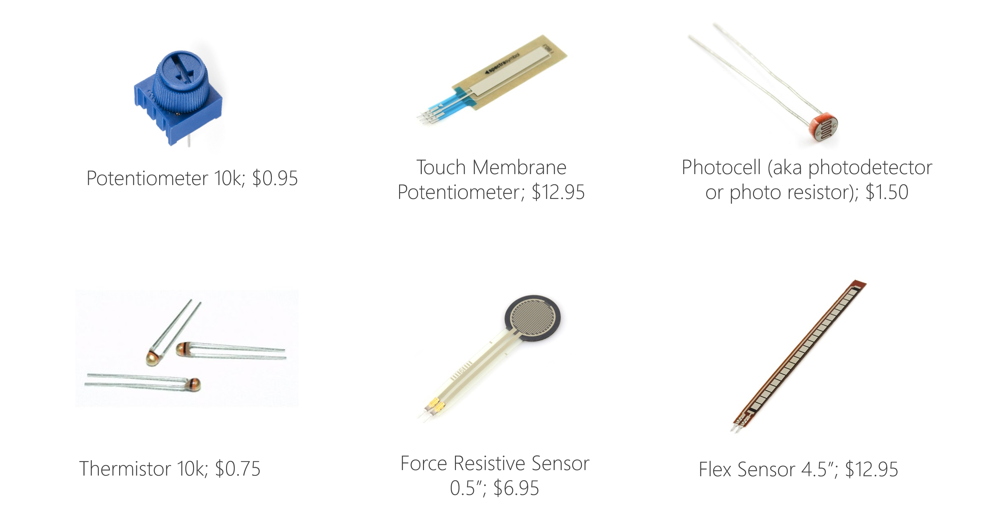
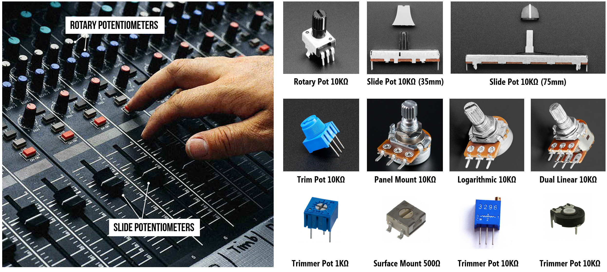
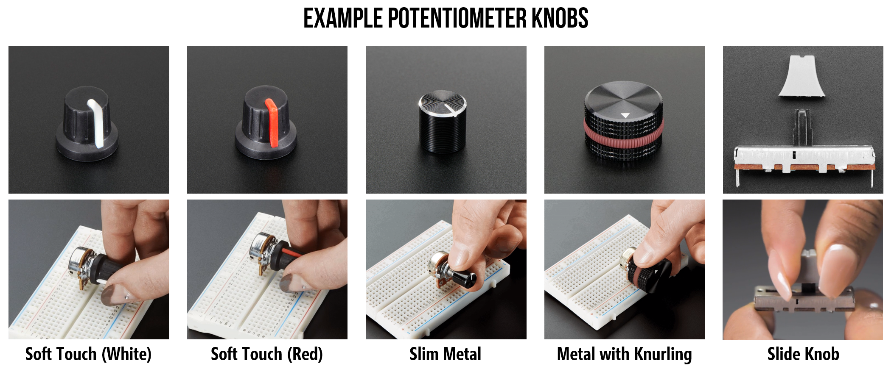
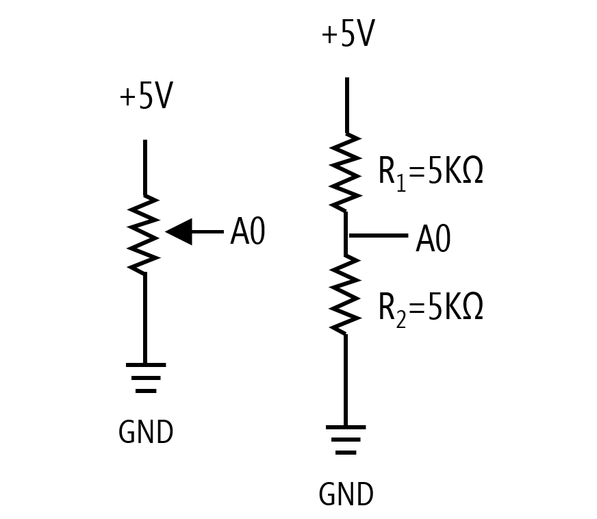

# {{ page.title | replace_first:'L','Lesson '}}
{: .no_toc }

## Table of Contents
{: .no_toc .text-delta }

1. TOC
{:toc}
---

In previous lessons, we worked with [fixed-value resistors](resistors.md)—a critical component in many circuits. In this lesson, we'll learn about **variable resistors**—resistors that *change* their resistance based in response to some physical input (like potentiometers) or environmental input like thermistors (temperature), force-sensitive resistors (force), or photo-sensitive resistors (light).

This is exciting! Physical computing is all about **interaction** and resistive materials that respond to different stimuli open up a new world of possibilities!

**Figure.** Many common **sensors** are actually variable resistors—they dynamically change their resistance in response to some human or environmental input. For example, thermistors change their resistance based on temperature, photocells based on light, force-sensitive resistors (FSRs) based on force. In fact, you have thermistors, photocells, and FSRs in your hardware kits! Prices and pictures are from Sparkfun.com; parts can often be cheaper in bulk from suppliers like [Digi-Key](https://www.digikey.com/) or [Mouser Electronics](https://www.mouser.com/).
{: .fs-1 }

We'll start with one of the most common variable resistors, called a potentiometer, and then **TODO**!!!!

## Variable resistor types

There are **two-leg** variable resistors like rheostats, photocells, and force-sensitive resistors and there are **three-leg** variable resistors, which are called potentiometers. Both types are orientation agnostic—just like regular resistors, they will work in either direction (non-polarized). See schematic symbols below.

**Figure.** Schematic symbols for some example two-leg and three-leg variable resistors. Notice how some schematic symbols are the *same* across variable resistor types.
{: .fs-1 }

A few things to  note:

1. The two-leg variable resistor schematic symbol looks quite similar to a regular resistor but has a **diagonal line** through it indicating variability
2. Some common variable resistors, like light-dependent resistors (LDRs or photocells), have their own schematic symbols
3. The potentiometers have, as indicated, three legs. The middle arrow in its schematic representation (the "wiper leg") can be connected in a circuit. We'll see this below.

Let's dive into potentiometers!

## Potentiometers

A [potentiometer](https://en.wikipedia.org/wiki/Potentiometer) (or pot) is a three-terminal resistor with a sliding or rotating contact that can be used to dynamically vary resistance.  

<video autoplay loop muted playsinline style="margin:0px">
  <source src="assets/videos/Potentiometer_Overview_ByJonFroehlich.mp4" type="video/mp4" />
</video>
**Video.** This animation shows how the wiper can be used to vary resistance in a rotary potentiometer. The figure on the right is the formal electrical symbol.
{: .fs-1 }

Potentiometers are truly ubiquitous electronic components found in everything from volume controls to analog joysticks. In our UW courses, we often provide 10kΩ potentiometers in our kits like the following 10K panel mount and trim potentiometers.

**Figure.** Two example potentiometers commonly included in our hardware kits: a 10kΩ panel mount and and a 10kΩ trim potentiometer.
{: .fs-1 }

Though still widely used, some of the potentiometer's applications spaces have recently been subsumed by digital controls like rotary encoders and buttons. [Rotary encoders](https://learn.adafruit.com/rotary-encoder) look very similar to potentiometers—indeed, with knobs attached they can look identical (however, while rotary encoders can be spun around continuously, potentiometers typically have a controllable angle of 200°-270°)

**Figure.** Potentiometers are ubiquitous input devices found in everything from cars to audio mixing boards. There are nearly infinite designs, so we're only showing a small sample above. Note that you cannot tell the resistance value of a potentiometer (or pot) simply by looking at it nor can you tell whether it is a linear taper or a logarithmic taper. Logarithmic potentiometers are common in audio applications (because the human ear senses loudness logarithmically). Images sources: the potentiometer pictures with dark backgrounds are from [Adafruit](https://www.adafruit.com). The others are from [digikey](https://www.digikey.com/).
{: .fs-1 }

### Potentiometer knobs

There are a variety of knobs that can be placed on panel-mount potentiometers and rotary encoders for user-facing applications like audio mixers, joysticks, and control panels. 

**Figure.** Small sample of potentiometer and rotary encoder knobs. All images from [Adafruit](https://www.adafruit.com/). From left-to-right: [Soft Touch T18 - White](https://www.adafruit.com/product/2047), [Soft Touch T18 - Red](https://www.adafruit.com/product/2046), [Slim Metal Knob](https://www.adafruit.com/product/2058), [Machined Metal Knob](https://www.adafruit.com/product/2056), [Slide Pot with Plastic Knob](https://www.adafruit.com/product/4271)
{: .fs-1 }

#### Creating custom 3D-printable knobs

A fun introductory 3D-printing exercise is to design, model, and print your own potentiometer knob. We typically do this activity at the beginning of our fabrication module in our physical computing course. Here are some simple example 3D-printable potentiometer knobs that we designed.

**Figure.** Three simple potentiometer knobs created in Fusion 360 (in 5-10 minutes each). The CAD designs take roughly 20 minutes to print on an Ultimaker 2+ 3D printer with 0.2mm layer height and no supports or plate adhesion (*e.g.,* brims). All designs by Jon Froehlich. You can see step-by-step tutorial videos [here](https://youtu.be/bF1hreNH_E0) and [here](https://youtu.be/1Yz9DDb4QnI).
{: .fs-1 }

Even more fun is to combine your custom 3D prints with a microcontroller and to build custom applications that create new interactive experiences

<video autoplay loop muted playsinline style="margin:0px">
  <source src="assets/videos/3DPrintedTrimPotKnobDemo2_TrimmedAndOptimized_ByJonFroehlich.mp4" type="video/mp4" />
</video>
**Video.** A short video demonstrating the custom 3D printed potentiometer knobs being used as custom game controllers with an Arduino Leonardo and custom [Processing](https://processing.org/) sketches. The code for the Arduino+Processing "Etch-a-sketch" is [here](https://github.com/makeabilitylab/arduino/tree/master/Processing/ArduinoEtchASketch) and the code for the Arduino+Processing "Pong" is [here](https://github.com/makeabilitylab/arduino/tree/master/Processing/ArduinoPong). All 3D CAD designs and code by Jon Froehlich.
{: .fs-1 }

### Potentiometers as analog joysticks

Potentiometers have a long history as game controllers. In our hardware kits, we often include a 2-axis joystick like [this one](https://learn.parallax.com/tutorials/language/propeller-c/propeller-c-simple-devices/joystick) from Parallax ([$6.95 on Adafruit](https://www.adafruit.com/product/245)).

**Figure.** The [Parallax 2-Axis Joystick](https://learn.parallax.com/tutorials/language/propeller-c/propeller-c-simple-devices/joystick) has two embedded 10 kΩ potentiometers, one for each axis. You can see a video demo [here](https://youtu.be/SXtPGAu4MMw).
{: .fs-1 }

By moving the analog joystick, you independently control two embedded 10kΩ potentiometers. There is a $$V_{Out}$$ for the "Up/Down" potentiometer and a $$V_{Out}$$ for the "Left/Right" potentiometer. See the circuit diagram above.

<video autoplay loop muted playsinline style="margin:0px">
  <source src="assets/videos/Parallax_2-AxisJoystick_TrimmedAndMuted.mp4" type="video/mp4" />
</video>
**Video.** A short snippet from this [official Parallax video](https://youtu.be/SXtPGAu4MMw) showing how physical movement of the joystick is translated into an electrical signal using two potentiometers.
{: .fs-1 }

### How does a potentiometer work?

Potentiometers have three legs: the resistance between the outer two legs (Leg 1 and Leg 3) will not vary. For example, if you are using a 10kΩ potentiometer, then the resistance between Legs 1 and 3 will be 10kΩ. If you're using a 1kΩ resistor, then the resistance between Legs 1 and 3 will be 1kΩ, and so on.

The power of a potentiometer is in that middle leg (Leg 2) whose resistance will vary depending on the potentiometer's sliding or rotating contact (the wiper) position. It may help to think of a potentiometer as containing two interdependent resistors $$R_1$$ and $$R_2$$ that always sum to $$R_{Total}$$ (where $$R_{Total}$$ is the potentiometer's total value). As you move the slider contact, $$R_1$$'s resistance will increase as $$R_2$$'s resistance decreases. See animation below.

<video autoplay loop muted playsinline style="margin:0px">
  <source src="assets/videos/PotentiometerIntroduction_TrimmedAndCropped.mp4" type="video/mp4" />
</video>
**Video.** TODO. Animation by Jon Froehlich. Created in PowerPoint.
{: .fs-1 }

### Potentiometers as voltage dividers

Potentiometers are actually conveniently packaged voltage dividers, which we learned about in [Lesson 3](series-parallel.md): $$R_{1}$$ and $$R_{2}$$ divide the voltage as the potentiometer wiper moves.

A 10kΩ potentiometer split into two constituent resistors ($$R_{1}$$) and ($$R_{2}$$). In this case, the wiper is in the middle, so $$V_{A0}$$ equals 2.5V.
{: .fs-1 }

<!-- TODO: fix image to use Vout and Vin and not show 5K for resistance values? -->

As you move the wiper, the resistance across Legs 1 and 2 ($$R_{1}$$) and Legs 2 and 3 ($$R_{2}$$) proportionally change but always sum to $$R_{total}$$.

#### Voltage divider equation

The voltage divider equation, which derives from Ohm's Law, states that $$V_{out} = V_{in} \cdot \frac{R_2}{R_1 + R_2}$$. So, the voltage at leg 2 (the wiper) of the potentiometer is equal to $$V_{in} \cdot \frac{R_2}{R_1 + R_2}$$  

For example, if we set Leg 1 to $$5V$$ and Leg 3 to $$GND$$, then as we change the potentiometer dial, the voltage at Leg 2 ($$V_{out}$$) will dynamically shift according to the voltage divider equation.

The following video breaks down a potentiometer, shows how to think about ($$R_{1}$$) and ($$R_{2}$$) as the wiper moves, and demonstrates how the potentiometer functions in a circuit via a simulation:

<iframe width="736" height="414" src="https://www.youtube.com/embed/ZAzX_pxuWps" frameborder="0" allow="accelerometer; autoplay; encrypted-media; gyroscope; picture-in-picture" allowfullscreen></iframe>
Video shows how the voltage output at Leg 2 changes based on the wiper position, which splits the potentiometer into two "resistor" sub-parts, ($$R_{1}$$) and ($$R_{2}$$), which creates a voltage divider.
{: .fs-1 }

#### Video on Ohm's Law and voltage dividers

Jeff Feddersen, from NYU's ITP program, has a great video about potentiometers and nicely relates them to Ohm's Law and voltage dividers. Please watch this video before continuing (it's one of my favorites!).

<iframe src="https://player.vimeo.com/video/76442431" style="position:absolute;top:0;left:0;width:100%;height:100%;" frameborder="0" allow="autoplay; fullscreen" allowfullscreen></iframe>

<a href="https://vimeo.com/76442431">Ohm Part 2</a> from <a href="https://vimeo.com/fddrsn">Jeff Feddersen</a> on <a href="https://vimeo.com">Vimeo</a>.

{: .fs-1 }

See also this [Sparkfun tutorial](https://learn.sparkfun.com/tutorials/voltage-dividers/all) on voltage dividers.

We're going to start with using only **two legs** of the potentiometer. We'll need all **three legs** when we start working again with microcontrollers.

### Using a potentiometer as a two-terminal variable resistor

When only two terminals (or legs) of the potentiometer are used—an outer leg and the wiper (or signal) leg—the potentiometer acts as **rheostat** or a two-terminal **variable resistor**. 

That said, 

To use these two-leg variable resistors with a microcontroller, we will need to add an additional fixed resistor to create a voltage divider. We'll show you how to do that in our [next lesson](force-sensitive-resistors.md).

Here, however, we are going to focus on using a potentiometer first as a rheostat and then as a voltage divider with our Arduino.

## Outline

- Introduce variable resistors
- Introduce potentiometers and voltage dividers
- Show CircuitJS simulations
- Use potentiometers in Tinkercad
- Build actual circuits
- Use FSR and photocell

----

## Potentiometers

<video autoplay loop muted playsinline style="margin:0px">
  <source src="assets/videos/PotentiometerIntroduction-WiperPositions-TrimmedAndCropped_ByJonFroehlich.mp4" type="video/mp4" />
</video>
**Video.** This animation shows how the wiper can be used to vary resistance. The figure on the right is the formal electrical symbol.
{: .fs-1 }

### Demonstrating a potentiometer as a voltage divider

<video autoplay loop muted playsinline style="margin:0px">
  <source src="assets/videos/PotentiometerIntroduction-VoltageDividerWithCircuitJS_ByJonFroehlich.mp4" type="video/mp4" />
</video>
**Video.** This animation shows how the wiper can be used to vary resistance. The figure on the right is the formal electrical symbol.
{: .fs-1 }

Animation shows how the wiper can be used to vary resistance. The figure on the right is the formal electrical symbol.
{: .fs-1 }

Potentiometers are truly ubiquitous electronic components found in everything from volume controls to analog joysticks. In our UW courses, we often provide 10kΩ potentiometers in our kits (like [this one](https://www.adafruit.com/product/356) from Adafruit).

<!-- TODO: talk about different taper types? -->
<!-- TODO: talk about potentiometer drawbacks--like maintainance, corrosion. See https://ultimateelectronicsbook.com/potentiometers/ -->

<!-- 
<iframe src="https://player.vimeo.com/video/76442431" style="position:absolute;top:0;left:0;width:100%;height:100%;" frameborder="0" allow="autoplay; fullscreen" allowfullscreen></iframe>

<a href="https://vimeo.com/76442431">Ohm Part 2</a> from <a href="https://vimeo.com/fddrsn">Jeff Feddersen</a> on <a href="https://vimeo.com">Vimeo</a>.

## Resources
 - [Chapter 11: Potentiometer](https://learning.oreilly.com/library/view/Encyclopedia+of+Electronic+Components+Volume+1/9781449333881/ch11.html) in Platt, *Make: Encyclopedia of Electronic Components Volume 1: Resistors, Capacitors, Inductors, Switches, Encoders, Relays, Transistors*, O'Reilly, 2012. -->

