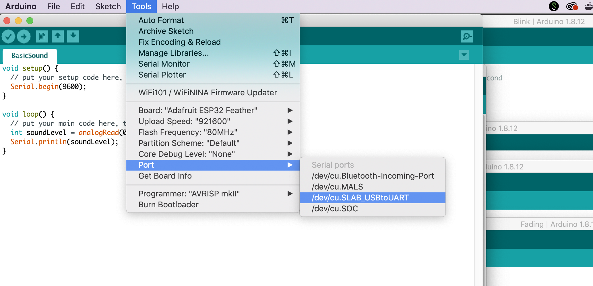

## Huzzah32 installation instructions for the Arduino IDE

You can follow the [official Adafruit Huzzah32 Arduino IDE installation instructions](https://learn.adafruit.com/adafruit-huzzah32-esp32-feather/using-with-arduino-ide), which we've expanded a bit below.

### Step 1: Add ESP32 to Arduino Board Manager

1. Open the Arduino IDE

2. Go to Preferences

3. In preferences, find the `Additional Board Manager URLs:` field 

4. Add the ESP32 JSON url `https://raw.githubusercontent.com/espressif/arduino-esp32/gh-pages/package_esp32_index.json`

5. Open the Arduino IDE Board Manager

6. Search for `ESP32` and click `Install`

### Step 2: Install USB to UART Bridge Virtual COM Port Driver

As noted in the [official Adafruit Huzzah32 Arduino IDE installation instructions](https://learn.adafruit.com/adafruit-huzzah32-esp32-feather/using-with-arduino-ide), the second step is to install the USB to UART Bridge Virtual COM Port (VCP) driver to interface with the ESP32 board. You can download the driver from Windows, Mac, and Linux [here](https://www.silabs.com/products/development-tools/software/usb-to-uart-bridge-vcp-drivers).

### Step 3: Select `Adafruit ESP32 Feather` in board menu

Once installed, select the `Adafruit ESP32 Feather` in the Board menu.

### Step 4: Select the appropriate port

Finally, select the appropriate port

### Resources

### Official ESP32 Documentation
- [API Reference](https://docs.espressif.com/projects/esp-idf/en/latest/esp32/api-reference/index.html)
- [API Guides](https://docs.espressif.com/projects/esp-idf/en/latest/esp32/api-guides/index.html)

### Other
- [Sparkfun's ESP32 Thing Hookup Guide](https://learn.sparkfun.com/tutorials/esp32-thing-hookup-guide/all). Written for Sparkfun's ESP32 Thing board but has relevant WiFi and BLE examples.

## Application ideas
- Connect to WiFi, get the time, print out on OLED. Create a clock?
- Connect to WiFi, download Covid-19 stats, print out on display
- Evidently ESP32 may support Serial.printf? [See link](https://arduino.stackexchange.com/a/53751).

### Sound / VUMeters

- [Using the ESP32's built-in DAC](https://www.reddit.com/r/esp32/comments/bid08m/finally_got_audio_sampling_via_dma_with_no_cpu/)?

