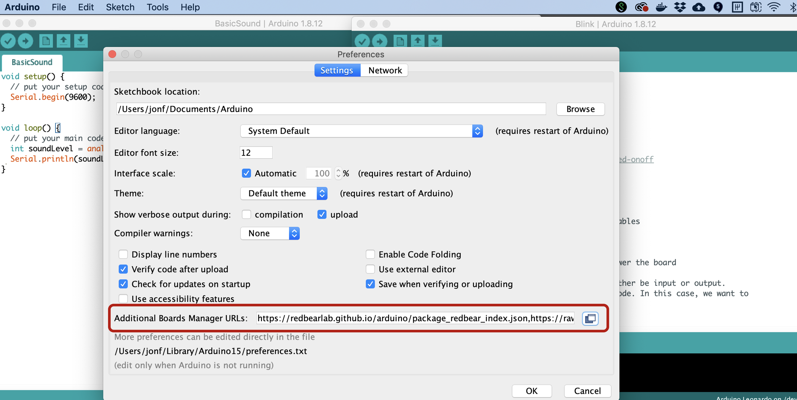

# {{ page.title }}
{: .no_toc }

## Table of Contents
{: .no_toc .text-delta }

1. TOC
{:toc}
---

<!-- Images of lots of esp32 boards: https://randomnerdtutorials.com/getting-started-with-esp32/
and https://makeradvisor.com/esp32-development-boards-review-comparison/ -->

| Name | Arduino Uno | Huzzah32 |
| ---- | ----------- | -------- |
| Image |  |  |
| Microcontroller | 8-bit, 16 MHz [ATmega328P](https://www.microchip.com/wwwproducts/en/ATmega328) | 32-bit, 240 MHz dual core Tensilica LX6 |
| Microcontroller Manufacturer | Microchip (Atmel) | Espressif |
| System-on-a-chip | N/A | [ESP32](https://www.espressif.com/sites/default/files/documentation/esp32_datasheet_en.pdf) |
| Input voltage (limit) | 6-20V | 7-12V |
| Operating voltage | 5V | 3.3V |
| Flash memory | 32KB (0.5KB used by bootloader) | 4MB |
| SRAM | 2KB | 520KB |
| Analog inputs | 6 | 8 |
| GPIO pins | 14 | 21 |
| PWM pins | 6 | All |
| Wi-Fi | N/A | 802.11b/g/n HT40 Wi-Fi transceiver |
| Bluetooth | N/A | Dual mode (classic and BLE) |

Recall that flash memory is where your compiled program is stored and SRAM is where your microcontroller creates and manipulates variables when it runs.

The ESP32 also has 2xI2S Audio, 2xDAC, 2xI2C (only one configured by default in the Feather Arduino IDE support), 3 x SPI (only one configured by default in Feather IDE support). See [Adafruit overview](https://learn.adafruit.com/adafruit-huzzah32-esp32-feather/overview).

## Huzzah32 pin diagram

So, what do all of these pins do? Oh, so many things!

The pin diagram for the Huzzah32 in the official Adafruit [docs](https://learn.adafruit.com/adafruit-huzzah32-esp32-feather/pinouts) is pretty confusing. We read a few documentation sources and created our own pin diagram:

See the Adafruit Huzzah32 [docs](https://learn.adafruit.com/adafruit-huzzah32-esp32-feather/pinouts) for details.
{: .fs-1 } 

Some important notes:
- There are **21 GPIO pins**; however, on the Huzzah32, pins 34 (A2), 39 (A3), 36 (A4) are not output-capable and thus should only be used for input. So, **18 GPIO pins** in total
- **PWM** is possible on all 18 GPIO pin
- There are **13 analog input pins**; however, A13 is not exposed. It's used for measuring the voltage on the LiPoly battery via a voltage divider. When reading in the battery level using `analogRead(A13)`, make sure multiply by 2 to get correct reading.
- The Adafruit docs state (somewhat confusingly) that ADC#1 only works when WiFi has started. This affects A2, A3, A4, A7, and A9.

TODO: what is the ADC resolution?

<!-- 
Pin diagram from [Zerynth](https://docs.zerynth.com/latest/official/board.zerynth.adafruit_huzzah32/docs/index.html). ICU stands for [Input Capture Unit](https://docs.zerynth.com/official/core.zerynth.stdlib/r2.0.9/icu.html).
{: .fs-1 }  -->

<!-- Another helpful pin diagram: https://people.eecs.berkeley.edu/~boser/courses/49_sp_2019/N_gpio.html#_pin_diagram -->

## Huzzah32 installation instructions for the Arduino IDE

You can follow the [official Adafruit Huzzah32 Arduino IDE installation instructions](https://learn.adafruit.com/adafruit-huzzah32-esp32-feather/using-with-arduino-ide), which we've expanded a bit below.

### Step 1: Add ESP32 to Arduino Board Manager

1. Open the Arduino IDE

2. Go to Preferences

3. In preferences, find the `Additional Board Manager URLs:` field 

4. Add the ESP32 JSON url `https://raw.githubusercontent.com/espressif/arduino-esp32/gh-pages/package_esp32_index.json`

5. Open the Arduino IDE Board Manager

6. Search for `ESP32` and click `Install`

### Step 2: Install USB to UART Bridge Virtual COM Port Driver

As noted in the [official Adafruit Huzzah32 Arduino IDE installation instructions](https://learn.adafruit.com/adafruit-huzzah32-esp32-feather/using-with-arduino-ide), the second step is to install the USB to UART Bridge Virtual COM Port (VCP) driver to interface with the ESP32 board. You can download the driver from Windows, Mac, and Linux [here](https://www.silabs.com/products/development-tools/software/usb-to-uart-bridge-vcp-drivers).

### Step 3: Select `Adafruit ESP32 Feather` in board menu

Once installed, select the `Adafruit ESP32 Feather` in the Board menu.

### Step 4: Select the appropriate port

Finally, select the appropriate port

### Resources

### Official ESP32 Documentation
- [API Reference](https://docs.espressif.com/projects/esp-idf/en/latest/esp32/api-reference/index.html)
- [API Guides](https://docs.espressif.com/projects/esp-idf/en/latest/esp32/api-guides/index.html)

### Other
- [Sparkfun's ESP32 Thing Hookup Guide](https://learn.sparkfun.com/tutorials/esp32-thing-hookup-guide/all). Written for Sparkfun's ESP32 Thing board but has relevant WiFi and BLE examples.

<!-- ## Application ideas
- Connect to WiFi, get the time, print out on OLED. Create a clock?
- Connect to WiFi, download Covid-19 stats, print out on display
- Evidently ESP32 may support Serial.printf? [See link](https://arduino.stackexchange.com/a/53751).

### Sound / VUMeters

- [Using the ESP32's built-in DAC](https://www.reddit.com/r/esp32/comments/bid08m/finally_got_audio_sampling_via_dma_with_no_cpu/)?
- [Streaming music with I2S](https://www.reddit.com/r/esp32/comments/dluvgl/streaming_web_radio_to_esp32_playing_it_using_the/)

### Platform IO for VSCode

- https://docs.platformio.org/en/latest/integration/ide/visualstudio.html
- https://maker.pro/arduino/tutorial/how-to-use-platformio-in-visual-studio-code-to-program-arduino -->

