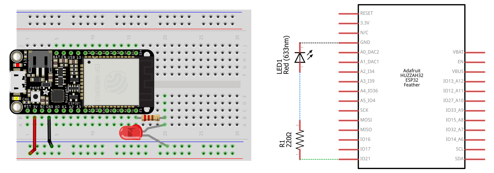

# {{ page.title | replace_first:'L','Lesson '}}
{: .no_toc }

## Table of Contents
{: .no_toc .text-delta }

1. TOC
{:toc}
---

In this lesson, we'll rehash the ole [Blink lesson](../arduino/led-blink.md) from the [Intro to Output](../arduino/intro-output.md) series but with the **ESP32**.

## Materials

All of our ESP32 examples will use the Huzzah32 but any ESP32 board will work as long as you've installed the appropriate Arduino library in the Arduino IDE. Also, if you're not using the Huzzah32, the pins will also be different, so consult your specific pin out diagram.

| Breadboard | ESP32 | LED | Resistor |
| ---------- |:-----:|:-----:|:-----:|
|  |     |  |  |
| Breadboard | Huzzah32  | Red LED | 220Ω Resistor |

## Circuit

The ESP32 has a large number of pins and each can be used for multiple functions. So, it's important that you have the pin diagram easily available. We suggest printing it out (and typically give out pin diagrams like this in our courses). If you don't have a printer, we suggest opening the diagram on a second monitor or otherwise keeping it handy.

See the Adafruit Huzzah32 [docs](https://learn.adafruit.com/adafruit-huzzah32-esp32-feather/pinouts) for details. Right-click and open image in a new tab to zoom in and print.
{: .fs-1 } 

### Building the circuit

Our circuit is about as simple as they come. 

Seating the Huzzah32 into the breadboard might take some effort. Please take care not to bend pins when placing and removing the board. Given that the Huzzah32 takes up so much room, you might consider using the full-sized breadboard rather than the half-sized.

Note, we're still using a 220Ω resistor just like the original [Blink lesson](../arduino/led-blink.md). But now we're using a 3.3V board rather than 5V (like the Uno or Leonardo), so we'll be supplying less current with the same resistor value. To obtain the predicted current in our circuit, assume a ~2V forward voltage ($$V_f$$) for a red LED. Thus, 

$$I=V/R \\ 
I = \frac{V_{cc} - V_f}{R} \\
I = \frac{3.3V - 2V}{220Ω} \\
I = 5.9mA$$

## Code

The code is the exact same as the original Arduino [Blink lesson](../arduino/led-blink.md) (be forewarned: it won't be for the [fade](led-fade.md) lesson). The hard part here is just getting the wiring right and figuring out which pins correspond to what!

Given that this should be review, try writing a Blink implementation without consulting our solution below. You can do it!

<!-- https://github.com/makeabilitylab/arduino/blob/master/ESP32/Basics/Blink/Blink.ino -->

## Video

<!-- TODO: insert workbench video -->

## Next Lesson

In the [next lesson](led-fade.md), we'll learn about how to use "analog output" on the ESP32 to fade an LED's brightness up and down. This is similar to our original Arduino [LED fade](../arduino/led-fade.md) lesson but we won't be using `analogWrite`!

[Previous: Introduction to the ESP32](esp32.md){: .btn .btn-outline }
[Next: Using PWM on the ESP32](led-fade.md){: .btn .btn-outline }
