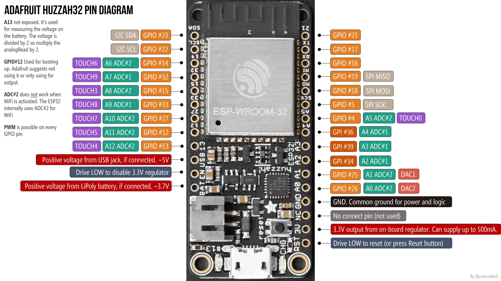

# {{ page.title | replace_first:'L','Lesson '}}
{: .no_toc }

## Table of Contents
{: .no_toc .text-delta }

1. TOC
{:toc}
---

In this lesson, we'll show how to use [PWM](https://www.arduino.cc/en/Tutorial/PWM) output on the ESP32 to fade an LED on and off. This is where our lessons begin to differ from the [Intro to Output](../arduino/intro-output.md) series.

Importantly, the `analogWrite` method—which was always a misnomer in the Arduino library because it output a pulse-width modulation (PWM) waveform rather than a true analog voltage—is not implemented in the ESP32 Arduino library. Instead, there is a set of PWM methods, which give you additional control but at a cost of complexity. So, it's good that, by now, you understand PWM. If you want a refresher, see our description with videos [here](../arduino/led-fade.md#Pulse-width-modulation-PWM).

## Materials

You'll need the same materials as the [last lesson](led-blink.md):

| Breadboard | ESP32 | LED | Resistor |
| ---------- |:-----:|:-----:|:-----:|
|  |     |  |  |
| Breadboard | Huzzah32  | Red LED | 220Ω Resistor |

## PWM on ESP32

To fade an LED on and off with an Arduino Uno (or other basic boards), you use the `[analogWrite](https://www.arduino.cc/reference/en/language/functions/analog-io/analogwrite/)` method. As we know by now, `analogWrite` does not actually drive an analog voltage to the specified pin but, instead, uses pulse-width modulation (PWM). These PWM waves are produced by hardware timers, which precisely drive a pin `HIGH` and `LOW` based on the set duty cycle. So, on the Arduino Uno, `analogWrite(<pin>, 127)` would output a 5V value for half the period (because 127/255 = ~50%) and `analogWrite(<pin>, 191)` would output a 5V for 75% of the period (because 191/255 = ~75%). The fraction of the time the signal is `HIGH` is called the duty cycle. The Arduino Uno (and Leonardo) only have six PWM outputs because they have three timers, each which can be used two control two PWM pins.

On the ESP32, all 18 GPIO pins support PWM but the programming approach is fundamentally different. Rather than `analogWrite`, we'll use Espressif's [LED control (LEDC)](https://docs.espressif.com/projects/esp-idf/en/latest/esp32/api-reference/peripherals/ledc.html) system. More specifically, we'll be using an Arduino-based abstraction layer above this. While the documentation for this Arduino library is a bit light (indeed, I never found formal API documentation), the code is open source and available here ([.h file](https://github.com/espressif/arduino-esp32/blob/a4305284d085caeddd1190d141710fb6f1c6cbe1/cores/esp32/esp32-hal-ledc.h), [.c file](https://github.com/espressif/arduino-esp32/blob/a4305284d085caeddd1190d141710fb6f1c6cbe1/cores/esp32/esp32-hal-ledc.c)).

### The LEDC library

The LEDC library was written primarily to control LEDs but can also be used for other purposes where PWM waveforms are useful like playing "music" to piezo speakers and driving motors.

Unlike all the other I/O we've done thus far with the Arduino, the LEDC library works on **channels** rather than individual **pins**. We setup a channel with a PWM waveform frequency and duty cycle and then subscribe or "attach" output pins to these channels. Multiple pins can attach to the same channel and will receive the same PWM waveform. The ESP32 has 16 channels in total, each which can generate an independent waveform. So, while all 18 GPIO pins support PWM, we can only drive 16 of them at once with **different** waveforms. However, we can attach all 18 GPIO pins to a single channel (or divide them across channels). In the animation below, we've attached all 18 GPIO pins to channel 0.

All 18 GPIO pins are subscribed to the same PWM channel.
{: .fs-1 } 

#### LEDC API

<!-- https://github.com/espressif/arduino-esp32/blob/96822d783f3ab6a56a69b227ba4d1a1a36c66268/tools/sdk/include/driver/driver/ledc.h -->

The LEDC API has four relevant methods:



/**
 * Sets up a channel (0-15), a PWM duty cycle frequency, and a PWM resolution (1 - 16 bits) 
 */
double      ledcSetup(uint8_t channel, double freq, uint8_t resolution_bits);

/**
 * Writes out a duty cycle value to the specified channel. The duty cycle value should be
 * between 0 - 2^PWM resolution
 */
void        ledcWrite(uint8_t channel, uint32_t duty);

/**
 * Attach the given pin to the specified channel (0-15)
 */
void        ledcAttachPin(uint8_t pin, uint8_t channel);

/**
 * Detach the previously attached pin
 */
void        ledcDetachPin(uint8_t pin);


The Espressif [docs](https://docs.espressif.com/projects/esp-idf/en/latest/esp32/api-reference/peripherals/ledc.html#supported-range-of-frequency-and-duty-resolutions) emphasize that the PWM frequency and resolution are interdependent; however, the docs do not precisely describe this relationship.  

See the Adafruit Huzzah32 [docs](https://learn.adafruit.com/adafruit-huzzah32-esp32-feather/pinouts) for details. Right-click and open image in a new tab to zoom in and print.
{: .fs-1 } 

Our circuit is about as simple as they come. 

Seating the Huzzah32 into the breadboard might take some effort. Please take care not to bend pins when placing and removing the board. Given that the Huzzah32 takes up so much room on the breadboard, you might consider using the full-sized breadboard rather than the half-sized.

Note, we're still using a 220Ω resistor just like the original [Blink lesson](../arduino/led-blink.md). But now we're using a 3.3V board rather than 5V (like the Uno or Leonardo), so we'll be supplying less current with the same resistor value. To obtain the predicted current in our circuit, assume a ~2V forward voltage ($$V_f$$) for a red LED. Thus, 

$$I=V/R \\ 
I = \frac{V_{cc} - V_f}{R} \\
I = \frac{3.3V - 2V}/220Ω \\
I = 5.9mA$$

## Code

The code is the exact same as the original Arduino [Blink lesson](../arduino/led-blink.md) (forewarning: it won't be for PWM output). The hard part here is just getting the wiring right and figuring out which pins correspond to what!

Given that this should be review, try writing a Blink implementation without consulting our solution below. You can do it!

<!-- https://github.com/makeabilitylab/arduino/blob/master/ESP32/Basics/Blink/Blink.ino -->

