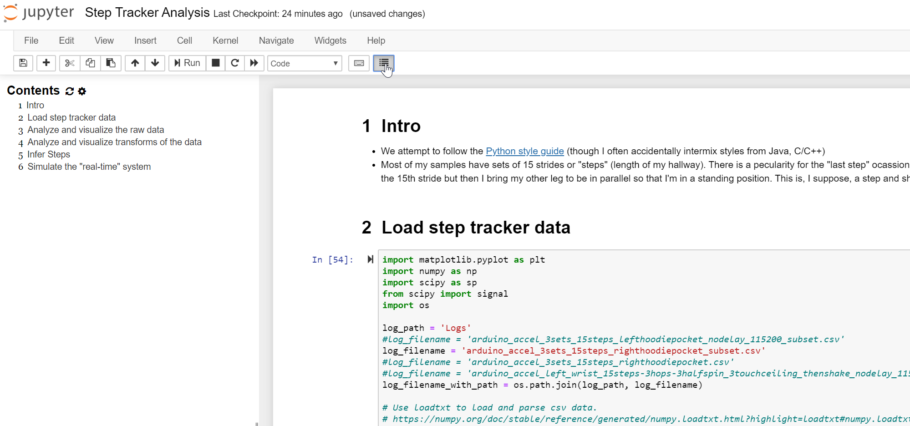

---
layout: default
title: Jupyter Notebook
nav_order: 5
has_toc: true # on by default
has_children: true
nav_exclude: false
---
# {{ page.title }}
{: .no_toc }

## Table of Contents
{: .no_toc .text-delta }

1. TOC
{:toc}
---


We will be using [Jupyter Notebook](https://jupyter.org/index.html) for the signal processing and machine learning portion of our course. Jupyter Notebook is a popular "data science" platform for quickly analyzing, processing, classifying, modeling, and visualizing data. While Notebook supports multiple languages (like R, Julia), we'll be using Python (specifically, Python 3).

For our signal analysis, we'll be using the [SciPy](https://www.scipy.org/) ("Sigh Pie") ecosystem of open-source libraries for mathematics, science, and engineering. Specifically, [NumPy](https://numpy.org/), [SciPy](https://www.scipy.org/scipylib/index.html), and [matplotlib](https://matplotlib.org/). We may also dabble in [Pandas](https://pandas.pydata.org/) and [Seaborn](https://seaborn.pydata.org/). And don't worry, all of these libraries will be managed and installed for us!

Just like for Arduino, there is a plethora of wonderful tutorials, forums, and videos about Jupyter Notebook and the SciPy libraries. Please feel free to search online and to share what you find with the class.

<!-- maybe talking about Google Colab here? https://colab.research.google.com/notebooks/intro.ipynb -->

## Installation and configuration

To install, Jupyter Notebook, follow the installation instructions below (or read the official [quickstart guide](https://jupyter.readthedocs.io/en/latest/install.html)).

**Importantly**, please use Anaconda to install Jupyter Notebook and all dependencies. This is the recommended way to install and use Notebook ([link](https://jupyter.readthedocs.io/en/latest/install.html#id3)).

#### Step 1: Download Anaconda

Download and install [Anaconda](https://www.anaconda.com/download) (latest Python 3 version)

#### Step 2: Run the server

Open your terminal (on linux or Mac) or the Anaconda Prompt (on Windows) and type:

```
> jupyter notebook
```

See "Running the Notebook" in the official Jupyter Notebook [docs](https://jupyter.readthedocs.io/en/latest/running.html).

### Installing notebook extensions

We strongly recommend installing the [`jupyter_contrib_nbextensions`](https://jupyter-contrib-nbextensions.readthedocs.io/en/latest/index.html) notebook extensions, which contains a collection of community-contributed (unofficial) extensions for Jupyter Notebook, including a table of contents generator and navigation pane called [Table of Contents (2)](https://jupyter-contrib-nbextensions.readthedocs.io/en/latest/install.html). See figure below.


Screenshot of a Jupyter Notebook with the nbextension called Table of Contents (2), which auto-generates a navigation pane based on markdown headers. This is installed as part of the [`jupyter_contrib_nbextensions` ](https://jupyter-contrib-nbextensions.readthedocs.io/en/latest/index.html)notebook extensions
{: .fs-1 }

Feel free to follow the official installation instructions [here](https://jupyter-contrib-nbextensions.readthedocs.io/en/latest/install.html) or our simplified version below:

#### Step 1: Use conda

To install the `nbextensions`, open your terminal (on linux or Mac) or the Anaconda Prompt (on Windows) and type:

```
> conda install -c conda-forge jupyter_contrib_nbextensions
```

#### Step 2: Open Jupyter Notebook and configure extensions

Restart Jupyter Notebook and you should see a tab called `Nbextensions` on the home screen. Click on that tab and then you should see all nbextensions. Click on `Table of Contents (2)` to configure and Enable it. See screenshots below.


#### Step 3: Try out TOC

Make some headers in markdown and then click on the `Table of Contents` button in the toolbar to see an auto-generated and clickable navigation sidebar. You can also access the TOC via the `Navigate` menu item.



## How to use Jupyter Notebook

Start by reading the official introduction to Jupyter Notebook ([link](https://jupyter-notebook.readthedocs.io/en/stable/notebook.html)). We will also go over basic functionality in class. Finally, there are many good tutorials online.


