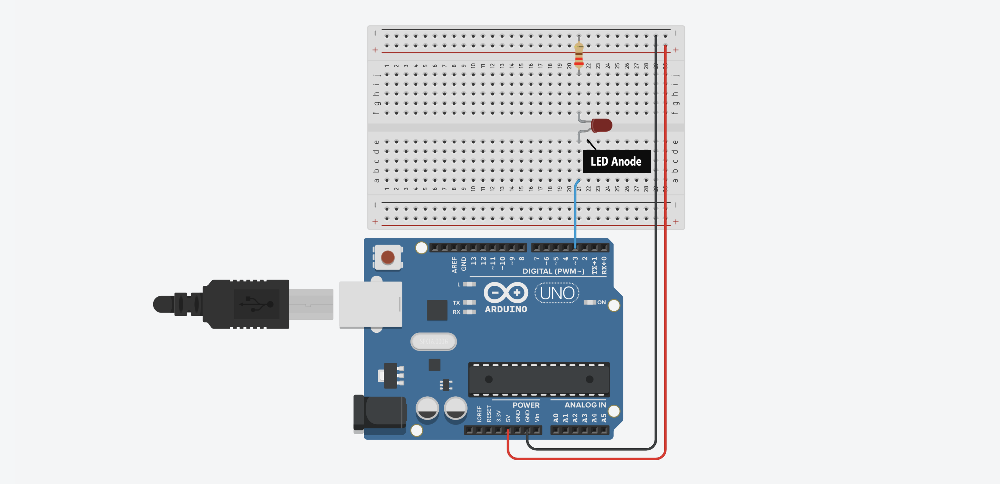
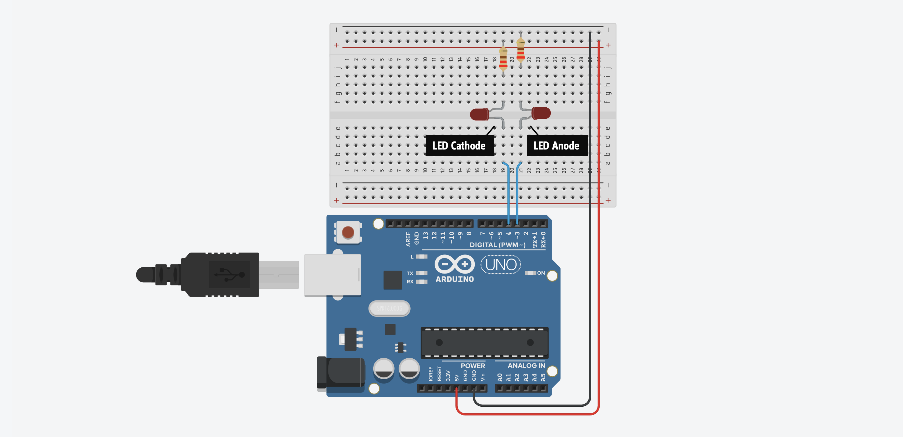

# Blinking Two LEDs
{: .no_toc }

## Table of Contents
{: .no_toc .text-delta }

1. TOC
{:toc}
---

In this tutorial, we will learn the difference between **current sourcing** and **current sinking** by revisiting our [LED Blink](led-blink.md) example. We are going to TODO.

TODO: insert video of two LEDS blinking (alternatively). Should have annotations? Should have current animation?

## Materials

Our materials are *almost* the same as before but this time, we are going to make two separate LED circuits (with the same components). So, we need **two** red LEDs and **two** 220Ω resistors. Now that we're using more components, we'll also need a **breadboard**—which will make it easier to make a clean, organized circuit.

| Arduino | LED | Resistor |
|:-----:|:-----:|:-----:|
|     |  |  |
| Arduino Uno, Leonardo, or similar  | **2** Red LEDs | **2** 220Ω Resistors |

TODO: insert breadboard here.

## Making the circuit

### Step 1: Wire up the power and GND rails

### Step 2: Wire up the first LED circuit

In this step, you'll wire up the exact same circuit used in our previous examples (*e.g.,* [LED Blink](led-blink.md) and [LED Fade](led-fade.md)) but this time using a breadboard. Make sure the LED anode (the long leg) is facing Pin 3.

### Step 3: Wire up the second LED circuit

In this step, you'll wire up the second LED circuit. This time, however, you're going to connect the LED cathode (short leg) to Pin 4

[Previous: LED Fade](led-fade.md){: .btn .btn-outline }
[Next: RGB LEDs](rgb-led.md){: .btn .btn-outline }
