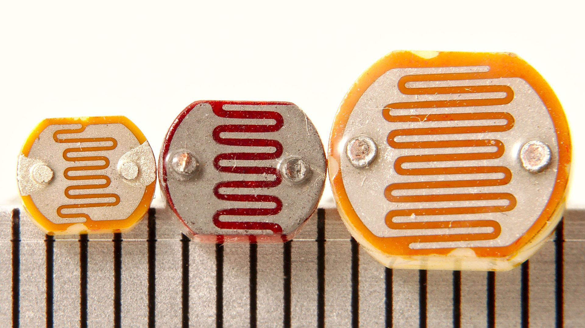
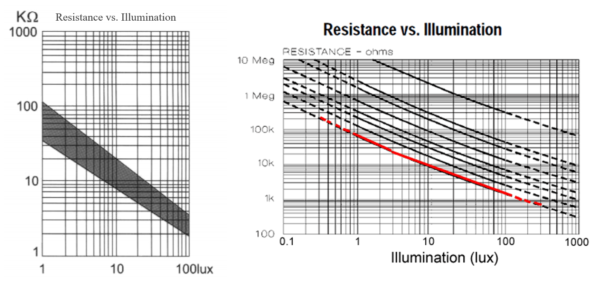
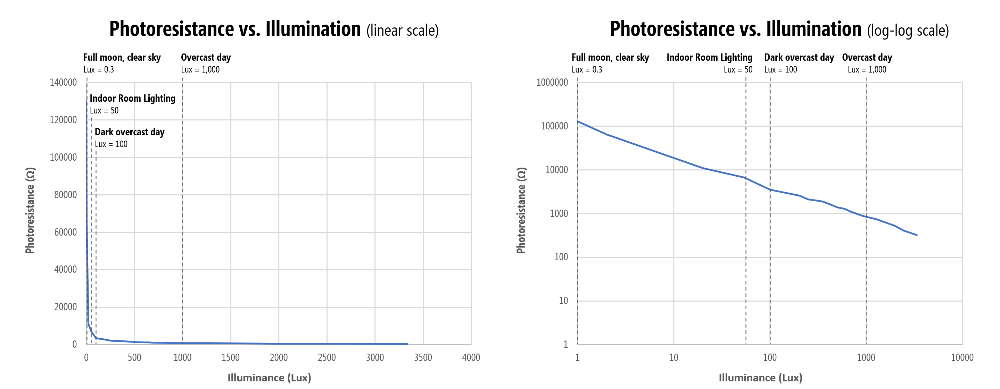
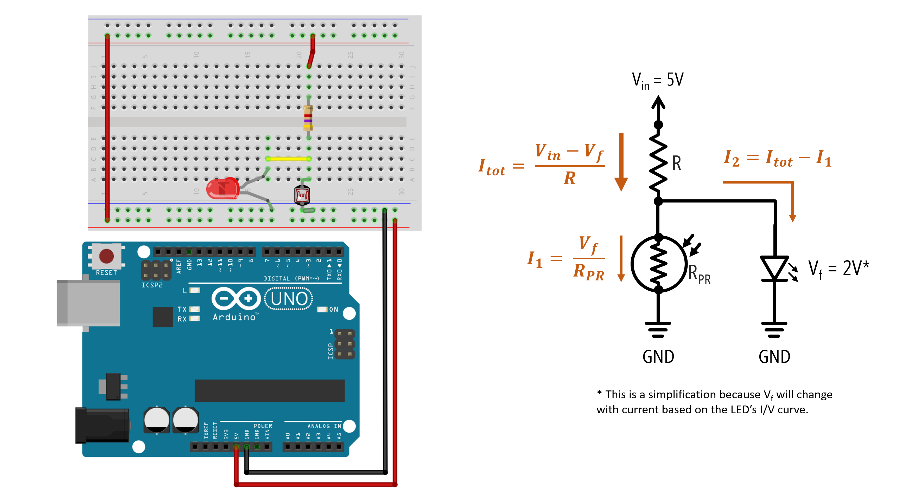
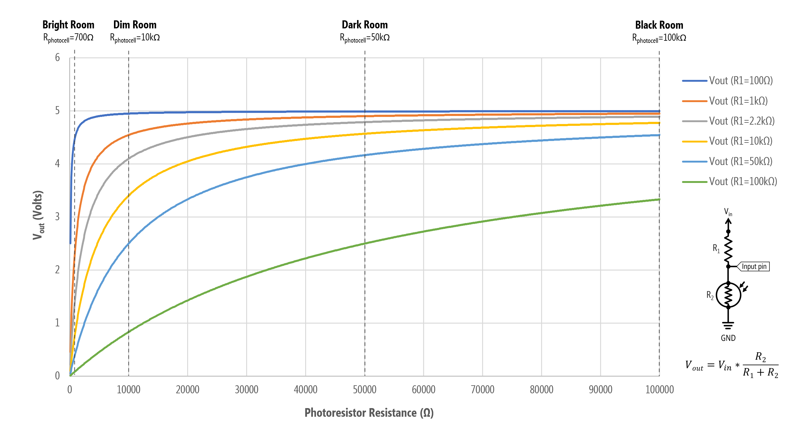
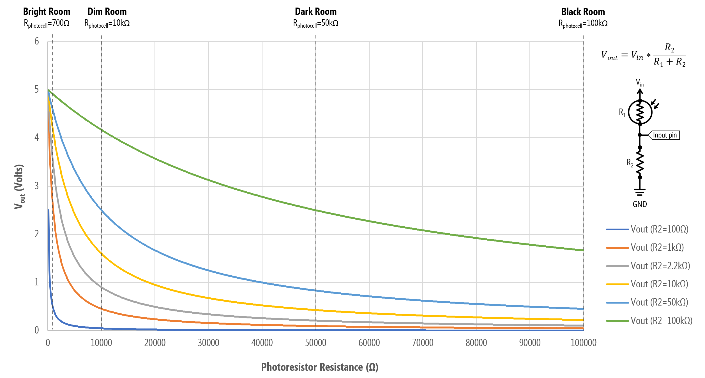
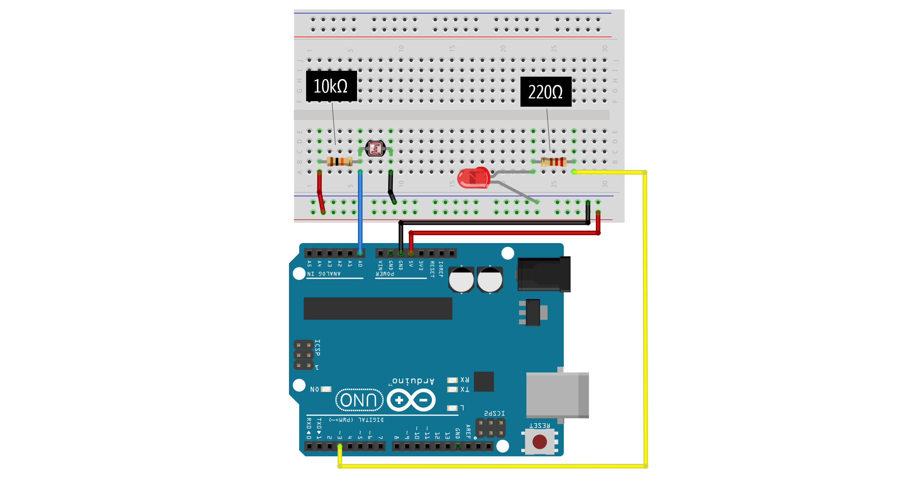

# {{ page.title | replace_first:'L','Lesson '}}
{: .no_toc }

## Table of Contents
{: .no_toc .text-delta }

1. TOC
{:toc}
---

In this lesson, you'll learn about [photoresistors](https://en.wikipedia.org/wiki/Photoresistor) and how to use them with and without microcontrollers.

## Photoresistor 

| Photoresistors | Schematic Symbol |
| -------------- | ---------------- |
|  |
 |
| Three differently sized photoresistors with scale in mm. Image from [Wikipedia](https://en.wikipedia.org/wiki/Photoresistor). | There are six interchangeable photoresistor schematic symbols. Image from [Platt](https://learning.oreilly.com/library/view/encyclopedia-of-electronic/9781449334307) |

A photoresistor—sometimes called a photocell or light-dependent resistor—varies its resistance in response to light. They are small, inexpensive, and easy-to-use. However, they are not particularly accurate so are best suited for measuring coarse-grain light levels (*e.g.,* the difference between a light and dark room) rather than precise illuminance.

Consequently, photoresistors are popular in children's toys, nightlights, clock radios, and other inexpensive gadgets. For example, they are used in this Melissa and Doug wooden fire truck puzzle to detect when pieces have been placed and when the puzzle is complete:

When the all pieces are placed (or all photoresistors have been covered), the puzzle plays a rewarding "fire truck siren" (rewarding for a child, at least):

<iframe width="736" height="414" src="https://www.youtube.com/embed/ySJw510mVgs" frameborder="0" allow="accelerometer; autoplay; encrypted-media; gyroscope; picture-in-picture" allowfullscreen></iframe>

### How do photoresistors work?

Photoresistors are typically made of Cadmium-Sulfide (CdS), which is a semiconductor that reacts to light. As [Platt](https://learning.oreilly.com/library/view/encyclopedia-of-electronic/9781449334307) describes, "*when exposed to light, more charge carriers are excited into states where they are mobile and can participate in conduction. As a result, electrical resistance decreases.*" Because they are made from Cadmium-Sulfide, they are sometimes referred to as CdS cells.

### Photoresistor resistance vs. illumination

To describe the relationship between photoresistance and light level, we need a more precise definition of the how light levels are characterized. Enter: (https://en.wikipedia.org/wiki/Lux)!

The SI unit of illuminance is called [lux](https://en.wikipedia.org/wiki/Lux), which is, formally, the "*luminous flux per unit area*". In photometry, lux is used as a measure of the intensity of light that hits or passes through a surface as perceived by the human eye.

As you're likely unfamiliar with lux just as we were, it's useful to contextualize lux with some examples (from [Wikipedia](https://en.wikipedia.org/wiki/Lux)). 

| Illuminance (lux) | Example |
| ----------------: | ------- |
| 0.0001            | Moonless, overcast night sky |
| 0.05 - 0.3        | Full moon on a clear night |
| 50                | Lighting in a domestic family room |
| 80                | Office building hallway |
| 100               | Dark overcast day |
| 400               | Sunrise or sunset on a clear day |
| 1,000             | Overcast day |
| 10k - 25k         | Full daylight (not direct sun) |
| 32k - 100k        | Direct sunlight |

While finding a detailed datasheet on photoresistors is difficult, both [Sparkfun](https://cdn.sparkfun.com/datasheets/Sensors/LightImaging/SEN-09088.pdf) and [Adafruit](https://learn.adafruit.com/photocells/measuring-light) provide low-quality graphs of photoresistor resistance *vs.* lux on their websites.

Graphs from [Sparkfun](https://cdn.sparkfun.com/datasheets/Sensors/LightImaging/SEN-09088.pdf) and [Adafruit](https://learn.adafruit.com/photocells/measuring-light). Both are in log-log scale.
{: .fs-1 }

Using a professional light meter, David Williams at [All About Circuits](https://www.allaboutcircuits.com/projects/design-a-luxmeter-using-a-light-dependent-resistor/) also conducted their own experiments of photoresistance *vs.* illumination and found the same log-log relationship. We've used this data to graph both a linear version (which is easier to understand) and log-log version with annotations.

In short, a photoresistor is most sensitive to light differences at lower lux levels (darker environments). This sensitivity drops exponentially as lux decreases. For example, the resistance drops 65kΩ between $$lux=1$$ and $$lux=2$$ (~65kΩ per lux) and 54kΩ between $$lux=2$$ and $$lux=20$$ (~3kΩ per lux in this range). Between $$lux=900$$ and $$lux=~1300$$, however, the resistance only drops 140Ω (2.8Ω per lux).

The Adafruit documentation emphasizes that each photocell will perform differently due to manufacturing and other variations and reaffirms that photocells should not be used to precisely measure light levels (and each photocell requires individual calibration).

<!-- Therefore, the resistance of LDRs is an inverse, nonlinear function of light intensity.
Read more http://www.resistorguide.com/photoresistor/ -->

#### Photoresistor spectral response graph

Photoresistors are also not uniformly responsive to all wavelengths of light. Their sensitivity peaks between 500nm (green) and 700nm (red). See the relative spectral response graph below:

Graph from [Adafruit](https://learn.adafruit.com/photocells/measuring-light).
{: .fs-1 }

#### Photoresistors lag

Photoresistors should not be used to sense or measure rapid fluctuations of light because of response latency. According to [Platt](https://learning.oreilly.com/library/view/encyclopedia-of-electronic/9781449334307) as well as [others](http://www.resistorguide.com/photoresistor/), photoresistors may take ~10ms to drop completely when light is applied after total darkness and up to 1 second to rise back to a stable high resistance after the removal of light. Phototransistors and photodiodes are both more responsive. 

#### Cadmium-Sulfide is classified as a hazardous material

Cadmium-Sulfide is classified as a hazardous environmental chemical by the [RoHS](https://www.rohsguide.com/rohs-faq.htm) and are thus unavailable in Europe. They are, however, still available in the US (and still used in toy manufacturing, yay!). 

### Measuring photoresistance with a multimeter

To get your own empirical sense of a photoresistor's resistance as a function of light, try hooking it up to a multimeter (with the ohmmeter setting). What do you observe?

Here's the results of our own informal experiments:

| Lighting condition | Photoresistance |
| ------------------ | ------------------------ |
| iPhone LED flashlight on full power directly against photoresistor   | ~50-100Ω                     |
| Desk lamp **on**   | 1.6kΩ                    |
| Desk lamp **off** but some ambient light (*e.g.,* from computer monitor )   | 10kΩ                    |
| Finger over photoresistor   | ~130kΩ                    |
| Very dark room (basement, no ambient light) | 1+ MΩ                    |

And a video:

<iframe width="736" height="414" src="https://www.youtube.com/embed/imbN0PtUQg0" frameborder="0" allow="accelerometer; autoplay; encrypted-media; gyroscope; picture-in-picture" allowfullscreen></iframe>
Our photoresistor ranges from 1.6kΩ with our desk lamp to 10kΩ with the lights off to over ~10MΩ when covered by a coffee cup.
{: .fs-1 }

## Making an LED dimmer with a photoresistor

Let's make something. How about a simple, prototype nightlight that automatically turns **on** (gets brighter) in the dark. 

As before, we're going to explore this sensor first **without** a microcontroller to build up familiarity. 

### Initial auto-on nightlight circuit

Like the [FSR](../arduino/force-sensitive-resistors.md), the photoresistor is a two-legged resistive sensor and is non-polarized. So, you can connect them in "either direction" in your circuits. 

You might initially try to hook up the photoresistor in the same way as the [FSR](../arduino/force-sensitive-resistors.md): in-series with the LED. As we measured a minimum resistance of ~50-100Ω when an ultrabright LED flashlight was pointed directly at the photoresistor, in both wiring diagrams, we include a backup current limiting resistor.

Try making this circuit. What happens?

Because the photoresistor resistance **decreases** with light levels, the LED gets brighter as the ambient light gets brighter. This is the opposite behavior of what we want! See video below.

<iframe width="736" height="414" src="https://www.youtube.com/embed/tNOG2tYaBQU" frameborder="0" allow="accelerometer; autoplay; encrypted-media; gyroscope; picture-in-picture" allowfullscreen></iframe>
In this video, the photoresistor is in series with the LED. As the ambient light level increases, the photoresistor resistance decreases, and the LED gets brighter. But we want the opposite effect? Note: this video has no audio.
{: .fs-1 }

What should we do? Well, the coder in us wants to immediately hook the sensor up to the microcontroller and solve this in code (which is a fine solution and, ultimately, what we will do!). However, can we solve this in hardware too?

Let's try it.

### An improved auto-on nightlight circuit

We are going to create an inverse relationship between ambient light levels and LED brightness by placing the LED in parallel with the photoresistor wired in a voltage divider configuration. Now, as the photoresistor resistance drops, the LED will get brighter. The key is in selecting an appropriate fixed resistor $$R$$. 

If $$R$$ is too small, the LED will still turn on even in ambient light. Through experimentation, we determined that $$R=4.7kΩ$$ resulted in the best performance: a 1.72V drop and 0.10mA through the LED with a **desk lamp off** (up to 0.6mA when the photoresistor is covered) and a 0.8V drop and 0mA through the LED with the **lamp on**. 

| R     | Desk Lamp **Off** | Desk Lamp **Off** | Desk Lamp **On**  | Desk Lamp **On**  |
| ----- | ----------------- | ----------------- | ----------------- | ----------------- |
| -     | LED Voltage Drop  | LED Current       | LED Voltage Drop  | LED Current       |
| 1kΩ   | 1.89V             | 2.9mA             | 1.85V             | 2.13mA            |
| 2.2kΩ | 1.82V             | 1.23mA            | 1.78V             | 0.5mA             |
| 4.7kΩ | 1.78V             | 0.48mA            | 1.41V             | 0mA               |
| 10kΩ  | 1.72V             | 0.10mA            | 0.80V             | 0mA               |

So, while this circuit works, it doesn't work well. We are not able to sufficiently control the current through the LED based on lighting conditions. Yes, we have the general LED behavior we want but 0.10mA is a very small current, so the LED is not very bright (even in the darkest conditions). See video below.

<iframe width="736" height="414" src="https://www.youtube.com/embed/ZYVQLw-7HU0" frameborder="0" allow="accelerometer; autoplay; encrypted-media; gyroscope; picture-in-picture" allowfullscreen></iframe>
This video shows a photoresistor wired in parallel to inverse the relationship between ambient light levels and LED brightness. Note: this video has no audio.
{: .fs-1 }

So, what could we do?

Two potential solutions: 

1. We could continue a pure hardware solution and add in a transistor like [this video](https://youtu.be/eEBMTpxdPiE). This would be the cheapest solution and the one EE's would advocate! :)
2. We could add in a microcontroller and solve this in software (a place where we are more comfortable but it's always useful to consider a pure hardware solution, if possible)

<!-- Using Thevenin equivalent circuits: https://ultimateelectronicsbook.com/voltage-dividers/#solving-by-hand-->

<!-- my own experiments voltage drop over LED and measured current through LED in dark | light
1.72V (0.10mA) | 0.80V (0mA) with 10kOhm (and turns off in light but LED dim)
1.78V (0.48mA) | 1.41V (0mA) with 4.7kOhm (and turns off in light but LED dim)
1.82V (1.23mA) | 1.78 (0.5mA) with 2.2k resistor (but still on in light)
1.89V (2.9mA) | 1.85V (2.13mA) with 1K resistor (but still on in light).
2.09V | 2.07V with 220 resistor -->

## Using photoresistors with microcontrollers

As a two-legged variable resistor, we can use the same voltage divider wiring as the [FSR](../arduino/force-sensitive-resistors.md). Recall the voltage divider equation introduced in the [potentiometers](../arduino/potentiometers.md) lesson: $$V_{out} = V_{in} \cdot \frac{R_2}{R_1 + R_2}$$. 

Below, we show two wiring options. On the left, the photoresistor is $$R_1$$ in the voltage divider configuration so $$V_{out}$$ will increase as light levels increase. On the right, the is $$R_2$$ so $$V_{out}$$ will increase as light levels decrease (a "darkness" sensor, if you will).

Either wiring will work. They are functionally equivalent but opposite. 
{: .fs-1 }

And, of course, we could inverse the relationship in software (rather than hardware). So, for example, if we wanted to make an LED brighter as light levels decrease with the left wiring configuration, we could do:



// In this code, we brighten an LED inversely proportional to light level (as measured by 
// a photoresistor). We assume the photoresistor is R1 and fixed resistor is R2 in the 
// voltage divider
int photoresistorVal = analogRead(INPUT_PHOTORESISTOR_PIN); // read in photoresistor val
int ledVal = map(photoresistorVal, 0, 1023, 0, 255); // convert to 8-bit range (0-255)
ledVal = 255 - ledVal; // invert so that LED gets brighter as photoresistor gets darker
analogWrite(OUTPUT_LED_PIN, ledVal);



And I often like to simplify this even more by relying on `map` for the inversion (notice how I flip the order of `255` and `0`), so the code becomes:



int photoresistorVal = analogRead(INPUT_PHOTORESISTOR_PIN); // read in photoresistor val
int ledVal = map(photoresistorVal, 0, 1023, 255, 0); // inverse relationship
analogWrite(OUTPUT_LED_PIN, ledVal);



### What value should we make our fixed resistor?

I think, by now, we understand how to hook up a two-leg resistive sensor to a microcontroller (using a voltage divider!). But one key question is: what to use as the fixed resistor in the voltage divider? 

Ideally, we would want to: (1) vary $$V_{out}$$ across our entire ADC range (0-5V)—otherwise, we're artificially limiting our precision—and (2) discriminate between light levels of interest (do we care more about bright lights or darker environments, for example).

To help answer this, we can graph $$V_{out}$$ as a function of various fixed resistors and a range of photoresistor resistances. We've also marked approximate resistances of the photoresistor based on ambient light levels. Note that these graphs don't incorporate how the photoresistor's resistance changes in response to light: they simply graph the voltage divider output for $$R_1$$ and varying $$R_2$$. Both graphs show the same data, just the inverse depending on whether the fixed resistor is $$R_1$$ or $$R_2$$.

Let's focus on the bottom graph for now (the "darkness" sensor configuration). Here's a table of $$V_{out}$$ values for six different fixed resistors ($$R_1$$) and some various resistances for the photoresistor ($$R_2$$).

| $$R_1$$ | $$R_2=100Ω$$ | $$R_2=1kΩ$$ | $$R_2=10kΩ$$ | $$R_2=50kΩ$$ | $$R_2=100kΩ$$ | 
| ------- | ------------ | ----------- | ------------ | ------------ | ------------- |
| 100Ω    | 2.50V 	     | 4.55V       | 4.95V        | 4.99V        | 5.00V         |
| 1kΩ     | 0.45V	     | 2.50V       | 4.55V        | 4.90V        | 4.95V         |
| 2.2kΩ   | 0.22V        | 1.56V       | 4.10V        | 4.79V        | 4.89V         |
| 10kΩ    | 0.10V	     | 0.88V       | 3.40V        | 4.57V        | 4.78V         |
| 50kΩ    | 0.05V	     | 0.45V       | 2.50V        | 4.17V        | 4.55V         |
| 100kΩ   | 0.01V        | 0.10V       | 0.83V        | 2.50V        | 3.33V         |

Note how with a 1kΩ for $$R_1$$, almost our entire $$V_{out}$$ range falls between the photoresistance $$R_2=100Ω$$ and $$R_2=10kΩ$$. So, a 1kΩ for $$R_1$$ is useful if we want to discriminate between brighter light levels but not as useful for darker light levels (indeed, from $$R_2=50kΩ$$ to $$R_2=100kΩ$$, there is only a 0.05V difference across a 50kΩ range!). In contrast, if we select a 100kΩ for $$R_1$$, then at bright light levels ($$R_2=100Ω$$ to $$R_2=1kΩ$$), our voltage only differs by 0.09V but at darker light levels ($$R_2=50kΩ$$ to $$R_2=100kΩ$$), the voltage differs by 0.83V. So, there is comparatively more precision in darker environments with $$R_1=100kΩ$$ than $$R_2=1kΩ$$

Once again, the handy 10kΩ for $$R_1$$ may be a nice compromise.

#### Using the "Axel Benz" formulation

To help select a fixed resistor value, both [Platt](https://learning.oreilly.com/library/view/encyclopedia-of-electronic/9781449334307) and the Adafruit tutorial recommend the following equation: $$R_{fixed} = \sqrt{R_{min} \cdot R_{max}}$$ where $$R_{min}$$ is the minimum photoresistance value expected in the deployment environment (*i.e.,* resistance at highest light intensity) and $$R_{max}$$ is the maximum resistance value expected (*i.e.,* resistance at lowest light intensity). [Adafruit](https://learn.adafruit.com/photocells/using-a-photocell) refers to this as the "Axel Benz" formulation but we couldn't determine a reliable source for this.

## Let's make a simple auto-on nightlight with Arduino

OK, now let's make a simple auto-on nightlight with the Arduino that inversely sets an LED's brightness based on light level.

### Make the circuit

We need to make two independent circuits: one for the photoresistor and one for the LED. Unlike our non-microcontroller examples where the photoresistor was part of the same circuit as the LED, in this case, they are two separate circuits.

Below, we've wired the photoresistor using a voltage divider with a fixed resistor of 10kΩ in the $$R_1$$ position (so, the 'darkness' sensor configuration). The voltage divider output is connected to `A0`. For the LED circuit, we've wired the LED anode towards Pin 3 with a 220Ω current-limiting resistor. 

### Write the code

Try writing the code before looking at our solution. Print your `analogRead` values from the photoresistor to better determine light/dark thresholds to set your LED brightness. For example, your auto-on nightlight should be completely off when it's "light" and fully bright when it's "dark" (but you can control these tolerances).

Our code:

## Exercises
- `map()` assumes a linear mapping between two value ranges. What if you wanted a logarithmic or exponential conversion? How would you implement this? How might this be useful for working with sensors?
- Just like we did for the [FSR lesson](../arduino/force-sensitive-resistors.md), try hooking up a piezo buzzer (and be creative about how it makes "music").
- Make the night light brighter or multi-color (either with your RGB LEDs or individually colored LEDs)

## References
- [Photocells](https://learn.adafruit.com/photocells?view=all), Adafruit tutorial
- [Designing a Luxmeter Using a Light-Dependent Resistor](https://www.allaboutcircuits.com/projects/design-a-luxmeter-using-a-light-dependent-resistor/), All About Circuits, David Williams 
- Chapter 20: Photoresistor in Platt, [*Make: Encyclopedia of Electronic Components Volume 3: Sensing Light, Sound, Heat, Motion, and More*](https://learning.oreilly.com/library/view/encyclopedia-of-electronic/9781449334307), O'Reilly, 2016.
- [Photoresistor](https://en.wikipedia.org/wiki/Photoresistor), Wikipedia
- [Photoresistor](http://www.resistorguide.com/photoresistor/), Resistorguide.com

<!-- Selenium history:

"The word 'optophone' was first used by Dr. E E. Fournier d'Albe, who in 1910 was appointed Assistant Lecturer in Physics at the University of Birmingham in England. It was here that he set up a laboratory to look into the properties of selnium. Selenium had been discovered by Berzelius in 1817 and in the years that followed, it became apparent that selenium was photosensitive, racting to light in such a way as to vary its conductivity. Possibly uknown to Fournier d'Albe, a few devices had already been inveted, such as the Elktroftalm and the Photophonic book. The Elektroftalm, originally created in 1897 by Noiszewski, was a mobility aid for the blind. It used a single selenium cell that was placed on the forehad to control the intensity of a sound output, thus allowing a blind persont o distinguish between light and dark." From Capp_TheOptophone-AnElectronicBlindAid_BiomedicalEngineering2000.pdf

The Elektroftalm is described in:

Starkiewicz, W. and Kuluiszewski, Tv. "Active energy radiating system: the 80-channel Elektroftalm" Proc Int Congress on Technology and Blindness, 1963. Vol 1., pp. 157-166 (The American Foundation for the Blind, New York) -->