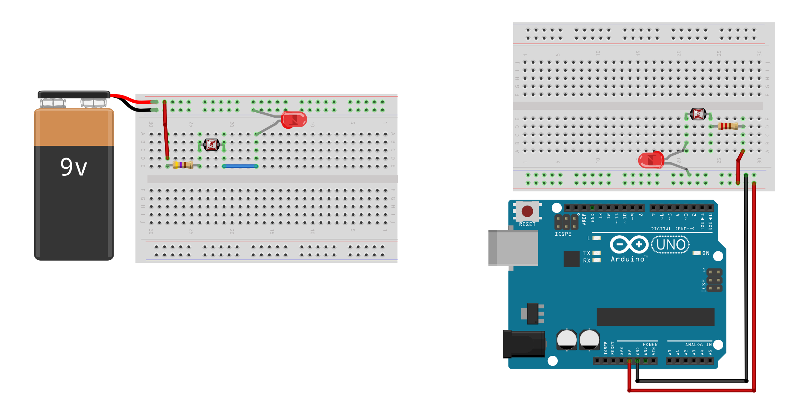

# {{ page.title | replace_first:'L','Lesson '}}
{: .no_toc }

## Table of Contents
{: .no_toc .text-delta }

1. TOC
{:toc}
---

In my own experiments, I found that the photoresistor resistance ranged from 100+ MΩ to ~50-100Ω with my iPhone LED flashlight on full power 

### Photoresistor 

<iframe width="736" height="414" src="https://www.youtube.com/embed/imbN0PtUQg0" frameborder="0" allow="accelerometer; autoplay; encrypted-media; gyroscope; picture-in-picture" allowfullscreen></iframe>
Our photoresistor ranges from 1.6kΩ with our desk lamp to 10kΩ with the lights off to over ~10MΩ when covered by a coffee cup
{: .fs-1 }

## Making an LED dimmer with a photoresistor

Let's make something.

As before, we're going to explore this sensor first **without** a microcontroller to build up familiarity before connecting it as analog input to the Arduino. 

Let's try making a simple, prototype nightlight that automatically turns **on** in the dark. 

### Initial auto-on nightlight circuit

Like the FSR, the photocell is a two-legged resistive sensor. So, we might initially try to hook it up in the exact same way:

As we measured a minimum resistance of ~50-100Ω when an ultrabright LED flashlight was pointed directly at the photoresistor, in both wiring diagrams, we included a backup current limiting resistor.

Try making this circuit. What happens?

<iframe width="736" height="414" src="https://www.youtube.com/embed/tNOG2tYaBQU" frameborder="0" allow="accelerometer; autoplay; encrypted-media; gyroscope; picture-in-picture" allowfullscreen></iframe>
In this video, the photoresistor is in series with the LED. As the ambient light level increases, the photoresistor resistance decreases, and the LED gets brighter. But we want the opposite effect? Note: this video has no audio.
{: .fs-1 }

Because the photoresistor resistance **decreases** with light levels, the LED gets brighter as the ambient light gets brighter. This is the opposite of what we want!

What should we do? Well, the coder in me wants to immediately hook the sensor up to the microcontroller and solve this in code (which is a fine solution and, ultimately, what we will do!). However, can we solve this in hardware too?

Hint: what does a voltage divider do?

### An improved auto-on nightlight circuit

We are going to create an inverse relationship between ambient light levels and LED brightness by creating a voltage divider with the photoresistor and placing the LED in parallel with the photoresistor. Now, as the photoresistor resistance drops, the LED will get brighter.

TODO: insert graph of resistance levels?

<iframe width="736" height="414" src="https://www.youtube.com/embed/ZYVQLw-7HU0" frameborder="0" allow="accelerometer; autoplay; encrypted-media; gyroscope; picture-in-picture" allowfullscreen></iframe>
In this video, we show how a voltage divider can be used with a photoresistor to inverse the relationship between ambient light levels and LED brightness. Note: this video has no audio.
{: .fs-1 }

<!-- my own experiments voltage drop over LED and measured current through LED in dark | light
1.72V (0.10mA) | 0.80V (0mA) with 10kOhm (and turns off in light but LED dim)
1.78V (0.48mA) | 1.41V (0mA) with 4.7kOhm (and turns off in light but LED dim)
1.82V (1.23mA) | 1.78 (0.5mA) with 2.2k resistor (but still on in light)
1.89V (2.9mA) | 1.85V (2.13) with 1K resistor.
2.09V | 2.07V with 220 resistor -->

With desk lamp: was 1.6 kΩ and lights off (But computer monitor still on): about 10kΩ. Finger over photoresistor: 132kΩ.

## References
- [Photoresistor](https://en.wikipedia.org/wiki/Photoresistor), Wikipedia
- Chapter 20: Photoresistor in Platt, [*Make: Encyclopedia of Electronic Components Volume 3: Sensing Light, Sound, Heat, Motion, and More*](https://learning.oreilly.com/library/view/encyclopedia-of-electronic/9781449334307), O'Reilly, 2016.