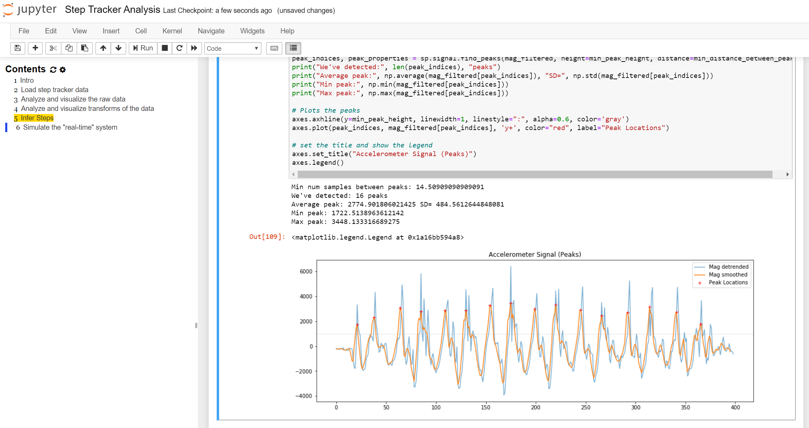

# {{ page.title }}
{: .no_toc }

## Table of Contents
{: .no_toc .text-delta }

1. TOC
{:toc}
---

<!-- TODO: write an intro for signal processing and move this to jupyter.md -->



Jupyter Notebook screenshot showing an analysis and visualization of a 3-axis accelerometer to infer step counts.
{: .fs-1 }

We will be using [Jupyter Notebook](https://jupyter.org/index.html) for the signal processing and machine learning portion of our course. Jupyter Notebook is a popular "data science" platform for analyzing, processing, classifying, modeling, and visualizing data. While Notebook supports multiple languages (like R, Julia), we'll be using Python (specifically, Python 3).

For analysis, we'll be using the [SciPy](https://www.scipy.org/) ("Sigh Pie") ecosystem of open-source libraries for mathematics, science, and engineering. Specifically, [NumPy](https://numpy.org/), [SciPy](https://www.scipy.org/scipylib/index.html), and [matplotlib](https://matplotlib.org/). We may also dabble in [Pandas](https://pandas.pydata.org/) and [Seaborn](https://seaborn.pydata.org/). For machine learning, we'll be using [sci-kit learn](https://scikit-learn.org/stable/). And don't worry, all of these libraries will be managed and installed for us!

Just like for Arduino, there is a plethora of wonderful tutorials, forums, and videos about Jupyter Notebook and the SciPy libraries. Please feel free to search online and to share what you find with the class.

<!-- maybe talking about Google Colab here? https://colab.research.google.com/notebooks/intro.ipynb -->

## Installation and configuration

To install, Jupyter Notebook, follow the installation instructions below (or read the official [quickstart guide](https://jupyter.readthedocs.io/en/latest/install.html)).

**Importantly**, please use [**Anaconda**](https://www.anaconda.com/download) to install Jupyter Notebook and all dependencies. This is the officially recommended way to install and use Notebook ([link](https://jupyter.readthedocs.io/en/latest/install.html#id3)).

#### Step 1: Download Anaconda

Download and install [Anaconda](https://www.anaconda.com/download) (latest Python 3 version)

#### Step 2: Run the server

Open your terminal (on linux or Mac) or the Anaconda Prompt (on Windows) and type:

```
> jupyter notebook
```

See "Running the Notebook" in the official Jupyter Notebook [docs](https://jupyter.readthedocs.io/en/latest/running.html).

### Installing notebook extensions

We strongly recommend installing the [`jupyter_contrib_nbextensions`](https://jupyter-contrib-nbextensions.readthedocs.io/en/latest/index.html) notebook extensions, which contains a collection of community-contributed (unofficial) extensions for Jupyter Notebook, including a table of contents generator and navigation pane called [Table of Contents (2)](https://jupyter-contrib-nbextensions.readthedocs.io/en/latest/nbextensions/toc2/README.html). See figure below.


Screenshot of a Jupyter Notebook with the nbextension called Table of Contents (2), which auto-generates a navigation pane based on markdown headers.
{: .fs-1 }

Feel free to follow the official installation instructions [here](https://jupyter-contrib-nbextensions.readthedocs.io/en/latest/install.html) or our simplified version below:

#### Step 1: Use conda to install nbextensions

To install the `nbextensions`, open your terminal (on linux or Mac) or the Anaconda Prompt (on Windows) and type:

```
> conda install -c conda-forge jupyter_contrib_nbextensions
```

#### Step 2: Open Jupyter Notebook and configure extensions

Restart Jupyter Notebook and you should see a tab called `Nbextensions` on the home screen. Click on that tab and then you should see all nbextensions. Click on `Table of Contents (2)` to configure and Enable it. See screenshots below.


#### Step 3: Try out TOC

Make some headers in markdown and then click on the `Table of Contents` button in the toolbar to see an auto-generated and clickable navigation sidebar. You can also access the TOC via the `Navigate` menu item.


Example of TOC running in Jupyter Notebook
{: .fs-1 }

## How to use Jupyter Notebook

Start by reading the official introduction to Jupyter Notebook ([link](https://jupyter-notebook.readthedocs.io/en/stable/notebook.html)). We will also go over basic functionality in class. Finally, there are many good tutorials online.

Please follow the [Python](https://www.python.org/dev/peps/pep-0008/) style guide for variable and function naming conventions and other formatting. This will make your code easier to follow and debug. And, of course, we all often (accidentally or intentionally) intermix styles from other programming languages—this is especially true in this course as we toggle between so many languages.

## Lessons

These lessons are intended to be interactive. Open the notebooks (`ipynb` files) either locally on your computer in Jupyter Notebook or, perhaps even more conveniently, using [Google Colab](https://colab.research.google.com/), which enables us to dynamically serve our notebooks directly from GitHub into the Colab environment where you can play, edit code, etc. right from your browser—and just a click away. Yay!

**Note:** For your actual assignments where you will have to load data from disk, you'll likely want to run your notebooks locally; however, you can also do this with Google Colab (you'll just need to get your data into the cloud environment).

1. [**Introduction to Python**](https://github.com/makeabilitylab/signals/blob/master/Tutorials/IntroToPython.ipynb). If you're not familiar with Python—or even if you are—it's a good idea to start with this (rapid) introduction to Python. It was also give you a feel for Jupyter Notebook.
[](https://colab.research.google.com/github/makeabilitylab/signals/blob/master/Tutorials/IntroToPython.ipynb)

2. [**Introduction to NumPy**]